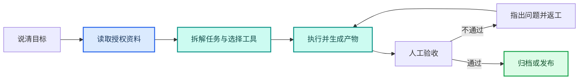

---
AIGC:
  ContentProducer: '001191110102MAD55U9H0F10002'
  ContentPropagator: '001191110102MAD55U9H0F10002'
  Label: '1'
  ProduceID: '0831c90c-74ce-4d87-902b-94443082fe16'
  PropagateID: '0831c90c-74ce-4d87-902b-94443082fe16'
  ReservedCode1: 'bd51d5df-049f-479f-8c04-77fe52ef7aac'
  ReservedCode2: 'bd51d5df-049f-479f-8c04-77fe52ef7aac'
---

# 1.1 初识 TeleAgent

**TeleAgent（星辰超级智能体）** 是中电信人工智能公司自研的通用智能体架构，一键安装在个人电脑上的 Agent 产品——你的"AI 办公搭子"，能干又可靠。

面向政企办公、数据分析、内容生产、合同审核、深度调研等场景，TeleAgent 能够像真正同事一样思考、执行任务并交付结果。

## 星辰大模型与产品背景

TeleAgent 的底层能力来自**星辰大模型**——中国电信完全自主研发的大模型体系，是国内首个"全模态、全尺寸、全国产"的 AI 大模型体系。2026 年 1 月，星辰大模型入选国务院国资委"2025 年度央企十大国之重器"。

TeleAgent 的产品发展历程（以下时间线基于公开报道整理）：

| 时间 | 里程碑 |
|------|--------|
| 2025 年 4 月 | 天翼 AI 开放平台正式上线 |
| 2025 年 9 月 | 企业级 AI 引擎"星辰超级智能体"上线 |
| 2025 年 12 月 | 星辰智能体服务平台 1.0 发布，推出跨终端 AI 入口"星小辰" |
| 2026 年 1 月 | 升级版本整合多模态、Agent+RPA 能力 |
| 2026 年 4 月 | 在成都展示政务与工业应用场景 |
| 2026 年 7 月 | WAIC 世界人工智能大会正式发布 TeleAgent 桌面版 |

截至 2026 年 7 月，据公开报道，TeleAgent 注册用户已超 30 万，日均 Token 消耗超 2000 亿。

## 从"回答问题"到"交付结果"

与传统对话式 AI 助手不同，TeleAgent 不只是陪用户聊天、回答问题或者给出建议。

用户只需要用一句自然语言描述需求，它就可以理解任务目标，在本地电脑中自主规划执行步骤，并完成复杂的多步任务。

在获得用户授权后，TeleAgent 可以读取和处理本地文件，自动完成批量文件处理、文档生成、表格分析、PPT 制作、深度调研、知识库构建、合同审核等工作。

对于更加复杂的任务，它还可以自主拆解步骤，并通过多个智能体并行，减少人工在不同工具、文件和任务之间反复切换的成本。

例如，用户可以直接告诉 TeleAgent："分析这个文件夹中的销售数据，并生成一份汇报 PPT"。

TeleAgent 会自主读取相关文件，理解数据内容，完成分析和总结，并生成最终可以查看和修改的工作成果。

整个过程中，用户不需要手动上传每一个文件，也不需要一步一步告诉 AI 下一步应该做什么。TeleAgent 面向的是完整的工作任务。

## 四大核心工作场景

TeleAgent 覆盖四大核心工作场景，每个场景都能从一句话需求到交付成品：

| 场景 | 典型任务 | 交付物 |
|------|----------|--------|
| **整理文件** | 批量处理 Excel/Word/PPT、发票整理报销、周报合并 | 格式化文档、统计表 |
| **深度调研与资讯** | 行业政策调研、商机挖掘、技术架构分析 | 带引用来源的研究报告 |
| **写文档做PPT** | 行业大会发言稿、党建 PPT、经营分析报告 | docx、pptx 成品文件 |
| **写代码做应用** | 代码辅助、MCP 服务开发、技术文档 | 可运行的代码和应用 |

## 意图识别与任务分解

TeleAgent 的核心技术之一是**意图识别与任务分解**机制。当你输入一句自然语言时，系统会：

1. **意图识别**：理解你想完成什么任务
2. **任务分解**：将复杂任务拆解为可执行的子步骤序列
3. **选择工具**：根据任务类型自动选择合适的技能、MCP 工具或内置能力

这一机制让 TeleAgent 能够精准理解模糊需求，而不需要用户精确描述操作步骤。

## 四大技术特点

| 特点 | 说明 |
|------|------|
| **心领神会** | 意图识别精准拆解需求，一句自然语言即可触发多步自主执行 |
| **手脚麻利** | Skills 技能包 + MCP 连接器打通内外应用，连接飞书、企业微信、浏览器等 |
| **思维透明** | 执行过程全程可见，高危操作须用户授权，始终由人掌控最终决策权 |
| **驾轻就熟** | 持久化记忆随用随长，定时任务自动执行，越用越懂你的工作习惯 |

## 核心能力

TeleAgent 的核心能力可以概括为三点：**听得懂人话，能够自主思考规划，也真的能够操作电脑交付成果。**

为了完成不同类型的任务，TeleAgent 还提供了以下能力：

| 能力 | 说明 |
|------|------|
| **Skills 技能包** | 可复用的专业能力模块，涵盖 Excel、PPT、PDF、OCR、深度调研、新闻周报、合同审核等数十种技能，支持一键安装和自建 |
| **MCP 连接器** | 通过 MCP 协议接入外部工具和服务（飞书、企业微信、浏览器等），扩展 AI 的工具箱 |
| **长期记忆** | 分为用户指定记忆（USER.md）和系统推断记忆（MEMORY.md），随使用不断积累用户偏好和事实记忆 |
| **定时任务** | 支持 cron 和一次性任务，自动在指定时间执行，结果推送到 IM 或文档 |
| **多模型切换** | 支持多种大模型适配，根据任务类型自动选择最合适的模型 |
| **数据不出域** | 本地文件处理优先，数据不上传云端，满足政务和企业合规要求 |
| **安全控制** | 高危指令拦截、敏感操作确认、权限边界控制，降低 AI 自主执行风险 |

## 与对话式大模型的区别

| 维度 | 对话式大模型 | TeleAgent |
|------|-------------|-----------|
| 交付物 | 给"答案/建议" | 给"成品"文件（docx、xlsx、pptx、pdf） |
| 数据位置 | 需要上传文件到云端 | 数据不出本地，本地处理优先 |
| 执行方式 | 一问一答，需要人工逐步引导 | 多步自主执行，一次交付完整结果 |
| 自动化 | 不支持 | 支持定时任务和自动化工作流 |
| 记忆 | 会话内记忆，关闭即失 | 长期记忆，跨会话保留且持续积累 |
| 工具 | 内置有限工具 | Skills 技能包 + MCP 连接器，可无限扩展 |

## 桌面版与网页版

TeleAgent 提供桌面版和网页版两种形态：

| 维度 | 桌面版 | 网页版 |
|------|--------|--------|
| 数据存储 | 完全存储于本地硬盘 | 云端存储 |
| 数据隐私 | 数据主权隐私优先 | 依赖云端安全体系 |
| 工作流 | 深度绑定工作流闭环 | 轻量化使用 |
| 定制能力 | 支持无限定制（Skills、MCP、记忆） | 能力受限于平台配置 |
| 定时任务 | 支持 | 有限支持 |

本书以桌面版为主线进行讲解，因为桌面版是 TeleAgent 能力的完整形态。

## 适用人群

TeleAgent 面向各类职场角色：

- **管理岗位**：经营分析、KPI 通报、汇报材料生成
- **运营与市场**：内容生产、数据分析、资讯整合
- **销售与售前**：客户研究、方案制作、跟进流程
- **行政与 HR**：制度答疑、材料检查、流程提醒
- **财务与法务**：合同审核、条款对比、数据分析
- **研发与 IT**：代码辅助、技术文档、巡检自动化

## 阅读建议

- **第一次使用**：从1.2开始，按顺序完成第一篇
- **已经有具体任务**：直接进入第二篇对应案例或案例集，跑通后再读第三篇
- **准备团队落地**：重点阅读第三、四篇，记录权限边界、验收标准和失败回退