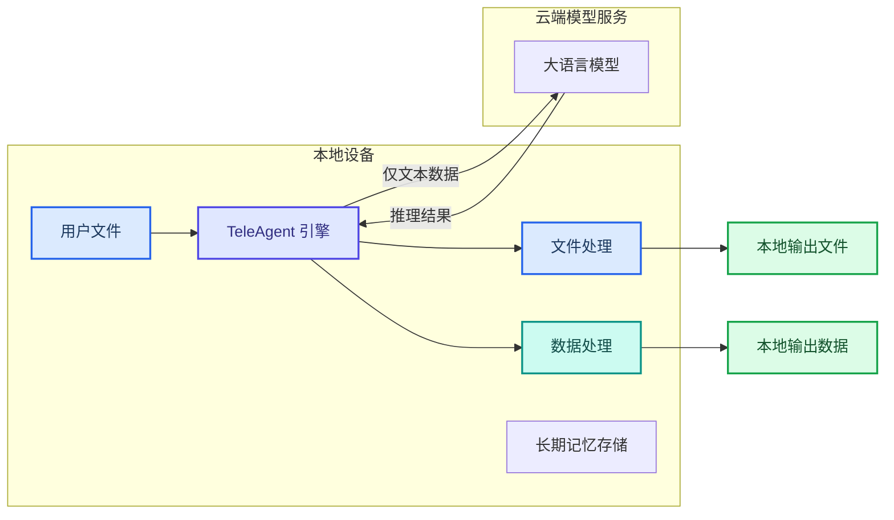
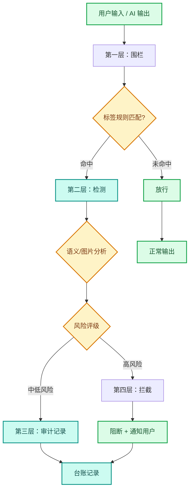
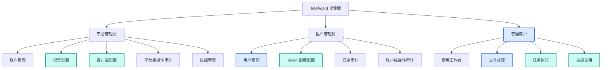

---
AIGC:
  ContentProducer: '001191110102MAD55U9H0F10002'
  ContentPropagator: '001191110102MAD55U9H0F10002'
  Label: '1'
  ProduceID: 'a6352bfa-5755-4ff4-a354-5a2e963aa9f2'
  PropagateID: 'a6352bfa-5755-4ff4-a354-5a2e963aa9f2'
  ReservedCode1: 'b8a9040e-7f56-4a96-92d4-9c16752a3d61'
  ReservedCode2: 'b8a9040e-7f56-4a96-92d4-9c16752a3d61'
---

# 1.10 安全与权限控制

## 本章目标

全面了解 TeleAgent 的安全防护体系，掌握敏感操作确认机制、AIGC 安全围栏、权限分级控制和操作审计，理解"数据不出域"的合规价值。

## 1.10.1 安全为什么重要

TeleAgent 与普通对话式大模型最大的区别在于：它能直接操作你的文件、执行系统命令、调用外部工具。这种强大的执行能力带来了远超普通聊天的安全风险——如果缺乏管控，AI 可能误删文件、泄露数据或执行危险操作。

TeleAgent 从设计之初就将"安全可控"作为核心原则，构建了覆盖**操作层、内容层、数据层、审计层**的全方位安全体系，确保智能体在提升效率的同时不跨越安全红线。

## 1.10.2 敏感操作确认机制

### 工具授权机制

TeleAgent 对用户指令的操作采用**逐项授权机制**。当智能体需要执行修改类操作（如文件写入、应用程序操控、网络请求等）时，必须获得用户的明确授权方可继续执行。这是 TeleAgent 在自动化能力与操作安全之间建立的核心防线——「人在回路」设计确保智能体在提升效率的同时，完全服务于人的意志。

### 授权选项

当工具需要授权时，系统显示"等待授权"状态，并提供三个选项：

| 授权选项 | 含义 | 适用场景 |
| --- | --- | --- |
| **允许一次** | 仅授权本次操作 | 信任此次操作，但不想授权该类操作的全部后续调用 |
| **一直允许** | 整个任务的后续同类操作都自动授权 | 任务需要多次同类修改操作，不想重复授权 |
| **拒绝** | 不授权，跳过该操作 | 不确定操作安全性，或不需要执行该步骤 |

### 授权机制的关键特性

授权机制的设计体现了自动化与可控性之间的精细平衡：

- **等待不计时**：工具执行时间不包含用户等待决策的时间，用户无需担心因思考授权决策而影响任务耗时统计，可以从容审阅操作内容后再做决定
- **拒绝后继续**：拒绝授权后，系统不会中止整个任务，而是跳过该操作，继续完成其他可执行部分，最大限度保障已投入算力的产出价值

### 授权操作建议

基于实际使用经验，针对不同操作类型给出以下授权策略建议：

| 操作类型 | 建议授权策略 | 原因 |
| --- | --- | --- |
| **文件读取** | 可放心选择"一直允许" | 读取操作不改变任何数据，安全性高 |
| **文件写入与修改** | 首次建议"允许一次"，确认输出路径和内容符合预期后，后续可切换为"一直允许" | 确保首次输出正确，避免批量错误 |
| **高风险操作**（删除文件、发送邮件、执行系统命令） | 务必逐次"允许一次"，审慎确认每次操作的具体参数 | 不可逆操作，需逐一把关 |
| **批量处理任务** | 若理解并接受操作的统一模式，选择"一直允许"可大幅减少交互次数 | 提升执行流畅度 |

## 1.10.3 数据不出域

### 本地优先原则

TeleAgent 的核心设计原则是**本地处理优先**：

- **文件操作在本地完成**：读取、修改、生成文件全部在你的电脑上执行
- **模型调用走云端**：需要大模型推理时，仅将必要的文本数据发送到模型服务，文件本身不上传
- **记忆存储在本地**：长期记忆文件（USER.md、MEMORY.md、daily-log）全部存放在你的设备上，不上传云端

### 个人版 vs 企业版

| 对比项 | 个人版 | 企业版 |
| --- | --- | --- |
| 文件处理位置 | 用户本地电脑 | 用户本地电脑 |
| 模型服务位置 | 中国电信公有云 | 企业私有化部署的模型服务 |
| 记忆存储位置 | 用户本地电脑 | 用户本地电脑（受私有化安全体系保护） |
| 数据传输路径 | 本地 ←→ 公有云模型 | 本地 ←→ 企业内网模型服务 |

企业版的私有化部署确保所有数据——包括模型推理请求——都在企业内网中流转，不经过公网，满足政务和涉密场景的合规要求。

## 1.10.4 AIGC 安全防护体系

企业版的智能体安全模块采用**"围栏 + 检测 + 审计 + 拦截"**四重防护体系，确保 AI 生成内容符合企业合规要求。个人版也内置了基础的内容安全检测。

### 四重防护架构

### 第一层：内容安全围栏

围栏是安全防护的第一道屏障，基于标签体系实现智能体输入输出内容的安全审查：

- **标签管理**：创建、编辑、删除内容安全标签并定义检测规则
- **标签分组**：将标签按维度分组管理，形成标签组体系，灵活适配不同业务场景
- **代答知识库**：为安全围栏提供知识支撑，维护和更新知识条目，确保检测规则持续迭代
- **机审 + 人审**：对内容进行自动化安全审查，命中内容自动转交人工复核和判定

### 第二层：语义检测

检测层提供文本语义和图片内容两大维度的深度安全分析：

| 检测类型 | 能力 | 价值 |
| --- | --- | --- |
| **语义检测** | 识别隐含的风险表达和绕过关键词过滤的变体内容 | 防止"换种说法"绕过安全规则 |
| **图片检测** | 识别图片中的敏感信息和违规内容 | 保障多模态场景下的内容安全 |
| **工具调用安全** | 实时监控外部工具调用行为，识别异常调用请求 | 阻止未经授权的 API 调用 |

检测能力依托代答知识库持续进化——安全管理员可随时补充新的违规模式和安全规则，确保检测能力随威胁形势同步升级。

### 第三层：安全审计

审计层提供安全事件的全程记录和可追溯能力：

- **数据分析**：统计安全检测事件的数量、类型和趋势，分析检测准确率和覆盖率
- **台账管理**：记录所有安全检测事件的信息，支持按条件查询和导出，满足合规审计需求
- **工具调用审计**：记录所有工具调用的详细日志——调用方、目标工具、调用参数、执行结果，确保每次外部交互可溯源

::: tip 审计满足等保要求
企业版的操作审计和安全审计支持多维度条件筛选（用户、动作类型、时间范围），满足等保 2.0 审计要求。
:::

### 第四层：实时拦截

拦截层是安全防护的最后一道屏障：

- **内容拦截**：对命中标签规则的文本和图片内容实时拦截，阻止违规内容触达用户
- **拦截通知**：拦截后自动向用户发送通知，告知拦截原因并引导调整输入
- **工具调用拦截**：识别并拦截异常的外部工具调用（未经授权的 API 调用、超频调用、异常参数调用）
- **策略配置**：支持配置精细化的工具调用安全策略和规则

## 1.10.5 权限分级控制

### 个人版的权限边界

即使个人版中，TeleAgent 也会在执行修改类操作时要求用户授权，具体权限边界以实际产品配置为准。

### 企业版的三层身份体系

企业版采用三层身份体系，确保权限清晰、操作可追溯：

| 角色 | 权限范围 | 核心职责 |
| --- | --- | --- |
| **平台管理员** | 全平台管理权限 | 租户管理、模型配置、平台级审计、技能发布 |
| **租户管理员** | 租户内管理权限 | 用户管理、Token 额度配置、安全审计、操作审计 |
| **普通用户** | 工作台使用权限 | 文件处理、任务执行、技能调用 |

::: warning 管理员账号安全
企业版采用管理员分配账号制度，不支持自主注册。首次登录后需强制修改初始密码，保障账号安全。
:::

### 企业版的四层安全体系

| 层级 | 安全措施 | 说明 |
| --- | --- | --- |
| **基础设施层** | 网络隔离、访问控制 | 私有化部署，物理/逻辑网络隔离 |
| **平台层** | 身份认证、权限管控 | 三层身份体系，操作可审计可追溯 |
| **应用层** | 内容安全围栏、工具调用安全 | AIGC 四重安全防护 |
| **数据层** | 数据加密、租户隔离 | 数据落盘加密，租户间数据完全隔离 |

## 1.10.6 合规认证

TeleAgent 已完成多轮内外部安全测试，获得多项国家级认证：

| 认证类型 | 测试方 | 详情 |
| --- | --- | --- |
| **自主安全测试** | 联合长亭、奇安信等安全厂家 | 28 个场景，336 个用例，通过率 99.7% |
| **中国电信集团测评** | 电信研究院 | 感知、决策、记忆、执行四层均符合安全评测要求，通过率 98.2% |
| **国家级认证** | 中国信通院 | 通过智能体安全能力检验，获得企业级类 Claw 智能体安全能力检验证书 |

### 四关键环节安全加固

TeleAgent 在以下四个关键环节实施安全加固，形成全链路防护：

| 环节 | 加固措施 |
| --- | --- |
| **输入环节** | 用户输入进行安全检测，识别并拦截恶意指令 |
| **执行环节** | 逐项授权机制 + 工具调用安全审计，执行过程全程可追溯 |
| **输出环节** | AIGC 四重防护（围栏、检测、审计、拦截），确保生成内容合规 |
| **数据环节** | 本地处理优先 + 数据加密 + 租户隔离，数据主权完整保障 |

### 三重合规保障

1. **智能体安全**：通过集团、信通院等国家级安全测评认证
2. **操作审计合规**：平台级和租户级双重操作审计，满足等保 2.0 要求
3. **数据主权合规**：全栈私有化部署，数据不外传，满足数据主权和隐私保护法规要求

## 1.10.7 日常使用安全建议

### 个人用户建议

1. **逐项授权**：初次使用时对文件写入操作选择"允许一次"，确认输出无误后再切换"一直允许"；高风险操作始终逐次确认
2. **定期审查记忆**：偶尔查看长期记忆内容，删除不再需要的敏感信息
3. **工作空间隔离**：不同项目用不同工作空间，避免数据交叉
4. **技能安装审查**：安装技能前查看安全扫描报告，不安装来源不明的技能
5. **敏感数据谨慎**：处理涉密信息时，确认网络请求已关闭或使用企业版

### 企业管理员建议

1. **最小权限原则**：按角色分配权限，普通用户不给予管理权限
2. **Token 额度控制**：设置合理的配额上限，防止单用户资源占用过高
3. **定期审计**：每周查看安全审计和操作审计日志，及时发现异常
4. **模型访问控制**：仅开放必要的模型给用户，避免使用未经验证的模型
5. **安全标签更新**：根据业务变化及时更新内容安全围栏的标签和规则
6. **知识库维护**：定期更新代答知识库，确保检测能力与威胁形势同步

## 1.10.8 常见问题

| 问题 | 原因 | 解决方案 |
| --- | --- | --- |
| 操作被拦截提示"安全风险" | 内容命中安全围栏标签规则 | 查看拦截通知中的原因，调整输入内容后重试 |
| 企业版某用户无法使用智能体 | Token 额度耗尽或账号被禁用 | 租户管理员检查用户状态和额度配置 |
| MCP 工具调用被拒绝 | 首次使用未授权或调用参数异常 | 在设置中为该工具授权；检查调用参数是否符合规范 |
| 技能安装被拦截 | 静态安全扫描发现高危代码 | 查看安全扫描报告，确认技能来源可信后再决定是否手动安装 |
| 审计日志中看到陌生操作 | 可能是其他用户使用或账号被盗用 | 立即核查操作详情，必要时重置密码并联系管理员 |

## 1.10.9 本章小结

安全是 TeleAgent 一切能力的前提。本章从五个层面梳理了 TeleAgent 的安全体系：

- **操作层**：逐项授权机制 + 工具调用安全审计，用户始终掌控最终决策权
- **内容层**：AIGC 四重防护（围栏、检测、审计、拦截），确保生成内容合规
- **数据层**：本地处理优先、数据不出域，企业版私有化部署全面隔离
- **权限层**：企业版三层身份体系 + 四层安全体系，权限清晰可追溯
- **合规层**：通过电信集团、信通院等国家级认证，满足等保 2.0 审计要求

---

## 第一篇完结

至此，第一篇"使用手册：先把 TeleAgent 用起来"全十章已完成。从下载安装到完成第一个任务，从加载技能到连接外部工具，从长期记忆到定时任务，从多模型切换到安全控制——你已经掌握了 TeleAgent 的全部基础使用能力。

接下来，第二篇将通过真实案例带你进入实战，把学到的能力组合运用到具体工作场景中。