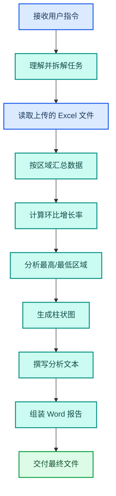

---
AIGC:
  ContentProducer: '001191110102MAD55U9H0F10002'
  ContentPropagator: '001191110102MAD55U9H0F10002'
  Label: '1'
  ProduceID: '42fd3e35-3402-426a-8eb7-1be3b803dabd'
  PropagateID: '42fd3e35-3402-426a-8eb7-1be3b803dabd'
  ReservedCode1: 'e810f6ce-dd89-4e14-9aa4-ab1baa3fd125'
  ReservedCode2: 'e810f6ce-dd89-4e14-9aa4-ab1baa3fd125'
---

# 1.4 完成第一个任务

## 本章目标

从零开始完成一个真实任务——将一份销售数据 Excel 整理成可视化分析报告，体验 TeleAgent 从理解指令到交付成果的完整流程。

## 1.4.1 任务说明

**场景**：你有一份各区域季度销售数据 Excel 文件，需要快速生成一份包含数据汇总和图表的分析报告。

**预期输入**：一份 `.xlsx` 文件，包含区域、产品、销售额等字段

**预期输出**：一份整理好的 Excel 汇总表 + 一份 Word 分析报告

## 1.4.2 准备工作

1. **创建工作空间**：新建一个名为"销售数据分析"的工作空间
2. **上传文件**：将销售数据 Excel 文件拖入对话区域
3. **确认文件已识别**：在文件列表中确认文件已成功上传

## 1.4.3 编写任务指令

在底部输入框中输入以下指令：

```
请分析这份销售数据：
1. 按区域汇总各季度销售额，计算环比增长率
2. 找出销售额最高和最低的区域，分析原因
3. 生成一个柱状图展示各区域销售额对比
4. 将以上内容整理成一份 Word 分析报告，包含数据表格和图表
```

### 指令编写要点

好的指令应该包含以下要素：

| 要素 | 说明 | 示例 |
| --- | --- | --- |
| 明确目标 | 说清楚最终要什么 | "整理成一份 Word 分析报告" |
| 指定步骤 | 列出需要的处理步骤 | "先汇总、再分析、最后生成报告" |
| 约束格式 | 说明输出格式和内容要求 | "包含数据表格和图表" |
| 提供上下文 | 给出必要的背景信息 | "这是各区域的季度销售数据" |

::: tip 自然语言即可
不需要学习特殊的命令语法，用日常说话的方式描述你的需求即可。TeleAgent 会自动理解意图并拆解任务。
:::

## 1.4.4 观察执行过程

提交指令后，TeleAgent 的工作流程：



在对话区域，你可以看到：

1. **思考过程**：TeleAgent 展示其对任务的理解和执行计划
2. **中间结果**：每一步的执行输出，如数据汇总表预览
3. **文件生成**：最终交付的文件以卡片形式展示，可直接下载

## 1.4.5 验收交付结果

TeleAgent 完成任务后，会交付以下成果：

- **Excel 汇总表**：按区域整理的季度销售数据汇总，含环比增长率
- **Word 分析报告**：包含文字分析、数据表格和柱状图的专业报告

你可以直接在对话中提出修改意见：

- "报告里的图表换成饼图"
- "增加一个同比分析"
- "报告标题改为'2026年Q2区域销售分析报告'"

TeleAgent 会基于已有上下文继续修改，无需从头开始。

## 1.4.6 关键认知：交付成品而非建议

这是 TeleAgent 与对话式大模型最本质的区别：

| 对比维度 | 对话式大模型 | TeleAgent |
| --- | --- | --- |
| 交互方式 | 你问问题，它给答案 | 你说需求，它给成品 |
| 输出形式 | 文字回答/代码片段 | 可直接使用的文件（docx/xlsx/pptx） |
| 文件操作 | 无法读取/修改本地文件 | 可读取、创建、修改本地文件 |
| 多步执行 | 每轮对话独立 | 拆解多步任务自动执行 |
| 工具调用 | 无法调用外部工具 | 自主调用技能、MCP工具、搜索引擎 |

## 1.4.7 常见问题

**Q：执行过程中可以中断吗？**
A：可以。点击对话区域的中断按钮即可停止当前任务。已完成的部分结果会保留。

**Q：生成的文件保存在哪里？**
A：交付的文件会保存在工作空间的文件目录中，也可通过对话区域的文件卡片直接下载到指定位置。

**Q：任务执行失败了怎么办？**
A：TeleAgent 在执行失败时会给出原因说明。你可以根据提示调整指令后重试，或换一种描述方式重新下达任务。

## 本章小结

恭喜完成了第一个真实任务！你已经体验了 TeleAgent 最核心的工作模式：自然语言指令 → 任务拆解 → 工具调用 → 成品交付。接下来几章将逐一介绍技能、MCP、长期记忆等增强能力，让你的 TeleAgent 更加强大。