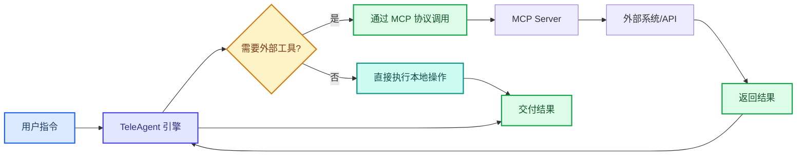

---
AIGC:
  ContentProducer: '001191110102MAD55U9H0F10002'
  ContentPropagator: '001191110102MAD55U9H0F10002'
  Label: '1'
  ProduceID: '161d8132-9910-4df2-a025-13eb42c4db00'
  PropagateID: '161d8132-9910-4df2-a025-13eb42c4db00'
  ReservedCode1: '97cb5c8b-50f0-422a-bb85-f48030e97082'
  ReservedCode2: '97cb5c8b-50f0-422a-bb85-f48030e97082'
---

# 1.6 MCP 连接器与外部工具

## 本章目标

理解 MCP（Model Context Protocol，模型上下文协议）的作用，配置第一个 MCP 连接器，让 TeleAgent 具备连接外部系统和服务的能力。

## 1.6.1 什么是 MCP

MCP 是一种标准化的工具集成协议，让 TeleAgent 能够：

- **连接外部系统**：如飞书、企业微信、OA 系统、数据库等
- **调用外部 API**：如天气查询、地图服务、短信发送等
- **操作外部工具**：如浏览器自动化、文件系统操作等

TeleAgent 的**意图决策中枢**在接收到用户指令后，会通过树形架构路由判断是否需要调用外部工具。如果需要，中枢会自动选择合适的 MCP 连接器并发起调用——用户无需关心底层工具选择过程。

### 技能 vs MCP

| 维度 | 技能（Skills） | MCP 连接器 |
| --- | --- | --- |
| 定位 | 封装专业知识和流程 | 提供外部系统访问通道 |
| 形式 | ZIP 包，含 SKILL.md 和脚本 | 标准协议服务，支持 stdio 和 HTTP |
| 典型场景 | 合同审核、PPT 制作 | 飞书消息推送、数据库查询 |
| 关系 | 技能可以调用 MCP 工具 | MCP 为技能提供外部能力支撑 |

## 1.6.2 MCP 的工作原理



MCP 采用客户端-服务端架构：
- **MCP Client**：内置于 TeleAgent，负责发起工具调用请求
- **MCP Server**：独立运行的服务进程，负责连接具体的外部系统并执行操作

## 1.6.3 传输方式

MCP 支持两种传输方式：

### stdio（标准输入输出）

- 适用于本地运行的 MCP 服务器
- TeleAgent 启动时自动拉起 MCP 服务进程
- 延迟低，适合频繁调用
- 典型场景：本地文件系统操作、数据库访问

### StreamableHTTP（流式 HTTP）

- 适用于远程 MCP 服务
- 通过 HTTP 协议通信
- 支持流式响应
- 典型场景：云端 API 调用、Web 服务集成

## 1.6.4 内置工具

TeleAgent 自带一组内置工具，无需额外配置即可使用：

| 工具 | 能力 |
| --- | --- |
| 文件读写 | 读取、创建、修改本地文件 |
| Shell 执行 | 运行 PowerShell / 命令行命令 |
| 网页搜索 | 联网搜索信息 |
| 网页抓取 | 获取指定 URL 的网页内容 |
| 浏览器自动化 | 打开网页、截图、点击操作 |
| 图像理解 | 识别和描述图片内容 |
| 图像生成 | 根据文字描述生成图片 |

## 1.6.5 配置第一个 MCP 连接器

以飞书（Lark）集成为例：

### 步骤 1：获取 MCP 服务配置

飞书 MCP 服务需要以下配置信息：
- App ID：飞书应用 ID
- App Secret：飞书应用密钥
- 需要的权限范围：消息发送、文档读写、日历管理等

### 步骤 2：在 TeleAgent 中配置

1. 进入"设置 - MCP 工具配置"
2. 点击"添加 MCP 服务"
3. 填写服务名称和连接参数
4. 选择传输方式（stdio 或 HTTP）
5. 保存配置并测试连接

### 步骤 3：验证连接

配置完成后，可以发送测试指令验证：

```
通过飞书给我发送一条测试消息："TeleAgent MCP 连接成功"
```

如果连接正常，TeleAgent 会通过 MCP 协议调用飞书消息接口，你的飞书账号将收到测试消息。

## 1.6.6 常用 MCP 集成场景

| 场景 | MCP 连接器 | 典型用法 |
| --- | --- | --- |
| IM 消息推送 | 飞书 / 企业微信 | 任务完成后自动发送群消息通知 |
| 文档协作 | 飞书文档 / Lark Docs | 自动创建和编辑在线文档 |
| 日程管理 | 飞书日历 | 创建会议、设置提醒 |
| 数据库操作 | MySQL / PostgreSQL | 查询数据、生成报表 |
| 邮件服务 | SMTP / IMAP | 自动发送邮件、解析收件箱 |
| 浏览器自动化 | Playwright | 网页操作、数据采集 |

## 1.6.7 MCP 工具的权限管理

::: warning 安全提示
MCP 工具涉及外部系统访问，TeleAgent 对工具调用实施严格的安全管控：
:::

- **授权确认**：首次调用某个 MCP 工具时，需用户明确授权
- **权限范围**：可配置每个 MCP 工具的可操作范围
- **调用日志**：所有 MCP 工具调用均记录日志，可追溯
- **企业版安全审计**：企业版的智能体安全模块对 MCP 工具调用进行行为监控和异常拦截

## 1.6.8 开发自定义 MCP 服务器

对于有开发需求的企业，可以使用 MCP SDK 开发自定义 MCP 服务器：

### Python（FastMCP）

```python
from mcp.server.fastmcp import FastMCP

mcp = FastMCP("my-tools")

@mcp.tool()
def query_database(sql: str) -> str:
    """执行 SQL 查询并返回结果"""
    # 实现数据库查询逻辑
    return result

if __name__ == "__main__":
    mcp.run()
```

### Node.js / TypeScript（MCP SDK）

```typescript
import { McpServer } from '@modelcontextprotocol/sdk/server/mcp.js'

const server = new McpServer({ name: 'my-tools', version: '1.0.0' })

server.tool('query-database', { sql: z.string() }, async (params) => {
  // 实现数据库查询逻辑
  return { content: [{ type: 'text', text: result }] }
})
```

开发完成后，在 TeleAgent 的 MCP 配置中注册即可使用。

## 本章小结

MCP 连接器让 TeleAgent 突破了本地环境的边界，能够与飞书、企业微信、数据库等外部系统协同工作。结合技能和 MCP，TeleAgent 已经可以成为一个连接万物的智能工作中枢。下一章我们将介绍长期记忆功能——让 TeleAgent 越用越懂你。