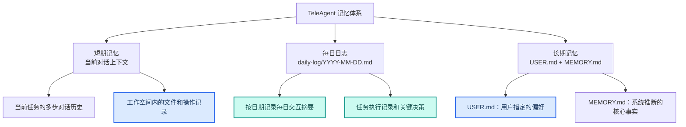

---
AIGC:
  ContentProducer: '001191110102MAD55U9H0F10002'
  ContentPropagator: '001191110102MAD55U9H0F10002'
  Label: '1'
  ProduceID: '3ad74aae-f872-447a-9e73-51cbfdc048a9'
  PropagateID: '3ad74aae-f872-447a-9e73-51cbfdc048a9'
  ReservedCode1: '37225fc8-6a60-48bf-8c05-98d8a2c547c5'
  ReservedCode2: '37225fc8-6a60-48bf-8c05-98d8a2c547c5'
---

# 1.7 长期记忆与个性化

## 本章目标

理解 TeleAgent 的长期记忆机制，学会让 TeleAgent 记住你的偏好和习惯，实现越用越懂你的个性化体验。

## 1.7.1 为什么需要长期记忆

如果没有长期记忆，每次对话都像是在和陌生人交流——你需要反复说明自己的身份、工作习惯、文档格式偏好。有了长期记忆，TeleAgent 会逐步学习并记住这些信息，让协作越发顺畅。

### 有记忆 vs 无记忆

| 场景 | 无长期记忆 | 有长期记忆 |
| --- | --- | --- |
| 写周报 | 每次都要说明格式、章节结构、汇报对象 | 自动按你习惯的格式生成 |
| 数据处理 | 每次都要指定字段含义和处理规则 | 记住字段映射和计算口径 |
| 文档风格 | 每次都要描述用词习惯和排版偏好 | 自动匹配你的行文风格 |
| 项目上下文 | 每次都要解释项目背景和关键人物 | 自动关联项目历史信息 |

## 1.7.2 记忆体系结构

TeleAgent 的记忆体系从功能角度分为以下几层：

> 以下记忆体系结构基于产品实际使用整理，白皮书从认知科学角度将记忆分为情景记忆、语义记忆和程序性记忆三类。



### 短期记忆

- 当前对话的多步上下文
- 工作空间内的文件操作记录
- 任务执行过程中的中间状态
- 随工作空间切换而隔离

### 每日日志

- 按日期自动记录的交互摘要
- 文件路径：`daily-log/YYYY-MM-DD.md`
- 包含当日执行的任务、关键操作和决策记录
- 可按关键词检索历史日志

### 长期记忆

长期记忆分为两份文件，存储在本地设备上：

| 文件 | 性质 | 内容 |
| --- | --- | --- |
| USER.md | 用户指定 | 用户主动告知的长期偏好（称呼、工作习惯、语言偏好等） |
| MEMORY.md | 系统推断 | 系统从交互中自动总结的核心事实（身份、工作内容、技能偏好等） |

::: tip 数据不出本地
所有记忆文件均存储在你的本地设备上，不会上传到云端。这确保了你的个人隐私和工作数据的安全性。
:::

## 1.7.3 如何让 TeleAgent 记住你

### 方式一：主动告知

直接告诉 TeleAgent 你希望它记住的内容：

```
请记住以下信息：
- 我的称呼是"老板"
- 我在安徽电信工作，负责 TeleAgent 省份落地
- 周报按6个章节输出，条目按日期正序
- 数据报表偏好用 HTML 格式，导航栏横向置顶
```

TeleAgent 会将这些信息写入 USER.md，作为持久记忆。

### 方式二：自然积累

在日常使用中，TeleAgent 会自动从对话中提取关键信息写入 MEMORY.md：

- 发现你经常处理 Excel 经营数据 → 记录"精通 Excel 经营数据处理"
- 发现你总是要求简洁风格 → 记录"偏好简洁、关键词式表达"
- 发现你常用某个技能组合 → 记录常用技能偏好

### 方式三：查询与回顾

你可以随时查询 TeleAgent 的记忆内容：

- "你还记得关于我的什么信息？"
- "帮我回顾一下上周做了什么"
- 系统会从 MEMORY.md 和每日日志中检索相关信息

## 1.7.4 记忆的管理

### 查看记忆内容

在 TeleAgent 中可以直接询问它记住了什么，也可以通过文件系统查看记忆文件：

- USER.md 路径：`~/.local/share/TeleAgent/memory/USER.md`（实际路径以本地安装为准）
- MEMORY.md 路径：`~/.local/share/TeleAgent/memory/MEMORY.md`
- 每日日志：`~/.local/share/TeleAgent/memory/daily-log/YYYY-MM-DD.md`

### 修改记忆

- **USER.md**：你可以随时要求 TeleAgent 更新偏好，如"把我的称呼从'老板'改成'张总'"
- **MEMORY.md**：系统推断的记忆可能不准确，你可以纠正："不对，我不在合肥，我在上海"
- **每日日志**：日志为只读记录，不可手动修改

### 记忆的优先级

当 USER.md 和 MEMORY.md 中存在冲突信息时，以 USER.md 为准——用户指定优先于系统推断。

## 1.7.5 记忆的使用场景

### 场景 1：个性化文档生成

你第一次让 TeleAgent 写周报时花了很多时间说明格式。下次只需要说"写周报"，它就会自动按照你上次的格式和偏好生成。

### 场景 2：工作上下文延续

上周你在做一个招标分析任务，本周继续时不需要重新解释项目背景。TeleAgent 从日志中恢复了上下文，直接进入分析阶段。

### 场景 3：技能推荐

TeleAgent 根据你的工作内容和使用习惯，推荐你可能需要的技能。例如检测到你经常处理合同，推荐安装"合同审核"技能。

## 1.7.6 记忆与隐私

::: warning 数据安全
- 记忆文件存储在本地设备，不上传云端
- 记忆内容仅用于提升你的个人使用体验
- 企业版中记忆数据存储在本地电脑，受私有化部署安全体系保护
- 你可以随时查看、修改或清除记忆内容
:::

## 本章小结

长期记忆是 TeleAgent 从"工具"进化为"伙伴"的关键能力。随着使用时间增长，TeleAgent 会越来越了解你的工作方式和偏好，协作效率持续提升。下一章我们将介绍定时任务——让 TeleAgent 在你不在时也能自动工作。