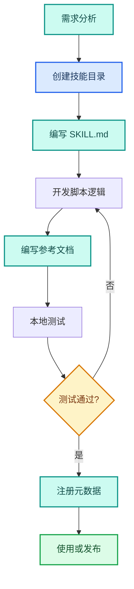
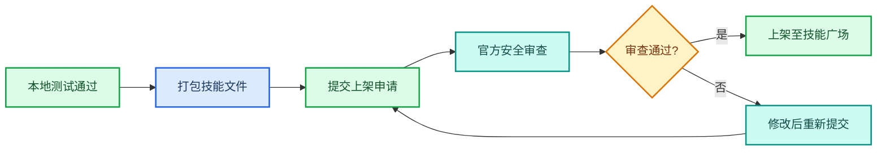

---
AIGC:
  ContentProducer: '001191110102MAD55U9H0F10002'
  ContentPropagator: '001191110102MAD55U9H0F10002'
  Label: '1'
  ProduceID: 'cd439380-77cf-4c15-9cbd-6d333f028b7b'
  PropagateID: 'cd439380-77cf-4c15-9cbd-6d333f028b7b'
  ReservedCode1: '502554e5-7f9f-4336-8f2c-d34c89735d2e'
  ReservedCode2: '502554e5-7f9f-4336-8f2c-d34c89735d2e'
---

# 3.1 打造 Skills：把经验蒸馏为可执行技能

## 本章目标

掌握 TeleAgent 技能的完整开发流程：从需求分析到技能发布，理解技能的目录结构和生命周期，学会用自然语言和手动两种方式创建技能。

## 3.1.1 什么是技能（Skills）

技能是 TeleAgent 能力的基本单元。一个技能封装了特定领域知识、操作流程和工具调用逻辑，用户通过 @技能名 即可调用。

### 技能的核心特征

| 特征 | 说明 |
| --- | --- |
| 可复用 | 一次开发，反复调用，避免重复描述 |
| 可分享 | 开发完成后可上架至技能广场供他人使用 |
| 可组合 | 多个技能可串联完成复杂任务 |
| 自包含 | 技能包包含指令、脚本、模板等全部依赖 |

### 技能的复杂度分级

| 等级 | 名称 | 特征 | 示例 |
| --- | --- | --- | --- |
| L1 | 基础技能 | 单一功能点，调用 1-2 个底层 API 或模型 | 文本翻译、计算表达式 |
| L2 | 复合技能 | 由多个基础技能或逻辑步骤组成，解决一个具体任务 | 自动整理桌面文件并邮件报告 |
| L3 | 工作流技能 | 封装完整的多步骤业务流程，可能涉及多轮人机交互和状态保持 | 从需求文档到原型设计的全流程辅助 |
| L4 | 领域智能体 | 具备特定领域深厚知识，能自主规划、调用多个 L2/L3 技能完成复杂目标 | 财务分析智能体、个人健康管理智能体 |

## 3.1.2 技能的目录结构

每个技能是一个独立目录，核心文件为 `SKILL.md`：

```
my-skill/
├── SKILL.md              # 技能指令文件（必需，入口）
├── scripts/              # 可执行脚本目录
│   ├── main.py           # 主逻辑脚本
│   └── utils.js          # 辅助工具脚本
├── references/           # 参考文档目录
│   └── api-spec.md       # API 文档
├── templates/            # 模板文件目录
│   └── report.html       # 输出模板
└── assets/               # 静态资源目录
    └── logo.png          # 图片资源
```

### SKILL.md 文件格式

SKILL.md 是技能的入口文件，采用 Markdown + YAML Frontmatter 格式：

```yaml
---
name: my-skill
name_cn: "我的技能【自定义】"
description: "一句话描述技能功能"
---

# 我的技能

## 功能说明
详细描述技能的功能和使用场景。

## 使用方式
描述触发条件和调用方式。

## 执行流程
1. 第一步...
2. 第二步...
3. 输出结果...
```

::: warning SKILL.md 注意事项
- 文件名必须为 `SKILL.md`（大写），是技能的唯一入口
- YAML Frontmatter 中的 name_cn 和 description 不能包含未转义的特殊字符
- 单文件大小不超过 6MB，大型数据文件应存放在外部数据目录
- 技能不能依赖本地密钥或硬编码路径，需保证他人部署也能运行
:::

## 3.1.3 创建技能的两种方式

### 方式一：自然语言创建

在技能广场界面点击「创建技能」按钮，用自然语言描述需求：

```
技能名称：周报生成器
功能：从印象笔记中提取本周工作记录，
按6个章节分类汇总，输出为 docx 文档。
章节包括：本周工作、数据回顾、项目进展、
风险提示、下周计划、需协调事项。
```

TeleAgent 会根据描述自动生成技能骨架，用户可进一步编辑完善。

### 方式二：手动开发

适合需要精细控制的复杂技能，完整开发流程如下：



## 3.1.4 完整开发流程详解

### 第一步：需求分析

| 分析维度 | 关键问题 |
| --- | --- |
| 目标用户 | 谁会用这个技能？技术水平如何？ |
| 输入规范 | 用户需要提供什么？文件、文本还是参数？ |
| 输出规范 | 技能产出什么？文件、数据还是执行操作？ |
| 调用频率 | 一次性使用还是高频复用？ |
| 依赖关系 | 需要调用哪些外部服务或本地工具？ |

### 第二步：编写 SKILL.md

SKILL.md 是技能的核心指令文件，告诉 TeleAgent 如何执行该技能。编写要点：

| 要素 | 说明 | 示例 |
| --- | --- | --- |
| 功能描述 | 一句话说清做什么 | "将会议录音转为结构化纪要" |
| 触发条件 | 什么情况下调用 | "用户上传音频文件并要求生成纪要" |
| 执行步骤 | 分步骤描述流程 | 1. 语音识别 2. 内容提取 3. 格式化输出 |
| 输出规范 | 产出的格式和要求 | "Word 文档，含脑图图片" |
| 异常处理 | 出错时怎么办 | "音频格式不支持时提示用户转换格式" |

### 第三步：开发脚本

如果技能需要执行代码逻辑（如数据处理、API 调用），在 `scripts/` 目录下开发。

技术栈选择优先级：

| 优先级 | 技术栈 | 适用场景 |
| --- | --- | --- |
| 1 | 内置技能调用 | 优先复用已有技能能力 |
| 2 | Python | 数据分析、复杂逻辑、批量操作 |
| 3 | Node.js | JSON 读写、轻量文件操作、Web 交互 |
| 4 | PowerShell | Windows 系统级操作 |

::: warning 可移植性要求
技能中的脚本**不能依赖本地密钥、硬编码路径或特定用户环境**。需要保证其他用户部署后也能正常运行。涉及配置项应通过参数传入或从通用配置文件读取。
:::

### 第四步：本地测试

| 测试项 | 方法 |
| --- | --- |
| 基本功能 | 正常输入，验证输出是否正确 |
| 边界情况 | 空输入、超长输入、非法格式 |
| 异常恢复 | 模拟网络中断、文件不存在等异常 |
| 性能测试 | 大文件或批量处理时的响应时间 |
| 可移植性 | 在干净环境（无缓存）下测试是否能运行 |

### 第五步：注册元数据

> 以下元数据注册机制为实践经验总结，具体实现以实际产品为准。

技能开发完成后，需在 skills-metadata.json 中注册元数据条目，客户端才能识别。以下为实践中常见的元数据字段：

| 字段 | 说明 |
| --- | --- |
| name | 技能名称 |
| location | SKILL.md 的路径 |
| fingerprint | 文件指纹（文件数、总字节数、SKILL.md 的 MD5） |
| source | 来源（技能广场添加 / 本地创建 / 本地导入） |
| enabled | 是否启用 |

::: tip 元数据注册
通过技能广场界面创建或导入的技能会自动注册元数据。手动开发的技能需要重启客户端后自动扫描注册，或手动编辑 `skills-metadata.json`。
:::

## 3.1.5 技能发布与上架

### 发布流程



### 安全审查内容

| 审查项 | 检查内容 |
| --- | --- |
| 代码安全 | 是否包含恶意代码、后门、未授权网络请求 |
| 权限最小化 | 是否只申请必要权限 |
| 数据安全 | 是否存在数据外传风险 |
| 依赖安全 | 第三方依赖是否有已知漏洞 |
| 合规性 | 是否违反相关法律法规 |

### 上架要求清单

- [ ] SKILL.md 文件完整且格式正确
- [ ] 脚本可在无缓存环境正常运行
- [ ] 无硬编码路径和本地密钥依赖
- [ ] 单文件不超过 6MB
- [ ] 已通过本地功能测试和边界测试
- [ ] 填写完整的发布说明和更新日志

## 3.1.6 技能维护与版本管理

### 版本迭代

| 迭代场景 | 操作 |
| --- | --- |
| 修复 Bug | 修改脚本，重新注册元数据 |
| 新增功能 | 更新 SKILL.md 和脚本，发布新版本 |
| 性能优化 | 优化脚本逻辑，不需要更新 SKILL.md |
| 适配变更 | TeleAgent 更新后适配新的接口规范 |

### 更新通知

- 技能广场发布的技能更新后，用户在「我的技能」中会看到更新提示
- 本地创建的技能修改 SKILL.md 后需重启客户端刷新元信息
- 企业内部技能可通过管理员统一推送更新

## 3.1.7 常见问题

| 问题 | 原因 | 解决方案 |
| --- | --- | --- |
| 技能创建后客户端不显示 | 未注册 skills-metadata.json | 重启客户端自动扫描，或手动注册元数据 |
| 调用技能时报错 | SKILL.md 格式错误或脚本异常 | 检查 YAML 格式，运行脚本排查错误 |
| 技能在其他电脑无法运行 | 包含硬编码路径或本地密钥 | 改为参数传入，使用相对路径 |
| 技能名称显示异常 | name_cn 字段含非法字符 | 检查 YAML 转义，去除【xxx】标记冲突 |
| 上架审查被拒 | 安全审查未通过 | 根据审查反馈修改，重点关注权限和数据安全 |

## 本章小结

打造 Skills 是从「TeleAgent 使用者」升级为「TeleAgent 构建者」的关键一步。核心是**把重复性工作经验封装为可复用的技能包**——一次开发，反复调用，还可分享给团队。关键是遵循可移植性原则（无硬编码路径、无本地密钥依赖），确保技能在任何环境都能运行。

下一章深入技能广场生态——如何从官方市场获取、管理和协同使用技能。