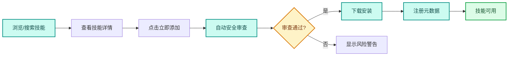
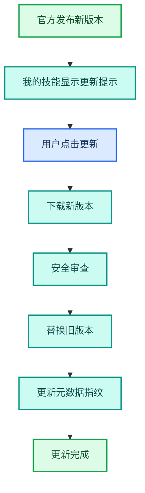
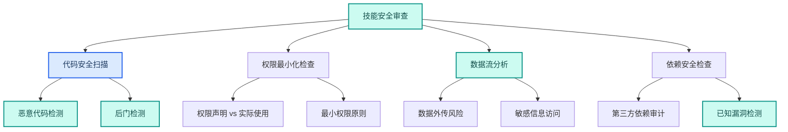

---
AIGC:
  ContentProducer: '001191110102MAD55U9H0F10002'
  ContentPropagator: '001191110102MAD55U9H0F10002'
  Label: '1'
  ProduceID: '9325b86e-9a50-41bc-9064-611f25dacb9b'
  PropagateID: '9325b86e-9a50-41bc-9064-611f25dacb9b'
  ReservedCode1: '12348f90-218e-4f43-9f82-15464bf65c84'
  ReservedCode2: '12348f90-218e-4f43-9f82-15464bf65c84'
---

# 3.2 技能广场生态

## 本章目标

掌握 TeleAgent 技能广场的深度使用：技能浏览与检索、安装与卸载管理、版本更新、安全审查机制理解，以及自研技能与官方技能的协同使用。

## 3.2.1 技能广场概览

技能广场是 TeleAgent 技能生态的核心入口，展示平台官方及社区发布的可用技能。用户可浏览、搜索所需技能，一键添加至个人技能库。

### 技能获取方式

| 方式 | 操作 | 适用场景 |
| --- | --- | --- |
| 技能广场添加 | 浏览/搜索技能广场，点击「立即添加」 | 获取官方和社区发布的技能 |
| 本地导入 | 点击「导入技能」，上传 .zip 或 .skill 文件 | 导入团队内部或自定义技能 |
| 自然语言创建 | 点击「创建技能」，用自然语言描述需求 | 快速生成个性化技能 |

::: tip 技能文件要求
通过本地导入的技能文件，根目录下必须包含 `SKILL.md` 文件，且文件大小不超过 6MB。系统会自动执行安全审查，审查通过后技能出现在「我的技能」列表中。
:::

## 3.2.2 技能浏览与检索

### 分类浏览

技能广场按功能场景分类组织：

| 分类 | 典型技能 | 使用频率 |
| --- | --- | --- |
| 办公文档 | Excel、Word、PPT 生成与处理 | 高 |
| 数据分析 | 经营报告、数据看板、KPI 通报 | 高 |
| 信息检索 | 深度调研、招标监测、新闻聚合 | 中高 |
| 文档处理 | OCR 识别、合同审核、文档比对 | 中 |
| 通信协作 | 企业微信推送、飞书集成、邮件 | 中 |
| 会议记录 | 语音转写、会议纪要、脑图生成 | 中 |
| 开发工具 | 代码生成、调试、架构审计 | 低（开发者群体高） |

### 搜索技巧

| 技巧 | 操作 | 效果 |
| --- | --- | --- |
| 关键词搜索 | 在搜索框输入功能关键词 | 快速定位相关技能 |
| 分类筛选 | 按功能分类筛选 | 浏览特定领域的全部技能 |
| 来源筛选 | 筛选官方技能/社区技能 | 优先使用官方审核技能 |
| 热门排序 | 按安装量/评分排序 | 发现高质量技能 |

## 3.2.3 安装与管理

### 安装流程

### 我的技能管理

安装后的技能在「我的技能」中集中管理：

| 管理操作 | 说明 |
| --- | --- |
| 启用/禁用 | 禁用的技能不占用调用名额，不会被 @ 召唤 |
| 按来源筛选 | 筛选技能广场添加/本地创建/本地导入的技能 |
| 按状态筛选 | 筛选启用/禁用的技能 |
| 更新 | 官方发布新版本后，点击更新获取最新版 |
| 卸载 | 移除技能（内置技能不可卸载） |
| 申请上架 | 本地创建或导入的技能可申请上架至技能广场 |

::: warning 技能数量限制
同时启用的技能上限为 50 个。虽然可以安装更多技能，但超过 50 个后需要禁用部分技能才能启用新的。建议仅启用当前高频使用的技能。
:::

### 卸载保护机制

| 技能类型 | 卸载限制 |
| --- | --- |
| 内置技能 | 不可卸载（如 docx、xlsx、pptx 等基础技能） |
| 技能广场安装的技能 | 可卸载，卸载后元数据同步删除 |
| 本地创建/导入的技能 | 可卸载，建议卸载前备份技能文件 |

## 3.2.4 版本更新机制

### 更新流程

### 更新策略选择

| 策略 | 操作 | 适用场景 |
| --- | --- | --- |
| 手动更新 | 看到更新提示后手动点击 | 谨慎更新，先查看更新日志 |
| 批量更新 | 一次性更新所有有新版本的技能 | 技能数量多，定期维护 |
| 延迟更新 | 暂不更新，继续使用旧版本 | 旧版本稳定运行，不想冒险 |

### 更新注意事项

- 更新前建议查看更新日志，了解变更内容
- 更新后如果出现兼容性问题，可联系技能开发者反馈
- 本地修改过的技能（如修改了 SKILL.md），更新后本地修改会被覆盖
- 技能更新后需重启客户端才能刷新技能元信息

## 3.2.5 安全审查机制

### 安全审查机制

TeleAgent 对技能广场上架技能实施安全审查，确保用户安装的技能安全可信。具体审查机制以实际产品为准。

### 审查维度

### 数字签名

官方技能库经多层自动化与人工审核，并强制数字签名。安装时系统会验证签名完整性：

| 签名状态 | 处理 |
| --- | --- |
| 签名有效 | 正常安装 |
| 签名无效 | 拦截安装，提示签名验证失败 |
| 无签名（社区技能） | 警告提示，用户确认后安装 |

## 3.2.6 自研技能与官方技能的协同

### 协同模式

| 模式 | 说明 | 示例 |
| --- | --- | --- |
| 串联调用 | 自研技能调用官方技能 | 自研周报技能调用 @docx（Word 文档助手） 生成文档 |
| 前置处理 | 自研技能做数据预处理，再交给官方技能 | 自研数据清洗技能 + @xlsx（Excel 表格助手） 表格处理 |
| 后置加工 | 官方技能产出后，自研技能做定制化加工 | @ppt-master（PPT 生成大师） 生成 PPT + 自研技能添加公司水印 |
| 互补组合 | 自研技能和官方技能各负责不同环节 | 自研业务逻辑 + @wecom-push（企业微信推送） 推送结果 |

### 协同设计原则

| 原则 | 说明 |
| --- | --- |
| 单一职责 | 每个技能只做一件事，通过组合实现复杂流程 |
| 接口约定 | 技能间通过文件或标准格式传递数据 |
| 容错隔离 | 一个技能失败不应导致整个链路崩溃 |
| 版本兼容 | 调用官方技能时注意版本兼容性 |

## 3.2.7 企业技能管理

### 企业内部技能市场

企业版 TeleAgent 提供内部技能市场，支持：

| 功能 | 说明 |
| --- | --- |
| 技能上架/下架审核 | 管理员审核后才能在企业内发布 |
| 版本管理 | 管理技能的全版本历史，支持回滚 |
| 使用情况统计 | 统计各技能的安装量、调用量、活跃度 |
| 热点技能分析 | 分析最受企业员工欢迎的技能 |
| 部门权限控制 | 限定技能只在特定部门可见 |
| 统一推送 | 管理员可向全公司推送必需技能 |

### 企业技能生态成熟度

| 阶段 | 特征 | 典型指标 |
| --- | --- | --- |
| 起步期 | 以官方技能为主，少量自研 | 5~10 个自研技能 |
| 成长期 | 部门级自研技能涌现 | 30~50 个自研技能 |
| 成熟期 | 企业技能市场活跃，跨部门共享 | 100+ 自研技能，月活率高 |
| 生态期 | 技能自进化，智能组合 | 技能自动协作完成复杂任务 |

## 3.2.8 常见问题

| 问题 | 原因 | 解决方案 |
| --- | --- | --- |
| 安装技能后客户端不显示 | 元数据未注册 | 重启客户端，或检查 skills-metadata.json |
| 技能广场加载缓慢 | 网络延迟或本地缓存过期 | 首次加载需抓取数据源，之后缓存秒加载 |
| 更新后技能不可用 | 新版本有兼容性问题 | 回滚到旧版本，向开发者反馈 |
| 安全审查被拦截 | 技能包含高危代码 | 查看拦截原因，联系技能开发者确认 |
| 启用技能后无法 @ 调用 | 技能未启用或超过 50 个上限 | 在「我的技能」中启用该技能，禁用不常用的 |
| 企业内部技能无法安装 | 不在可见范围 | 联系企业技能管理员添加权限 |

## 本章小结

技能广场生态是 TeleAgent 能力扩展的核心枢纽——从官方获取成熟技能，开发自研技能填补空白，两者协同构建个人和团队的 AI 工作系统。关键是**理解安全审查机制、掌握版本管理、合理规划技能组合**，让技能生态持续为工作效率赋能。

下一章进入多 Agent 系统设计——用多个智能体协作完成超越单一技能能力的复杂任务。