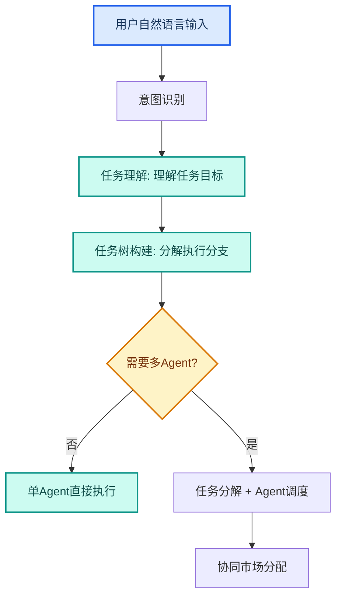
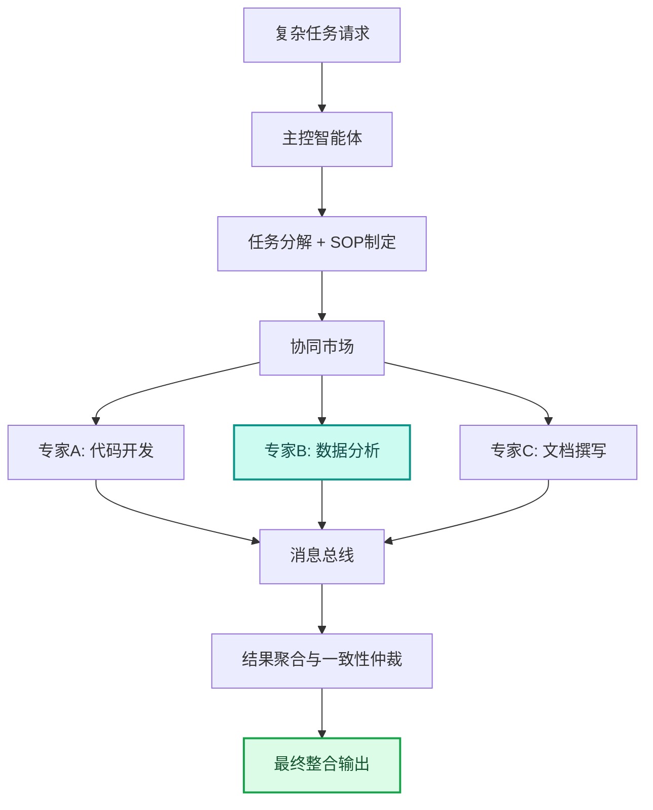
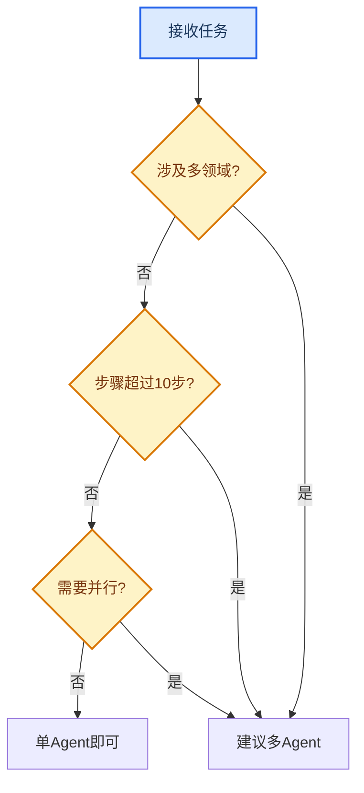
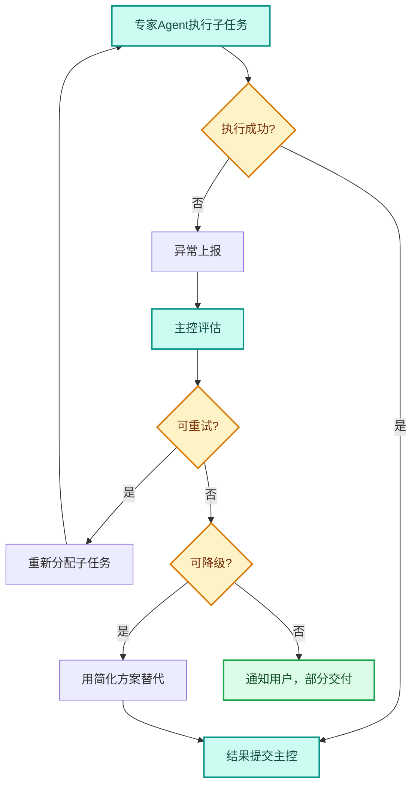
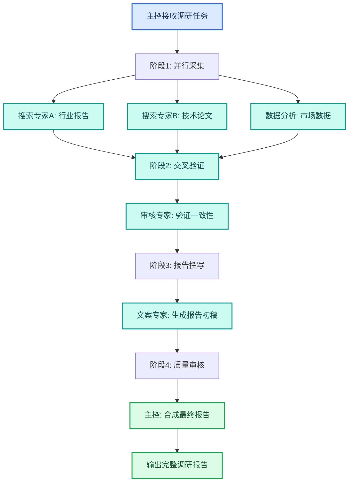

---
AIGC:
  ContentProducer: '001191110102MAD55U9H0F10002'
  ContentPropagator: '001191110102MAD55U9H0F10002'
  Label: '1'
  ProduceID: 'ca2d7a15-1168-4b5b-bda1-319fb5c8813e'
  PropagateID: 'ca2d7a15-1168-4b5b-bda1-319fb5c8813e'
  ReservedCode1: '6f3a5fa1-01a3-4be6-ab4e-caf865485a9b'
  ReservedCode2: '6f3a5fa1-01a3-4be6-ab4e-caf865485a9b'
---

# 3.3 多 Agent 系统设计

## 本章目标

理解 TeleAgent 分布式多智能体协同引擎的工作原理，掌握任务拆分判断、角色契约设计、Agent 间通信和失败传播控制的实践方法。

## 3.3.1 从单 Agent 到多 Agent

### 单 Agent 的局限

单 Agent 模式下，一个智能体完成全部任务。对于简单任务绰绰有余，但面对以下场景会力不从心：

| 局限场景 | 具体表现 |
| --- | --- |
| 跨领域任务 | 一个任务涉及代码、设计、文案等多个专业领域 |
| 长流程任务 | 步骤过多，单 Agent 上下文窗口不够 |
| 高可靠要求 | 单点失败导致整个任务崩溃 |
| 并行处理 | 多个子任务需要同时执行 |

### 多 Agent 的优势

TeleAgent 内置分布式多智能体协同引擎，采用「星状拓扑」与「去中心化市场」相结合的混合架构：

| 优势 | 说明 |
| --- | --- |
| 专业分工 | 每个专家 Agent 专注自己擅长的领域 |
| 并行执行 | 多个子任务同时推进，提升效率 |
| 容错性强 | 单个 Agent 失败可重新分配，不影响整体 |
| 弹性伸缩 | 根据任务负载动态调整参与 Agent 数量 |

### Agent + RPA 融合

TeleAgent 通过 RPA 桥接能力整合了 Agent + RPA（机器人流程自动化）。这意味着智能体不仅能"思考"和"生成"，还能模拟人类操作执行跨系统的重复性工作：

| 能力 | 纯 Agent | Agent + RPA |
| --- | --- | --- |
| 文档处理 | 生成、修改文件 | 同左 |
| 系统操作 | 通过 MCP/API 调用 | 可模拟人类操作 UI，处理无 API 的遗留系统 |
| 跨系统流程 | 依赖 API 集成 | 可串联多个系统界面操作，实现端到端自动化 |
| 适用场景 | 有标准接口的系统 | 接口不全的旧系统、需人工操作的审批流程 |

典型场景：报销审批流程中，TeleAgent 既可以解析发票（Agent 能力），又可以自动在 OA 系统中填写表单并提交（RPA 能力），实现从单据整理到流程提交的全自动化。

## 3.3.2 架构原理

### 意图识别与任务分解

TeleAgent 的多 Agent 协同底层依赖于**意图识别与任务分解**机制——采用分层认知架构将用户意图转化为可执行的任务树。当用户输入一句自然语言时，系统会：

1. **意图识别**：理解用户想完成的任务目标
2. **任务树构建**：沿分层认知架构将意图分解为任务树中的执行节点
3. **任务分解**：将复杂任务拆解为子任务，判断是否需要多 Agent 协同
4. **Agent 调度**：根据子任务的专业领域，分配给对应的专家 Agent



### 星状拓扑



### 核心角色

| 角色 | 职责 | 类比 |
| --- | --- | --- |
| 主控智能体 | 接收任务、分解、制定 SOP、协调、合成结果 | 项目经理 |
| 专家智能体 | 执行子任务，产出专业结果 | 团队成员 |
| 协同市场 | 子任务发布、竞标、分配 | 任务看板 |
| 消息总线 | Agent 间通信、上下文共享 | 即时通讯 |

### 任务调度机制

主控智能体将子任务发布到协同市场，专家智能体根据自身能力声明和信誉积分进行「竞标」：

| 调度因素 | 说明 |
| --- | --- |
| 能力声明 | 专家 Agent 声明自己擅长的领域 |
| 信誉积分 | 历史任务完成质量积累的信誉分 |
| 报价（计算成本） | 完成子任务所需的计算资源 |
| 当前状态 | 是否空闲、负载情况 |

## 3.3.3 任务拆分判断

### 何时需要多 Agent



### 任务拆分原则

| 原则 | 说明 | 示例 |
| --- | --- | --- |
| 领域边界 | 按专业领域拆分 | 代码、设计、文案各一个 Agent |
| 独立性 | 子任务之间尽量独立，减少依赖 | 数据采集和报告撰写可并行 |
| 粒度适中 | 不要过粗（失去分工优势）或过细（协调成本高） | 3~7 个子任务为宜 |
| 可验证 | 每个子任务有明确的验收标准 | 代码 Agent 产出需通过测试 |

### 拆分示例

以「制作季度经营汇报 PPT」为例：

| 子任务 | 角色 Agent | 输入 | 输出 |
| --- | --- | --- | --- |
| 数据采集与分析 | 数据分析专家 | 原始数据文件 | 分析结论 + 数据表格 |
| 内容规划与文案 | 文案撰写专家 | 分析结论 | PPT 大纲 + 每页文案 |
| 视觉设计与排版 | 设计专家 | 大纲 + 文案 | PPTX 文件 |
 | 质量审核 | 审核专家 | PPTX 文件 | 审核意见 + 修改建议 |

## 3.3.4 角色契约设计

### 契约要素

每个专家 Agent 需要明确的角色契约：

| 要素 | 说明 | 示例 |
| --- | --- | --- |
| 角色名称 | 专家身份 | "数据分析专家" |
| 能力声明 | 擅长什么 | "精通数据处理、统计分析、可视化" |
| 输入规范 | 接收什么 | "CSV/Excel 数据文件 + 分析要求" |
| 输出规范 | 产出什么 | "分析结论 JSON + 图表文件" |
| 质量标准 | 验收标准 | "数据准确、结论有据、图表清晰" |
| 异常处理 | 出错怎么办 | "数据缺失时标记并继续，不编造数据" |

### 契约模板

```
角色：{角色名称}
能力：{能力声明}
输入：{输入格式和内容}
输出：{输出格式和内容}
质量标准：{验收标准}
异常处理：{异常场景和应对策略}
依赖：{需要哪些前置条件或外部资源}
```

## 3.3.5 Agent 间通信

### 消息总线

Agent 间通过结构化消息总线进行通信，支持发布/订阅模式：

| 通信类型 | 说明 | 示例 |
| --- | --- | --- |
| 直接消息 | 一个 Agent 向另一个 Agent 发送消息 | 数据专家向文案专家发送分析结论 |
| 广播消息 | 一个 Agent 向所有相关 Agent 发送消息 | 主控 Agent 广播任务进度更新 |
| 共享上下文 | Agent 间共享中间结果和状态 | 所有 Agent 共享项目背景信息 |

### 上下文共享原则

| 原则 | 说明 |
| --- | --- |
| 增量共享 | 只共享新增信息，避免重复传输 |
| 按需可见 | 每个 Agent 只看到与自己相关的上下文 |
| 时序一致 | 确保所有 Agent 看到的状态是最新且一致的 |
| 不可篡改 | 已发布的中间结果不可被单方面修改 |

## 3.3.6 失败传播与容错

### 失败传播控制



### 容错策略

| 策略 | 说明 | 适用场景 |
| --- | --- | --- |
| 重试 | 重新分配子任务给同一个或另一个 Agent | 瞬时失败（网络超时） |
| 降级 | 用简化方案替代，保证核心功能 | 部分能力不可用 |
| 隔离 | 阻止失败传播到其他 Agent | 子任务独立性强 |
| 部分交付 | 完成的部分正常交付，未完成的标注 | 非关键路径子任务失败 |

### 信誉积分系统

每个专家 Agent 有信誉积分，影响后续任务分配：

| 行为 | 积分变化 |
| --- | --- |
| 按时高质量完成 | + 信誉 |
| 完成但质量不佳 | 信誉不变或微降 |
| 任务失败 | 信誉下降 |
| 连续失败 | 信誉大幅下降，减少任务分配 |

## 3.3.7 实践案例：用多 Agent 完成深度调研

### 任务拆分

以「调研 AI Agent 行业现状并生成报告」为例：

| 阶段 | 角色 | 任务 | 输出 |
| --- | --- | --- | --- |
| 1. 信息采集 | 搜索专家 A | 搜索行业报告和新闻 | 原始素材库 |
| 1. 信息采集 | 搜索专家 B | 搜索技术论文和专利 | 技术素材库 |
| 1. 信息采集 | 数据分析专家 | 收集市场规模和融资数据 | 数据表格 |
| 2. 交叉验证 | 审核专家 | 验证多个来源的信息一致性 | 验证报告 |
| 3. 报告撰写 | 文案撰写专家 | 整合所有素材生成报告 | 报告初稿 |
| 4. 质量审核 | 主控智能体 | 审核报告完整性并合成最终版 | 最终报告 |

### 执行流程



## 3.3.8 常见问题

| 问题 | 原因 | 解决方案 |
| --- | --- | --- |
| Agent 间结果不一致 | 上下文共享不充分 | 确保关键上下文通过消息总线同步 |
| 任务卡在某个 Agent | 专家 Agent 执行超时 | 设置超时阈值，超时后重新分配 |
| 合成结果质量差 | 主控合成策略不合理 | 优化合成规则，增加一致性检查 |
| 协调成本过高 | 任务拆分过细 | 合并粒度太小的子任务 |
| 并行子任务有隐含依赖 | 拆分时未识别依赖关系 | 重新分析依赖，调整执行顺序 |

## 本章小结

多 Agent 系统设计是 TeleAgent 应对复杂任务的利器——通过「主控 + 专家」的星状协作架构，实现专业分工、并行执行和容错恢复。关键是**合理判断何时需要多 Agent、设计清晰的角色契约、控制失败传播**。对于简单任务不需要多 Agent，否则增加协调成本反而降低效率。

下一章聚焦自动化工作流的可靠性——如何让定时任务和多步流程从「能用」升级为「可靠」。