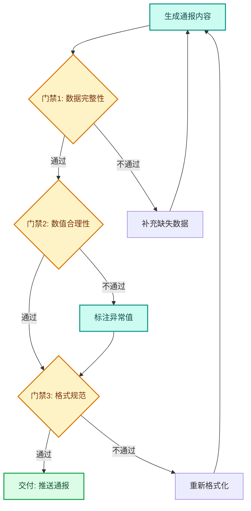
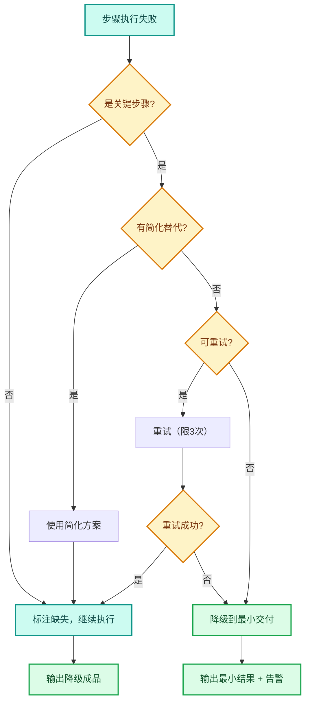

---
AIGC:
  ContentProducer: '001191110102MAD55U9H0F10002'
  ContentPropagator: '001191110102MAD55U9H0F10002'
  Label: '1'
  ProduceID: 'b435d881-262c-45b0-8a6f-f72ac87b4485'
  PropagateID: 'b435d881-262c-45b0-8a6f-f72ac87b4485'
  ReservedCode1: '02ba9f7f-1f4c-4eff-979d-fbd33b29e907'
  ReservedCode2: '02ba9f7f-1f4c-4eff-979d-fbd33b29e907'
---

# 3.4 自动化工作流的可靠性

## 本章目标

掌握让 TeleAgent 自动化工作流从「能用」升级为「可靠」的工程方法：状态机设计、数据源就绪检查、质量门禁、降级交付与告警机制。

## 3.4.1 从「能用」到「可靠」的差距

第二篇的案例展示了 TeleAgent 的能力——执行一次任务并获得成品。但当任务需要**每天定时执行、长时间无人值守**时，「能用」和「可靠」之间有巨大差距：

| 维度 | 能用 | 可靠 |
| --- | --- | --- |
| 数据源 | 假设数据总是可用 | 检查数据是否存在、是否完整 |
| 执行过程 | 正常走完就算成功 | 每步有质量门禁，异常有处理 |
| 失败处理 | 失败就报错终止 | 自动降级、重试、部分交付 |
| 结果质量 | 生成什么就用什么 | 自动校验，不达标自动重做 |
| 运维可见性 | 出问题才知道 | 执行状态可追踪，异常主动告警 |

## 3.4.2 状态机设计

### 为什么需要状态机

复杂的自动化工作流不应是线性脚本，而应有明确的状态流转。状态机让每一步都有前置条件、执行动作和后置验证。

### 状态机模型

```mermaid
stateDiagram-v2
    [*] --> 等待触发
    等待触发 --> 前置检查: 定时触发
    前置检查 --> 执行中: 检查通过
    前置检查 --> 跳过执行: 数据未就绪
    执行中 --> 质量门禁: 执行完成
    质量门禁 --> 交付: 质量达标
    质量门禁 --> 重做: 质量不达标
    重做 --> 执行中: 重试次数未超限
    重做 --> 降级交付: 重试次数超限
    降级交付 --> 交付: 部分结果可用
    交付 --> 告警通知: 有降级或异常
    交付 --> [*]: 正常完成
    跳过执行 --> 告警通知: 通知用户
    告警通知 --> [*]


### 状态设计原则

| 原则 | 说明 |
| --- | --- |
| 状态可观测 | 每个状态可被外部查询和追踪 |
| 转移有条件 | 状态间的转移必须有明确的前置条件 |
| 可回退 | 非关键步骤失败可回退到上一步 |
| 终态明确 | 必须有明确的成功和失败终态 |
| 超时保护 | 每个状态有最大停留时间 |

## 3.4.3 数据源就绪检查

### 检查清单

在执行自动化任务前，必须验证所有输入数据已就绪：

| 检查项 | 检查内容 | 不就绪时的处理 |
| --- | --- | --- |
| 文件存在性 | 输入文件是否存在 | 等待 / 通知用户 / 跳过本次 |
| 文件完整性 | 文件是否完整（非空、非损坏） | 重新获取 / 通知用户 |
| 数据时效性 | 数据是否为最新（如今天的经营数据） | 等待 / 使用上次数据并标注 |
| 格式正确性 | 文件格式是否符合预期 | 转换格式 / 报错 |
| 权限可用性 | 是否有访问外部服务的权限 | 通知用户授权 |

### 检查实现方式

在 SKILL.md 中定义前置检查步骤：

```
## 执行前检查
1. 确认「经营数据」目录下存在今天的 CSV 文件
2. 确认 CSV 文件行数大于 0
3. 确认文件包含必需列：日期、收入、回款
4. 如以上任一检查失败，通知用户并跳过本次执行
```

## 3.4.4 质量门禁

### 门禁设计

质量门禁是流程中自动校验输出质量的关键环节：

| 门禁类型 | 校验内容 | 不达标处理 |
| --- | --- | --- |
| 完整性 | 输出是否包含所有必需部分 | 补充缺失部分 |
| 格式规范 | 输出格式是否符合要求 | 重新格式化 |
| 数据合理性 | 数值是否在合理范围内 | 标注异常并人工确认 |
 | 一致性 | 多源数据是否一致 | 交叉验证，取可信来源 |
| 时效性 | 输出是否在预期时间内生成 | 超时降级 |

### 质量门禁示例

以「每日经营通报」为例：



### 门禁配置原则

| 原则 | 说明 |
| --- | --- |
| 关键路径必设 | 核心输出环节必须有质量门禁 |
| 阈值合理 | 门禁标准不能太松（无意义）或太严（频繁触发） |
| 可配置 | 门禁参数应可根据业务调整 |
| 有记录 | 门禁触发和通过情况需记录日志 |

## 3.4.5 降级交付策略

### 降级层次

当工作流无法完美完成时，按层次降级交付（以下降级阶段命名独立于技能复杂度分级）：

| 降级阶段 | 策略 | 交付内容 |
| --- | --- | --- |
| D0 正常 | 全部步骤成功 | 完整成品 |
| D1 部分 | 非关键步骤失败 | 完整成品 + 标注缺失项 |
| D2 简化 | 复杂步骤用简化替代 | 简化版成品 + 降级说明 |
| D3 最小 | 仅完成核心步骤 | 最小可用结果 + 异常说明 |
| D4 跳过 | 无法执行 | 跳过通知 + 上次结果引用 |

### 降级决策



## 3.4.6 告警与通知机制

### 告警分级

| 等级 | 触发条件 | 通知方式 |
| --- | --- | --- |
| 信息 | 正常执行完成，有降级标注 | 记录日志 |
| 警告 | 部分步骤失败，已降级交付 | IM 消息通知 |
| 错误 | 关键步骤失败，无法交付 | IM 消息 + @相关人员 |
| 严重 | 系统级故障，流程无法启动 | IM 消息 + @all + 邮件 |

### 告警内容规范

每条告警消息应包含：

| 要素 | 示例 |
| --- | --- |
| 任务名称 | 每日经营通报 |
| 触发时间 | 2026-08-16 08:05 |
| 告警等级 | 警告 |
| 问题描述 | 经营数据 CSV 文件缺失 |
| 影响范围 | 无法生成本次通报 |
| 已采取措施 | 跳过本次执行 |
| 建议 | 请检查数据导出任务是否正常 |

## 3.4.7 可靠性设计清单

### 设计阶段检查清单

- [ ] 定义了完整的状态机，每个状态有明确的转移条件
- [ ] 所有数据源都有就绪检查
- [ ] 关键输出环节设置了质量门禁
- [ ] 定义了降级层次和各级降级策略
- [ ] 配置了告警分级和通知方式
- [ ] 每个步骤有超时保护
- [ ] 异常情况有日志记录
- [ ] 可手动触发和手动干预

### 运行阶段监控指标

| 指标 | 说明 | 健康阈值 |
| --- | --- | --- |
| 执行成功率 | 成功执行次数 / 总执行次数 | > 95% |
| 平均执行时长 | 从触发到交付的平均时间 | 稳定无突增 |
| 降级率 | 降级交付次数 / 总执行次数 | < 10% |
| 告警频率 | 单位时间内告警次数 | 递减趋势 |
| 数据就绪率 | 数据源就绪次数 / 检查次数 | > 98% |

## 3.4.8 实践案例：可靠的经营日报自动化

### 整体架构

```mermaid
flowchart TD
    A[每天8:00 定时触发] --> B[前置检查]
    B --> C{今日CSV存在?}
    C -->|否| D[等待15分钟后重试]
    D --> C
    C -->|是| E{数据完整?}
    E -->|否| F[告警: 数据不完整]
    E -->|是| G[计算关键指标]
    G --> H{门禁: 数值合理?}
    H -->|否| I[标注异常 + 告警]
    H -->|是| J[生成通报内容]
    I --> J
    J --> K{门禁: 格式规范?}
    K -->|是| L[推送到企业微信群]
    K -->|否| M[重新格式化]
    M --> K
    L --> N[记录执行日志]
    N --> [*]
    F --> N
    classDef input fill:#dbeafe,stroke:#2563eb,stroke-width:2px,color:#1e3a5f
    classDef process fill:#ccfbf1,stroke:#0d9488,stroke-width:2px,color:#134e4a
    classDef decision fill:#fef3c7,stroke:#d97706,stroke-width:2px,color:#78350f
    classDef output fill:#dcfce7,stroke:#16a34a,stroke-width:2px,color:#14532d
    classDef highlight fill:#e0e7ff,stroke:#4f46e5,stroke-width:2px,color:#312e81
    class C,E,H,K decision
    class F,I,L output
    class G,J,N process
```

### 关键设计点

| 设计点 | 实现 |
| --- | --- |
| 数据未就绪 | 等待 15 分钟后重试，最多重试 3 次 |
| 数据不完整 | 跳过缺失字段，用上次数据填充并标注 |
| 数值异常 | 标注红色，不阻断流程继续推送 |
| 格式错误 | 自动重新格式化，最多重试 2 次 |
| 推送失败 | 重试 3 次后告警通知 |
| 全流程超时 | 超过 30 分钟强制终止并告警 |

## 3.4.9 常见问题

| 问题 | 原因 | 解决方案 |
| --- | --- | --- |
| 定时任务偶尔不执行 | 客户端未运行 | 确保客户端常驻运行；设置启动项 |
| 结果时好时坏 | 数据源不稳定 | 增加数据就绪检查和重试机制 |
| 门禁太严频繁触发 | 阈值设置不合理 | 调整门禁阈值，先观察后调优 |
| 降级交付无感知 | 降级未通知 | 设置降级告警，让用户知晓 |
| 日志堆积占用空间 | 日志未定期清理 | 设置日志保留策略（如保留 30 天） |

## 本章小结

自动化工作流的可靠性是 TeleAgent 从「一次性工具」升级为「长期工作系统」的分水岭。核心是**状态机设计、数据就绪检查、质量门禁、降级交付、告警通知**五位一体的工程化保障。不要追求一步到位——先用最简流程跑通，再逐步添加门禁和降级策略，观察运行数据后持续优化。

下一章进入技能自进化与持续迭代——让技能自动发现改进点，持续提升。