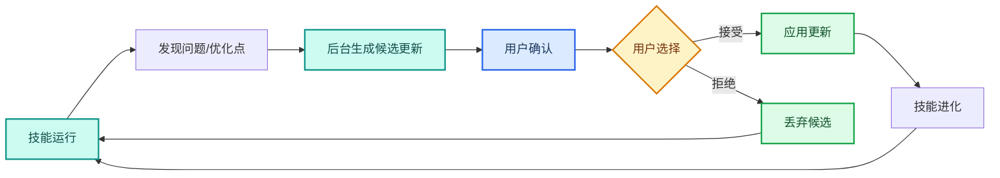
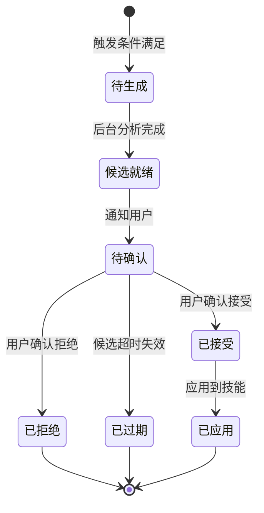
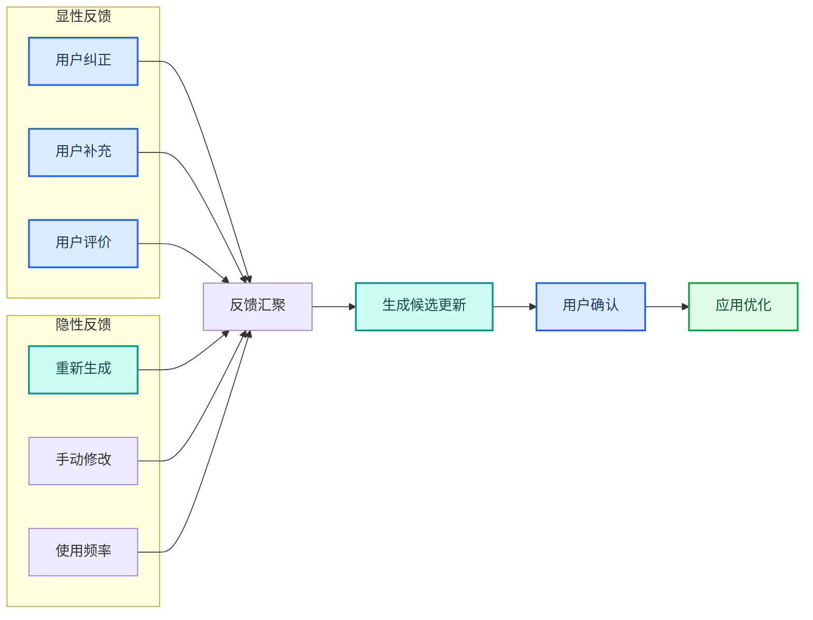

---
AIGC:
  ContentProducer: '001191110102MAD55U9H0F10002'
  ContentPropagator: '001191110102MAD55U9H0F10002'
  Label: '1'
  ProduceID: 'f17eed7d-cbfe-434d-b4eb-e7008a3a69d1'
  PropagateID: 'f17eed7d-cbfe-434d-b4eb-e7008a3a69d1'
  ReservedCode1: '91ac1202-e1c4-4759-adbb-1044ae8fb027'
  ReservedCode2: '91ac1202-e1c4-4759-adbb-1044ae8fb027'
---

# 3.5 技能自进化与持续迭代

## 本章目标

理解 TeleAgent 技能自进化机制的工作原理，掌握候选更新的确认与拒绝流程，以及如何通过反馈驱动技能持续优化。

## 3.5.1 为什么需要自进化

### 传统技能维护的痛点

| 痛点 | 说明 |
| --- | --- |
| 静态老化 | 技能开发后不会自动适应变化的环境 |
| 手动维护成本高 | 开发者需要主动发现问题并更新 |
| 反馈链路断裂 | 用户遇到问题不一定反馈给开发者 |
| 更新滞后 | 从发现问题到发布更新周期长 |

### 自进化的核心理念

TeleAgent 的技能自进化机制让技能在运行过程中**自动发现可改进点，生成候选更新，经用户确认后应用**，实现技能的持续迭代。

## 3.5.2 自进化机制详解

### 触发条件

自进化在以下场景中自动触发：

| 触发场景 | 说明 | 示例 |
| --- | --- | --- |
| 执行失败 | 技能执行出错，分析根因后生成修复候选 | 脚本报错：修复代码路径 |
| 结果不理想 | 输出质量未达预期，优化指令或流程 | PPT 页数不对：调整 SKILL.md 中的页数约束 |
| 新依赖发现 | 执行过程中发现有更优的依赖或方法 | 有新 API 可用：更新脚本调用 |
| 兼容性变化 | TeleAgent 更新后接口变化，适配新规范 | 接口参数变更：更新调用方式 |
| 用户反馈 | 用户在对话中提出改进建议 | 「下次帮我加上时间戳」：更新输出格式 |

### 候选更新生成

自进化在后台自动进行，生成的候选更新包括：

| 更新类型 | 修改对象 | 示例 |
| --- | --- | --- |
| 指令优化 | SKILL.md | 优化执行步骤描述 |
| 脚本修复 | scripts/ 下的脚本 | 修复 Bug 或优化逻辑 |
| 参考文档更新 | references/ 下的文档 | 更新过时的 API 文档 |
| 模板改进 | templates/ 下的模板 | 改进输出模板格式 |
| 依赖更新 | 脚本中的依赖引用 | 替换为更优的库或 API |

### 候选更新的生命周期

## 3.5.3 用户确认流程

### 确认界面

当有候选更新就绪时，用户会收到通知。确认界面展示：

| 信息项 | 说明 |
| --- | --- |
| 技能名称 | 哪个技能有更新候选 |
| 更新类型 | 指令优化 / 脚本修复 / 模板改进等 |
| 问题描述 | 为什么要更新（发现了什么问题） |
| 修改内容 | 具体修改了什么（diff 对比） |
| 影响范围 | 修改会影响哪些功能 |
| 操作选项 | 接受 / 拒绝 / 延后 |

### 确认决策指南

| 场景 | 建议操作 |
| --- | --- |
| 修复关键 Bug | 接受——修复后技能更稳定 |
| 优化执行效率 | 接受——提升处理速度 |
| 适配接口变更 | 接受——否则技能可能失效 |
| 更改输出格式 | 看需求——如果当前格式满足需要可拒绝 |
| 增加新功能 | 看需求——按需接受 |
| 候选已过期 | 忽略——过期候选自动失效 |

::: tip 谨慎评估
对于正在生产环境中稳定运行的关键技能，建议先在测试环境验证候选更新后再接受。如果候选更新有风险，可以拒绝并等待更成熟的版本。
:::

## 3.5.4 反馈驱动优化

### 显性反馈

用户在对话中直接提供的反馈：

| 反馈方式 | 示例 | 效果 |
| --- | --- | --- |
| 纠正结果 | 「这个数据不对，应该是 125.6 不是 1256」 | 技能学习正确的数据处理方式 |
| 补充要求 | 「下次帮我再加上环比数据」 | 技能更新输出规范 |
| 质量评价 | 「这个 PPT 排版太挤了」 | 技能优化排版参数 |
| 偏好声明 | 「我喜欢简洁的表格格式」 | 技能适配用户偏好 |

### 隐性反馈

系统通过观察用户行为自动获取的反馈：

| 行为信号 | 推断的反馈 |
| --- | --- |
| 用户重新生成结果 | 对当前结果不满意 |
| 用户手动修改输出 | 输出有需要改进的地方 |
| 用户连续使用某技能 | 技能价值高 |
| 用户停止使用某技能 | 技能可能有问题 |
| 用户频繁追问修正 | 技能指令不够精确 |

### 双驱动优化

## 3.5.5 技能的长期演进

### 演进阶段

| 阶段 | 特征 | 典型表现 |
| --- | --- | --- |
| 初创期 | 刚开发完成，功能基本可用 | 执行成功率 80%+，偶尔需手动修正 |
| 成长期 | 通过自进化修复主要问题 | 执行成功率 90%+，用户反馈减少 |
| 成熟期 | 稳定运行，偶发优化 | 执行成功率 95%+，极少需要干预 |
| 生态期 | 被其他技能组合调用 | 成为复杂工作流的可靠环节 |

### 版本管理

| 版本类型 | 说明 | 管理方式 |
| --- | --- | --- |
| 主版本 | 重大功能变更 | 需人工开发和充分测试 |
| 次版本 | 功能增强或优化 | 自进化候选 + 用户确认 |
| 修订版本 | Bug 修复 | 自进化自动修复 + 用户确认 |

### 回滚机制

如果接受候选更新后发现问题：

| 回滚方式 | 操作 |
| --- | --- |
| 自动回滚 | 应用后执行失败，自动恢复到上一个版本 |
| 手动回滚 | 在技能管理界面选择恢复到历史版本 |
| 部分回滚 | 只回滚出问题的部分修改，保留其他改进 |

## 3.5.6 自进化的边界

### 自进化的能力范围

| 能做 | 不能做 |
| --- | --- |
| 修复脚本 Bug | 重写核心架构 |
| 优化指令描述 | 改变技能的核心功能定位 |
| 适配接口变更 | 新增需要全新依赖的功能 |
| 调整参数阈值 | 替换数据源或外部服务 |
| 改进输出格式 | 涉及安全或合规的修改 |

### 需要人工干预的场景

| 场景 | 原因 | 处理方式 |
| --- | --- | --- |
| 核心功能缺失 | 自进化无法新增核心功能 | 手动开发新版本 |
| 架构性重构 | 涉及技能整体结构变更 | 手动重构 |
| 安全合规修改 | 涉及权限或数据安全 | 人工审核 + 手动修改 |
| 跨技能依赖变更 | 依赖的其他技能接口变更 | 协调多个技能同步更新 |

## 3.5.7 配置与管理

### 开关设置

在 TeleAgent 的「设置 - 基础设置」中可以开启或关闭技能自进化计划：

| 设置项 | 说明 |
| --- | --- |
| 启用自进化 | 开启后后台自动分析并生成候选更新 |
| 通知方式 | 候选就绪时的通知方式（对话通知/仅标记） |
| 自动应用范围 | 可设置仅自动应用修订版本，次版本需手动确认 |

### 管理建议

| 建议 | 说明 |
| --- | --- |
| 保持开启 | 自进化能持续提升技能质量，建议保持开启 |
| 定期检查 | 定期查看候选更新列表，及时确认或拒绝 |
| 关注日志 | 通过日志了解自进化的触发和改进情况 |
| 参与反馈 | 遇到问题时主动反馈，加速技能进化 |

## 3.5.8 常见问题

| 问题 | 原因 | 解决方案 |
| --- | --- | --- |
| 长时间没有候选更新 | 技能运行稳定或触发条件未满足 | 正常现象，说明技能已趋于成熟 |
| 候选更新频繁被拒绝 | 候选质量不高或不符合用户需求 | 检查触发条件是否合理，必要时手动优化 |
| 接受更新后技能异常 | 候选更新有未发现的副作用 | 使用回滚机制恢复到上一版本 |
| 自进化占用资源过多 | 后台分析频率过高 | 调整自进化触发频率或关闭非关键技能的自进化 |
| 候选过期失效 | 候生成后长时间未确认 | 过期候选自动失效，新的候选会重新生成 |

## 本章小结

技能自进化是 TeleAgent 区别于传统工具的核心特性——技能不是静态的代码包，而是能**在运行中持续学习、发现改进点、自动生成优化候选**的「活」能力。关键是**保持自进化开启、定期确认候选、主动提供反馈**，让技能越用越好。

---

第三篇到此完结。从打造技能到技能广场生态，从多 Agent 协作到自动化可靠性，再到技能自进化，本篇展示了 TeleAgent 从「使用工具」到「构建系统」的完整路径。

接下来的第四篇将把这些能力落地到具体岗位和行业——行政文秘、财务审计、法务合规、销售市场、技术研发，以及政务、金融、教育、医疗等行业的实际应用。