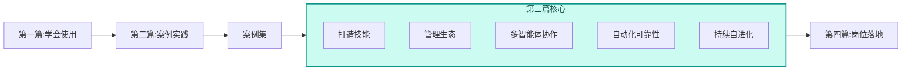

---
AIGC:
  ContentProducer: '001191110102MAD55U9H0F10002'
  ContentPropagator: '001191110102MAD55U9H0F10002'
  Label: '1'
  ProduceID: '5ea43342-6983-4295-aaca-f99813355a25'
  PropagateID: '5ea43342-6983-4295-aaca-f99813355a25'
  ReservedCode1: 'f4d0b1d0-14de-4226-8dac-48e2f1cb720f'
  ReservedCode2: 'f4d0b1d0-14de-4226-8dac-48e2f1cb720f'
---

# 第三篇 进阶篇：把案例变成自己的工作系统

第二篇的案例和案例集展示了 TeleAgent 的开箱即用能力——安装技能、描述任务、获得成品。但每个案例都是一次性的：下次遇到类似任务，还要重新描述、重新执行。

本篇解决的问题是：**如何把一次成功的任务沉淀为可复用的工作系统。**

## 本篇结构

| 章节 | 主题 | 核心问题 |
| --- | --- | --- |
| 3.1 | 打造 Skills | 如何把个人经验封装为可复用、可分享的技能包 |
| 3.2 | 技能广场生态 | 如何从官方技能广场获取、管理和协同使用技能 |
| 3.3 | 多 Agent 系统设计 | 如何用多个智能体协作完成复杂任务 |
| 3.4 | 自动化工作流的可靠性 | 如何让定时任务从"能用"升级为"可靠" |
| 3.5 | 技能自进化与持续迭代 | 如何让技能自动发现改进点并持续迭代 |

## 阅读建议

- **已完成第一篇全部章节的读者**：本篇可以按顺序通读，每章都建立在前篇能力之上
- **有开发经验的读者**：重点看3.1（技能开发）和3.3（多 Agent 设计）
- **管理岗位读者**：重点看3.2（技能生态管理）和3.4（自动化可靠性）
- **所有读者**：3.5展示了 TeleAgent 的自进化机制，建议必读

## 从"使用者"到"构建者"

本篇是 TeleAgent 从"工具"升级为"平台"的关键——当你开始打造自己的技能、设计多智能体协作、构建可靠自动化工作流时，TeleAgent 就不再只是一个助手，而是你个人的 AI 工作系统。