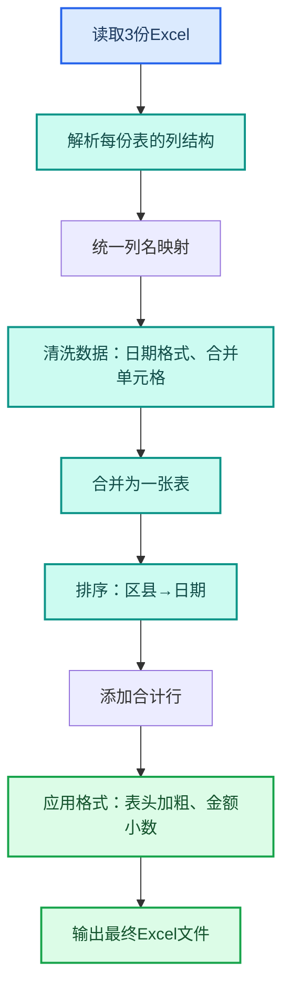

---
AIGC:
  ContentProducer: '001191110102MAD55U9H0F10002'
  ContentPropagator: '001191110102MAD55U9H0F10002'
  Label: '1'
  ProduceID: 'c0bfad78-6e80-4fce-a45f-1c5888899f83'
  PropagateID: 'c0bfad78-6e80-4fce-a45f-1c5888899f83'
  ReservedCode1: '8550592b-7965-46d6-a54e-b3bf16968a27'
  ReservedCode2: '8550592b-7965-46d6-a54e-b3bf16968a27'
---

# 2.1 办公文档：Excel、Word、PPT

## 本章目标

通过三个实操案例，掌握用 TeleAgent 处理日常办公三件套（Excel、Word、PPT）的完整流程。从"给模型一段文字"升级为"让智能体直接交付成品文件"。

## 2.1.1 案例：Excel 数据清洗与格式化

### 案例背景

你是一名词售人员，月底收到各区县提交的销售数据 Excel 表，格式混乱：有的合并了单元格、有的列名不统一、有的日期格式混乱。你需要将三张表合并为一张标准格式的汇总表。

### 目标定义

- 输入：3 份格式不一致的区县销售数据 Excel 文件
- 交付：1 份统一格式的汇总 Excel，含标准列名、规范日期、合计行
- 验收：打开文件无报错，公式可计算，格式可直接用于汇报

### 操作步骤

**第一步：上传文件**

将 3 份 Excel 文件拖入工作空间文件区。

**第二步：描述任务**

在输入框输入：

```
请把这三份销售数据表合并为一张汇总表，要求：
1. 统一列名为：区县、产品名称、销售数量、销售金额（万元）、日期
2. 日期统一为 YYYY-MM-DD 格式
3. 取消所有合并单元格
4. 按区县和日期排序
5. 末尾添加合计行
6. 输出为 Excel 文件，表头加粗、金额列保留两位小数
```

**第三步：执行流程**



**第四步：验收交付**

TeleAgent 输出一份 Excel 文件。检查要点：
- 打开无报错
- 列名统一、日期格式规范
- 合计行数值正确
- 金额列两位小数

### 效果对比

| 对比项 | 手动操作 | TeleAgent |
| --- | --- | --- |
| 耗时 | 30~60 分钟 | 2~3 分钟 |
| 合并单元格处理 | 逐个手动取消 | 自动识别并取消 |
| 格式统一 | 逐列检查修改 | 一次性规范 |
| 出错率 | 容易漏改 | 规则统一执行 |

### 能力组合

| 第一篇能力 | 本章运用 |
| --- | --- |
| 文件上传与处理（1.3） | 上传 3 份 Excel 到工作空间 |
| 任务执行全流程（1.4） | 自然语言指令 → 自动规划 → 执行交付 |
| 工作空间隔离（1.3） | 为此任务创建独立工作空间 |

::: tip 进阶玩法
如果每月都要做同样的合并，可以把这套指令固化成定时任务（1.8），每月初自动执行。或者用 skill-creator 技能把它封装成自定义技能（3.1），以后一句话唤起。
:::

## 2.1.2 案例：Word 报告撰写

### 案例背景

你需要写一份季度工作总结报告，手头有本季度的项目数据 Excel、一份会议纪要 Word 文档，以及一份上季度报告作为格式参考。

### 目标定义

- 输入：项目数据 Excel、会议纪要 Word、上季度报告 Word（格式模板）
- 交付：一份完整的季度工作总结 Word 文档
- 验收：结构完整、数据准确、格式与上季度报告一致

### 操作步骤

**第一步：上传全部参考文件**

将 3 份文件拖入工作空间。

**第二步：描述任务**

```
请根据以下文件撰写本季度工作总结报告：
1. 从「项目数据.xlsx」提取本季度各项目完成情况
2. 从「会议纪要.docx」提取关键决议和待办事项
3. 参考「上季度报告.docx」的格式和结构来写
4. 报告结构：一、季度概况；二、项目进展；三、关键决议；四、问题与风险；五、下季度计划
5. 每部分用表格呈现核心数据，文字部分简洁
6. 输出为 Word 文档
```

**第三步：执行流程**

TeleAgent 会依次：读取并解析三份文件 → 提取项目数据关键指标 → 提取会议纪要要点 → 分析上季度报告结构 → 按指定结构生成报告 → 应用格式 → 输出 Word 文件。

**第四步：验收交付**

打开生成的 Word 文档，检查：
- 五个章节齐全
- 数据与源文件一致
- 格式与上季度报告一致（字体、标题层级、表格样式）
- 无遗漏的待办事项

### 效果对比

| 对比项 | 手动撰写 | TeleAgent |
| --- | --- | --- |
| 耗时 | 2~4 小时 | 5~10 分钟 |
| 数据提取 | 逐条从 Excel 抄录 | 自动提取并填入 |
| 格式对齐 | 手动调整样式 | 参考模板自动对齐 |
| 修改迭代 | 改一遍重排一遍 | 补充指令即可重新生成 |

## 2.1.3 案例：PPT 快速生成

### 案例背景

明天上午要向领导汇报项目进展，你需要一份 8~10 页的 PPT。

### 目标定义

- 输入：项目进展 Word 报告一份
- 交付：8~10 页 PPT，含封面、目录、内容页、总结页
- 验收：结构清晰、要点突出、可直接演示

### 操作步骤

**第一步：上传报告**

将 Word 报告拖入工作空间。

**第二步：描述任务**

```
请根据这份项目报告生成一份汇报PPT，要求：
1. 8~10页，含封面、目录、内容页、总结页
2. 每页标题+3~5个要点，不要大段文字
3. 数据部分用表格呈现
4. 风格简洁正式，适合向上级汇报
5. 输出为PPTX文件
```

**第三步：验收交付**

检查：
- 页数在 8~10 页范围内
- 每页是关键词式要点，不是整段文字
- 数据表格正确
- 封面信息完整

::: tip PPT 技能加持
安装「pptx」或「ppt-master」技能后，PPT 生成质量和排版精细度会显著提升。详见1.5和2.9。
:::

### 能力组合

| 第一篇能力 | 本章运用 |
| --- | --- |
| Skills 技能加载（1.5） | 安装 pptx 技能提升 PPT 质量 |
| 任务执行全流程（1.4） | 从文档到 PPT 的端到端转换 |
| 工作空间管理（1.3） | 独立工作空间管理多份文件 |

## 2.1.4 三个案例的能力总结

| 案例 | 核心能力 | 对应第一篇章节 |
| --- | --- | --- |
| Excel 数据清洗 | 文件处理 + 数据操作 | 第 3、4 章 |
| Word 报告撰写 | 多文件整合 + 文档生成 | 第 3、4 章 |
| PPT 快速生成 | 文档转换 + Skills 技能 | 第 4、5 章 |

## 2.1.5 常见问题

| 问题 | 原因 | 解决方案 |
| --- | --- | --- |
| Excel 合并后数据丢失 | 原表有隐藏行或筛选状态 | 先提示"请先取消所有筛选和隐藏行" |
| Word 报告格式与模板不一致 | 模板文件结构未被充分识别 | 在指令中更具体地描述格式要求 |
| PPT 页数不够或过多 | 内容信息量与页数不匹配 | 在指令中明确每页内容范围 |
| 生成的文件打不开 | 罕见编码或版本问题 | 要求输出为 .xlsx/.docx/.pptx 标准格式 |

## 本章小结

三个案例覆盖了日常办公最核心的"三件套"场景。关键不是 TeleAgent 能做什么，而是你如何把工作需求转化为清晰的指令——**说清目标、给全素材、明确验收标准**，TeleAgent 就能把数小时的工作压缩到几分钟。

下一章我们看 TeleAgent 如何批量管理文件和整理桌面，把"找文件"的时间也省掉。