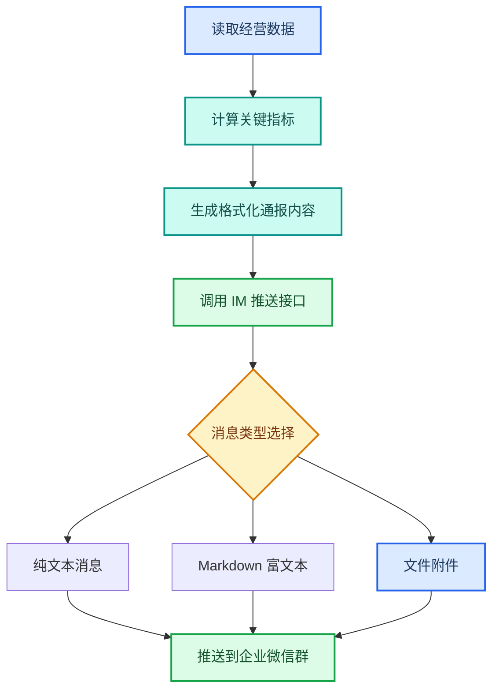

---
AIGC:
  ContentProducer: '001191110102MAD55U9H0F10002'
  ContentPropagator: '001191110102MAD55U9H0F10002'
  Label: '1'
  ProduceID: '25110860-9cfb-4cc9-b9d0-c1afa57ecad6'
  PropagateID: '25110860-9cfb-4cc9-b9d0-c1afa57ecad6'
  ReservedCode1: 'abb8f1e4-f200-449f-b372-7fc7a23003dc'
  ReservedCode2: 'abb8f1e4-f200-449f-b372-7fc7a23003dc'
---

# 2.10 IM 集成与消息推送

## 本章目标

掌握用 TeleAgent 将任务结果自动推送到企业即时通讯工具的完整流程：IM 连接器配置、消息格式选择、定时推送、多群分发。

## 2.10.1 案例：每日经营数据通报推送

### 案例背景

经营团队每天早上需要在企业微信群发送昨日经营数据通报，过去需要人工从系统中导数据、做表格、截图发群，流程繁琐且容易延误。

### 目标定义

- 输入：每日经营数据（收入、回款、新增用户等关键指标）
- 交付：格式化消息自动推送到企业微信群
- 验收：消息格式美观、数据准确、准时推送

### 操作步骤

**第一步：配置 IM 连接器**

在 TeleAgent 设置中配置企业微信机器人 Webhook URL（或飞书机器人 Token）。配置方式详见1.6 MCP 连接器。

**第二步：描述任务**

```
请汇总昨天的经营数据，生成一份简洁的日报，包含：
1. 昨日收入和回款数据
2. 新增用户数和活跃用户数
3. 环比变化标注涨跌
4. 异常指标加红色标注
然后推送到企业微信群。
```

**第三步：执行流程**



**第四步：验收交付**

检查要点：
- 消息准时推送到目标群
- 数据准确无误
- 格式在手机端和电脑端均显示正常
- 异常标注醒目

### 效果对比

| 对比项 | 人工发群 | TeleAgent |
| --- | --- | --- |
| 操作耗时 | 每天约 30 分钟 | 全自动 |
| 准时性 | 依赖个人时间安排 | 定时精确推送 |
| 格式一致性 | 每次手工编辑，格式不一 | 模板化，格式统一 |
| 异常发现 | 需人工比对 | 自动标注涨跌异常 |
| 多群分发 | 逐群复制粘贴 | 一次推送多群 |

### 能力组合

| 第一篇能力 | 本章运用 |
| --- | --- |
| MCP 连接器（1.6） | 企业微信/飞书 Webhook 连接 |
| 定时任务（1.8） | 每日定时自动推送 |
| 数据分析与经营报告（2.3） | 经营数据汇总和指标计算 |
| Skills 技能（1.5） | @wecom-push 企业微信推送技能 |

::: tip 企业微信推送技能
安装「wecom-push」技能后，支持发送纯文本消息、Markdown 富文本、文件附件三种消息类型。可通过 @all 提醒全员，也可指定具体成员。飞书用户可使用「lark」技能实现同等功能。
:::

## 2.10.2 消息格式选择

### 三种消息类型对比

| 类型 | 优势 | 限制 | 适用场景 |
| --- | --- | --- | --- |
| 纯文本 | 兼容性最好，所有客户端可显示 | 不支持富文本格式 | 简短通知、状态更新 |
| Markdown | 支持标题、加粗、引用、颜色标注 | 部分旧客户端显示不完整 | 格式化报告、数据通报 |
| 文件附件 | 可推送完整文档 | 文件不超过 20MB | 推送周报、PPT 等成品文件 |

### Markdown 消息示例

```
### 每日经营通报（8月15日）

**收入数据**
- 昨日收入：125.6万元 <font color="info">↑3.2%</font>
- 累计收入：3,756.2万元

**回款数据**
- 昨日回款：98.3万元 <font color="warning">↓5.1%</font>
- 累计回款：2,891.5万元

**用户数据**
- 新增用户：1,256 <font color="info">↑12.5%</font>
- 活跃用户：45,670

> 异常指标：回款环比下降超5%，请关注
```

## 2.10.3 定时推送场景

### 常见定时推送场景

| 场景 | 频率 | 推送内容 | 消息类型 |
| --- | --- | --- | --- |
| 每日经营通报 | 每天 8:00 | 昨日关键经营指标 | Markdown |
| 每周工作周报 | 每周五 17:00 | 一周工作总结 | 文件附件 |
| 招标信息日报 | 每天 8:30 | 新增招标信息汇总 | Markdown + 链接 |
| 异常预警 | 触发式 | 指标超阈值告警 | 纯文本（@all） |
| 会议纪要分发 | 会后 30 分钟 | 会议纪要文档 | 文件附件 |

### 定时推送设置


设置示例：

| 参数 | 值 |
| --- | --- |
| 任务名称 | 每日经营通报 |
| Cron 表达式 | `0 8 * * *` |
| 任务内容 | 汇总昨日经营数据并生成通报 |
| 推送目标 | 经营分析群 |
| 消息格式 | Markdown |
| 失败重试 | 3 次 |

## 2.10.4 多群分发与权限管理

### 多群分发

一条消息可同时推送到多个群：

```
将本周工作周报推送到以下群：
1. 部门周报群
2. 经营分析群
3. 领导层通报群
```

### 权限注意事项

| 注意点 | 说明 |
| --- | --- |
| Webhook 有效性 | 群机器人 Webhook URL 需保持有效，失效会导致推送失败 |
| 消息频率限制 | 企业微信群机器人每分钟最多发 20 条消息 |
| 文件大小限制 | 单个文件不超过 20MB |
| 敏感信息 | 推送内容不应包含涉密数据 |
| @all 谨慎使用 | 避免 @all 骚扰，仅紧急通知使用 |

## 2.10.5 常见问题

| 问题 | 原因 | 解决方案 |
| --- | --- | --- |
| 推送失败 | Webhook URL 失效或网络问题 | 检查群机器人是否被移除，重新获取 Webhook URL |
| Markdown 格式显示异常 | 企业微信对部分 Markdown 语法支持不完整 | 使用企业微信支持的 Markdown 子集（标题、加粗、引用、颜色标签） |
| 文件推送失败 | 文件超过 20MB 限制 | 压缩文件或拆分后分多次推送 |
| 定时推送未执行 | 客户端未运行 | 确保客户端在预定时间处于运行状态 |
| 推送内容包含乱码 | 编码问题 | 确保内容为 UTF-8 编码 |
| @成员不生效 | 成员 ID 不正确 | 使用企业微信 userid，不是昵称 |

## 本章小结

IM 集成与消息推送是 TeleAgent「MCP 连接器 + 定时任务」的延伸场景——把任务结果从工作空间自动推送到企业微信、飞书等沟通工具，实现「执行 → 交付 → 通知」的闭环。关键是**选对消息格式、设好推送频率、注意权限和频率限制**，让信息及时触达又不造成骚扰。

下一章进入 OCR 识别与文档数字化——将扫描件、图片、发票等纸质或图片文档转化为可编辑的结构化文本。