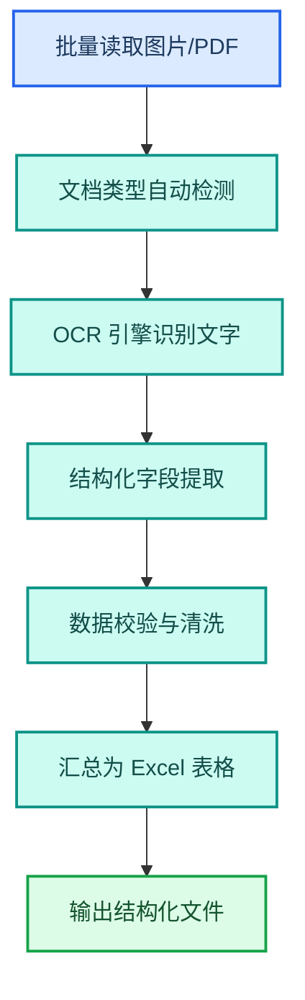
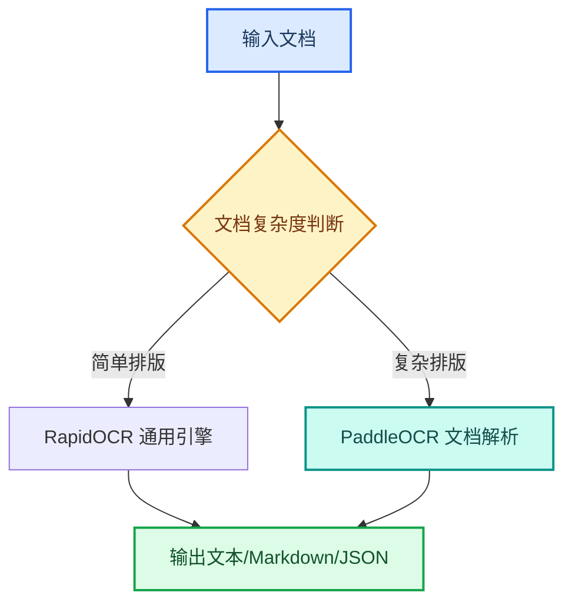

---
AIGC:
  ContentProducer: '001191110102MAD55U9H0F10002'
  ContentPropagator: '001191110102MAD55U9H0F10002'
  Label: '1'
  ProduceID: 'c80df957-7263-42f7-a592-203c2964f3e2'
  PropagateID: 'c80df957-7263-42f7-a592-203c2964f3e2'
  ReservedCode1: '6c410402-d975-4233-9d9a-de67b14b754d'
  ReservedCode2: '6c410402-d975-4233-9d9a-de67b14b754d'
---

# 2.11 OCR 识别与文档数字化

## 本章目标

掌握用 TeleAgent 将扫描件、图片、发票、合同等非结构化文档转化为可编辑结构化文本的完整流程：文件输入、引擎选择、格式输出、批量处理。

## 2.11.1 案例：发票信息批量提取

### 案例背景

财务部门每月收到数百张纸质发票的扫描件，需要逐张录入发票代码、发票号码、金额、开票日期等关键信息。人工录入费时费力且容易出错。

### 目标定义

- 输入：一批发票扫描件图片（PNG/JPG）或扫描 PDF
- 交付：结构化 Excel 表格，每行对应一张发票的关键字段
- 验收：字段识别准确、格式统一、可批量核对

### 操作步骤

**第一步：上传文件**

将发票扫描件批量拖入工作空间，或放入指定子目录。

**第二步：描述任务**

```
请对工作空间中「发票扫描件」目录下的所有图片进行 OCR 识别，
提取以下信息并汇总为 Excel 表格：
1. 发票代码
2. 发票号码
3. 开票日期
4. 购方名称
5. 销方名称
6. 金额（不含税）
7. 税额
8. 价税合计
9. 发票类型（增值税专用/普通）
```

**第三步：执行流程**



**第四步：验收交付**

检查要点：
- 每张发票对应表格中一行记录
- 发票代码和号码无识别错误
- 金额字段保留两位小数
- 日期格式统一为 YYYY-MM-DD
- 发票类型分类正确

### 效果对比

| 对比项 | 人工录入 | TeleAgent |
| --- | --- | --- |
| 单张耗时 | 约 2 分钟 | 约 10 秒 |
| 100 张耗时 | 约 3 小时 | 约 15 分钟 |
| 准确率 | 依赖人员细心程度 | 95% 以上（清晰扫描件） |
| 数据格式 | 手工输入，格式不一 | 统一结构化输出 |
| 可追溯性 | 难以复核 | 原图与数据一一对应 |

### 能力组合

| 第一篇能力 | 本章运用 |
| --- | --- |
| Skills 技能（1.5） | @ocr-toolkit OCR 识别技能 |
| 文件处理（1.3） | 批量图片/PDF 读取和 Excel 输出 |
| 数据分析与经营报告（2.3） | 识别后数据的进一步分析 |
| 任务执行全流程（1.4） | 批量识别→提取→校验→汇总 |

::: tip OCR 识别技能
安装「ocr-toolkit」技能后，基于本地 RapidOCR 引擎运行，数据不出本地。支持 PDF（含扫描件）、PNG、JPG、BMP、TIFF、WebP 等格式输入，输出 TXT、Markdown、JSON 三种格式。支持发票、行程单、资质证书、合同、身份证、银行卡等文档类型自动检测。
:::

## 2.11.2 支持的文档类型

### 通用文档

| 类型 | 支持情况 | 输出内容 |
| --- | --- | --- |
| 扫描件 PDF | 支持 | 全文文本，保留段落结构 |
| 图片文档 | 支持 | 全文文本 |
| 多栏排版文档 | 支持 | 保留多栏结构 |
| 手写文档 | 部分支持 | 清晰手写体可识别，潦草体准确率有限 |
| 表格图片 | 支持 | 保留行列结构的表格文本 |

### 专用票据

| 类型 | 自动检测 | 提取字段 |
| --- | --- | --- |
| 增值税发票 | 支持 | 发票代码、号码、日期、金额、税额、购销方 |
| 行程单 | 支持 | 姓名、航线、日期、金额、票号 |
| 资质证书 | 支持 | 证书名称、编号、有效期、发证机关 |
| 身份证 | 支持 | 姓名、身份证号、地址、有效期 |
| 银行卡 | 支持 | 卡号、银行名称、卡类型 |

### 复杂文档处理

对于复杂排版的 PDF（含公式、图表、多栏混排），通用 OCR 引擎可能无法完整保留结构。此时可切换到 PaddleOCR 文档解析引擎，支持：

- 数学公式识别
- 图表内容提取
- 多栏分栏还原
- 表格结构化输出



## 2.11.3 输出格式选择

### 三种输出格式对比

| 格式 | 优势 | 适用场景 |
| --- | --- | --- |
| TXT | 最简洁，纯文本 | 后续手动编辑、快速浏览 |
| Markdown | 保留标题、列表、表格结构 | 文档归档、知识库入库 |
| JSON | 结构化键值对，程序可读 | 与其他系统集成、批量数据处理 |

### JSON 输出示例（发票）

```json
{
  "document_type": "增值税普通发票",
  "invoice_code": "031001900111",
  "invoice_number": "12345678",
  "issue_date": "2026-08-15",
  "buyer": "XX科技有限公司",
  "seller": "XX办公用品有限公司",
  "amount_excluding_tax": "5000.00",
  "tax_amount": "650.00",
  "total_amount": "5650.00",
  "items": [
    {
      "name": "办公耗材",
      "quantity": "100",
      "unit_price": "50.00",
      "amount": "5000.00"
    }
  ]
}
```

## 2.11.4 批量处理与质量保障

### 批量处理流程

| 步骤 | 操作 | 要点 |
| --- | --- | --- |
| 1. 文件整理 | 将待识别文件放入同一目录 | 按类型或日期分目录 |
| 2. 批量识别 | 指定目录批量处理 | 识别进度实时反馈 |
| 3. 结果汇总 | 所有结果合并为一份文件 | 原始文件名作为标识列 |
| 4. 人工抽检 | 随机抽取 10%~20% 核对 | 重点检查金额、号码等关键字段 |
| 5. 异常修正 | 对识别错误的结果做修正 | 可追问「修正第 5 行的发票号码为...」 |

### 识别准确率提升技巧

| 技巧 | 操作 | 效果 |
| --- | --- | --- |
| 提升图像质量 | 扫描分辨率不低于 300 DPI | 显著提高识别准确率 |
| 预处理图片 | 裁剪边框、调整对比度 | 减少噪声干扰 |
| 指定文档类型 | 在指令中说明文档类型 | 启用专用模板，字段提取更准确 |
| 分批处理 | 控制每批文件数量 | 避免内存不足导致中断 |
| 双引擎校验 | 复杂文档用两个引擎交叉验证 | 发现不一致字段后人工确认 |

## 2.11.5 常见问题

| 问题 | 原因 | 解决方案 |
| --- | --- | --- |
| 识别结果有错别字 | 图片不清晰或字体特殊 | 提高扫描分辨率；对关键字段做人工抽检 |
| 表格结构丢失 | 复杂表格超过引擎能力 | 切换到 PaddleOCR 文档解析引擎 |
| 大 PDF 处理超时 | 页数过多 | 拆分为多个小 PDF 分批处理 |
| 手写体无法识别 | 手写潦草 | 手写体识别能力有限，建议人工录入关键字段 |
| 中英混排识别错误 | 引擎语言模型偏向 | 在指令中说明「中英文混排文档」 |
| 内存不足 | 批量文件过大 | 减少每批文件数量，关闭其他占用内存的程序 |

::: warning 数据安全提示
OCR 识别过程中的所有数据均在本地处理，不上传云端。处理身份证、银行卡等敏感信息时，建议在独立目录中操作，处理完成后及时清理中间文件。
:::

## 本章小结

OCR 识别与文档数字化是 TeleAgent「输入端」的关键能力——将纸质或图片文档转化为可编辑、可搜索的结构化数据。关键是**选对引擎、指定文档类型、做好批量处理和质量抽检**。日常票据用通用引擎即可，复杂文档切换到 PaddleOCR 解析引擎。

---

第二篇到此完结。从 Excel 到 PPT，从深度调研到合同审核，从会议纪要到招标监测，这些案例展示了 TeleAgent 在日常办公中的核心价值：**把耗时重复的工作交给 AI，让人专注于判断和决策**。

案例集汇集了全国电信系统 99 个真实案例的详细操作步骤和效果亮点，建议结合自身岗位查阅。接下来的第三篇将进入进阶阶段——从「使用现成技能」到「打造自己的工作系统」，包括自定义技能开发、技能广场生态、多 Agent 系统设计等内容。