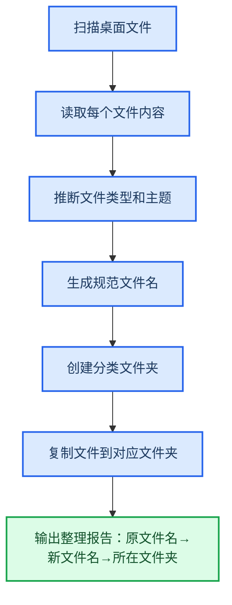

---
AIGC:
  ContentProducer: '001191110102MAD55U9H0F10002'
  ContentPropagator: '001191110102MAD55U9H0F10002'
  Label: '1'
  ProduceID: '9a85c2c3-41cc-47b9-83b5-bf8d090f31cc'
  PropagateID: '9a85c2c3-41cc-47b9-83b5-bf8d090f31cc'
  ReservedCode1: 'e31feabd-607a-4d7a-a601-f4b50e7bc4d8'
  ReservedCode2: 'e31feabd-607a-4d7a-a601-f4b50e7bc4d8'
---

# 2.2 文件管理与桌面整理

## 本章目标

学会用 TeleAgent 批量管理本地文件——重命名、归类、搜索汇总，把杂乱的桌面和文件夹整理得井井有条。

## 2.2.1 案例：桌面文件批量整理

### 案例背景

你的桌面上堆了 50 多个文件：报告、截图、合同、表格混在一起，文件名五花八门（"新建文档.docx"、"最终版2.xlsx"、"扫描件(3).pdf"）。每次找文件都要翻半天。

### 目标定义

- 输入：桌面上杂乱的 50+ 文件
- 交付：按类型归入子文件夹，文件名统一规范
- 验收：桌面只剩分类文件夹，文件名可读、有日期、有内容标识

### 操作步骤

**第一步：描述任务**

```
请帮我整理桌面文件，要求：
1. 按文件类型分到子文件夹：报告文档、表格数据、合同法务、图片截图、其他
2. 文件名统一为：日期_主题_版本.扩展名（如 20260815_季度报告_v1.docx）
3. 根据文件内容推断主题，不要用"新建文档"这种默认名
4. 保留原始文件，复制到分类文件夹，不删除原文件
```

**第二步：执行流程**



**第三步：验收交付**

TeleAgent 输出一份整理报告，列出每个文件的原名、新名、归属文件夹。检查：
- 分类文件夹已创建
- 文件名规范统一
- 原文件未被删除

### 效果对比

| 对比项 | 手动整理 | TeleAgent |
| --- | --- | --- |
| 耗时 | 1~2 小时 | 3~5 分钟 |
| 文件命名 | 逐个想名字 | 根据内容自动生成 |
| 归类准确度 | 凭印象 | 根据文件内容判断 |
| 整理报告 | 无 | 完整的文件映射清单 |

::: tip 安全提示
首次操作建议选择"复制不删除"模式，确认整理结果满意后再手动删除原文件。熟练后可以在指令中说明"移动文件"直接整理。
:::

## 2.2.2 案例：跨文件夹搜索与汇总

### 案例背景

你需要从 5 个项目文件夹中找出所有包含"预算"信息的文件，并把关键数据汇总到一张表格里。

### 目标定义

- 输入：5 个项目文件夹，共约 80 个文档
- 交付：1 张汇总表，列出每个项目的预算金额、预算日期、文件来源
- 验收：无遗漏项目，金额与原文一致

### 操作步骤

```
请在以下5个项目文件夹中搜索包含"预算"的文件：
- 项目A/、项目B/、项目C/、项目D/、项目E/
然后汇总为一张表格，包含列：项目名称、预算金额（万元）、预算日期、文件来源路径
输出为Excel文件
```

### 执行流程

TeleAgent 会：逐个扫描文件夹 → 识别含"预算"关键词的文件 → 读取每个文件提取预算金额和日期 → 汇总到统一表格 → 输出 Excel。

### 验收要点

- 5 个项目都有数据行
- 金额与原文档一致
- 文件来源路径正确

### 能力组合

| 第一篇能力 | 本章运用 |
| --- | --- |
| 工作空间文件管理（1.3） | 管理大量文件的处理上下文 |
| 任务执行全流程（1.4） | 批量操作 + 结果汇总 |
| 安全操作确认（1.10） | 文件复制/移动操作的确认机制 |

## 2.2.3 案例：定期自动备份重要文件

### 案例背景

你经常忘记备份重要工作文件，导致翻找历史版本时很痛苦。

### 目标定义

- 设定每天下午 6 点自动备份指定文件夹到备份目录
- 备份文件夹按日期命名（如 backup_20260815）
- 保留最近 30 天的备份，超期自动清理

### 操作步骤

利用1.8学到的定时任务功能：

```
请创建一个定时任务：
- 执行时间：每天 18:00
- 任务内容：将「重要文件」文件夹复制到「备份」目录下，文件夹名格式为 backup_YYYYMMDD
- 清理规则：删除「备份」目录中超过30天的旧备份文件夹
```

::: tip 结合长期记忆
如果你在 USER.md 中记录了"重要文件路径"偏好，TeleAgent 会自动记住哪些文件需要备份，无需每次指定路径。参见1.7长期记忆。
:::

## 2.2.4 实用文件管理指令模板

以下是日常文件管理的高频指令，可直接复用：

| 场景 | 指令模板 |
| --- | --- |
| 批量重命名 | `请将该文件夹下的所有文件按"日期_主题.扩展名"格式重命名` |
| 去重 | `请检查该文件夹是否有重复文件（内容相同但文件名不同），列出重复文件清单` |
| 格式转换 | `请将这些Word文件批量转换为PDF格式` |
| 内容摘要 | `请为每个文件生成一段50字的内容摘要，汇总到一张表格` |
| 按日期归档 | `请按文件的修改日期，将文件归入 2026年7月、2026年8月 等月度文件夹` |

## 2.2.5 常见问题

| 问题 | 原因 | 解决方案 |
| --- | --- | --- |
| 文件名含特殊字符导致报错 | 系统不允许的字符（如 ? * < > \|） | 在指令中要求"过滤文件名中的特殊字符" |
| 整理后找不到文件 | 归类逻辑与预期不符 | 先用"复制不删除"模式，对照整理报告确认 |
| 大文件处理超时 | 文件过大导致读取慢 | 分批指定文件夹，每次处理 20~30 个 |
| 定时备份未执行 | TeleAgent 未开机或处于休眠 | 确保客户端在执行时间点处于运行状态 |

## 本章小结

文件管理看似简单，却是日常办公最大的时间黑洞。TeleAgent 的价值在于：你只需要说清规则，它来执行重复劳动。关键是**把你的分类逻辑用自然语言说清楚**，它就能按你的标准批量执行。

下一章进入数据分析领域——看 TeleAgent 如何从多源数据中挖掘洞察并生成经营报告。