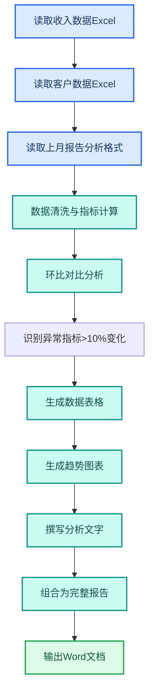

---
AIGC:
  ContentProducer: '001191110102MAD55U9H0F10002'
  ContentPropagator: '001191110102MAD55U9H0F10002'
  Label: '1'
  ProduceID: '78c00835-982c-4acf-968f-586e157b7346'
  PropagateID: '78c00835-982c-4acf-968f-586e157b7346'
  ReservedCode1: '9655b6a1-80bc-42ff-b9ce-ec20d8d697fe'
  ReservedCode2: '9655b6a1-80bc-42ff-b9ce-ec20d8d697fe'
---

# 2.3 数据分析与经营报告

## 本章目标

掌握用 TeleAgent 完成从多源数据整合到经营分析报告生成的全链路操作，包括数据清洗、趋势分析、图表生成和报告输出。

## 2.3.1 案例：月度经营分析报告

### 案例背景

每月初你需要写一份经营分析报告，数据来源包括：收入数据 Excel、客户数据 Excel、上月报告 Word（格式参考）。传统做法是先在 Excel 里做透视表和图表，再截图粘贴到 Word 里写分析文字，整个过程大半天。

### 目标定义

- 输入：本月收入数据 Excel、客户数据 Excel、上月报告 Word
- 交付：一份完整的月度经营分析报告 Word，含数据表格、趋势分析、图表
- 验收：数据准确、分析有洞察、格式与上月报告一致

### 操作步骤

**第一步：上传全部文件**

```
请根据以下文件生成本月经营分析报告：
1. 从「本月收入数据.xlsx」提取收入、回款、欠费等核心指标
2. 从「客户数据.xlsx」提取新增客户、流失客户、活跃客户数据
3. 与上月数据对比，计算环比变化
4. 报告结构参考「上月报告.docx」的格式
5. 报告内容要求：
   - 一、核心指标概览（表格+环比）
   - 二、收入分析（按产品线拆分，含趋势图）
   - 三、客户分析（新增/流失/活跃，含分布图）
   - 四、异常说明（环比变化超过10%的指标需解释原因）
   - 五、下月建议
6. 输出为Word文档
```

**第二步：执行流程**



**第三步：验收交付**

检查要点：
- 五个章节齐全
- 收入和客户数据与源文件一致
- 环比计算正确
- 异常指标有原因分析
- 图表清晰可读

### 效果对比

| 对比项 | 传统方式 | TeleAgent |
| --- | --- | --- |
| 数据整理 | 手动做透视表 | 自动提取计算 |
| 图表制作 | Excel 截图粘贴 | 直接生成嵌入文档 |
| 分析文字 | 逐段手写 | 自动生成+人工微调 |
| 总耗时 | 4~6 小时 | 10~15 分钟 |
| 格式一致 | 每月手动对齐 | 参考模板自动对齐 |

### 能力组合

| 第一篇能力 | 本章运用 |
| --- | --- |
| 文件处理（1.3） | 多文件上传和管理 |
| 任务执行全流程（1.4） | 复杂多步任务的编排执行 |
| 多模型切换（1.9） | 数据分析阶段用推理强的模型 |

::: tip 数据准确性
TeleAgent 处理数据时会保留计算过程，你可以在输出中看到每个指标的计算来源。如果对某个数字有疑问，直接追问"这个数怎么算的"即可。
:::

## 2.3.2 案例：KPI 数据看板

### 案例背景

你需要将季度 KPI 数据整理成一个可视化的看板，供团队会议展示。

### 目标定义

- 输入：季度 KPI 数据 Excel（含收入、客户满意度、项目完成率等 10+ 指标）
- 交付：一份 HTML 格式的交互式 KPI 看板
- 验收：指标卡清晰、颜色区分达标/未达标、可浏览器直接打开

### 操作步骤

```
请根据这份KPI数据生成一个HTML看板，要求：
1. 顶部展示核心指标卡片：总收入、新增客户、客户满意度、项目完成率
2. 每个卡片显示数值、目标值、达成率，达标绿色未达标红色
3. 下方放两个图表：收入趋势折线图、客户满意度柱状图
4. 配色用深蓝主题，简洁专业
5. 导航栏横向置顶
6. 输出为单个HTML文件，浏览器直接打开可用
```

### 验收要点

- 指标数值与源数据一致
- 达标/未达标颜色正确
- 图表可正常渲染
- 页面响应式适配

## 2.3.3 数据分析常用指令模板

| 场景 | 指令模板 |
| --- | --- |
| 基础统计 | `请计算这份数据的均值、中位数、标准差，并标注异常值` |
| 环比同比 | `请计算每个指标的环比和同比变化，变化超过10%的标红` |
| 分组汇总 | `请按部门/产品线汇总销售额，输出排名表` |
| 趋势预测 | `请根据近6个月数据拟合趋势线，预测下月值` |
| 交叉分析 | `请做交叉分析：不同产品线在不同区域的销售表现` |

## 2.3.4 常见问题

| 问题 | 原因 | 解决方案 |
| --- | --- | --- |
| 计算结果有误差 | 原始数据有空值或格式不统一 | 先要求"清洗数据，处理空值和格式" |
| 图表不显示 | HTML 中的图表库未正确加载 | 确认输出为"单文件 HTML，内联所有 CSS 和 JS" |
| 报告分析太笼统 | 指令未给够分析维度 | 在指令中指定分析角度（如按产品线、按区域、按客户类型） |
| 数据量过大超时 | 一次性处理太多数据 | 按时间或维度分批处理 |

## 本章小结

经营分析报告是 TeleAgent 最能体现"成品交付"价值的场景之一——从多源数据到带图表的分析报告，全链路自动化。关键技巧是**在指令中把分析维度和验收标准说清楚**，让 TeleAgent 知道你要的不是简单罗列数据，而是有洞察的分析。

下一章进入深度调研领域——看 TeleAgent 如何联网检索、交叉验证并生成研究报告。