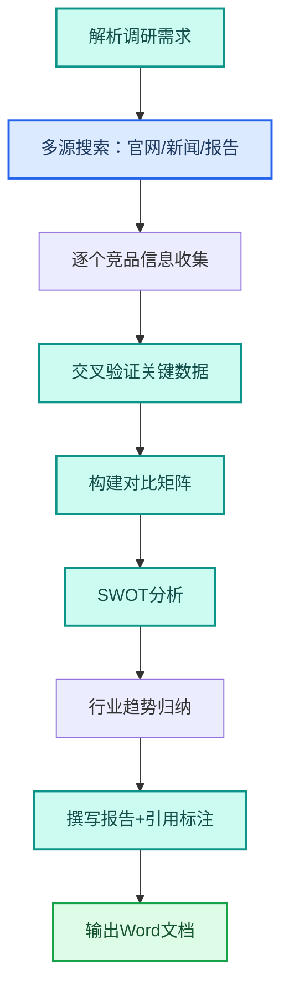

---
AIGC:
  ContentProducer: '001191110102MAD55U9H0F10002'
  ContentPropagator: '001191110102MAD55U9H0F10002'
  Label: '1'
  ProduceID: '6d3f1def-35d4-4317-9ac4-5f5b64a01b68'
  PropagateID: '6d3f1def-35d4-4317-9ac4-5f5b64a01b68'
  ReservedCode1: '00891634-49ca-43a7-b2f7-dc9069838133'
  ReservedCode2: '00891634-49ca-43a7-b2f7-dc9069838133'
---

# 2.4 深度调研与信息整合

## 本章目标

掌握用 TeleAgent 完成专业调研报告的完整流程：多源搜索、交叉验证、引用标注，输出可直接用于决策的研究报告。

## 2.4.1 案例：行业竞品调研报告

### 案例背景

领导要求你在一周内出一份 AI 智能体行业竞品调研报告，覆盖 5 家主要竞品的产品定位、功能对比、市场份额和差异化策略。

### 目标定义

- 输入：行业关键词和竞品名单
- 交付：一份结构化调研报告 Word，含竞品对比表、SWOT 分析和趋势判断
- 验收：信息有来源引用、对比维度完整、结论有数据支撑

### 操作步骤

**第一步：描述任务**

```
请帮我调研AI智能体行业的主要竞品，要求：
1. 调研对象：竞品A、竞品B、竞品C、竞品D、竞品E
2. 每个竞品覆盖：产品定位、核心功能、目标客户、定价模式、市场份额、最新动态
3. 做一张功能对比矩阵表（功能项×竞品）
4. 做一个SWOT分析（针对TeleAgent的竞争态势）
5. 总结行业趋势和差异化建议
6. 所有关键数据需标注信息来源
7. 输出为Word文档，约5000字
```

**第二步：执行流程**



**第三步：验收交付**

检查要点：
- 5 个竞品信息完整
- 对比矩阵维度齐全
- SWOT 分析针对性强
- 关键数据有来源标注
- 结论有逻辑支撑

### 效果对比

| 对比项 | 传统调研 | TeleAgent |
| --- | --- | --- |
| 信息收集 | 逐个搜索引擎查 | 多源并行检索 |
| 交叉验证 | 手动比对多篇文章 | 自动发现矛盾并标注 |
| 报告撰写 | 逐段手写 | 自动生成结构化报告 |
| 总耗时 | 3~5 天 | 20~30 分钟 |
| 引用标注 | 事后补标 | 生成时同步标注 |

### 能力组合

| 第一篇能力 | 本章运用 |
| --- | --- |
| 任务执行全流程（1.4） | 多步检索推理任务的编排 |
| 联网搜索（1.3） | 联网能力是调研基础 |
| 多模型切换（1.9） | 推理阶段用强模型确保深度 |
| 长期记忆（1.7） | 调研偏好可记入记忆复用 |

::: tip 深度调研技能
安装「deep-research」技能后，调研深度和引用规范性会大幅提升。该技能会执行多轮搜索、交叉验证和结构化输出，适合正规研究报告场景。
:::

## 2.4.2 案例：政策法规解读

### 案例背景

新出台的行业政策需要快速解读，提取对企业的影响和应对建议。

### 操作步骤

```
请帮我解读最新出台的《XXX政策文件》，要求：
1. 提取政策核心要点（不超过10条）
2. 分析对我们行业的影响（正面/负面/中性）
3. 列出需要调整的合规事项
4. 给出3条应对建议
5. 标注政策原文出处和条款编号
输出为Word文档
```

## 2.4.3 调研报告质量检查清单

| 检查项 | 合格标准 |
| --- | --- |
| 信息完整 | 每个调研对象覆盖所有指定维度 |
| 来源标注 | 关键数据有可追溯的信息来源 |
| 交叉验证 | 重大结论至少有两个独立来源支撑 |
| 时效性 | 信息发布时间在6个月以内 |
| 客观性 | 分析基于事实而非主观臆断 |

## 2.4.4 常见问题

| 问题 | 原因 | 解决方案 |
| --- | --- | --- |
| 搜索结果过时 | 搜索引擎返回旧内容 | 在指令中加"优先搜索2026年的最新信息" |
| 数据有矛盾 | 不同来源信息不一致 | 要求"标注矛盾点，分别列出两个来源" |
| 报告太浅 | 指令未要求深度分析 | 增加"每个结论需有3个论据支撑"等要求 |
| 引用格式不规范 | 未指定引用格式 | 在指令中要求"按[序号]格式标注，末尾附来源列表" |

## 本章小结

深度调研是 TeleAgent 最能体现"智能"而非"工具"属性的场景——它不是简单搜索和复制粘贴，而是多源检索、交叉验证、逻辑推理的综合运用。关键是**在指令中明确信息来源要求和验证标准**，确保报告经得起审查。

下一章进入合同审核——TeleAgent 如何逐条审读合同并生成批注版文档。