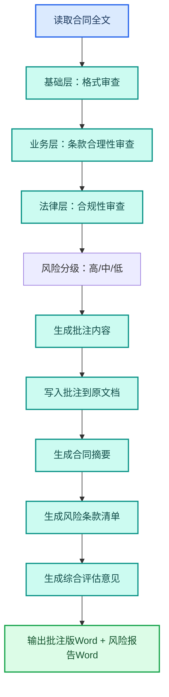

---
AIGC:
  ContentProducer: '001191110102MAD55U9H0F10002'
  ContentPropagator: '001191110102MAD55U9H0F10002'
  Label: '1'
  ProduceID: '819698ec-31f4-4b80-924e-bf48ea4494fd'
  PropagateID: '819698ec-31f4-4b80-924e-bf48ea4494fd'
  ReservedCode1: '45f18afb-2672-4543-bf80-c0bd4a16cc16'
  ReservedCode2: '45f18afb-2672-4543-bf80-c0bd4a16cc16'
---

# 2.5 合同审核与法务辅助

## 本章目标

掌握用 TeleAgent 完成合同审核的完整流程：逐条审读、风险标注、生成批注版文档和结构化风险报告。这是 TeleAgent 演示场景中的黄金案例之一。

## 2.5.1 案例：采购合同审核

### 案例背景

法务部门收到一份 20 页的采购合同，要求在 2 小时内出具审核意见。传统人工审核需要逐条阅读、标注风险、写审核报告，至少半天。

### 目标定义

- 输入：采购合同 Word 文档（20 页）
- 交付：批注版合同（原文+批注）+ 结构化风险报告
- 验收：风险条款无遗漏、批注清楚可读、风险分级准确

### 操作步骤

**第一步：上传合同文件**

将合同 Word 拖入工作空间。

**第二步：加载技能并描述任务**

```
@contract-review 请审核这份采购合同，要求：
1. 三层审核：基础格式、业务条款、法律风险
2. 不改变原文，以批注形式标注问题
3. 每条批注包含：问题类型、风险原因、修改建议
4. 风险等级分为高/中/低，高风险条款用红色标注
5. 生成结构化风险报告，包含：
   - 合同摘要（甲乙方、金额、期限、标的）
   - 风险条款清单（按风险等级排序）
   - 综合评估意见和修改优先级建议
6. 输出批注版Word文档和风险报告Word文档
```

**第三步：执行流程**



**第四步：验收交付**

检查要点：
- 原文未被修改，批注以评论形式附加
- 每条批注包含问题类型、风险原因、修改建议三要素
- 高风险条款醒目标注
- 风险报告结构完整

### 效果对比

| 对比项 | 人工审核 | TeleAgent |
| --- | --- | --- |
| 审核耗时 | 3~5 小时 | 5~8 分钟 |
| 遗漏率 | 容易漏看长合同尾部条款 | 全文逐条扫描无遗漏 |
| 批注质量 | 依赖个人经验 | 标准化三层审核结构 |
| 风险报告 | 事后另写 | 与审核同步生成 |

### 能力组合

| 第一篇能力 | 本章运用 |
| --- | --- |
| Skills 技能（1.5） | @contract-review 技能加载 |
| 文件处理（1.3） | 合同文件上传和批注版输出 |
| 安全控制（1.10） | 合同属敏感文件，确认操作权限 |
| 任务执行全流程（1.4） | 多步审核→批注→报告的端到端流程 |

::: warning 合同安全提示
合同包含商业敏感信息。建议在审核前确认：1）对文件写入操作选择"允许一次"，确认输出路径后再切换"一直允许"；2）审核完成后及时从工作空间删除原件。
:::

## 2.5.2 合同审核的三层结构

TeleAgent 合同审核遵循三层递进结构：

| 层级 | 审查内容 | 典型问题 |
| --- | --- | --- |
| **基础层** | 格式规范性 | 标题缺失、编号不连续、签字栏空白 |
| **业务层** | 条款合理性 | 付款条件过苛、交付标准模糊、验收周期不合理 |
| **法律层** | 合规与风险 | 管辖法院不利、违约责任不对等、知识产权归属不清 |

## 2.5.3 常见问题

| 问题 | 原因 | 解决方案 |
| --- | --- | --- |
| 批注在 Word 中显示位置不对 | 批注锚点定位偏差 | 以风险报告为准，批注版仅作辅助参考 |
| 遗漏了附件条款 | 附件未被一起上传 | 把合同附件也一起拖入工作空间 |
| 风险等级判断有偏差 | 不同行业合同风险标准不同 | 在指令中补充行业背景和特殊关注条款 |

## 本章小结

合同审核是 TeleAgent 最具说服力的实战场景——上传统一份合同，几分钟内拿到批注版文档和风险报告，且全文逐条扫描无遗漏。关键是**加载 contract-review 技能并在指令中说清三层审核要求和风险分级标准**。

下一章进入知识库构建——把散落的文档变为可检索、可问答的知识资产。