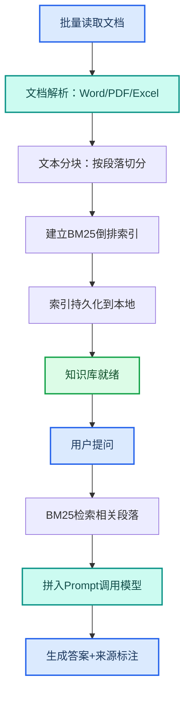

---
AIGC:
  ContentProducer: '001191110102MAD55U9H0F10002'
  ContentPropagator: '001191110102MAD55U9H0F10002'
  Label: '1'
  ProduceID: 'b309b84a-c2fb-45c6-a0a7-791ae31c0335'
  PropagateID: 'b309b84a-c2fb-45c6-a0a7-791ae31c0335'
  ReservedCode1: '75c62eb0-9679-4fef-b866-dd78b305d29b'
  ReservedCode2: '75c62eb0-9679-4fef-b866-dd78b305d29b'
---

# 2.6 知识库构建与管理

## 本章目标

掌握用 TeleAgent 构建本地知识库的完整流程：文档批量导入、语义索引、RAG 检索问答，把散落的文档变为可检索、可问答的知识资产。

## 2.6.1 案例：企业制度知识库

### 案例背景

公司有 80+ 份制度文件散落在不同文件夹（管理办法、操作规范、流程文档），每次查制度都要翻半天。希望构建一个可问答的知识库，输入问题直接给出答案和原文出处。

### 目标定义

- 输入：80+ 份制度文档（Word/PDF/Excel）
- 交付：可检索问答的知识库，输入问题返回答案+来源文件+条款位置
- 验收：召回率 >90%，答案准确，来源可追溯

### 操作步骤

**第一步：批量导入文档**

```
请将以下文件夹中的所有文档导入知识库：
- 制度文件/（含Word、PDF、Excel共80份）
建立本地索引，支持关键词检索和语义检索
```

**第二步：执行流程**



**第三步：查询使用**

```
@knowledge-base 请问公司差旅报销标准是多少？出差审批流程是怎样的？
```

TeleAgent 从知识库中检索相关条款，返回答案并标注来源文件和条款号。

### 效果对比

| 对比项 | 传统查找 | 知识库问答 |
| --- | --- | --- |
| 查找耗时 | 10~30 分钟逐份翻 | 10 秒内返回答案 |
| 准确性 | 依赖记忆可能记错 | 基于原文准确回答 |
| 来源追溯 | 找到文件但没标注条款 | 直接给出文件名和条款位置 |
| 跨文件关联 | 需要手工比对 | 自动关联多份文件中的相关条款 |

### 能力组合

| 第一篇能力 | 本章运用 |
| --- | --- |
| Skills 技能（1.5） | @knowledge-base 技能加载 |
| 文件处理（1.3） | 批量文档导入和解析 |
| 数据不出域（1.10） | 知识库索引全部存储在本地 |
| 长期记忆（1.7） | 知识库与记忆互补，知识库存制度、记忆存偏好 |

::: tip 知识库 vs 长期记忆
知识库存的是"组织知识"——制度文件、技术文档、操作手册；长期记忆存的是"个人偏好"——你的习惯、你的项目、你的工作方式。两者互补但不重叠。
:::

## 2.6.2 知识库的日常维护

| 维护操作 | 操作方式 |
| --- | --- |
| 新增文档 | 拖入文件后输入"请将新文档加入知识库索引" |
| 更新文档 | 替换原文件后输入"请重新索引该文件" |
| 删除文档 | 输入"请从知识库中移除该文件的索引" |
| 重建索引 | 输入"请重建知识库全量索引" |
| 检查状态 | 输入"请列出知识库当前的文档清单和索引状态" |

## 2.6.3 常见问题

| 问题 | 原因 | 解决方案 |
| --- | --- | --- |
| 检索结果不准 | 文档分块粒度不当 | 追问"请调整分块策略，按章节而非段落切分" |
| 答案缺少来源标注 | 检索未返回来源信息 | 在指令中要求"每条答案必须标注来源文件和条款位置" |
| PDF 内容未被索引 | 扫描件 PDF 无法直接提取文字 | 先用 OCR 技能（2.11）转为文本，再导入知识库 |
| 知识库占用空间大 | 索引文件较大 | 索引存储在外部数据目录，不影响工作空间 |

## 本章小结

知识库把"收藏文档"升级为"对话文档"——你不再需要打开文件逐页查找，而是直接提问获得带来源标注的答案。关键是**确保文档解析质量和索引定期更新**，让知识库始终与最新制度同步。

下一章进入会议纪要——用语音转写和结构化生成把会议变成可执行的工作清单。