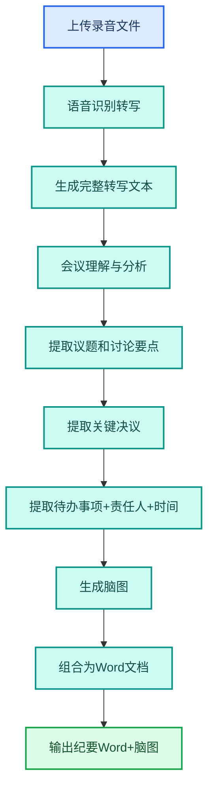

---
AIGC:
  ContentProducer: '001191110102MAD55U9H0F10002'
  ContentPropagator: '001191110102MAD55U9H0F10002'
  Label: '1'
  ProduceID: '65e7c094-d0c2-4c2e-b1ba-496fe035e46b'
  PropagateID: '65e7c094-d0c2-4c2e-b1ba-496fe035e46b'
  ReservedCode1: 'd281be4c-e92a-4031-99ca-4434383057c0'
  ReservedCode2: 'd281be4c-e92a-4031-99ca-4434383057c0'
---

# 2.7 会议纪要与语音转写

## 本章目标

掌握用 TeleAgent 将会议录音转化为结构化会议纪要的完整流程：语音识别转写、关键信息提取、纪要自动生成、脑图输出。

## 2.7.1 案例：项目评审会纪要

### 案例背景

刚开完一场 90 分钟的项目评审会，需要当天产出会议纪要。传统做法是边听录音边手动记录，至少 2~3 小时，还容易遗漏关键决议。

### 目标定义

- 输入：90 分钟会议录音文件（WAV/MP3）
- 交付：结构化会议纪要 Word + 脑图图片
- 验收：转写完整、决议清晰、待办明确、附脑图

### 操作步骤

**第一步：上传录音**

将会议录音文件拖入工作空间。

**第二步：描述任务**

```
请对这段会议录音进行智能分析，要求：
1. 语音识别生成完整转写文本
2. 基于转写内容生成结构化会议纪要，包含：
   - 会议主题、时间、参会人（从录音中识别）
   - 讨论要点（按议题分组）
   - 关键决议
   - 待办事项（标注责任人和截止时间）
3. 文末附带脑图图片，展示会议内容结构
4. 输出为Word文档，文件名用会议标题
```

**第三步：执行流程**



**第四步：验收交付**

检查要点：
- 转写文本完整，无明显错漏
- 议题分组合理
- 决议和待办事项清晰
- 责任人和截止时间标注完整
- 脑图图片正确嵌入文档末尾

### 效果对比

| 对比项 | 手动记录 | TeleAgent |
| --- | --- | --- |
| 转写耗时 | 边听边记 2~3 小时 | 全自动 5~10 分钟 |
| 信息完整性 | 容易遗漏 | 全量转写无遗漏 |
| 结构化程度 | 依赖个人整理能力 | 自动结构化输出 |
| 脑图 | 需额外工具制作 | 随纪要一并生成 |

### 能力组合

| 第一篇能力 | 本章运用 |
| --- | --- |
| Skills 技能（1.5） | 语音转写技能（可通过技能广场安装或自研） |
| 文件处理（1.3） | 音频文件上传和 Word 输出 |
| 任务执行全流程（1.4） | 语音→文本→理解→纪要的端到端流程 |

::: tip 语音转写技能
TeleAgent 支持通过技能广场安装或自研语音转写技能，安装后可配置热词（如项目名称、人名、专业术语）提升识别准确率，还支持敏感词过滤。
:::

## 2.7.2 纪要质量提升技巧

| 技巧 | 操作 | 效果 |
| --- | --- | --- |
| 配置热词 | 上传前在技能设置中添加专业术语和人名 | 减少专有名词识别错误 |
| 多人会议标注 | 在指令中说明参会人名单 | 转写文本自动标注发言人 |
| 指定议题框架 | 在指令中给出议题结构 | 纪要按指定框架分组 |
| 追加修正 | 纪要生成后追问修正 | 微调不满意的部分 |

## 2.7.3 常见问题

| 问题 | 原因 | 解决方案 |
| --- | --- | --- |
| 转写有较多错别字 | 录音噪音大或方言口音重 | 配置热词；有条件时用外接麦克风录音 |
| 发言人区分不清 | 多人同时说话或声音相似 | 提供参会人名单，让技能做多声道分离 |
| 待办事项遗漏 | 讨论中未明确说"待办"二字 | 在指令中要求"从讨论内容中推断隐含的待办事项" |
| 脑图不显示 | Word 中嵌入图片格式问题 | 追问"请单独输出脑图图片文件" |

## 本章小结

会议纪要是 TeleAgent 最直观的"省时间"场景——90 分钟录音变 10 分钟转写+结构化纪要。关键是**配置好热词和参会人信息**，让识别准确率最大化，再用结构化指令确保纪要包含待办事项和责任人。

下一章进入招标信息监测——用定时任务实现信息自动追踪和推送。