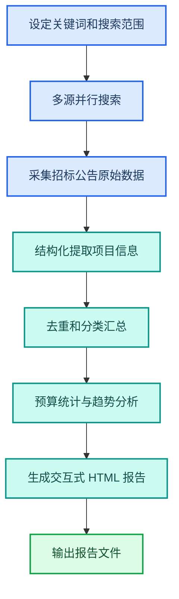
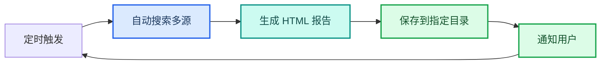

---
AIGC:
  ContentProducer: '001191110102MAD55U9H0F10002'
  ContentPropagator: '001191110102MAD55U9H0F10002'
  Label: '1'
  ProduceID: '892e5d16-ccbb-47a5-9fc7-4b468558f170'
  PropagateID: '892e5d16-ccbb-47a5-9fc7-4b468558f170'
  ReservedCode1: '3dd264bd-0c43-4295-8001-938477cf3cee'
  ReservedCode2: '3dd264bd-0c43-4295-8001-938477cf3cee'
---

# 2.8 招标信息监测与追踪

## 本章目标

掌握用 TeleAgent 自动搜索政府采购和招标网站、生成结构化报告、设置定时追踪的完整流程：关键词设定、多源搜索、报告生成、定时监测。

## 2.8.1 案例：AI Agent 相关招标追踪

### 案例背景

市场团队需要持续跟踪「AI Agent」「智能体」「智慧城市」等关键词的政府采购和招标信息，过去靠人工每天翻阅各省采购网，耗时且容易遗漏。

### 目标定义

- 输入：关键词列表（如「AI Agent」「智慧城市」「数字政府」）
- 交付：交互式 HTML 报告，含项目详情、预算分析、时间线、趋势洞察
- 验收：覆盖主要采购网站、信息无遗漏、报告可交互筛选

### 操作步骤

**第一步：描述任务**

```
请搜索最近 30 天内包含「AI Agent」「智能体」「智慧城市」关键词的政府采购和招标公告，
要求：
1. 覆盖主要政府采购网站和招标平台
2. 收集项目名称、采购单位、预算金额、发布日期、截止日期、项目摘要
3. 按关键词分类汇总
4. 生成含预算分析和时间线的交互式 HTML 报告
5. 报告支持按关键词、地区、预算范围筛选
```

**第二步：执行流程**



**第三步：验收交付**

检查要点：
- 项目信息完整（名称、单位、预算、日期）
- 覆盖天数和关键词范围符合设定
- HTML 报告可正常打开，筛选和排序功能正常
- 预算分析和趋势洞察有实际数据支撑

### 效果对比

| 对比项 | 人工翻阅采购网 | TeleAgent |
| --- | --- | --- |
| 搜索耗时 | 每天约 2 小时 | 全自动 5~15 分钟 |
| 数据覆盖 | 依赖个人精力，易遗漏 | 多源并行搜索，覆盖全面 |
| 报告形式 | 手工整理 Excel | 自动生成交互式 HTML |
| 趋势分析 | 需额外手工统计 | 自动汇总预算和趋势 |
| 持续追踪 | 需每天重复操作 | 定时任务自动执行 |

### 能力组合

| 第一篇能力 | 本章运用 |
| --- | --- |
| Skills 技能（1.5） | @bidding-watchdog 招标信息搜索技能 |
| 定时任务（1.8） | 设置每日/每周自动搜索和报告生成 |
| 深度调研与信息整合（2.4） | 多源搜索结果的交叉验证和去重 |
| 文件处理（1.3） | HTML 报告输出和存档 |

::: tip 招标信息搜索技能
安装「bidding-watchdog」技能后，可自定义搜索关键词、时间范围（过去 N 天）、屏蔽特定网站。报告自动包含项目详情表格、预算分布图、时间线和趋势洞察。
:::

## 2.8.2 定时追踪设置

将一次性搜索升级为持续监测，有两种方式：

### 方式一：自然语言设定

```
每天早上 8 点搜索过去 24 小时内包含「AI Agent」「智慧城市」的招标信息，
生成 HTML 报告保存到工作空间的「招标监测」目录。
```

### 方式二：定时任务管理

在定时任务界面创建 Cron 任务：

| 参数 | 设置 |
| --- | --- |
| 执行频率 | `0 8 * * *`（每天 8:00） |
| 任务内容 | 搜索指定关键词的招标信息并生成报告 |
| 输出目录 | 指定工作空间子目录 |
| 通知方式 | 执行完成后通知（可选 IM 推送） |



## 2.8.3 报告解读与决策应用

### 报告核心模块

| 模块 | 内容 | 决策用途 |
| --- | --- | --- |
| 项目明细表 | 名称、单位、预算、日期、摘要 | 筛选可投项目 |
| 预算分布 | 按金额区间统计项目数量 | 判断市场容量 |
| 地区热力 | 按省份/城市统计 | 识别热点区域 |
| 时间线 | 按发布日期排列 | 掌握投标窗口期 |
| 趋势洞察 | 关键词频次变化、预算趋势 | 预判市场方向 |

### 筛选策略建议

| 策略 | 操作 | 适用场景 |
| --- | --- | --- |
| 按预算筛选 | 设定金额区间（如 100 万~500 万） | 匹配公司承接能力 |
| 按地区筛选 | 选择目标省份 | 聚焦属地化项目 |
| 按时效筛选 | 关注截止日期 15 天内的项目 | 紧急投标决策 |
| 按关键词交叉 | 同时包含多个关键词的项目 | 精准定位核心项目 |

## 2.8.4 常见问题

| 问题 | 原因 | 解决方案 |
| --- | --- | --- |
| 搜索结果偏少 | 关键词过于狭窄 | 扩展关键词变体（如「智能体」增加「AI助理」「数字员工」） |
| 部分网站抓取不到 | 网站反爬或需要登录 | 技能内置多源策略，会自动尝试备用数据源 |
| 预算金额缺失 | 部分公告未公布预算 | 报告中标记「预算待公布」，可追加手动查询 |
| 报告打开空白 | HTML 文件过大或浏览器兼容问题 | 用 Edge 或 Chrome 打开；文件过大时可拆分 |
| 定时任务未执行 | 客户端未运行或时间设置错误 | 确保客户端在预定时间处于运行状态 |

## 本章小结

招标信息监测是 TeleAgent「定时任务 + 搜索技能」组合的典型场景——从人工每天翻阅升级为自动持续追踪。关键是**设定好关键词矩阵和搜索频率**，让系统自动覆盖主要采购网站，再用交互式报告快速筛选可投项目。

下一章进入 PPT 生成与演示制作——从文字大纲到 PPTX 成品的自动化流程。