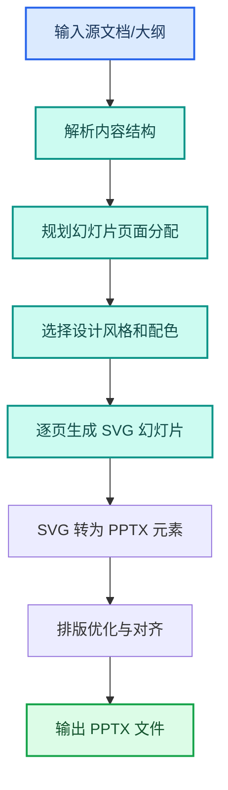
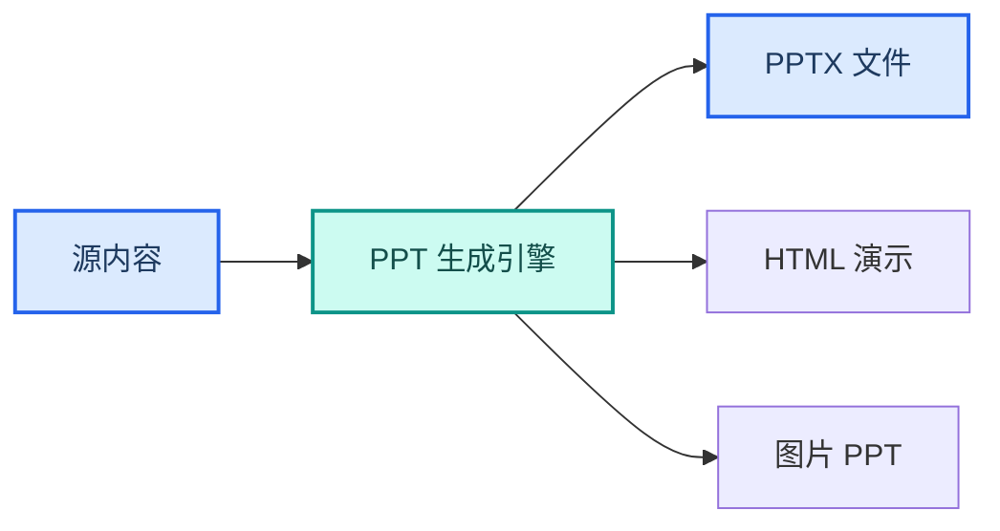

---
AIGC:
  ContentProducer: '001191110102MAD55U9H0F10002'
  ContentPropagator: '001191110102MAD55U9H0F10002'
  Label: '1'
  ProduceID: '3f9d405d-4e91-4742-b683-ae7ef4866d48'
  PropagateID: '3f9d405d-4e91-4742-b683-ae7ef4866d48'
  ReservedCode1: '7af2cb95-3c03-434f-848b-3d0cb36d2b7f'
  ReservedCode2: '7af2cb95-3c03-434f-848b-3d0cb36d2b7f'
---

# 2.9 PPT 生成与演示制作

## 本章目标

掌握用 TeleAgent 从文字大纲到 PPTX 成品的完整流程：内容规划、风格选择、自动生成、排版优化、多格式输出。

## 2.9.1 案例：季度经营汇报 PPT

### 案例背景

季度末需要向领导汇报经营情况，手头有一份 Word 版经营分析报告，需要快速转为 PPTX 演示文稿。传统做法是手动建幻灯片、逐页排版，至少半天起步。

### 目标定义

- 输入：Word 经营分析报告（或 Markdown 大纲）
- 交付：排版精美的 PPTX 文件，含封面、目录、数据图表页、总结页
- 验收：内容完整、排版整齐、风格统一、可直接演示

### 操作步骤

**第一步：准备大纲**

将 Word 报告拖入工作空间，或在指令中直接给出大纲结构。

**第二步：描述任务**

```
请根据这份经营分析报告生成一份 PPTX 演示文稿，要求：
1. 风格：商务正式，深蓝色调
2. 结构：封面 + 目录 + 各章节内容页 + 总结页
3. 每页要点不超过 5 条，关键词式表达
4. 数据表格保留为表格形式，不要转为纯文字
5. 总页数 15~20 页
```

**第三步：执行流程**



**第四步：验收交付**

检查要点：
- 内容覆盖源文档全部章节
- 每页信息量适中，不堆砌文字
- 表格和图表正确渲染
- 封面、目录、页码完整
- 在 PowerPoint 或 WPS 中可正常打开和编辑

### 效果对比

| 对比项 | 手动制作 PPT | TeleAgent |
| --- | --- | --- |
| 制作耗时 | 半天到一天 | 10~20 分钟 |
| 排版一致性 | 依赖个人水平 | 风格统一规范 |
| 内容覆盖 | 需手动逐页搬运 | 自动解析全文生成 |
| 可编辑性 | 原生编辑 | 输出可编辑 PPTX |
| 迭代效率 | 改一页动全身 | 指令调整后重新生成 |

### 能力组合

| 第一篇能力 | 本章运用 |
| --- | --- |
| Skills 技能（1.5） | @ppt-master 或 @pptx 技能 |
| 文件处理（1.3） | 源文档读取和 PPTX 输出 |
| 任务执行全流程（1.4） | 解析→规划→生成→优化端到端流程 |
| 多模型切换（1.9） | 内容规划用强推理模型，排版用效率模型 |

::: tip PPT 生成技能
TeleAgent 内置多种 PPT 生成技能：@ppt-master 基于SVG 精排，适合正式汇报；@pptx 直接操作 PowerPoint 文件，适合快速生成；@html-ppt 生成网页演示，适合在线分享。根据场景选择合适的技能。
:::

## 2.9.2 风格与模板选择

### 内置风格方向

| 风格 | 特点 | 适用场景 |
| --- | --- | --- |
| 商务正式 | 深色主色、简洁排版、数据导向 | 经营汇报、管理层评审 |
| 极简清新 | 大量留白、少量配色 | 产品介绍、创意提案 |
| 科技感 | 深色背景、霓虹色点缀 | 技术分享、新品发布 |
| 教育培训 | 图文并茂、色彩丰富 | 课件制作、培训材料 |

### 从已有 PPT 提取风格

如果公司有统一的 PPT 模板，可以将其作为参考：

```
请参考这份公司模板的风格（配色、字体、版式），
用同样的风格生成新的 PPTX。
```

技能会自动提取模板的：
- 主题配色方案
- 标题和正文字体
- 母版版式结构
- 页脚和页码样式

## 2.9.3 内容优化技巧

### 文字精简原则

| 原则 | 操作 | 效果 |
| --- | --- | --- |
| 关键词化 | 将完整句子提炼为关键词 | 信息密度高，演讲空间大 |
| 分组归并 | 相关联想放同一页 | 逻辑清晰 |
| 数据可视化 | 文字描述的数据转为表格或图表 | 直观易读 |
| 控制页密度 | 每页不超过 5 条要点 | 避免信息过载 |

### 指令优化示例

| 指令写法 | 效果 |
| --- | --- |
| 「每页不超过 5 条要点」 | 控制信息密度 |
| 「数据用表格展示，不用纯文字」 | 保持数据结构化 |
| 「总结页用 3 个关键词概括」 | 强化核心信息 |
| 「添加过渡页衔接各章节」 | 提升演示流畅度 |

## 2.9.4 多格式输出

TeleAgent 的 PPT 技能支持多种输出格式：

| 格式 | 优势 | 适用场景 |
| --- | --- | --- |
| PPTX | 可在 PowerPoint/WPS 编辑 | 正式汇报、需后续修改 |
| HTML | 在线浏览、无需安装软件 | 远程分享、在线演示 |
| 图片 PPT | 每页为图片，排版固定 | 防篡改、归档存证 |



## 2.9.5 常见问题

| 问题 | 原因 | 解决方案 |
| --- | --- | --- |
| 文字溢出幻灯片边界 | 内容过多或字号过大 | 指令中指定「每页不超过 5 条要点」「正文 18 号字」 |
| 表格变形 | 复杂表格在 PPTX 中渲染异常 | 指定「表格保留原格式」或在生成后手动调整 |
| 配色不符合公司规范 | 未提供参考模板 | 提供公司模板作为风格参考 |
| 图片模糊 | 自动生成的 SVG 转图片时分辨率不足 | 指定更高分辨率或使用矢量格式 |
| 中文字体显示异常 | 系统缺少指定中文字体 | 使用常见字体（微软雅黑、思源黑体） |
| 页数过多或过少 | 未指定页数范围 | 指令中明确「总页数 15~20 页」 |

## 本章小结

PPT 生成是 TeleAgent「文档转换」类任务的标杆场景——从 Word/Markdown 到 PPTX，把半天的排版工作压缩到十几分钟。关键是**选对技能、定好风格、写清约束**，让生成结果一步到位。正式汇报用 @ppt-master，快速产出版用 @pptx，在线分享用 @html-ppt。

下一章进入 IM 集成与消息推送——把 TeleAgent 的任务结果自动推送到企业微信、飞书等即时通讯工具。