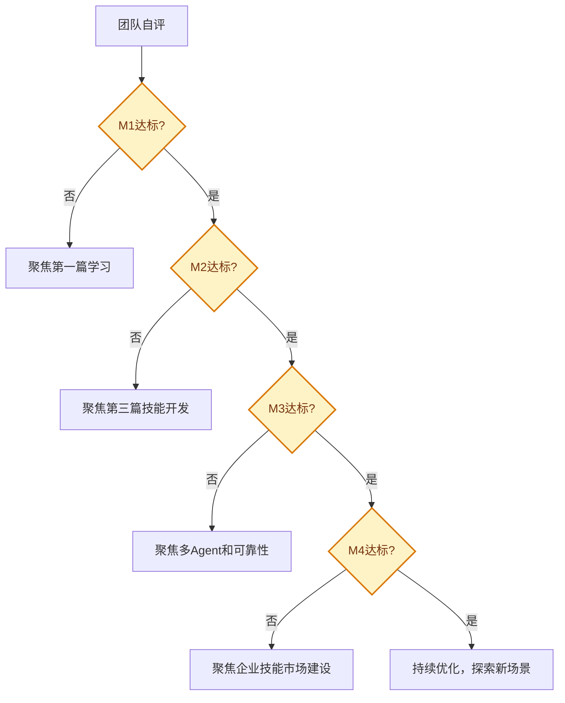

---
AIGC:
  ContentProducer: '001191110102MAD55U9H0F10002'
  ContentPropagator: '001191110102MAD55U9H0F10002'
  Label: '1'
  ProduceID: '8bcb6162-2f46-4c11-9365-51b34500a8c0'
  PropagateID: '8bcb6162-2f46-4c11-9365-51b34500a8c0'
  ReservedCode1: 'f724e5d9-7b1b-473a-a2c5-254e662af727'
  ReservedCode2: 'f724e5d9-7b1b-473a-a2c5-254e662af727'
---

# 4.1 岗位应用框架

## 本章目标

建立 TeleAgent 岗位应用的四级成熟度模型（M1~M4），为个人和团队提供清晰的 AI 落地路线图，从单次辅助逐步进化到团队能力。

## 4.1.1 为什么需要成熟度模型

没有成熟度模型，AI 落地容易陷入两个极端：

| 极端 | 表现 | 后果 |
| --- | --- | --- |
| 过度保守 | 只用来简单问答 | 浪费 TeleAgent 的执行能力 |
| 过度激进 | 一次性构建复杂自动化 | 失败率高，打击信心 |

成熟度模型提供渐进式的落地路径，让每个阶段都有明确的目标和验收标准。

## 4.1.2 四级成熟度模型

### M1：单次辅助

| 维度 | 说明 |
| --- | --- |
| 核心特征 | 遇到具体任务时调用 TeleAgent 完成 |
| 使用方式 | 描述任务 → 获得成品 |
| 技能使用 | 使用官方技能广场的基础技能 |
| 自动化程度 | 无，每次手动触发 |
| 价值 | 个人效率提升 30%~50% |
| 典型场景 | 生成一份 PPT、处理一个 Excel、审一份合同 |

### M2：流程固化

| 维度 | 说明 |
| --- | --- |
| 核心特征 | 把高频重复任务封装为技能，形成标准流程 |
| 使用方式 | @技能名 一键调用 |
| 技能使用 | 自研岗位技能 + 官方技能协同 |
| 自动化程度 | 部分定时任务 |
| 价值 | 岗位效率提升 50%~70% |
| 典型场景 | 每周自动生成周报、每日经营数据通报 |

### M3：协同自动化

| 维度 | 说明 |
| --- | --- |
| 核心特征 | 多个技能和 Agent 协作，覆盖完整业务流程 |
| 使用方式 | 定时触发 + 自动执行 + 结果推送 |
| 技能使用 | 多技能组合 + 多 Agent 协同 |
| 自动化程度 | 全流程自动化，人工仅做决策 |
| 价值 | 团队效率提升 70%~90% |
| 典型场景 | 招标监测→分析→报告→推送全链路自动化 |

### M4：全员赋能

| 维度 | 说明 |
| --- | --- |
| 核心特征 | 技能沉淀为组织资产，新员工即用即得上手 |
| 使用方式 | 企业技能市场 + 标准化工作流 |
| 技能使用 | 企业内部技能市场 + 自进化 |
| 自动化程度 | 全员自动化 + 持续优化 |
| 价值 | 组织能力提升，经验不再依赖个人 |
| 典型场景 | 新员工入职即有全套岗位技能包 |

## 4.1.3 成熟度评估

### 评估清单

| 等级 | 评估项 | 达标标准 |
| --- | --- | --- |
| M1 | 能完成基本任务 | 至少使用 3 个官方技能完成实际工作 |
| M1 | 理解任务执行流程 | 能独立描述任务并获取合格成品 |
| M2 | 有自研技能 | 至少开发 1 个岗位自研技能 |
| M2 | 有定时任务 | 至少设置 2 个定时自动化任务 |
| M2 | 技能可复用 | 同一技能每月调用 5 次以上 |
| M3 | 多技能协作 | 至少有 1 个多技能串联的工作流 |
| M3 | 自动化覆盖核心流程 | 核心业务流程 70%+ 自动化 |
| M3 | 有可靠性保障 | 关键流程有质量门禁和降级策略 |
| M4 | 企业技能市场 | 有内部技能市场且持续更新 |
| M4 | 全员使用 | 团队 80%+ 成员日常使用 TeleAgent |
| M4 | 经验沉淀 | 最优实践已封装为技能，新员工可直接使用 |

### 评估方法

## 4.1.4 落地路线图

### 个人路线图

| 阶段 | 目标 | 周期 | 关键行动 |
| --- | --- | --- | --- |
| 第 1 周 | 学会基本使用 | 1 周 | 通读第一篇，完成首个任务 |
| 第 2~4 周 | 建立使用习惯 | 3 周 | 每天至少用 TeleAgent 完成 1 项工作 |
| 第 2~3 月 | 开发岗位技能 | 4~8 周 | 把高频任务封装为自研技能 |
| 第 4~6 月 | 构建自动化 | 8~12 周 | 设置定时任务，建立质量门禁 |

### 团队路线图

| 阶段 | 目标 | 周期 | 关键行动 |
| --- | --- | --- | --- |
| 试点期 | 2~3 人先行 | 1~2 月 | 先在小组内试用，积累经验 |
| 推广期 | 全员使用 | 2~3 月 | 培训 + 共享技能 + 建立规范 |
| 深化期 | 流程自动化 | 3~6 月 | 多技能协作，关键流程全自动化 |
| 生态期 | 组织能力 | 6 月+ | 企业技能市场，持续自进化 |

## 4.1.5 各岗位的成熟度目标

| 岗位 | M1 目标 | M2 目标 | M3 目标 |
| --- | --- | --- | --- |
| 行政文秘 | 公文起草、会议纪要 | 日程管理自动化技能 | 会议全流程自动化 |
| 财务审计 | 发票识别、报表生成 | 月度报表自动化技能 | 财务分析全链路 |
| 法务合规 | 合同审核、法规检索 | 合同审核标准化技能 | 合规检查自动化 |
| 销售市场 | 客户调研、PPT 制作 | 客户画像自动化技能 | 市场监测全链路 |
| 技术研发 | 代码生成、文档编写 | 项目文档自动化技能 | 代码审查 + 文档协同 |

## 4.1.6 常见落地障碍与对策

| 障碍 | 表现 | 对策 |
| --- | --- | --- |
| 不知道从哪开始 | 感觉 TeleAgent 什么都能做但不知先做什么 | 从最耗时的重复性任务开始 |
| 尝试一次就放弃 | 某次效果不好就放弃使用 | 先从简单任务建立信心，逐步进阶 |
| 技能开发门槛高 | 不敢尝试开发自研技能 | 用自然语言创建技能，逐步过渡到手动开发 |
| 团队推广遇阻 | 团队成员不愿改变习惯 | 先影响关键人，用效果说话 |
| 自动化不稳定 | 定时任务偶尔失败就失去信心 | 学习可靠性设计，建立容错机制 |

## 本章小结

岗位应用框架提供了 TeleAgent 落地的渐进式路线图——从 M1 单次辅助到 M4 全员赋能，每一步都有明确的目标和验收标准。关键是**不要跳级**：先夯实 M1 的使用习惯，再推进 M2 的技能固化，最后追求 M3/M4 的团队协同和组织能力。

接下来六章分别针对行政文秘、财务审计、法务合规、销售市场、技术研发五个岗位，展示具体落地路径。