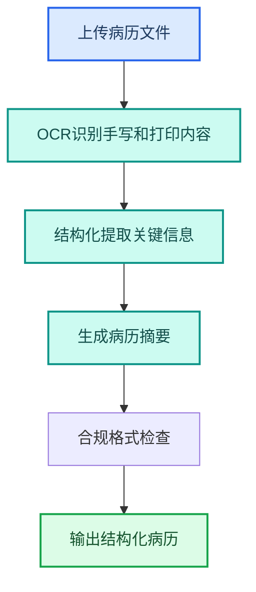
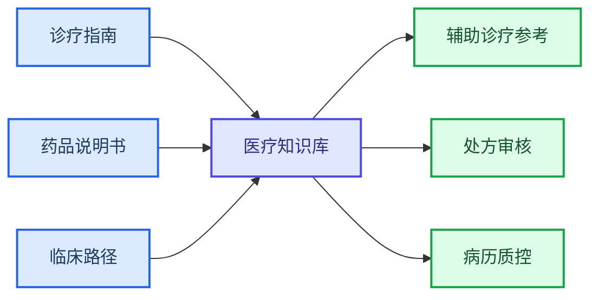

---
AIGC:
  ContentProducer: '001191110102MAD55U9H0F10002'
  ContentPropagator: '001191110102MAD55U9H0F10002'
  Label: '1'
  ProduceID: 'd3faa6b0-b449-4337-8e6e-c89229f6a6c0'
  PropagateID: 'd3faa6b0-b449-4337-8e6e-c89229f6a6c0'
  ReservedCode1: 'bc550aab-9cdd-434c-bd18-af2ec15bdbeb'
  ReservedCode2: 'bc550aab-9cdd-434c-bd18-af2ec15bdbeb'
---

# 4.10 医疗行业

## 行业特征

医疗行业对准确性和合规性有极高要求——病历处理、文献检索、药品说明、合规审查，每项工作都关系到患者安全和医疗质量。TeleAgent 在医疗行业的角色是「辅助工具」，所有产出必须经医疗专业人员审核。

### 行业核心需求

| 需求 | 说明 | TeleAgent 应对 |
| --- | --- | --- |
| 病历效率 | 病历书写占用大量时间 | 语音识别技能 + 文档生成 |
| 文献检索 | 医学文献更新快，检索耗时 | @deep-research（深度调研） + @knowledge-base（知识库检索） |
| 合规审查 | 病历和处方需符合规范 | 规则检查 + 审核辅助 |
| 数据安全 | 患者隐私高度敏感 | 数据不出域 + 本地处理 |

## 4.10.1 典型应用场景

### 场景一：病历摘要与整理



| 环节 | 技能 | 输出 |
| --- | --- | --- |
| 病历识别 | @ocr-toolkit（OCR 识别工具） | 病历文本 |
| 信息提取 | 内置推理 | 主诉、现病史、诊断、处方 |
| 摘要生成 | @docx（Word 文档助手） | 结构化病历摘要 |
| 格式检查 | 规则校验 | 合规性提示 |

### 场景二：医学文献检索

```
请检索近一年关于「AI辅助糖尿病早期筛查」的医学文献，
汇总研究进展，包含研究方法、样本量、核心结论和临床意义。
```

| 环节 | 技能 | 效果 |
| --- | --- | --- |
| 文献搜索 | @deep-research | 多源检索 |
| 摘要提取 | 内置推理 | 快速了解文献核心 |
| 综述生成 | @docx | 结构化文献综述 |

### 场景三：科研辅助

| 场景 | 技能 | 效果 |
| --- | --- | --- |
| 数据统计 | @xlsx（Excel 表格助手） | 临床试验数据分析 |
| 图表生成 | @xlsx | 研究数据可视化 |
| 论文排版 | @docx | 辅助论文格式排版 |
| 参考文献整理 | @deep-research | 文献检索和引用整理 |

## 4.10.2 医疗行业定制技能

| 技能 | 功能 | 使用者 |
| --- | --- | --- |
| 病历摘要助手 | 病历 OCR + 结构化摘要 | 医生/病案室 |
| 文献检索助手 | 医学文献多源检索+综述 | 科研人员 |
| 处方审核辅助 | 药物相互作用+剂量检查 | 药剂师 |
| 科研数据分析 | 临床数据统计+图表 | 科研人员 |
| 医疗合规检查 | 病历处方合规性扫描 | 质控部门 |

## 4.10.3 医疗知识库



| 知识库 | 内容 | 技能 |
| --- | --- | --- |
| 诊疗指南库 | 各科室诊疗指南和规范 | @knowledge-base |
| 药品数据库 | 药品说明、相互作用、禁忌 | @knowledge-base |
| 临床路径库 | 标准化诊疗流程 | @knowledge-base |
| 病历模板库 | 各病种病历模板 | @knowledge-base + @docx |

## 4.10.4 数据安全与合规

::: warning 医疗数据安全红线
- 患者个人信息（姓名、身份证、病历号）属于高度敏感数据
- 所有病历数据处理必须在本地完成，严禁上传云端
- 涉及患者隐私的数据在推送和共享时必须脱敏
- AI 产出的诊断建议、处方审核结果仅供参考，不作为医疗决策依据
- 必须遵守《医疗机构病历管理规定》和《个人信息保护法》
:::

### 脱敏处理规范

| 数据项 | 脱敏方式 |
| --- | --- |
| 患者姓名 | 替换为「患者A」「患者B」 |
| 身份证号 | 保留前 3 位和后 4 位，中间用 * 替代 |
| 联系电话 | 保留前 3 位和后 4 位 |
| 住址 | 保留到区县级 |
| 病历号 | 替换为编号 |

## 4.10.5 效果对比

> 以下效果数据为参考值，实际效果以具体使用场景为准。

| 工作项 | 传统方式 | TeleAgent | 提升 |
| --- | --- | --- | --- |
| 病历摘要 | 30~60 分钟/份 | 5~10 分钟/份 | 5~6 倍 |
| 文献检索 | 半天~1 天 | 1~2 小时 | 4~6 倍 |
| 科研数据统计 | 1~2 天 | 2~3 小时 | 5~8 倍 |
| 病历质控检查 | 逐份人工抽查 | 批量自动扫描 | 覆盖率大幅提升 |

## 4.10.6 落地建议

| 优先级 | 场景 | 理由 |
| --- | --- | --- |
| 高 | 病历摘要与整理 | 减少医生文书时间 |
| 高 | 科研数据分析 | 提升科研效率 |
| 中 | 医学文献检索 | 保持知识更新 |
| 中 | 医疗知识库建设 | 长期知识资产 |
| 低 | 处方审核辅助 | 需要与药品数据库深度对接 |

## 本章小结

医疗行业的 TeleAgent 落地以「辅助医疗、不替代医生」为基本原则——让 AI 处理繁重的文书和数据工作，让医生聚焦于诊疗决策。关键是**严格的数据安全合规、完善的脱敏机制、明确的辅助定位**。所有 AI 产出仅供参考，最终医疗决策权在医生。