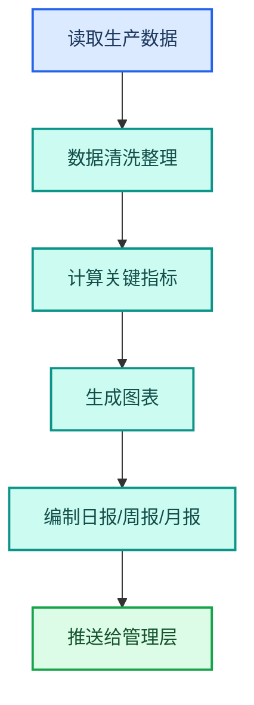
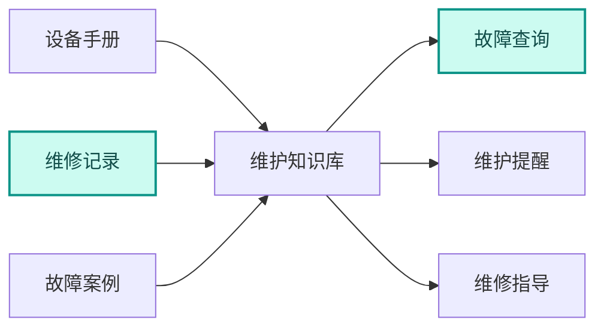

---
AIGC:
  ContentProducer: '001191110102MAD55U9H0F10002'
  ContentPropagator: '001191110102MAD55U9H0F10002'
  Label: '1'
  ProduceID: '89fb961e-f098-4f57-92c3-8d42db9f728e'
  PropagateID: '89fb961e-f098-4f57-92c3-8d42db9f728e'
  ReservedCode1: '9a12fd7a-f9c5-42bc-be0e-1dad6ef5bca5'
  ReservedCode2: '9a12fd7a-f9c5-42bc-be0e-1dad6ef5bca5'
---

# 4.11 制造业

## 行业特征

制造业的核心诉求是降本增效——生产报表、供应链数据、质检报告、设备维护文档，数据量大且需要实时处理。TeleAgent 在制造业的价值是「把数据变成行动」。

### 行业核心需求

| 需求 | 说明 | TeleAgent 应对 |
| --- | --- | --- |
| 生产报表 | 日/周/月报自动生成 | @xlsx（Excel 表格助手） + 定时任务 |
| 供应链管理 | 供应商数据分析和比价 | @xlsx + @deep-research（深度调研） |
| 质检报告 | 检验数据统计和报告 | @xlsx + @docx（Word 文档助手） |
| 设备维护 | 维护文档管理和提醒 | 知识库 + 定时任务 |

## 4.11.1 典型应用场景

### 场景一：生产报表自动化



| 环节 | 技能 | 效果 |
| --- | --- | --- |
| 数据处理 | @xlsx | 自动汇总生产数据 |
| 指标计算 | @xlsx | 产量、良率、能耗等 |
| 报表生成 | @docx | 规范化生产报表 |
| 定时推送 | @wecom-push（企业微信推送） | 定时推送给管理层 |

### 场景二：供应链数据分析

| 场景 | 技能 | 效果 |
| --- | --- | --- |
| 供应商比价 | @xlsx | 多供应商价格对比 |
| 交付分析 | @xlsx | 交付及时率统计 |
| 库存预警 | @xlsx + 定时任务 | 自动库存预警 |
| 采购报告 | @docx | 采购分析报告 |

### 场景三：质检报告生成

```
请根据这份质检数据 Excel，生成质检报告：
1. 按产品线统计合格率和不良品分布
2. 不良原因 Top5 排行
3. 与上月对比趋势
4. 质量改善建议
```

| 环节 | 技能 | 输出 |
| --- | --- | --- |
| 数据分析 | @xlsx | 质量统计表 |
| 图表生成 | @xlsx | 不良品分布图 |
| 报告生成 | @docx | 质检报告 |

## 4.11.2 制造业定制技能

| 技能 | 功能 | 适用部门 |
| --- | --- | --- |
| 生产日报生成器 | 自动汇总生产数据生成日报 | 生产部 |
| 供应商分析助手 | 供应商数据比价和评估 | 采购部 |
| 质检报告生成器 | 质检数据统计和报告 | 品控部 |
| 设备维护文档管理 | 维护手册管理和维护提醒 | 设备部 |
| 成本分析助手 | 生产成本统计和分析 | 财务部 |

## 4.11.3 设备维护知识库



| 知识库 | 内容 | 技能 |
| --- | --- | --- |
| 设备手册库 | 设备操作和维护手册 | @knowledge-base |
| 维修记录库 | 历史维修记录和方案 | @knowledge-base |
| 故障案例库 | 典型故障和解决方案 | @knowledge-base |
| 备件清单 | 备件型号和库存 | @xlsx + @knowledge-base |

### 定时维护提醒

| 任务 | Cron | 内容 |
| --- | --- | --- |
| 日维护提醒 | `0 8 * * *` | 查询当日需维护设备并推送提醒 |
| 周维护汇总 | `0 8 * * 1` | 汇总上周维护情况 |
| 备件预警 | `0 9 * * *` | 检查低库存备件并预警 |

## 4.11.4 效果对比

> 以下效果数据为参考值，实际效果以具体使用场景为准。

| 工作项 | 传统方式 | TeleAgent | 提升 |
| --- | --- | --- | --- |
| 生产日报 | 1~2 小时 | 10 分钟（自动）| 6~12 倍 |
| 供应商比价 | 半天 | 1 小时 | 4 倍 |
| 质检报告 | 2~3 小时 | 20 分钟 | 6~9 倍 |
| 维护提醒 | 人工查表 | 自动推送 | 实时 |
| 故障查询 | 翻阅手册 | 知识库检索 | 10 倍+ |

## 4.11.5 落地建议

| 优先级 | 场景 | 理由 |
| --- | --- | --- |
| 高 | 生产报表自动化 | 高频且格式固定 |
| 高 | 质检报告生成 | 数据量大需快速出报告 |
| 中 | 供应商数据分析 | 提升采购决策效率 |
| 中 | 设备维护知识库 | 长期知识资产 |
| 低 | 与 MES/ERP 系统对接 | 需要 MCP 深度集成 |

## 本章小结

制造业的 TeleAgent 落地核心是「把数据变成行动」——从生产报表到质检报告，从供应链分析到设备维护，让数据驱动的决策更快、更准。关键是**建设设备维护知识库**和**实现报表自动化**，把分散在各系统中的数据整合为可行动的洞察。