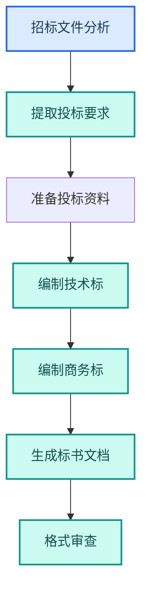

---
AIGC:
  ContentProducer: '001191110102MAD55U9H0F10002'
  ContentPropagator: '001191110102MAD55U9H0F10002'
  Label: '1'
  ProduceID: '55f58ffe-059a-45d0-b9ad-c6267b7d66e9'
  PropagateID: '55f58ffe-059a-45d0-b9ad-c6267b7d66e9'
  ReservedCode1: '06a35fe6-ea05-493d-860c-850745ad42b2'
  ReservedCode2: '06a35fe6-ea05-493d-860c-850745ad42b2'
---

# 4.12 建筑与房地产行业

## 行业特征

建筑与房地产行业涉及大量文档处理——招投标文件、工程进度报告、合同管理、成本核算。项目周期长、参与方多、文档种类杂，是 TeleAgent 文档处理能力的理想落地场景。

### 行业核心需求

| 需求 | 说明 | TeleAgent 应对 |
| --- | --- | --- |
| 招投标文档 | 标书制作和审查 | @docx（Word 文档助手） + @ppt-master（PPT 生成大师） |
| 工程进度 | 定期进度报告 | @xlsx（Excel 表格助手） + @docx + 定时任务 |
| 合同管理 | 大量合同审核和归档 | @contract-review（合同审核） + 文档管理 |
| 成本核算 | 工程量统计和成本分析 | @xlsx + @docx |

## 4.12.1 典型应用场景

### 场景一：招投标文档制作



| 环节 | 技能 | 效果 |
| --- | --- | --- |
| 招标文件分析 | @docx + 内置推理 | 快速提取投标要求 |
| 技术标编制 | @docx | 辅助编写技术方案 |
| 商务标编制 | @xlsx | 报价计算和表格 |
| 标书排版 | @docx | 规范化排版 |

### 场景二：工程进度报告

```
请根据这份工程进度数据 Excel，生成月度工程进度报告：
1. 各标段完成情况统计
2. 进度偏差分析（计划 vs 实际）
3. 问题和风险提示
4. 下月计划
```

| 环节 | 技能 | 输出 |
| --- | --- | --- |
| 数据处理 | @xlsx | 进度统计表 |
| 偏差分析 | @xlsx | 计划实际对比图 |
| 报告生成 | @docx | 月度进度报告 |

### 场景三：合同管理

| 场景 | 技能 | 效果 |
| --- | --- | --- |
| 合同审核 | @contract-review | 三层审查+批注标注 |
| 合同比对 | @doc-compare（文档比对） | 版本差异比对 |
| 合同归档 | 自研归档技能 | 自动分类命名 |
| 到期提醒 | 定时任务 | 提前 30 天提醒续约 |

## 4.12.2 建筑行业定制技能

| 技能 | 功能 | 适用部门 |
| --- | --- | --- |
| 标书制作助手 | 招标文件分析+标书编制 | 投标部 |
| 工程进度报告生成器 | 进度数据→月度报告 | 工程部 |
| 合同管理助手 | 合同审核+归档+到期提醒 | 合约部 |
| 成本分析助手 | 工程量统计+成本核算 | 成本部 |
| 安全检查报告 | 安全检查数据→报告 | 安全部 |

## 4.12.3 成本核算自动化


| 环节 | 技能 | 说明 |
| --- | --- | --- |
| 工程量导入 | @xlsx | 从清单导入工程量 |
| 单价匹配 | @xlsx | 自动匹配定额单价 |
| 计算汇总 | @xlsx | 分部分项计算汇总 |
| 报告生成 | @docx | 成本分析报告 |

## 4.12.4 效果对比

> 以下效果数据为参考值，实际效果以具体使用场景为准。

| 工作项 | 传统方式 | TeleAgent | 提升 |
| --- | --- | --- | --- |
| 标书制作 | 3~5 天 | 1~2 天 | 2~3 倍 |
| 进度报告 | 半天~1 天 | 1~2 小时 | 4~6 倍 |
| 合同审核 | 2~3 小时/份 | 20 分钟/份 | 6~9 倍 |
| 成本核算 | 2~3 天 | 半天 | 4~6 倍 |
| 合同到期管理 | 手工记录 | 自动提醒 | 零遗漏 |

## 4.12.5 落地建议

| 优先级 | 场景 | 理由 |
| --- | --- | --- |
| 高 | 合同审核自动化 | 合同量大，痛点最强 |
| 高 | 工程进度报告自动化 | 高频定期需求 |
| 中 | 标书制作辅助 | 提升投标效率 |
| 中 | 成本核算自动化 | 减少手工计算错误 |
| 低 | 建设项目管理知识库 | 长期资产积累 |

## 本章小结

建筑与房地产行业的 TeleAgent 落地核心是「文档自动化」——招投标、进度报告、合同管理、成本核算，每个环节都涉及大量文档处理。关键是**把高频文档场景标准化**，让项目人员把更多时间花在现场管理和决策上。合同管理是最优先切入的场景，因为量大且有标准审查流程。