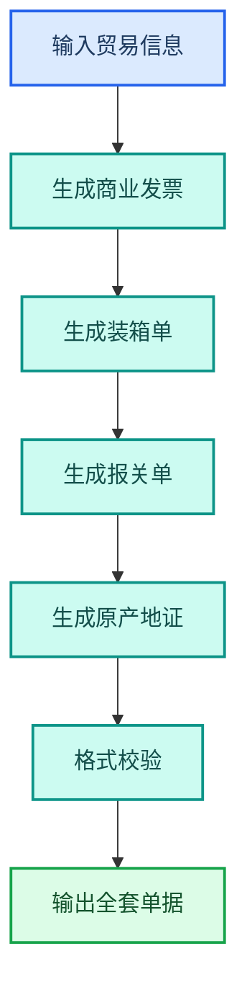
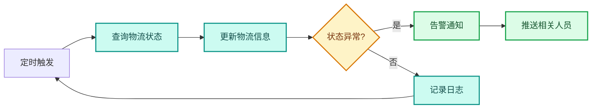

---
AIGC:
  ContentProducer: '001191110102MAD55U9H0F10002'
  ContentPropagator: '001191110102MAD55U9H0F10002'
  Label: '1'
  ProduceID: '1c14d92d-2dc3-4f0d-ab42-49a5aec21f19'
  PropagateID: '1c14d92d-2dc3-4f0d-ab42-49a5aec21f19'
  ReservedCode1: '139ef80e-1862-44c2-92df-184d28e13a28'
  ReservedCode2: '139ef80e-1862-44c2-92df-184d28e13a28'
---

# 4.13 跨境贸易行业

## 行业特征

跨境贸易行业的独特挑战是多语言、多币种、多法规——报关单据、合同翻译、汇率核算、跨境物流跟踪，需要处理不同国家的语言、货币和法规差异。TeleAgent 的多语言处理和数据分析能力在此行业有独特价值。

### 行业核心需求

| 需求 | 说明 | TeleAgent 应对 |
| --- | --- | --- |
| 报关单据 | 中英文单据制作和核对 | @docx（Word 文档助手） + @ocr-toolkit（OCR 识别工具） |
| 合同翻译 | 双语合同对照 | 内置多语言能力 + @docx |
| 汇率核算 | 多币种成本核算 | @xlsx（Excel 表格助手） |
| 物流跟踪 | 跨境物流信息整合 | @deep-research（深度调研） + 定时任务 |

## 4.13.1 典型应用场景

### 场景一：报关单据制作



| 环节 | 技能 | 输出 |
| --- | --- | --- |
| 发票生成 | @docx | 中英文商业发票 |
| 装箱单 | @docx | 装箱明细单 |
| 报关单 | @docx | 报关单据 |
| 单据校验 | 内置规则检查 | 格式和数据校验 |

### 场景二：双语合同翻译与审核

```
请将这份中文采购合同翻译为英文，保持双语对照格式，
翻译完成后进行合同条款审核，标注风险条款。
```

| 环节 | 技能 | 效果 |
| --- | --- | --- |
| 合同翻译 | 内置多语言 + @docx | 中英双语对照合同 |
| 条款审核 | @contract-review（合同审核） | 风险条款标注 |
| 格式规范 | @docx | 保持合同格式 |

### 场景三：汇率核算与成本分析

```
请根据以下信息进行跨境贸易成本核算：
1. 采购成本：USD 50,000（FOB 上海）
2. 运费：USD 3,500
3. 保险费：USD 500
4. 关税税率：8%
5. 增值税率：13%
6. 汇率：1 USD = 7.25 CNY
计算到岸成本（CIF）、关税、增值税和总成本。
```

| 环节 | 技能 | 输出 |
| --- | --- | --- |
| 成本计算 | @xlsx | 成本核算表 |
| 汇率换算 | @xlsx | 多币种成本对比 |
| 分析报告 | @docx | 成本分析报告 |

## 4.13.2 跨境贸易定制技能

| 技能 | 功能 | 适用场景 |
| --- | --- | --- |
| 报关单据生成器 | 全套报关单据自动生成 | 报关部 |
| 双语合同助手 | 合同翻译+条款审核 | 法务部 |
| 汇率核算工具 | 多币种成本核算 | 财务部 |
| 物流跟踪助手 | 跨境物流信息整合 | 物流部 |
| 贸易合规检查 | 出口管制和制裁名单筛查 | 合规部 |

## 4.13.3 多语言处理

### TeleAgent 多语言能力

| 场景 | 语言 | 能力 |
| --- | --- | --- |
| 合同翻译 | 中英/中日/中韩 | 全文翻译+对照排版 |
| 邮件翻译 | 多语种 | 商务邮件互译 |
| 单据翻译 | 中英 | 报关单据双语生成 |
| 市场调研 | 多语种检索 | 多国市场信息检索 |

::: tip 翻译质量建议
TeleAgent 的翻译是整句翻译（非词级替换），适合合同和商务文档。但法律效力文件建议翻译后由专业译员复核，确保法律术语准确。
:::

## 4.13.4 跨境物流跟踪



| 功能 | 实现方式 | 效果 |
| --- | --- | --- |
| 状态查询 | @deep-research 检索物流信息 | 自动跟踪 |
| 异常告警 | 规则判断+@wecom-push（企业微信推送） | 实时通知 |
| 到港提醒 | 定时任务 | 提前准备清关 |
| 物流报告 | @docx | 汇总物流状态 |

## 4.13.5 效果对比

> 以下效果数据为参考值，实际效果以具体使用场景为准。

| 工作项 | 传统方式 | TeleAgent | 提升 |
| --- | --- | --- | --- |
| 报关单据 | 2~3 小时/套 | 20~30 分钟/套 | 4~6 倍 |
| 合同翻译 | 半天~1 天 | 1~2 小时 | 4~6 倍 |
| 汇率核算 | 1~2 小时 | 10 分钟 | 6~12 倍 |
| 物流跟踪 | 手动查询 | 自动追踪 | 实时 |

## 4.13.6 落地建议

| 优先级 | 场景 | 理由 |
| --- | --- | --- |
| 高 | 报关单据自动化 | 高频且格式固定 |
| 高 | 汇率核算自动化 | 减少手工计算错误 |
| 中 | 双语合同翻译审核 | 提升合同处理效率 |
| 中 | 跨境物流跟踪 | 提升物流可视化 |
| 低 | 贸易合规检查 | 需要法规数据库支持 |

## 本章小结

跨境贸易行业的 TeleAgent 落地核心是「跨越语言和货币的壁垒」——报关单据、双语合同、汇率核算、物流跟踪，每项都涉及多语言和多币种处理。关键是**把单据制作标准化**和**利用多语言能力消除沟通障碍**。从报关单据和汇率核算切入，效果最直观。

---

第四篇到此完结。从行政文秘到跨境贸易，13 章覆盖了 5 个核心岗位和 7 个重点行业，展示了 TeleAgent 在不同场景下的落地路径。核心观点始终如一：**从最有痛点的场景切入，逐步扩展到全流程自动化，最终把个人最佳实践沉淀为组织能力。**

接下来的附录提供常用指令模板和场景速查表，方便日常使用时快速参考。