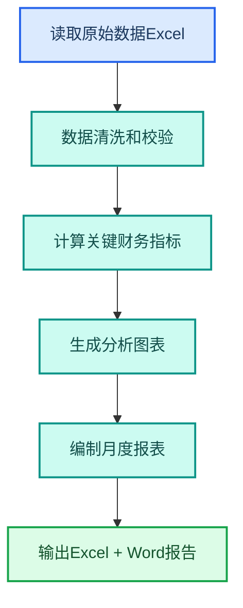

---
AIGC:
  ContentProducer: '001191110102MAD55U9H0F10002'
  ContentPropagator: '001191110102MAD55U9H0F10002'
  Label: '1'
  ProduceID: '63c22fd6-1099-47b2-94a7-bdf3ff57d12d'
  PropagateID: '63c22fd6-1099-47b2-94a7-bdf3ff57d12d'
  ReservedCode1: '77f48ba5-12fe-4719-b172-873e4bbe535c'
  ReservedCode2: '77f48ba5-12fe-4719-b172-873e4bbe535c'
---

# 4.3 财务审计岗位

## 岗位画像

财务审计岗位的核心工作是数据处理——发票核验、报表编制、审计底稿、税务计算。数据量大、精度要求高、截止日期严格，是 TeleAgent 数据处理能力的理想落地场景。

### 核心痛点

| 痛点 | 传统方式 | 影响 |
| --- | --- | --- |
| 发票录入耗时 | 逐张手工录入 | 每月数百张，极易出错 |
| 报表编制繁琐 | 手工汇总计算 | 月末加班集中处理 |
| 审计底稿重复 | 每次审计重新整理 | 效率低下 |
| 数据核对困难 | 跨表手工比对 | 容易遗漏差异 |

## 4.3.1 L1：单次辅助

### 发票批量识别

```
请对「发票扫描件」目录下的所有图片进行 OCR 识别，
提取发票代码、号码、日期、金额、税额，
汇总为 Excel 表格。
```

| 能力 | 技能 |
| --- | --- |
| OCR 识别 | @ocr-toolkit（OCR 识别工具） |
| 表格生成 | @xlsx（Excel 表格助手） |

### 数据分析报表

```
请根据这份经营数据 Excel，生成月度财务分析报告，
包含收入构成、成本分析、利润趋势和异常标注。
```

| 能力 | 技能 |
| --- | --- |
| 数据分析 | @xlsx |
| 文档生成 | @docx（Word 文档助手） |

```
请比对这个月的报表和上个月的报表，列出所有差异项。
```

| 能力 | 技能 |
| --- | --- |
| 文档比对 | @doc-compare（文档比对） |

## 4.3.2 L2：流程固化

### 自研技能：月度报表自动化



| 步骤 | 内容 |
| --- | --- |
| 触发方式 | @月度报表 |
| 输入 | 月度原始数据 Excel |
| 处理 | 数据清洗→指标计算→图表生成→报告编制 |
| 输出 | Excel 报表 + Word 分析报告 |

### 自研技能：发票核验助手

| 功能 | 说明 |
| --- | --- |
| 批量 OCR | 识别发票图片中的关键字段 |
| 重复检测 | 自动检测重复发票 |
| 金额校验 | 验证价税合计是否等于金额加税额 |
| 异常标注 | 标注金额异常或信息缺失的发票 |

### 定时任务：财务提醒

| 任务 | Cron | 内容 |
| --- | --- | --- |
| 月末关账提醒 | `0 17 L * *` | 每月最后一天提醒关账 |
| 发票截止提醒 | `0 9 25 * *` | 每月 25 日提醒提交发票 |

## 4.3.3 L3：协同自动化

### 财务月结全链路

| 环节 | 自动化 | 人工 |
| --- | --- | --- |
| 数据采集 | 自动读取各系统数据 | 确认数据完整性 |
| 数据清洗 | 自动去重、校验、格式化 | 审核异常项 |
| 报表编制 | 自动生成月度报表 | 审核报表 |
| 分析报告 | 自动生成分析报告 | 审核结论 |
| 分发推送 | 自动推送给管理层 | 确认推送对象 |

### 技能组合

| 技能 | 职责 | 协同方式 |
| --- | --- | --- |
| @ocr-toolkit | 发票识别 | 前置数据采集 |
| @xlsx | 数据处理和报表 | 核心处理 |
| @docx | 分析报告生成 | 接收数据结论 |
| @doc-compare | 月度差异比对 | 串联比对环节 |
| @wecom-push（企业微信推送） | 推送报表 | 后置通知 |

## 4.3.4 数据安全注意事项

::: warning 财务数据安全
财务数据属于敏感信息，使用 TeleAgent 处理时需注意：
- 所有数据在本地处理，不上传云端
- 处理完成后及时清理 .temp 目录中的中间文件
- 涉及涉密财务数据时，在独立目录中操作
- 推送报表时脱敏处理，不发送原始数据
:::

## 4.3.5 效果对比

> 以下效果数据为参考值，实际效果以具体使用场景为准。

| 工作项 | 传统方式 | L1 | L2 | L3 |
| --- | --- | --- | --- | --- |
| 发票录入 | 2 分钟/张 | 10 秒/张 | 批量自动 | 全自动 |
| 月度报表 | 2~3 天 | 半天 | 2 小时（@技能）| 30 分钟（全自动）|
| 审计底稿 | 3~5 天 | 1~2 天 | 半天（模板化）| 2 小时（自动化）|
| 差异核对 | 半天 | 1 小时 | 10 分钟（@比对）| 自动标注 |

## 4.3.6 落地建议

| 优先级 | 建议 | 理由 |
| --- | --- | --- |
| 高 | 先从发票 OCR 识别开始 | 效果最直观，节省大量录入时间 |
| 高 | 第二步做月度报表自动化 | 月末痛点最强 |
| 中 | 开发发票核验技能 | 提升数据准确性 |
| 中 | 建立审计底稿模板技能 | 减少重复整理 |
| 低 | 构建月结全链路 | 需要数据源稳定后推进 |

## 本章小结

财务审计岗位是 TeleAgent 数据处理能力的核心落地场景——从发票 OCR 到月度报表自动化，每一步都能显著降低人工数据处理量。关键是**确保数据准确性优先于效率**，建立质量门禁，让自动化结果可信可靠。