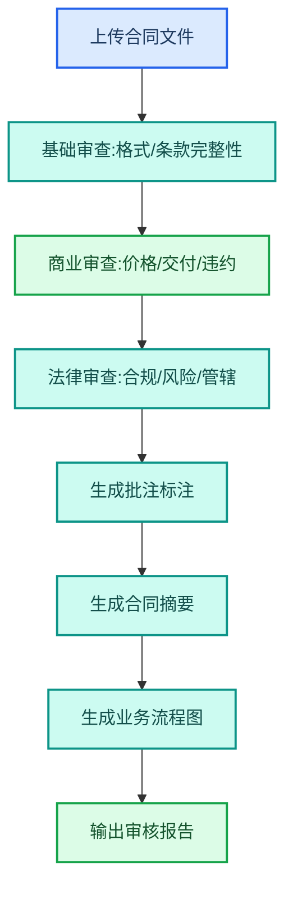

---
AIGC:
  ContentProducer: '001191110102MAD55U9H0F10002'
  ContentPropagator: '001191110102MAD55U9H0F10002'
  Label: '1'
  ProduceID: '827fac40-356c-4935-95f5-95dc1c690ede'
  PropagateID: '827fac40-356c-4935-95f5-95dc1c690ede'
  ReservedCode1: 'a2abdc6f-734e-4f32-aedc-fad2c5a4acc2'
  ReservedCode2: 'a2abdc6f-734e-4f32-aedc-fad2c5a4acc2'
---

# 4.4 法务合规岗位

## 岗位画像

法务合规岗位的核心工作是合同审核、合规检查、案件管理和法务报告。工作性质要求极高的准确性和严谨性，同时面临大量文档处理和法规检索的压力。

### 核心痛点

| 痛点 | 传统方式 | 影响 |
| --- | --- | --- |
| 合同审核耗时 | 逐条人工审阅 | 每份合同 1~2 小时 |
| 法规更新追踪 | 手动定期检索 | 容易遗漏新法规 |
| 案件资料整理 | 手工归档整理 | 查找困难 |
| 合规检查繁琐 | 逐项人工核对 | 覆盖面有限 |

## 4.4.1 L1：单次辅助

### 合同审核

```
请审核这份采购合同，进行三层审查（基础审查、商业审查、法律审查），
添加批注式问题标注，不改原文，生成合同摘要和业务流程图。
```

| 能力 | 技能 |
| --- | --- |
| 合同审核 | @contract-review（合同审核） |
| 流程图生成 | @diagram-drawing（图表绘制） |

### 法规检索

```
请搜索最近 30 天内关于数据安全的新法规，
汇总为法规简报，包含法规名称、发布机关、核心条款和影响分析。
```

| 能力 | 技能 |
| --- | --- |
| 深度调研 | @deep-research（深度调研） |
| 文档生成 | @docx（Word 文档助手） |

```
请对这份对外发布材料进行内容合规审校，
检查表述规范、敏感词和组织机构信息。
```

| 能力 | 技能 |
| --- | --- |
| 内容审校 | 内置推理 + 合规检查技能（可自研） |

## 4.4.2 L2：流程固化

### 自研技能：合同标准审核流程



| 步骤 | 内容 |
| --- | --- |
| 触发方式 | @合同审核 |
| 输入 | 合同文件（PDF/Word） |
| 处理 | 三层审查→批注标注→摘要→流程图 |
| 输出 | 带批注的合同 + 审核报告 + 流程图 |

### 自研技能：合规检查清单

| 检查项 | 检查内容 |
| --- | --- |
| 主体资质 | 合同主体是否合法存续 |
| 权限范围 | 签约人是否有授权 |
| 条款完备性 | 是否包含必要条款 |
| 风险条款 | 是否有不利条款 |
| 合规要求 | 是否符合行业法规 |

### 定时任务：法规更新追踪

| 任务 | Cron | 内容 |
| --- | --- | --- |
| 法规周报 | `0 9 * * 1` | 每周一搜索上周新法规并生成简报 |
| 合同到期提醒 | `0 9 * * *` | 检查合同到期日，提前 30 天提醒 |

## 4.4.3 L3：协同自动化

### 合同管理全链路

| 环节 | 自动化 | 人工 |
| --- | --- | --- |
| 合同接收 | 自动识别合同类型 | 确认分类 |
| 合同审核 | 三层自动审查 | 审核关键风险点 |
| 修改建议 | 自动生成修改建议 | 确认修改方案 |
| 归档管理 | 自动分类命名归档 | 确认归档 |
| 到期追踪 | 定时检查到期合同 | 决定续约或终止 |

### 技能组合

| 技能 | 职责 | 协同方式 |
| --- | --- | --- |
| @contract-review | 合同三层审查 | 核心审核 |
| @diagram-drawing | 业务流程图 | 接收审查结果 |
| @doc-compare（文档比对） | 版本对比 | 合同修改后比对 |
| @deep-research | 法规检索 | 前置法规更新 |

## 4.4.4 审核质量保障

::: warning 法务审核质量
法务审核的准确性至关重要，建议：
- AI 审核结果必须经法务人员复核后才能作为正式意见
- 高风险合同（如大额、跨境）需双重审核
- 建立审核结果反馈机制，持续优化技能准确率
- 保留审核轨迹，便于追溯
:::

## 4.4.5 效果对比

> 以下效果数据为参考值，实际效果以具体使用场景为准。

| 工作项 | 传统方式 | L1 | L2 | L3 |
| --- | --- | --- | --- | --- |
| 合同审核 | 1~2 小时/份 | 20 分钟 | 10 分钟（标准流程）| 5 分钟（自动+人工复核）|
| 法规检索 | 半天 | 1 小时 | 15 分钟（@技能）| 0（定时自动）|
| 合规检查 | 逐项人工 | 辅助检查 | 标准化清单 | 自动扫描 |
| 案件归档 | 手工整理 | 辅助分类 | 自动命名归档 | 全链路管理 |

## 4.4.6 落地建议

| 优先级 | 建议 | 理由 |
| --- | --- | --- |
| 高 | 先从标准合同审核开始 | 减少重复劳动，效果直观 |
| 高 | 建立合同到期追踪 | 避免遗漏续约 |
| 中 | 开发合规检查清单技能 | 系统化合规管理 |
| 中 | 设置法规更新定时任务 | 保持法规知识最新 |
| 低 | 构建合同管理全链路 | 需多技能协作稳定后推进 |

## 本章小结

法务合规岗位是 TeleAgent「严谨性」能力的落地场景——合同三层审查、法规追踪、合规检查、内容审校，每项任务都要求高准确性。关键是**AI 审核与人工复核相结合**，让 AI 做繁重的初步筛查，法务人员聚焦关键风险判断。