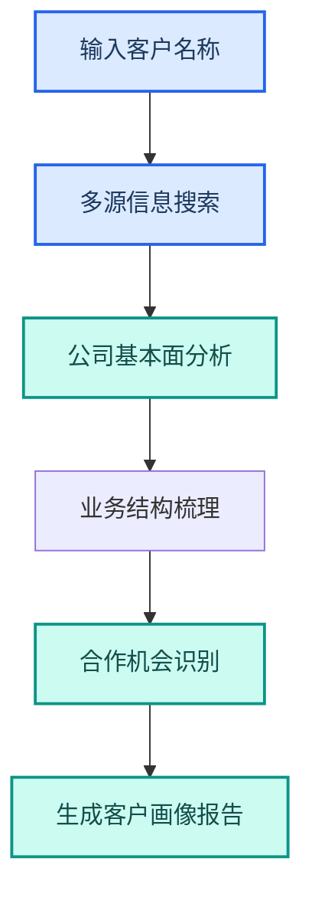

---
AIGC:
  ContentProducer: '001191110102MAD55U9H0F10002'
  ContentPropagator: '001191110102MAD55U9H0F10002'
  Label: '1'
  ProduceID: '9efc656d-2dda-4f36-901b-376cb0898e59'
  PropagateID: '9efc656d-2dda-4f36-901b-376cb0898e59'
  ReservedCode1: '0da967dd-d92d-4421-aff6-0c70bd9ac181'
  ReservedCode2: '0da967dd-d92d-4421-aff6-0c70bd9ac181'
---

# 4.5 销售市场岗位

## 岗位画像

销售市场岗位的核心工作是客户拓展、方案制作、市场调研和数据分析。节奏快、产出多、面向客户，对效率和质量同时有高要求。

### 核心痛点

| 痛点 | 传统方式 | 影响 |
| --- | --- | --- |
| 客户调研耗时 | 手动搜索整理 | 跟进不及时 |
| 方案制作周期长 | PPT 逐页制作 | 错失商机 |
| 数据通报手工 | Excel 手工统计 | 延迟且易错 |
| 市场信息滞后 | 依赖个人关注 | 覆盖面有限 |

## 4.5.1 L1：单次辅助

### 客户调研

```
请对 XX 公司进行深度调研，包含公司概况、业务范围、财务状况、
近期动态和合作机会分析，生成调研报告。
```

| 能力 | 技能 |
| --- | --- |
| 深度调研 | @deep-research（深度调研） |
| 文档生成 | @docx（Word 文档助手） |

```
请根据这份方案大纲生成 PPTX 演示文稿，
风格商务正式，15~20 页，包含公司介绍、方案概述、实施计划和报价。
```

| 能力 | 技能 |
| --- | --- |
| PPT 生成 | @ppt-master（PPT 生成大师） |
| 文件处理 | 内置能力 |

### 销售数据看板

```
请根据这份月度销售数据，生成含图表的数据看板，
按区域、产品线、销售经理三个维度分析。
```

| 能力 | 技能 |
| --- | --- |
| 数据分析 | @xlsx（Excel 表格助手） |

## 4.5.2 L2：流程固化

### 自研技能：客户画像生成器



| 步骤 | 内容 |
| --- | --- |
| 触发方式 | @客户画像 |
| 输入 | 客户公司名称 |
| 处理 | 多源搜索→基本面→业务结构→合作机会 |
| 输出 | 客户画像 docx 报告 |

### 自研技能：销售数据通报

| 功能 | 说明 |
| --- | --- |
| 数据汇总 | 按区域/产品线/人员汇总销售数据 |
| 环比同比 | 自动计算环比和同比变化 |
| 异常标注 | 标注涨跌超阈值的指标 |
| 格式化输出 | 生成 Markdown 推送消息 |

### 定时任务：市场监测

| 任务 | Cron | 内容 |
| --- | --- | --- |
| 行业新闻日报 | `0 8 * * *` | 搜索行业新闻生成日报 |
| 招标信息追踪 | `0 8 * * *` | 搜索指定关键词招标信息 |
| 每周销售通报 | `0 18 * * 5` | 周五汇总本周销售数据推送 |

## 4.5.3 L3：协同自动化

### 商机管理全链路

| 环节 | 自动化 | 人工 |
| --- | --- | --- |
| 市场监测 | 自动搜索行业动态和招标 | 筛选有效商机 |
| 客户调研 | 自动生成客户画像 | 判断合作意向 |
| 方案制作 | 自动生成方案 PPT | 个性化调整 |
| 报价支持 | 自动整理报价数据 | 确定最终报价 |
| 跟进提醒 | 定时提醒跟进 | 执行客户沟通 |

### 技能组合

| 技能 | 职责 | 协同方式 |
| --- | --- | --- |
| @deep-research | 客户调研 | 前置信息采集 |
| @ppt-master | 方案 PPT | 接收调研结论 |
| @xlsx | 数据分析 | 数据处理 |
| @bidding-watchdog（招标信息监测） | 招标追踪 | 定时信息采集 |
| @wecom-push（企业微信推送） | 通报推送 | 后置通知 |

## 4.5.4 效果对比

> 以下效果数据为参考值，实际效果以具体使用场景为准。

| 工作项 | 传统方式 | L1 | L2 | L3 |
| --- | --- | --- | --- | --- |
| 客户调研 | 半天~1 天 | 1~2 小时 | 30 分钟（@技能）| 15 分钟（自动化）|
| 方案 PPT | 1~2 天 | 2~3 小时 | 30 分钟（模板化）| 15 分钟（标准化）|
| 数据通报 | 2~3 小时 | 30 分钟 | 5 分钟（@技能）| 0（定时自动）|
| 市场监测 | 依赖个人 | 辅助搜索 | 定时搜索 | 全链路追踪 |

## 4.5.5 落地建议

| 优先级 | 建议 | 理由 |
| --- | --- | --- |
| 高 | 先从方案 PPT 制作开始 | 最高频痛点，效果最直观 |
| 高 | 第二步做数据通报自动化 | 每周/每月固定需求 |
| 中 | 开发客户画像技能 | 提升客户调研效率 |
| 中 | 设置招标追踪定时任务 | 自动发现商机 |
| 低 | 构建商机管理全链路 | 需要前述技能稳定后推进 |

## 本章小结

销售市场岗位是 TeleAgent「产出效率」能力的落地场景——方案 PPT、客户调研、数据通报、市场监测，每项都能直接转化为业务效率。关键是**把高频产出场景标准化**，让销售人员把更多时间花在客户沟通和关系维护上，而非文档制作。