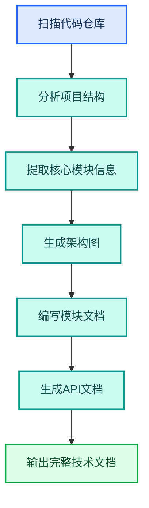

---
AIGC:
  ContentProducer: '001191110102MAD55U9H0F10002'
  ContentPropagator: '001191110102MAD55U9H0F10002'
  Label: '1'
  ProduceID: 'ac3b32db-aba0-4f23-83a1-ff52e014d08c'
  PropagateID: 'ac3b32db-aba0-4f23-83a1-ff52e014d08c'
  ReservedCode1: 'd15062bb-618a-47ee-80f7-09ad4883a619'
  ReservedCode2: 'd15062bb-618a-47ee-80f7-09ad4883a619'
---

# 4.6 技术研发岗位

## 岗位画像

技术研发岗位的核心工作是代码编写、技术文档、架构设计和研发流程管理。TeleAgent 在这个岗位的价值不仅是效率提升，更是标准化和知识沉淀。

### 核心痛点

| 痛点 | 传统方式 | 影响 |
| --- | --- | --- |
| 技术文档耗时 | 手工编写 | 文档滞后于代码 |
| 代码审查不统一 | 依赖个人经验 | 质量参差 |
| 架构设计难复用 | 每次从零开始 | 重复劳动 |
| 知识沉淀困难 | 散落在各处 | 新人上手慢 |

## 4.6.1 L1：单次辅助

### 代码生成与重构

```
请帮我重构这个函数，提高可读性和可维护性，
添加完整的类型注解和文档注释。
```

| 能力 | 说明 |
| --- | --- |
| 代码理解与生成 | 内置能力 |
| 文件处理 | 内置能力 |

### 技术文档编写

```
请根据这份代码仓库的结构和核心模块，
生成技术架构文档，包含系统概览、模块说明和数据流图。
```

| 能力 | 技能 |
| --- | --- |
| 架构图生成 | @diagram-drawing（图表绘制） |
| 文档生成 | @docx（Word 文档助手） |

```
请对这个 AI Agent 应用进行全栈诊断，
检查 12 层 Agent 栈中的潜在问题，生成按严重度排序的发现和修复建议。
```

| 能力 | 技能 |
| --- | --- |
| 架构审计 | @agent-architecture-audit |

## 4.6.2 L2：流程固化

### 自研技能：项目文档生成器



| 步骤 | 内容 |
| --- | --- |
| 触发方式 | @项目文档生成 |
| 输入 | 代码仓库目录路径 |
| 处理 | 结构分析→架构图→模块文档→API 文档 |
| 输出 | Markdown 技术文档 + 架构图 |

### 自研技能：代码审查清单

| 审查项 | 检查内容 |
| --- | --- |
| 代码规范 | 命名、格式、注释是否符合规范 |
| 安全性 | 是否有注入、XSS、敏感信息泄露风险 |
| 性能 | 是否有明显的性能瓶颈 |
| 可维护性 | 代码结构是否清晰，耦合度是否合理 |
| 测试覆盖 | 关键逻辑是否有测试覆盖 |

### 定时任务：依赖更新检查

| 任务 | Cron | 内容 |
| --- | --- | --- |
| 依赖安全扫描 | `0 9 * * 1` | 每周一检查项目依赖的安全漏洞 |
| 文档同步检查 | `0 9 * * 5` | 每周五检查文档是否与代码同步 |

## 4.6.3 L3：协同自动化

### 研发流程自动化

| 环节 | 自动化 | 人工 |
| --- | --- | --- |
| 需求分析 | 辅助需求文档梳理 | 确认需求优先级 |
| 架构设计 | 自动生成架构图和设计文档 | 审核架构方案 |
| 代码审查 | 自动扫描代码质量问题 | 审核核心逻辑 |
| 文档生成 | 自动从代码生成文档 | 审核文档准确性 |
| 知识沉淀 | 自动归档技术决策 | 确认归档内容 |

### 技能组合

| 技能 | 职责 | 协同方式 |
| --- | --- | --- |
| @diagram-drawing | 架构图生成 | 接收分析结果 |
| @docx | 技术文档 | 文档输出 |
| @agent-architecture-audit | 架构审计 | 代码质量检查 |
| @systematic-debugging | 系统调试 | Bug 排查 |
| 自研代码审查技能 | 代码质量扫描 | 串联审查流程 |

## 4.6.4 MCP 集成开发

技术研发岗位还可以利用 MCP 连接器将 TeleAgent 与开发工具链集成：

| 集成场景 | MCP 连接对象 | 用途 |
| --- | --- | --- |
| 代码仓库 | GitHub/GitLab API | 读取代码、提交修改 |
| 项目管理 | Jira/飞书任务 | 同步需求和任务状态 |
| CI/CD | Jenkins/GitHub Actions | 触发构建和部署 |
| 监控告警 | Prometheus/Grafana | 接收告警自动分析 |
| 日志分析 | ELK/Loki | 查询日志定位问题 |

## 4.6.5 效果对比

> 以下效果数据为参考值，实际效果以具体使用场景为准。

| 工作项 | 传统方式 | L1 | L2 | L3 |
| --- | --- | --- | --- | --- |
| 技术文档 | 1~2 天 | 2~3 小时 | 30 分钟（@技能）| 自动同步 |
| 代码审查 | 依赖个人 | 辅助检查 | 标准化清单 | 自动扫描 |
| 架构设计 | 手工画图 | 辅助生成 | @图表技能 | 模板化产出 |
| 调试排错 | 人工排查 | 辅助分析 | @调试技能 | 自动定位 |

## 4.6.6 落地建议

| 优先级 | 建议 | 理由 |
| --- | --- | --- |
| 高 | 先从技术文档生成开始 | 减少最大的重复劳动 |
| 高 | 第二步做代码审查标准化 | 提升代码质量 |
| 中 | 开发项目文档生成技能 | 文档与代码同步 |
| 中 | 集成 MCP 连接开发工具 | 打通研发工具链 |
| 低 | 构建研发流程全自动化 | 需要工具链稳定后推进 |

## 本章小结

技术研发岗位是 TeleAgent 「知识沉淀」能力的落地场景——把散落在代码注释、个人笔记、会议讨论中的技术知识，系统化为可维护、可检索的文档资产。关键是**让文档跟着代码走**，而非滞后于代码，让技术经验从「个人知识」变为「团队资产」。