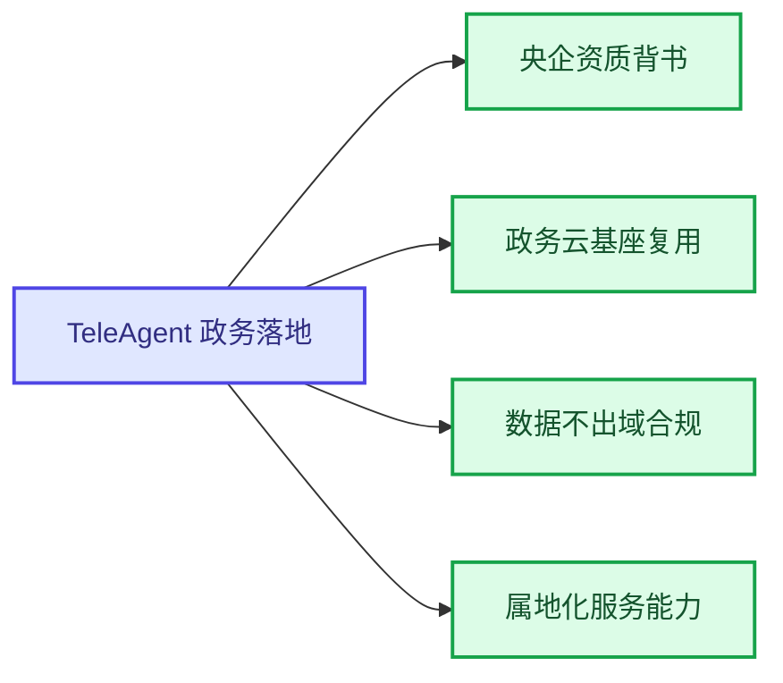
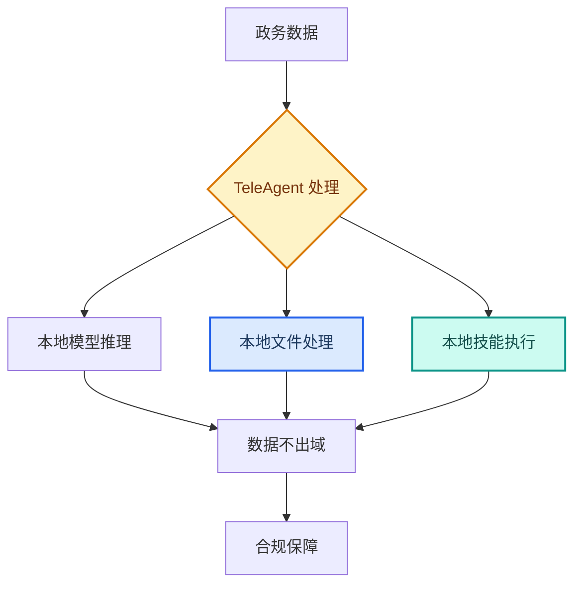
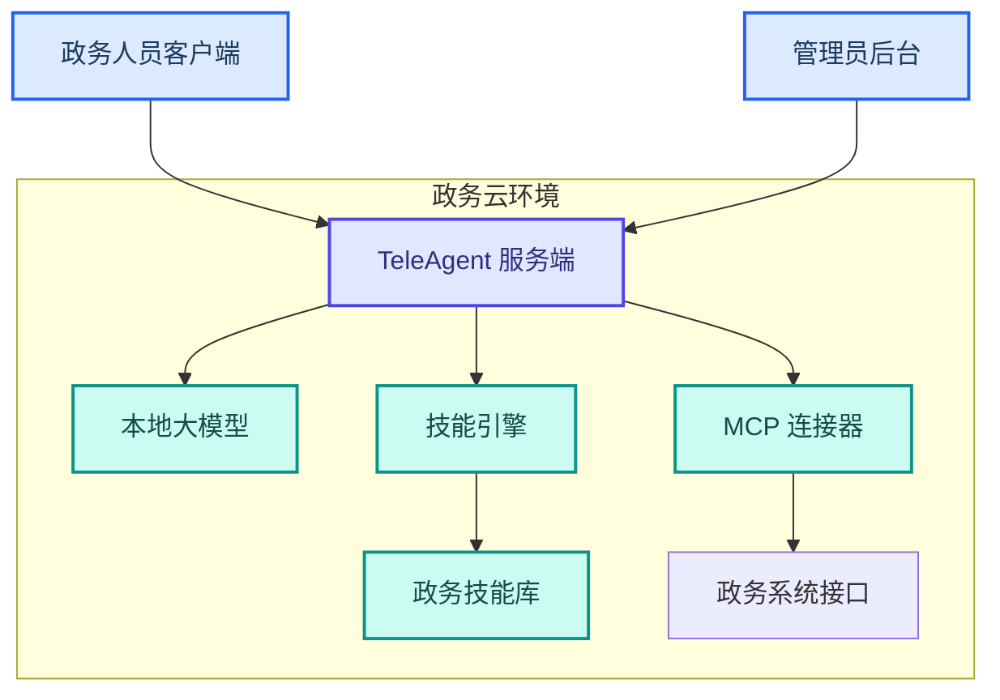

---
AIGC:
  ContentProducer: '001191110102MAD55U9H0F10002'
  ContentPropagator: '001191110102MAD55U9H0F10002'
  Label: '1'
  ProduceID: 'a6d604a4-166e-4003-9787-ebd107d37b3a'
  PropagateID: 'a6d604a4-166e-4003-9787-ebd107d37b3a'
  ReservedCode1: '04af9927-599e-4f70-977b-d38f08994431'
  ReservedCode2: '04af9927-599e-4f70-977b-d38f08994431'
---

# 4.7 政务场景：数据不出域的AI落地

## 行业特征

政务场景对 AI 工具有独特的严格要求——数据安全是底线，合规是前提，效率是目标。TeleAgent 作为中国电信旗下的 AI 原生应用，在政务场景具有天然优势。

### 政务场景的核心需求

| 需求 | 说明 | TeleAgent 优势 |
| --- | --- | --- |
| 数据不出域 | 所有数据处理在本地完成 | 本地化运行，数据不上传云端 |
| 央企资质背书 | 需要可信的供应商资质 | 中国电信旗下，央企资质 |
| 政务云基座 | 复用已有政务云基础设施 | 支持私有化部署到政务云 |
| 属地化服务 | 需要本地化运维和支持 | 中国电信属地化服务体系 |
| 合规审查 | 满足等保和密码评估要求 | 内置安全围栏和审计日志 |

## 4.7.1 政务场景的四大优势

### 央企资质背书

| 维度 | 说明 |
| --- | --- |
| 供应商资质 | 中国电信全资子公司，央企背景 |
| 安全审查 | 通过国家网络安全审查 |
| 合规认证 | 满足等保2.0审计要求 |
| 信任基础 | 政府客户天然信任央企 |

### 政务云基座复用

政务云已在全国广泛部署，TeleAgent 可直接私有化部署到已有政务云环境：

| 复用项 | 说明 |
| --- | --- |
| 计算资源 | 复用政务云 CPU/GPU 资源 |
| 存储资源 | 复用政务云存储 |
| 网络环境 | 复用政务专网，内外网隔离 |
| 安全体系 | 复用政务云安全防护 |

### 数据不出域合规

| 合规维度 | 实现方式 |
| --- | --- |
| 数据存储 | 全部数据存储在政务云本地 |
| 数据处理 | 推理和处理在本地完成 |
| 数据传输 | 不涉及外网传输 |
| 审计日志 | 本地记录完整操作日志 |

### 属地化服务能力

| 服务 | 说明 |
| --- | --- |
| 部署实施 | 本地团队负责安装部署 |
| 培训赋能 | 面向政务人员定制培训 |
| 运维支持 | 7x24 本地运维 |
| 技能定制 | 根据业务需求定制政务技能 |

## 4.7.2 典型政务应用场景

### 场景一：公文处理

| 场景 | TeleAgent 能力 | 效果 |
| --- | --- | --- |
| 公文起草 | @docx（Word 文档助手） + 指令 | 10 分钟生成规范化公文 |
| 公文校对 | 内置推理 + 合规检查技能 | 自动内容审校 |
| 公文流转 | @wecom-push（企业微信推送） / @lark（飞书集成） | 自动推送审批 |
| 归档管理 | 自研归档技能 | 自动分类归档 |

### 场景二：政务服务

| 场景 | TeleAgent 能力 | 效果 |
| --- | --- | --- |
| 政策检索 | @knowledge-base（知识库检索） + @deep-research（深度调研） | 快速检索相关政策 |
| 材料审核 | @ocr-toolkit（OCR 识别工具） + 自研审核技能 | 自动识别和校验材料 |
| 数据统计 | @xlsx（Excel 表格助手） | 自动生成统计数据 |
| 报告生成 | @docx + @ppt-master（PPT 生成大师） | 自动生成汇报材料 |

### 场景三：会议管理

| 场景 | TeleAgent 能力 | 效果 |
| --- | --- | --- |
| 会议纪要 | 语音转写技能 + @docx | 录音转写→纪要自动生成 |
| 决议追踪 | 自研追踪技能 | 自动提取待办并跟进 |
| 汇报材料 | @ppt-master + @xlsx | 数据→图表→PPT 全链路 |

## 4.7.3 政务部署架构

### 私有化部署方案

### 部署组件

| 组件 | 说明 | 部署位置 |
| --- | --- | --- |
| TeleAgent 服务端 | 核心引擎 | 政务云 |
| 本地大模型 | 推理模型 | 政务云 GPU 节点 |
| 技能库 | 政务定制技能 | 政务云存储 |
| 管理后台 | 用户和权限管理 | 政务云 |
| 客户端 | 用户交互界面 | 政务办公电脑 |

### 三层身份体系

| 层级 | 角色 | 权限 |
| --- | --- | --- |
| 管理员 | 信息中心技术人员 | 系统配置、用户管理、技能管理 |
| 部门管理员 | 各部门负责人 | 本部门用户和技能管理 |
| 普通用户 | 政务办公人员 | 使用已授权的技能 |

## 4.7.4 政务技能定制

### 常见政务定制技能

| 技能 | 功能 | 适用部门 |
| --- | --- | --- |
| 公文起草助手 | 按公文格式生成各类公文 | 所有部门 |
| 政策法规检索 | 检索政策法规库并生成解读 | 所有部门 |
| 会议纪要生成 | 录音转写→纪要→分发 | 所有部门 |
| 数据统计报告 | 自动统计政务数据生成报告 | 统计/发改/经贸 |
| 材料审核 | OCR 识别+自动校验申报材料 | 审批部门 |
| 内容审校 | 对外发布内容合规检查 | 宣传/办公室 |

### 技能安全审查

政务场景的技能审查比企业场景更严格：

| 审查项 | 标准要求 |
| --- | --- |
| 代码安全 | 必须通过源代码审计 |
| 数据安全 | 不允许任何形式的数据外传 |
| 权限控制 | 最小权限原则，严禁越权 |
| 审计追踪 | 完整的操作日志和审计轨迹 |
| 密码合规 | 符合密码评估要求 |

## 4.7.5 推广话术规范

::: warning 政务场景推广禁忌
- **不承诺绝对安全**：应表述为「满足等保2.0审计要求，数据不出域」
- **不贬低竞品**：突出自身央企优势，不攻击其他厂商
- **不夸大上线周期**：如实告知部署周期和资源需求
- **不过度承诺**：基于实际能力承诺，不夸大效果
:::

### 正确话术对照

| 场景 | 错误话术 | 正确话术 |
| --- | --- | --- |
| 数据安全 | 绝对安全，零风险 | 数据全程不出域，满足等保2.0审计要求 |
| 部署周期 | 一天就能上线 | 根据环境准备情况，通常 1~2 周 |
| 效果承诺 | 完全替代人工 | 辅助人工提升效率 50%+ |
| 竞品对比 | 比某某好得多 | 我们的央企资质和数据不出域是核心差异 |

## 4.7.6 效果对比

> 以下效果数据为参考值，实际效果以具体使用场景为准。

| 政务工作项 | 传统方式 | TeleAgent 私有化 |
| --- | --- | --- |
| 公文起草 | 2~3 小时 | 15 分钟 |
| 会议纪要 | 3~4 小时 | 15 分钟 |
| 政策检索 | 半天 | 10 分钟 |
| 数据统计报告 | 1~2 天 | 1~2 小时 |
| 材料审核 | 逐份人工 | 批量自动 |
| 内容审校 | 人工逐字 | 自动扫描 |

## 本章小结

政务场景是 TeleAgent 差异化优势最突出的领域——央企资质背书、政务云基座复用、数据不出域合规、属地化服务能力，四大优势构成坚固的竞争壁垒。关键是**用正确的安全表述传递信任**，用实际效果证明价值，让 TeleAgent 成为政务数字化转型的可信 AI 工具。

接下来六章将分别介绍金融、教育、医疗、制造业、建筑房地产和跨境贸易行业的落地路径。