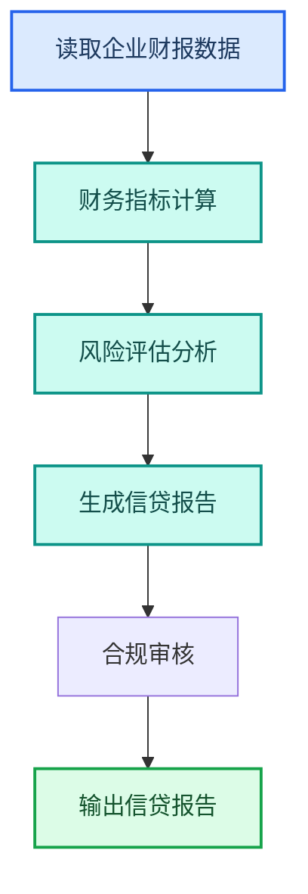
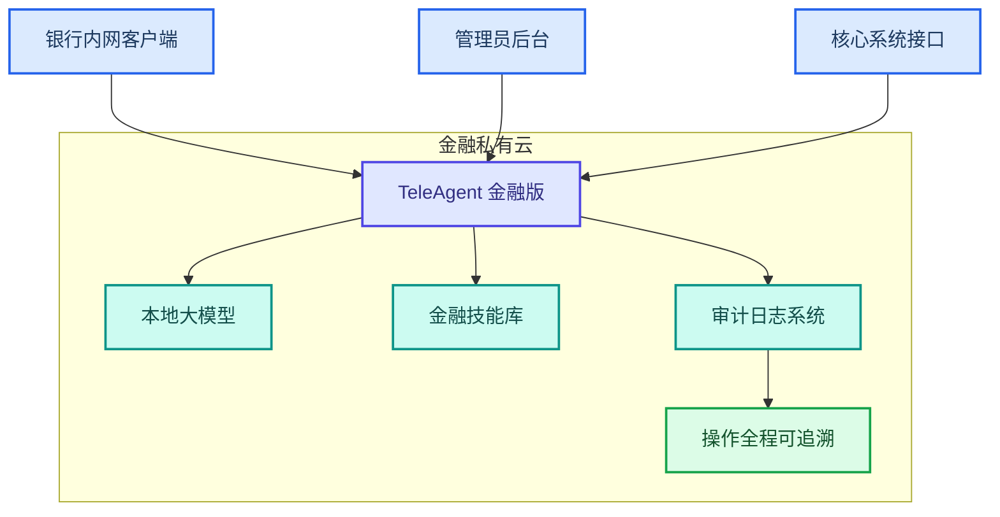

---
AIGC:
  ContentProducer: '001191110102MAD55U9H0F10002'
  ContentPropagator: '001191110102MAD55U9H0F10002'
  Label: '1'
  ProduceID: 'b3ef639e-b1cc-41d4-811b-8be1b60f093b'
  PropagateID: 'b3ef639e-b1cc-41d4-811b-8be1b60f093b'
  ReservedCode1: 'a9e0e717-1479-41d5-8a1b-a581fd31a9b8'
  ReservedCode2: 'a9e0e717-1479-41d5-8a1b-a581fd31a9b8'
---

# 4.8 金融行业

## 行业特征

金融行业是合规要求最严格的行业之一——风控审查、客户身份认证（KYC）、信贷报告、监管报表，每项工作都有严格的法规约束和精度要求。TeleAgent 在金融行业的落地核心是「合规优先、风控驱动」。

### 行业核心需求

| 需求 | 说明 | TeleAgent 应对 |
| --- | --- | --- |
| 合规优先 | 所有操作必须符合监管要求 | 私有化部署 + 审计日志 |
| 数据安全 | 客户金融数据高度敏感 | 数据不出域 + 本地处理 |
| 风控驱动 | 风险识别和控制是核心 | 数据分析 + 规则检查 |
| 监管报送 | 定期向监管机构报送数据 | 报表自动化 + 格式校验 |

## 4.8.1 典型应用场景

### 场景一：信贷报告自动化

| 环节 | TeleAgent 能力 | 效果 |
| --- | --- | --- |
| 数据录入 | @ocr-toolkit（OCR 识别工具） 识别财报 | 自动提取数据 |
| 指标计算 | @xlsx（Excel 表格助手） 自动计算 | 避免手工错误 |
| 风险分析 | 内置推理能力 | 辅助风险评估 |
| 报告生成 | @docx（Word 文档助手） | 自动生成规范报告 |

### 场景二：客户 KYC 审核

| 环节 | 说明 | 技能 |
| --- | --- | --- |
| 证件识别 | OCR 识别身份证/营业执照 | @ocr-toolkit |
| 信息核验 | 自动比对多源信息 | @doc-compare（文档比对） |
| 风险评分 | 根据规则计算风险分 | @xlsx |
| 审核报告 | 生成 KYC 审核报告 | @docx |

### 场景三：监管报表自动化

| 报表类型 | 自动化环节 | 技能组合 |
| --- | --- | --- |
| 资本充足率报表 | 数据提取→计算→填报 | @xlsx + @ocr-toolkit |
| 流动性报表 | 数据汇总→校验→生成 | @xlsx |
| 不良贷款报表 | 分类统计→汇总→格式化 | @xlsx + @docx |
| 反洗钱报告 | 交易筛选→分析→报告 | @xlsx + @docx |

## 4.8.2 金融行业定制技能

| 技能 | 功能 | 适用部门 |
| --- | --- | --- |
| 财报分析助手 | OCR 识别+指标计算+分析报告 | 信贷部 |
| KYC 审核助手 | 证件识别+信息核验+风险评分 | 合规部 |
| 监管报表生成器 | 数据汇总+格式化+校验 | 计财部 |
| 反洗钱筛查 | 交易筛选+可疑分析+报告 | 合规部 |
| 合同审查金融版 | 金融合同专项审查 | 法务部 |

## 4.8.3 部署架构

### 金融级安全要求

| 安全维度 | 要求 | 实现 |
| --- | --- | --- |
| 网络隔离 | 内网部署，物理隔离 | 私有云部署 |
| 数据加密 | 传输和存储全加密 | TLS + 本地加密 |
| 访问控制 | 三层身份+最小权限 | RBAC 权限体系 |
| 审计追踪 | 全程操作日志 | 审计日志系统 |
| 密码合规 | 以实际交付方案为准 | 根据客户需求配置 |

## 4.8.4 效果对比

> 以下效果数据为参考值，实际效果以具体使用场景为准。

| 工作项 | 传统方式 | TeleAgent | 提升 |
| --- | --- | --- | --- |
| 信贷报告 | 2~3 天 | 2~3 小时 | 10 倍 |
| KYC 审核 | 1~2 小时/客户 | 15 分钟/客户 | 4~8 倍 |
| 监管报表 | 3~5 天 | 半天 | 6~10 倍 |
| 合同审查 | 2~3 小时/份 | 20 分钟/份 | 6~9 倍 |

## 4.8.5 落地建议

| 优先级 | 场景 | 理由 |
| --- | --- | --- |
| 高 | 监管报表自动化 | 高频且格式固定，ROI 最高 |
| 高 | 信贷报告辅助 | 减少人工分析量 |
| 中 | KYC 审核自动化 | 提升客户开户效率 |
| 中 | 合同审查金融版 | 降低法务审查压力 |
| 低 | 反洗钱筛查 | 需要与核心系统深度对接 |

::: warning 金融合规提示
金融行业使用 AI 工具时，所有 AI 产出必须经专业人员复核后才能作为正式决策依据。TeleAgent 的角色是「辅助工具」而非「决策系统」，最终判断权在人。
:::

## 本章小结

金融行业的 TeleAgent 落地以「合规优先、风控驱动」为核心——在确保数据安全和合规的前提下，用自动化提升信贷、KYC、监管报表等核心业务的效率。关键是**私有化部署保障安全、审计日志确保可追溯、人工复核保障准确性**。