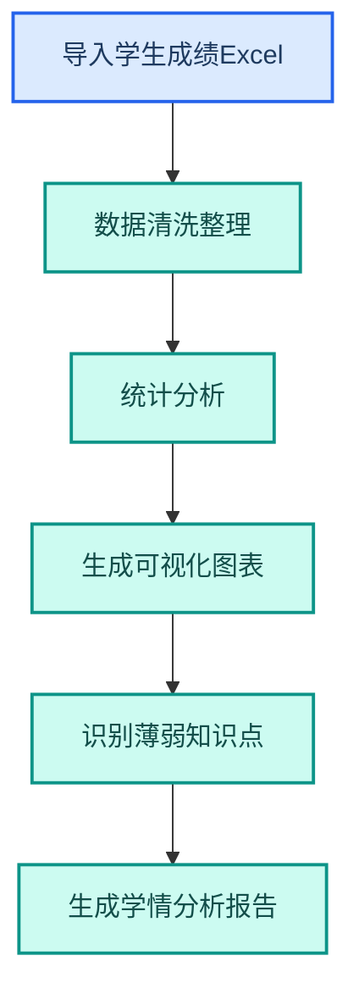
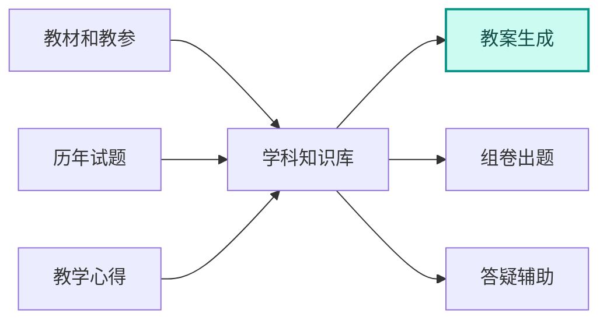

---
AIGC:
  ContentProducer: '001191110102MAD55U9H0F10002'
  ContentPropagator: '001191110102MAD55U9H0F10002'
  Label: '1'
  ProduceID: '8e226c47-c164-4bc1-9465-4a44d78b5e19'
  PropagateID: '8e226c47-c164-4bc1-9465-4a44d78b5e19'
  ReservedCode1: '1c59b97f-3f7e-440a-91a6-e0d56c0a1c83'
  ReservedCode2: '1c59b97f-3f7e-440a-91a6-e0d56c0a1c83'
---

# 4.9 教育行业

## 行业特征

教育行业的核心需求是知识传授和管理效率——教案编写、试卷批改、学情分析、校务行政。工作量大且重复性高，教师被大量非教学事务占用精力。TeleAgent 在教育行业的价值是「把时间还给教学」。

### 行业核心需求

| 需求 | 说明 | TeleAgent 应对 |
| --- | --- | --- |
| 教案效率 | 备课占用大量时间 | 文档生成 + 知识库 |
| 试卷批改 | 主观题批改耗时 | OCR + 自动评分辅助 |
| 学情分析 | 数据分散难以分析 | @xlsx（Excel 表格助手） 数据分析 |
| 校务行政 | 行政事务繁杂 | 文档自动化 + 定时任务 |

## 4.9.1 典型应用场景

### 场景一：教案生成与优化

```
请根据以下教学要求生成一份高中数学教案：
课题：导数的概念与应用
课时：2 课时
要求：包含教学目标、重难点、教学过程、板书设计和课后作业。
```

| 环节 | TeleAgent 能力 | 效果 |
| --- | --- | --- |
| 教案生成 | @docx（Word 文档助手） + 指令 | 15 分钟生成规范教案 |
| 课件制作 | @ppt-master（PPT 生成大师） | 自动生成教学 PPT |
| 素材检索 | @deep-research（深度调研） | 检索教学参考素材 |

### 场景二：学情分析



| 环节 | 技能 | 输出 |
| --- | --- | --- |
| 数据处理 | @xlsx | 成绩统计表 |
| 可视化 | @xlsx | 成绩分布图、趋势图 |
| 分析报告 | @docx | 学情分析报告 |
| 教学建议 | 内置推理 | 针对性教学建议 |

### 场景三：校务行政自动化

| 场景 | 技能 | 效果 |
| --- | --- | --- |
| 通知起草 | @docx | 快速生成规范通知 |
| 会议纪要 | 语音转写技能 + @docx | 自动转写生成纪要 |
| 数据统计 | @xlsx | 招生/成绩/考勤统计 |
| 材料归档 | 自研归档技能 | 自动分类归档 |

## 4.9.2 教育行业定制技能

| 技能 | 功能 | 使用者 |
| --- | --- | --- |
| 教案生成助手 | 按学科和课题生成规范教案 | 教师 |
| 试卷生成器 | 按知识点和难度自动组卷 | 教师 |
| 学情分析工具 | 成绩统计+薄弱点分析+教学建议 | 教师/教务 |
| 课件制作助手 | 教学内容→PPT 课件 | 教师 |
| 校务文档助手 | 通知/报告/纪要等行政文档 | 行政人员 |

## 4.9.3 知识库建设

教育行业特别适合建设学科知识库：



| 知识库类型 | 内容 | 技能 |
| --- | --- | --- |
| 学科教材库 | 各版本教材数字化 | @knowledge-base（知识库检索） |
| 试题题库 | 历年试题和模拟题 | @knowledge-base + @xlsx |
| 教学经验库 | 优秀教师教案和心得 | @knowledge-base |
| 政策法规库 | 教育政策和法规 | @knowledge-base + @deep-research |

## 4.9.4 效果对比

> 以下效果数据为参考值，实际效果以具体使用场景为准。

| 工作项 | 传统方式 | TeleAgent | 提升 |
| --- | --- | --- | --- |
| 教案编写 | 2~3 小时 | 20~30 分钟 | 4~6 倍 |
| 课件制作 | 1~2 小时 | 15 分钟 | 4~8 倍 |
| 学情分析 | 1~2 天 | 1~2 小时 | 8~12 倍 |
| 校务通知 | 30 分钟 | 5 分钟 | 6 倍 |
| 会议纪要 | 1~2 小时 | 10 分钟 | 6~12 倍 |

## 4.9.5 落地建议

| 优先级 | 场景 | 理由 |
| --- | --- | --- |
| 高 | 教案和课件生成 | 教师最高频痛点 |
| 高 | 学情分析自动化 | 数据驱动教学 |
| 中 | 建设学科知识库 | 长期资产积累 |
| 中 | 校务行政自动化 | 释放行政精力 |
| 低 | 试卷自动批改 | 主观题准确率待提升，辅助为主 |

::: tip 教育数据安全
学生数据（成绩、个人信息）属于敏感数据，使用 TeleAgent 处理时确保数据在本地，处理完成后及时清理中间文件。成绩分析结果推送时注意脱敏，不暴露个别学生信息。
:::

## 本章小结

教育行业的 TeleAgent 落地核心是「把时间还给教学」——让教师从繁重的教案编写、数据统计、行政事务中解放出来，聚焦于教学本身。关键是**建设学科知识库**，让备课、出题、答疑都能站在积累的知识资产上，越用越好。