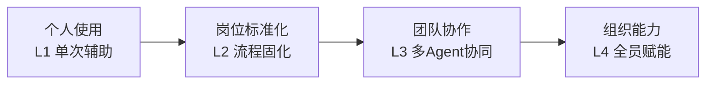

---
AIGC:
  ContentProducer: '001191110102MAD55U9H0F10002'
  ContentPropagator: '001191110102MAD55U9H0F10002'
  Label: '1'
  ProduceID: 'cce9c583-8e84-4797-afbf-02790d53eac6'
  PropagateID: 'cce9c583-8e84-4797-afbf-02790d53eac6'
  ReservedCode1: 'ba2b2f11-6773-49f8-b337-63064d45fc5c'
  ReservedCode2: 'ba2b2f11-6773-49f8-b337-63064d45fc5c'
---

# 第四篇 岗位与行业落地：从个人效率到组织能力

前三篇分别解决了「学会使用」「案例实践」「构建系统」三个层次的问题。本篇聚焦最后一个层次：**落地**——把 TeleAgent 的能力映射到具体岗位和行业的日常工作场景中。

## 本篇结构

第四篇分为两部分共 13 章：

### 第一部分：岗位应用（4.1~4.6）

| 章节 | 岗位 | 核心场景 |
| --- | --- | --- |
| 4.1 | 岗位应用框架 | L1-L4 成熟度模型，从单次辅助到团队能力 |
| 4.2 | 行政文秘 | 公文起草、会议管理、日程协调 |
| 4.3 | 财务审计 | 发票处理、报表生成、数据核对 |
| 4.4 | 法务合规 | 合同审核、法规检索、合规检查 |
| 4.5 | 销售市场 | 客户调研、方案制作、数据通报 |
| 4.6 | 技术研发 | 代码生成、文档编写、架构审计 |

### 第二部分：行业落地（4.7~4.13）

| 章节 | 行业 | 核心特征 |
| --- | --- | --- |
| 4.7 | 政务场景 | 数据不出域的 AI 落地 |
| 4.8 | 金融行业 | 合规优先、风控驱动 |
| 4.9 | 教育行业 | 知识库建设、教学辅助 |
| 4.10 | 医疗行业 | 病历处理、科研辅助 |
| 4.11 | 制造业 | 供应链管理、质量报告 |
| 4.12 | 建筑与房地产行业 | 合同管理、成本核算 |
| 4.13 | 跨境贸易行业 | 多语言处理、报关单据 |

## 阅读建议

- **按岗位阅读**：直接查看与自己岗位相关的章节，获取针对性建议
- **按行业阅读**：关注所在行业的章节，了解行业特定的落地模式
- **管理者必读**：4.1的成熟度模型是规划团队 AI 落地路线图的工具
- **跨岗位参考**：不同岗位的技能组合方式可以互相借鉴

## 从「个人效率」到「组织能力」

本篇的核心观点：TeleAgent 的价值不是让一个人省时间，而是**把个人的最佳实践沉淀为组织能力**，让每个岗位都能站在 AI 的肩膀上工作。