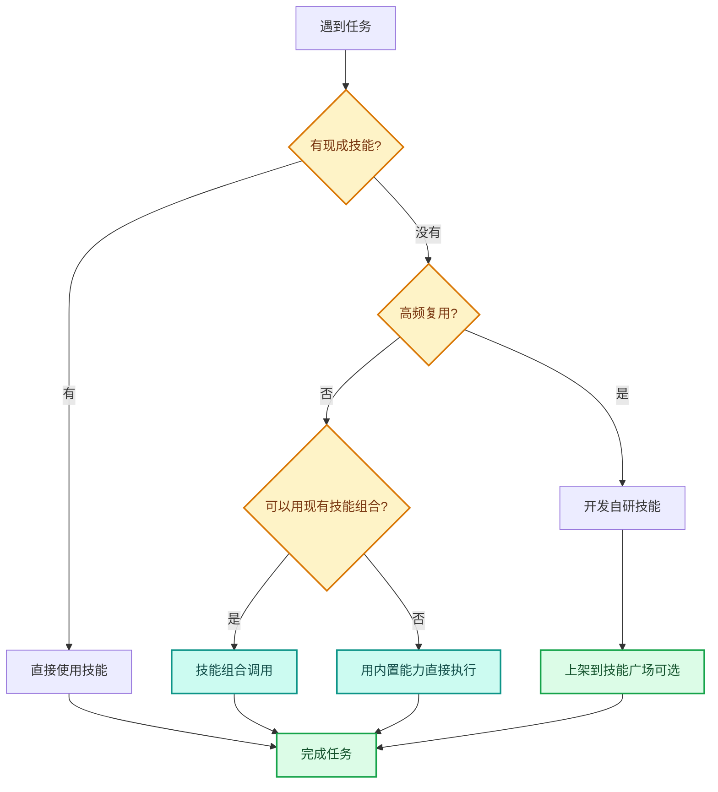

---
AIGC:
  ContentProducer: '001191110102MAD55U9H0F10002'
  ContentPropagator: '001191110102MAD55U9H0F10002'
  Label: '1'
  ProduceID: '03e6b0ca-5320-4bbd-a05e-2448778a0c26'
  PropagateID: '03e6b0ca-5320-4bbd-a05e-2448778a0c26'
  ReservedCode1: 'c8ccf442-2792-4316-ad85-efb3aa77e557'
  ReservedCode2: 'c8ccf442-2792-4316-ad85-efb3aa77e557'
---

# 附录 B 场景速查表

本附录提供一张表速查各类任务的技能选择、模型建议和权限需求。

::: tip 官方预置技能
TeleAgent 桌面版内置了多类常用技能，包括但不限于：新闻周报、合同审核、数据分析、Excel 表格处理、Word 文档生成、PPT 制作、PDF 生成、OCR 识别、深度调研、招标信息监测等。安装客户端后即可直接使用 `@技能名` 调用，无需额外安装。
:::

## B.1 办公文档场景

| 任务 | 首选技能 | 备选技能 | 模型建议 | 关键权限 |
| --- | --- | --- | --- | --- |
| Excel 数据处理 | @xlsx | Python 脚本 | 效率模型 | 文件读写 |
| Word 文档生成 | @docx | — | 强推理模型 | 文件读写 |
| PPT 生成（正式） | @ppt-master | — | 强推理模型 | 文件读写 |
| PPT 生成（快速） | @pptx | — | 效率模型 | 文件读写 |
| HTML 演示文稿 | @html-ppt | — | 效率模型 | 文件读写 |
| PDF 生成 | @pdf | — | 强推理模型 | 文件读写 |
| 文档格式转换 | @markitdown | — | 效率模型 | 文件读写 |

## B.2 数据分析场景

| 任务 | 首选技能 | 备选技能 | 模型建议 | 关键权限 |
| --- | --- | --- | --- | --- |
| 数据统计汇总 | @xlsx | Python pandas | 效率模型 | 文件读写 |
| 数据可视化 | @xlsx | Python matplotlib | 效率模型 | 文件读写 |
| 经营分析报告 | @xlsx + @docx | — | 强推理模型 | 文件读写 |
| 数据看板 | @xlsx | @infographic | 效率模型 | 文件读写 |
| 文档比对 | @doc-compare | — | 强推理模型 | 文件读写 |

## B.3 信息检索场景

| 任务 | 首选技能 | 备选技能 | 模型建议 | 关键权限 |
| --- | --- | --- | --- | --- |
| 深度调研 | @deep-research | — | 强推理模型 | 联网搜索 |
| 招标信息监测 | @bidding-watchdog | — | 效率模型 | 联网搜索 |
| 新闻聚合 | @news-aggregator-skill | — | 效率模型 | 联网搜索 |
| 知识库检索 | @knowledge-base | — | 效率模型 | 文件读写 |
| 客户调研 | @deep-research | — | 强推理模型 | 联网搜索 |

## B.4 合同法务场景

| 任务 | 首选技能 | 备选技能 | 模型建议 | 关键权限 |
| --- | --- | --- | --- | --- |
| 合同三层审核 | @contract-review | — | 强推理模型 | 文件读写 |
| 内容审校 | 内置推理 + 合规检查技能 | — | 强推理模型 | 文件读写 |
| 流程图生成 | @diagram-drawing | — | 效率模型 | 文件读写 |
| 法规检索 | @deep-research | — | 强推理模型 | 联网搜索 |
| 合同比对 | @doc-compare | — | 强推理模型 | 文件读写 |

## B.5 会议记录场景

| 任务 | 首选技能 | 备选技能 | 模型建议 | 关键权限 |
| --- | --- | --- | --- | --- |
| 语音转写 | 语音转写技能（技能广场安装或自研） | — | 强推理模型 | 文件读写、音频处理 |
| 会议纪要生成 | 语音转写技能 + @docx | — | 强推理模型 | 文件读写 |
| 脑图生成 | @diagram-drawing | — | 效率模型 | 文件读写 |

## B.6 通信推送场景

| 任务 | 首选技能 | 备选技能 | 模型建议 | 关键权限 |
| --- | --- | --- | --- | --- |
| 企业微信推送 | @wecom-push | — | 效率模型 | IM 推送 |
| 飞书推送 | @lark | — | 效率模型 | IM 推送 |
| 邮件推送 | @lark（飞书邮件） | — | 效率模型 | 邮件发送 |

## B.7 OCR 识别场景

| 任务 | 首选技能 | 备选技能 | 模型建议 | 关键权限 |
| --- | --- | --- | --- | --- |
| 通用 OCR | @ocr-toolkit | — | 效率模型 | 文件读写 |
| 发票识别 | @ocr-toolkit | — | 效率模型 | 文件读写 |
| 复杂文档解析 | @paddleocr-doc-parsing | — | 强推理模型 | 文件读写、Python |
| 扫描件数字化 | @ocr-toolkit | @pdf | 效率模型 | 文件读写 |

## B.8 技能开发场景

| 任务 | 首选技能 | 备选技能 | 模型建议 | 关键权限 |
| --- | --- | --- | --- | --- |
| 创建新技能 | @skill-creator | — | 强推理模型 | 文件读写 |
| 技能自进化更新 | @skill-evolver | — | 强推理模型 | 文件读写 |
| MCP 服务开发 | @mcp-builder | — | 强推理模型 | 文件读写、网络 |

## B.9 按岗位速查

| 岗位 | 核心技能组合 | 优先场景 |
| --- | --- | --- |
| 行政文秘 | 语音转写技能 + @docx + @wecom-push | 会议纪要、周报 |
| 财务审计 | @ocr-toolkit + @xlsx + @docx | 发票处理、月度报表 |
| 法务合规 | @contract-review + @deep-research | 合同审核、法规追踪、内容审校 |
| 销售市场 | @deep-research + @ppt-master + @xlsx + @bidding-watchdog | 客户调研、方案PPT |
| 技术研发 | @diagram-drawing + @docx + @agent-architecture-audit | 技术文档、架构审计 |

## B.10 按成熟度速查

| 成熟度 | 技能特点 | 自动化程度 | 典型配置 |
| --- | --- | --- | --- |
| L1 | 官方技能广场基础技能 | 手动触发 | 3~5 个官方技能 |
| L2 | 官方+自研技能 | 部分定时任务 | 5~10 个技能 + 2~3 个定时任务 |
| L3 | 多技能组合+多Agent | 全流程自动化 | 10+ 技能 + 质量门禁 + 降级策略 |
| L4 | 企业技能市场+自进化 | 全员自动化 | 企业技能市场 + 持续迭代 |

## B.11 技能选择决策树

## B.12 常见问题速查

| 症状 | 可能原因 | 解决方案 |
| --- | --- | --- |
| 技能安装后不显示 | 元数据未注册 | 重启客户端 |
| @技能名 无响应 | 技能未启用或超 50 上限 | 在我的技能中启用 |
| 定时任务不执行 | 客户端未运行 | 确保客户端常驻 |
| PPT 文字溢出 | 未指定页密度约束 | 指令加「每页不超过5条要点」 |
| OCR 识别错误多 | 图片不清晰 | 提高扫描分辨率到 300DPI+ |
| 推送失败 | Webhook 失效 | 重新获取群机器人 Webhook |
| 合同审核遗漏 | 审查层级不够 | 确认三层审查全部执行 |

---

本蓝皮书到此全部完结。如需获取最新版本或参与内容贡献，请关注 TeleAgent 官方更新渠道。