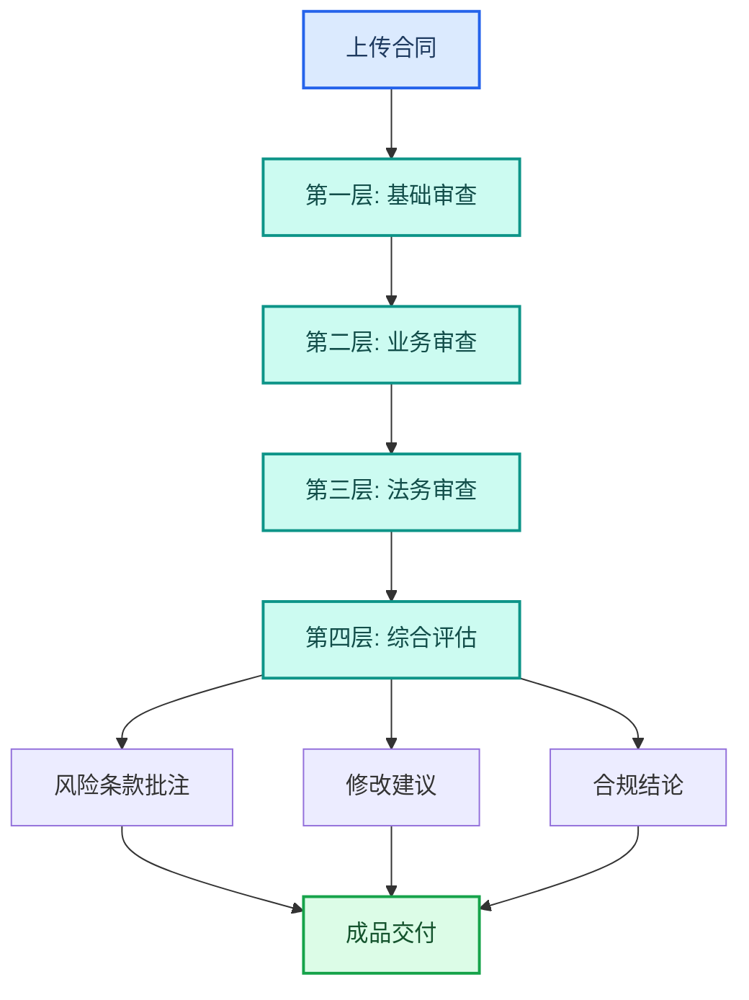

案例集

# 合同审核与法律合规

TeleAgent 实战蓝皮书 · 9 个案例 · 四层审查 · 跨境合同 · 诉讼代理 · 制度审核 · 纠纷管理

> 本章节汇集了 TeleAgent 在合同审核、法律合规、诉讼管理、制度审查等法务场景的实战案例，覆盖重庆电信、国际公司、中电信AI公司等多家单位的实践。

共 **9** 个案例，来自全国电信系统一线实践。

## 案例目录

| # | 案例名称 | 提供单位 | 来源 |
|---|---------|---------|------|
| 1 | 合同审核四层审查 | 重庆电信 法律合规部 | 案例集第七期 |
| 2 | 诉讼代理与以案促管全流程 | 重庆电信 法律合规部 | 案例集第七期 |
| 3 | 日常待办管理—四象限看板 | 国际公司 法律合规部 | 案例集第七期 |
| 4 | 纠纷专项管理 | 国际公司 法律合规部 | 案例集第七期 |
| 5 | 规章制度审核助理 | 国际公司 法律合规部 | 案例集第七期 |
| 6 | CTG合同审核助理 | 国际公司 法律合规部 | 案例集第七期 |
| 7 | 法规政策秒级对照 | 上海电信/何震渊 | 案例集第四期 |
| 8 | 合规风险把控 | 中电信人工智能科技有限公司 采购部 | 案例集第一期 |
| 9 | 合同风险审查 | 中电信人工智能科技有限公司 法务部/采购部 | 案例集第一期 |

---

## 1. 合同审核四层审查

> **提供单位**：重庆电信 法律合规部  
> **来源**：案例集第七期

### 案例背景

5787案例、12个典型案例、272份合同范本、20余份诉讼文书模板、
审核参考标准）和合同审核技能，实现四层审查机制（基础审查→商业
审查→电信行业合规审查→法律审查），上传合同后AI自动完成PDF提
取、资信核查、四层审核，输出批注+意见+清单共6份成果文件。
1. 在TeleAgent中搭建6大合规知识库，按月持续更新，覆盖法律法
规、案例库、合同范本、诉讼文书模板等；
2. 开发合同审核技能，内置四层审查框架、17项电信合规检查项、资
信核查标准；
3. 上传合同文件，智能体自动完成PDF提取（支持62页全文）；
4. 智能体自动执行签约方资信核查（6类风险扫描：失信/被执行/限消
等）；
5. 智能体按四层审查逐层审核：基础审查（数字/日期/金额/编号）→
商业审查（交付/付款/违约金）→电信合规审查（17项检查项+审批权
限校验+特殊合同类型专项审查）→法律审查（效力/管辖/知识产权/保
密）；
6. 智能体自动生成6份成果文件：合同摘要、资信审查报告、综合审核
意见书、DICT前后项对比分析、审查问题清单（分风险等级/审查层次/
处置建议）、批注文档。

### 效果亮点

1. 审核效率质变：自6月起审核20余份，每份从10分钟缩短至5分
钟，节约100工时；
2. 约60个高风险拦截：包括背靠背支付条款、合同审签倒置、交付验
收标准、知识产权约定等；
3. 四层审查机制：基础→商业→电信合规（17项）→法律，逐层递
进，审查问题清单分高/中/低风险等级和处置建议；
4. DICT前后项对比：全流程履约系统分析，前后项合同关键条款（履
约/支付/知识产权）衔接比对，有效转嫁风险。

---

## 2. 诉讼代理与以案促管全流程

> **提供单位**：重庆电信 法律合规部  
> **来源**：案例集第七期

### 案例背景

程标准化（诉讼需求发起→案件信息汇总→民事起诉状→证据目录+举
证意见→抗辩预判+分析→证据册编译→质证意见→代理词撰写→证据
卷宗汇编→以案促管），案件审结后自动进入以案促管闭环，从个案终
结到风险暴露→整改落实→制度固化。
1. 上传案件证据材料（微信聊天记录、律师函及邮寄面单、房屋租赁合
同等），告知智能体需求及基本事实；
2. 智能体自动汇总案件信息，提取租赁期限、合同金额、违约条款等关
键信息，分析违约事实；
3. 智能体自动生成民事起诉状，包含诉讼请求和事实理由；

### 操作步骤

4. 智能体自动生成证据目录和举证意见，证据链逻辑递进；
5. 智能体进行抗辩预判，类案检索预判被告抗辩方向，补充举证意见；
6. 智能体编译标准化证据册，生成质证意见和代理词，最终输出7份文
书和完整电子证据卷宗；
7. 案件审结后智能体自动进入以案促管：根因分析→风险促改→内控完
善→成效验收，输出风险报告并通过大合规平台派单整改。
1. 10步全流程标准化：从诉讼需求发起到以案促管，平均每案30分钟
内自动生成7份文书；

### 效果亮点

2. 已胜诉两件：有效提高公司员工代理质效，从手工起草3-5个工作日
缩短至30分钟；
3. 抗辩预判：类案检索提前预判被告抗辩意见，准备补充举证，降低败
诉风险；
4. 以案促管闭环：案件审结后自动输出风险报告，已通过大合规平台派
单2件、下发风险提示2份，督促业务部门整改闭环。

---

## 3. 日常待办管理—四象限看板

> **提供单位**：国际公司 法律合规部  
> **来源**：案例集第七期

### 案例背景

任务。面临事项易遗漏、任务难跟踪、成果难量化、价值难呈现等痛
点。通过TeleAgent一次性生成基于四象限的个人工作管理看板，以可
视化方式归纳工作事项，让法务人员聚焦关键任务、量化工作成果，实
现"工作看得见、成果可追溯"。
1. 与法务同事沟通，明确待办管理核心需求：四象限分类、任务卡片、
标签体系、状态跟踪；

### 操作步骤

2. 编写提示词指令：按紧急/重要维度划分四象限，支持自定义标签
（合规/人力/纠纷/其他），生成HTML看板；
3. 根据同事反馈调整看板布局与交互：增加批量操作、状态切换、排序
筛选等功能；
4. 将HTML看板部署在同事本地电脑，数据留存本地，隐私保障，无需
联网即可使用。
1. 可视化管理：脑子里记/Excel记→四象限看板一目了然，工作聚焦效
率提升；
2. 成果可追溯：即时办结无记录→成果可追溯，工作量化，总结效率提
升；
3. 价值数据化：法务价值难展示→数据化呈现，个人成就感与获得感显
著提升；

### 效果亮点

4. 本地部署隐私保障：数据留存本地，无需联网即可使用。

---

## 4. 纠纷专项管理

> **提供单位**：国际公司 法律合规部  
> **来源**：案例集第七期

### 案例背景

国际公司纠纷案件信息已通过办公协作平台有效收集，但每次对照依法
治企督导评价的考核指标仍需大量手工统计。案件信息动态变化，每次
更新影响整体指标计算（如审判→执行结案转化影响两个结案率），不
同报告统计口径与区间存在差异。通过TeleAgent搭建轻量本地应用，
加载筛选条件、设定考核指标计算规则，案件台账更新时计算规则自动
更新得分，直观得出依法治企督导评价中案件管理相关指标得分估值。
1. 梳理依法治企督导评价中案件管理的核心指标：执行结案率≥5%、
主诉案件回款率≥50%、被诉案件金额≤近三年均值80%、新发被诉案
件数量/金额不超均值；
2. 将考核指标的计算公式与口径固化到提示词中：执行结案率=执行结

### 操作步骤

案件数/处理案件总数、回款率=实际回款/法院认定应收回款；
3. 智能体搭建HTML轻量应用，支持按案件类型/状态/阶段筛选、按标
的额区间/时间区间筛选；
4. 实现自动计算各指标实时得分，达标/预警/不达标分级展示，金额阈
值与三年均值自动比对；
5. 年底个案分析提醒自动化，预置个案分析触发条件。
1. 统计响应自动化：手工反复统计→自动计算响应，效率显著提升；
2. 口径一致：口径不统一→公式规则固化，消除统计偏差；
3. 全局认知：区域法务各自统计→全局一目了然，总部法务可跨区域对
比分析；
4. 个案分析自动化：年底逐一人工判断→自动归纳提醒，动态更新指标
无需反复统计。

---

## 5. 规章制度审核助理

> **提供单位**：国际公司 法律合规部  
> **来源**：案例集第七期

### 案例背景

国际公司规章制度需定期修订与发布，审核需同时满足集团发布的体例
格式规范，需与现行有效制度进行横向交叉比对，规范性文件位阶判断
是法务难点，人工审核大量时间消耗在形式检查上。通过TeleAgent规
章制度审核助理技能，实现三层审查（形式审查+逻辑审查+位阶判
断），有效补位审核人员大量交叉比对工作量，让法务聚焦于真正需要
专业判断的环节。
1. 上传待审核的制度文件至TeleAgent，智能体自动进行形式审查：体
例结构是否符合集团规范、格式排版是否统一、编号体系是否连贯、条
款引用是否准确、发布程序是否完备；
2. 智能体自动与现行有效制度进行交叉比对（逻辑审查）：新旧制度条

### 操作步骤

款是否冲突、同一制度内部条款是否矛盾、与其他现行制度的横向影
响、权责划分是否清晰、流程闭环是否完整；
3. 智能体进行位阶判断：识别文件层级（集团/公司/部门）、判断与上
位法的一致性、标注可能存在的位阶冲突、提示需进一步确认的条款；
4. 智能体输出审核意见书（含具体条款标注），法务复核确认即可。

### 效果亮点

1. 形式合规零遗漏：人工逐一检查格式体例→自动扫描，零遗漏；
2. 逻辑审查自动化：手动交叉比对现行制度→自动比对，发现冲突；
3. 位阶判断AI辅助：凭经验判断文件位阶→AI辅助识别与标注；
4. 时间释放：审核时间大量消耗在形式检查→释放时间聚焦专业判断。

---

## 6. CTG合同审核助理

> **提供单位**：国际公司 法律合规部  
> **来源**：案例集第七期

### 案例背景

国际公司海外合同情况复杂，审核专业门槛高，审核后需制作风险评估
表将风险点归纳提供给商务团队决策，风险评估表逐条展示专业部门评
估意见，工量大，人员不足时效压力大，行政性文书工作挤占法务专
业判断时间。通过CTG合同审核助理技能，实现三层审核+跨境专项审
查，并按既定格式自动输出中英双语风险评估表，释放法务人员在行政
性文书上消耗的时间，聚焦真正的风险判断与决策。

### 操作步骤

1. 加载CTG合同审核助理技能，内嵌三层审核框架（形式+商业+法律
合规）、跨境专项审查项（管辖权/数据/制裁/语言）、中英双语输出模
板；
2. 上传海外合同文件（.docx/.pdf），智能体自动提取文本，识别合同
类型与关键条款，支持双语合同对照解析；
3. 智能体执行三层审查：形式完整性检查、商业合理性评估、法律合规
风险识别；
4. 智能体执行跨境专项审查：跨境数据/制裁/管辖权审查；
5. 智能体按既定格式自动生成中英双语风险评估表，包含风险等级标注
（高/中/低）、逐条风险提示与建议、每条风险援引合同原文，法务人
员复核确认即可。
1. 文书工作自动化：手动逐条编写风险评估表→AI自动生成，逐条输
出；

### 效果亮点

2. 中英双语同步：中英双语分别编写→一次审核双语同步输出；
3. 风险溯源：人工翻找合同原文援引→风险点自动援引原文条款；
4. 时间释放：审核+文书工作耗时长→审核聚焦判断，文书交由AI。

---

## 7. 法规政策秒级对照

> **提供单位**：上海电信/何震渊  
> **来源**：案例集第四期

### 案例背景

出差错，最快半周完成条款核对。利用TeleAgent实现法规政策秒级对照，原
来半天工作缩至十几分钟，准确率更高。AI不只是查找器，更是阅读器。
1. 打开TeleAgent，将新老政策法规文件上传至对话框；
2. 输入指令："请对照以下新老政策文件，逐条核对条款一致性，标注差异

### 操作步骤

点和需重点关注的内容"；
3. 智能体自动解析多份法规文件，提取关键条款并逐条对比，标注不一致之
处；
4. 人工审核对照结果，确认法规合规性。
法 规 条 款 对 照 从 半 天 缩 短 至 十 几 分 钟 ； AI自 动 逐 条 比 对 ， 准 确 率 高 于 人 工；

### 效果亮点

解决法条多又杂、易出差错的问题。

---

## 8. 合规风险把控

> **提供单位**：中电信人工智能科技有限公司 采购部  
> **来源**：案例集第一期

### 案例背景

条件是否存在隐形壁垒。智能体自动比对两份文件，快速梳理矛盾点，包括
术语不统一、否决审查环节缺失、人员资质前后矛盾等。
1.
将评审标准（Excel）和资格条件（Word）拖入对话框；
2.
输入指令："再复核一遍：评审标准和资格条件是否有什么不一致或矛
盾的地方？资格条件是否有隐形壁垒？给出你的修改意见"；
3.
智能体自动读取两份文件，逐条比对，梳理出6项矛盾/不一致：①知识
产权承诺函名称不一致 ②"不接受代理商"无评审落地机制 ③"询比"
采购方式术语贯穿全文（约15处）④供应商禁入情形三者条目数量和内
容不统一（资格条件17项vs正文14项vs须知表1项）⑤评审标准未设资
格条件否决审查环节 ⑥人员经验要求vs资格条件无对应；

### 操作步骤

4.
每项附修改依据和建议话术；
5.
按修改话术逐条修正。
8第  页
快速扫描出6项矛盾/不一致并附相关依据和修改话术，原来需要反复审阅的

### 效果亮点

工作现在仅需40秒完成。特别识别出隐形壁垒问题（如代理商否决无落地机
制、人员资质评审才提出），有效防控合规风险。
星辰超级智能体案例集·重庆0624

---

## 9. 合同风险审查

> **提供单位**：中电信人工智能科技有限公司 法务部/采购部  
> **来源**：案例集第一期

### 案例背景

关键风险条款容易漏看。通过智能体上传合同后自动扫描全文，风险条款、
缺失内容、修改建议一目了然，支持以批注形式标注问题。
1.
将待审合同文件拖入对话框；
2.
输入指令："使用合同审核技能审核一下X合同，并标出风险条款，给
出修改意见"；

### 操作步骤

3.
智能体自动扫描合同全文，识别风险条款和格式问题；
4.
以批注形式标注问题（问题类型、风险原因、修订建议），如："文本
质量-格式混乱：收款账户信息用A/B/C标记未说明用途，可能导致款项
支付混乱→建议明确各账户用途，删除无关账户信息"；
5.
根据修改建议修订合同。
上传合同自动扫描全文，以批注形式标注风险条款、缺失内容和修改建议，

### 效果亮点

结构清晰（问题类型+风险原因+修订建议）。相比逐条人工审阅，效率高且
零遗漏。
9第  页
三、办公高频应用案例
深度调研 | 多表格处理 | 招投标收集
星辰超级智能体案例集·重庆0624

---

[← 返回案例总览](./)
