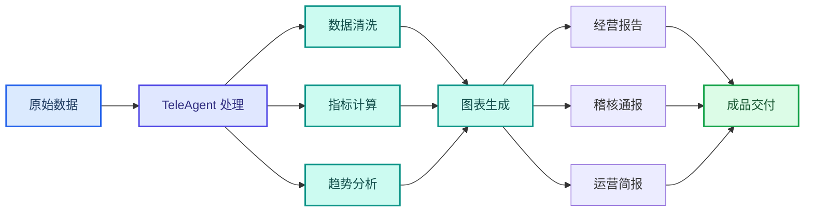

案例集

# 数据分析与经营分析

TeleAgent 实战蓝皮书 · 17 个案例 · 经营日报 · 三库分析 · 营销数据 · 稽核通报 · 运营简报

> 本章节汇集了 TeleAgent 在数据分析、经营报告、营销策划、经验萃取等数据场景的实战案例，覆盖上海电信、新疆电信、安徽电信、江西电信等多家单位的实践。

共 **17** 个案例，来自全国电信系统一线实践。

## 案例目录

| # | 案例名称 | 提供单位 | 来源 |
|---|---------|---------|------|
| 1 | 客经存量经营日报自动整理案例 | 上海电信/张磊 | 案例集第三期 |
| 2 | 三库（拆机 / 降档 / 提值）数据分析报告案例 | 上海电信/张磊 | 案例集第三期 |
| 3 | 营销活动方案策划 | 新疆电信客户经营中心 | 案例集第三期 |
| 4 | 营销活动数据分析报告 | 新疆电信客户经营中心 | 案例集第三期 |
| 5 | 政企客户三单营销商机挖掘 Skil | 盐城电信 | 案例集第三期 |
| 6 | 门店优秀营销经验智能萃取工具 | 西安电信商圈运营中心/余茜 | 案例集第三期 |
| 7 | 标准化智能配餐 | 安徽电信 淮南分公司 | 案例集第五期 |
| 8 | 数据分析师AI工作站 | 上海电信 客经中心/张磊 | 案例集第五期 |
| 9 | 经验深萃取三步法 | 陕西电信 西安分公司商圈运营中心/余茜 | 案例集第五期 |
| 10 | 短视频全流程AI赋能 | 江西电信 九江分公司全渠道电商运营中心 | 案例集第六期 |
| 11 | 直播智能复盘 | 江西电信 九江分公司全渠道电商运营中心 | 案例集第六期 |
| 12 | 运营数据智能分析简报 | 江西电信 九江分公司全渠道电商运营中心 | 案例集第六期 |
| 13 | 数据分析稽核通报 | 江苏电信 企信中心稽核班/张舸 | 案例集第四期 |
| 14 | 快速实现经营分析 | 上海电信 客经中心/汪舒曼 | 案例集第四期 |
| 15 | 初筛先进典型候选人 | 上海电信/何震渊 | 案例集第四期 |
| 16 | 职工成长发展赋能 | 中电信人工智能公司 工会 | 案例集第四期 |
| 17 | 多表格数据处理 | 中电信人工智能科技有限公司 各业务部门 | 案例集第一期 |

---

## 1. 客经存量经营日报自动整理案例

> **提供单位**：上海电信/张磊  
> **来源**：案例集第三期

### 案例背景

耗时久。AI 自动读取邮件附件多 Excel 表，提取各区核心指标，自动计算完
成率、排名，生成业务点评简报推送微信
1.设计标准化业务点评模板，绑定每日定时执行任务;

### 操作步骤

2.设置每周一至周五 20:30 自动读取日报邮件，AI 汇总多表格数据生成对
比简报并推送，直接用于经营复盘

### 效果亮点

一次性整合多份业务报表，自动计算环比、各区排名，自动生成标准化业务
分析话术，省去人工复制、计算、写点评全套重复工作

---

## 2. 三库（拆机 / 降档 / 提值）数据分析报告案例

> **提供单位**：上海电信/张磊  
> **来源**：案例集第三期

### 案例背景

上传特征 Excel 表，AI 自动关联资产、离网、提值各项指标，校验库设计合
理性，输出图文版分析 Word+HTML 双报告
· 搭建：搭建多维度交叉统计逻辑，设置提值 / 离网率量化评估标准，配套

### 操作步骤

双格式报告生成脚本。
· 使用：上传三库特征数据表，告知分析需求，AI 自动完成指标比对、逻辑
校验，生成完整评估报告。

### 效果亮点

多维度自动交叉统计，客观量化各特征转化、流失效果，同步输出两种格式
交付件，数据结论直观，减少人工透视表制作与逻辑校验工作量。

---

## 3. 营销活动方案策划

> **提供单位**：新疆电信客户经营中心  
> **来源**：案例集第三期

### 案例背景

一模板，上报审批效率低。依托 TeleAgent 搭建专属方案智能体，内置 8 大
标准章节与 23 项合规校验规则，输入活动需求即可输出标准化公文方案，自
动筛查违规内容，大幅缩短方案撰写与报审周期。
1.定义电信专属智能体角色，固化活动 8 大标准写作框架；配置宣传、终
端、续费三类合规校验规则；统一 Markdown 表格与公文标题排版模

### 操作步骤

板;
2.自然语言说明活动类型、目标客群、产品规则；AI 自动生成完整策划方案
并完成合规自检；人工微调少量个性化内容后直接用于内部审批。
内置全套电信营销合规审核机制，自动拦截极限违禁宣传词；方案章节标准

### 效果亮点

化，10 覆盖活动全流程要素，杜绝人工遗漏；统一公文格式适配多系统复
制，撰写时长由 2-3 天压缩至 2-3 小时，支持批量同步生成多套活动方案

---

## 4. 营销活动数据分析报告

> **提供单位**：新疆电信客户经营中心  
> **来源**：案例集第三期

### 案例背景

每月多份触点、事件营销原始报表分散，人工汇总派单、执行、接触转化数
据，环比计算、场景归因耗时 5 天，统计过程极易出现计算错误。借助
TeleAgent 实现数据全流程自动化，上传月度原始数据表自动分层汇总、标
注正负增长场景，输出标准化月度运营分析 Word 报告
1.配置派单 / 执行 / 接触率计算公式；设计分层汇总逻辑（总量 - 触点 - 场

### 操作步骤

景）；设置红绿区分正负拉动的报告排版模板;
2.上传当月全部营销明细 Excel；下达数据分析指令；AI 自动完成统计、环
比对比、场景归因，生成完整分析简报
自动完成多表格融合统计，无需人工复制透视表；自动识别增长 / 下滑场景

### 效果亮点

并标注原因；月度模板可复用，5 天人工统计工作缩短至 1 小时，数据计算
零人工误差

---

## 5. 政企客户三单营销商机挖掘 Skil

> **提供单位**：盐城电信  
> **来源**：案例集第三期

### 案例背景

盐城政企依靠装移机、故障、流量预警三类工单挖掘商机，传统人工梳理工
单耗时 30 分钟 / 单，商机识别零散、配套方案撰写繁琐。依托 TeleAgent
分三代迭代搭建商机挖掘技能：1.0 依托故障记录文本识别商机，2.0 支持
Excel 工单文件导入，3.0 升级星辰超级智能体，封装 1 类政企商机场景与
20 + 关键词规则，自动区分电信 / 客户侧故障、过滤无效工单，一键输出
标准化商机方案；政支、代维前后端协同流转商机，配套激励机制，累计产
出超 210 份商机文档，单份处理时长压缩至 3 分钟，精准挖掘机房、专线、
安全类增收商机
1.梳理政企 1 类核心增收商机，沉淀 20 余条工单关键词识别规则，搭建
商机判定逻辑；
2.1.0 版本：开发文本读取解析能力，基于故障文字识别商机并生成
Markdown 方案；
3.2.0 版本：新增 Excel 工单读取功能，优化文档排版，直接输出 Word 方
案；
4.3.0 超级智能体升级：封装完整技能包，支持一键导入复用，全程本地处

### 操作步骤

理保护客户敏感信息；
5.配置商机输出模板、前后端协同流转输出规则，完成内部测试后上线。
6.代维 / 运营收集故障工单、现场设备照片、客户网络问题记录；
7.将工单文本 / Excel 文件上传至星辰超级智能体，调用商机挖掘技能；
8.AI 自动过滤光缆等无效故障，识别客户侧网络类增收商机；
9.自动生成包含现状、方案、资费、回报的标准化商机 Word 文档；
10.商机同步至前后端协同群，客户经理跟进转化，完成商机登记结算激励
1.三代持续迭代，从文本处理升级为文件批量解析，操作门槛持续降低，技
能包可一键复用便于地市复制；
2.精准区分电信故障与客户网络短板，自动过滤无价值工单，商机挖掘精准
度大幅提升；
3.全流程自动化，商机梳理 + 方案撰写由 30 分钟缩短至 3 分钟，大幅减轻

### 效果亮点

政支人工作量；
4.数据本地离线存储，客户地址、联系方式等敏感信息不外流，满足信息安
全要求；
5.打通代维、政支前后端协同链路，配套标准化商机激励制度，形成工单挖
掘 - 方案输出 - 跟进转化完整营销闭环

---

## 6. 门店优秀营销经验智能萃取工具

> **提供单位**：西安电信商圈运营中心/余茜  
> **来源**：案例集第三期

### 案例背景

复制推广。输入一线完整营销过程描述，AI 自动拆解业务链路、客户画像、
标准话术、转化逻辑，输出可直接全员复用标准化营销案例。
1.内置电信门店营销业务知识库，搭建案例拆解、话术提炼模板；

### 操作步骤

2.录入完整成交场景、沟通细节，智能拆解全流程动作，生成标准化推广案
例、分层销售话术
贴合电信线下门店业务，自动提炼可复制标准化打法；完整拆解「培训 - 店

### 效果亮点

长推动 - 店员触达 - 到店转化」营销闭环，配套标准推介话术，快速沉淀销
冠经验供全门店复用，降低新人上手难度

---

## 7. 标准化智能配餐

> **提供单位**：安徽电信 淮南分公司  
> **来源**：案例集第五期

### 案例背景

自动复盘。配餐时间从15分钟/单压降至2-3分钟/单，配餐精确度从65%提升
至95%，上门成功率从23%提升至61%，转化成功率从14%提升至62%，原2
名专职配餐员转为销售人员，充实一线销售力量。
1. 打开TeleAgent，进入技能广场，搜索并导入"标准化智能配餐"技能；
2. 将本网客户信息文件和外网客户画像数据上传至知识库；
3. 输入指令："请根据客户画像数据，为当日待配餐客户生成个性化配餐方
案"；
4. 智能体自动分析客户信息，从产品库中匹配最优套餐组合，生成千人千面

### 操作步骤

配餐方案；
5. 将外呼录音和上门录音文件放入指定文件夹，输入指令："请全量复盘录
音，检查邀约话术执行和上门五步法规范"；
6. 智能体自动分析海量录音，识别执行偏差，输出分析报告和纠偏建议；
7. 人工审核配餐方案和复盘报告，据此辅导一线人员改进。
1. 配餐效率质变：配餐时间从15分钟/单压降至2-3分钟/单，2名配餐员转为
销售人员，充实一线销售力量；
2. 精准度跃升：配餐精确度从65%提升至95%，千人千面匹配客户需求；

### 效果亮点

3. 点检全覆盖：录音点检从20%抽检提升至10%全量覆盖，消除盲区；
4. 转化率突破：上门成功率23%→61%，转化成功率14%→62%，实现倍数
级增长；
5. "三喂"模式创新：一喂政策、二喂话术、三喂视图，投喂式赋能一线。

---

## 8. 数据分析师AI工作站

> **提供单位**：上海电信 客经中心/张磊  
> **来源**：案例集第五期

### 案例背景

数需求，基于TeleAgent构建"数据分析师个人AI工作站"。通过六步法（宽
表固化、知识库学习、本地化数据、经验沉淀、AI自驱出报告、远程打通），
实现简单问数由业务直接问AI、分析报告从1周缩短至10分钟、远程问数零门
槛。重复性工作减少50%，开发效率翻倍。
1. 将常关注的指标和特征做成宽表，在数据库中每日/月自动更新；
2. 将数据字典（中英文名、口径、格式、样例）导入TeleAgent知识库，输
入指令："学习数据字典"；
3. 将脱敏汇总数据导出本地，量大的导入MySQL供智能体查询；

### 操作步骤

4. 汇聚专家经验，输入指令："将这些客户经营经验沉淀为Skil"；
5. 日 常 使 用 时 ， 输 入 自 然 语 言 指 令 如 " 请 生 成 X 客 户 群 的 经 营 分 析 报 告"，
智能体自动取数、分析、输出报告；
6. 通过飞书/微信接入TeleAgent，领导临时要数时直接对话获取，实现远程
问数。
1. AI自驱出报告：分析报告从1周以上缩短至10分钟，只要数据完备即可秒级
输出；
2. 经验沉淀为组织资产：将个人经验沉淀为可复用的"客户经营Skil"，从
"重复造轮子"到"持续增值"；
3. 远程问数零门槛：通过飞书/微信接入，领导在外也能直接问AI获取数据，

### 效果亮点

随时响应；
4. 重复问数减半：简单问数由业务直接问AI，不再依赖数据分析师重复开发
找数；
5. 开发效率翻倍：宽表+持续投喂使AI越来越懂客户经营，甚至能先一步想到
洞察方向。

---

## 9. 经验深萃取三步法

> **提供单位**：陕西电信 西安分公司商圈运营中心/余茜  
> **来源**：案例集第五期

### 案例背景

步结构化（可复制），一线口述几句话自动生成标准四模块案例，1-2天缩短
至10分钟；第二步视觉化（可传播），从多页文档变一张卡片，传播力翻十
倍；第三步故事化（可打动人），从背套餐参数到讲故事+话术结合，客户从
无感到点头。6月整月单移合约7个，7月半月升至38个，高值占比60.5%。
1. 打开TeleAgent，进入技能广场，搜索并导入"经验深萃取"相关技能；
2. 收集一线员工口述素材（微信聊天、电话回忆等），输入指令："请将这
段一线经验进行结构化萃取，生成标准四模块案例"；
3. 智能体自动输出包含营销过程概述、场景还原与动作拆解、标准话术参考、
总结的标准化案例；

### 操作步骤

4. 输入指令："请将结构化案例视觉化，生成一张可传播的卡片"；
5. 智能体自动生成视觉化卡片，从多页文档变成一张图，便于在群内传播分
享；
6. 输入指令："请将经验素材故事化，挖掘打动客户的成交故事，输出话术
脚本和可复制动作清单"；
7. 智能体输出故事素材库、话术化脚本、话术速查表和可复制动作清单；
8. 人工审核并组织一线培训推广。
1. 萃取效率质变：1-2天缩短至10分钟，一线口述几句话即生成标准四模块案
例；
2. 传播力跃升：从多页文档没人看，变一张卡片人传，传播力翻十倍；
3. 成 交 方 式 升 级 ： 从 " 背 套 餐 参 数 客 户 无 感 " 到 " 讲 故 事 +话 术 客 户 点 头"，

### 效果亮点

讲故事的成交率远超背套餐；
4. 业绩显著提升：6月单移合约7个→7月半月38个，高值占比60.5%，形成
标杆效应；
5. 组织资产沉淀：将一线经验从"人脑子里的手感"变为"全省可复制的组
织资产"。
2、软件开发辅助案例
适用场景：企业级应用开发 | 数字化平台搭建

---

## 10. 短视频全流程AI赋能

> **提供单位**：江西电信 九江分公司全渠道电商运营中心  
> **来源**：案例集第六期

### 操作步骤

九江电信全渠道电商运营中心20人运营团队负责109家门店，短视频制作
是日常高频工作。过去运营人员先写通用脚本，再根据各门店情况反复调
整，门店拍回素材后还需人工剪辑、成片质量检查，效率低且标准不统
一。团队基于TeleAgent开发短视频全流程技能包，从脚本撰写、视频剪
辑、内容质检到企微推送点评，覆盖短视频从策划到成片的全链条，累计
输出短视频脚本80多份。
1. 打开TeleAgent，将活动规则、产品信息和门店要求输入，输入指令：
"请根据以下活动资料，为门店生成短视频脚本，包含台词、镜头顺序和
拍摄提示"；
2. 智能体自动梳理出短视频台词、镜头顺序和拍摄提示，门店拿到可直接
照着拍的脚本；
3. 门店拍回素材后，将素材上传至TeleAgent，输入指令："请按脚本要
求完成视频剪辑"；
4. 智能体调用剪辑工具处理素材，生成片；
5. 视频发布后，输入指令："请检查视频中的产品信息是否准确、画面和
话术有无需要优化的地方"；
6. 智能体自动完成内容质量检查，并通过企业微信推送点评，帮助门店及
时调整。
1. 全链条覆盖：从脚本撰写到视频剪辑、内容质检、企微推送点评，一个
技能包承包短视频从策划到成片的多个环节；

### 效果亮点

2. 规模化输出：累计输出短视频脚本80多份，覆盖百余家门店；
3. AI教练模式：门店需要拍什么、怎么拍、成片还可以怎样优化，都有了
一个随时可以调用的"AI教练"；
4. 技能沿业务链延伸：一个最初只想解决脚本撰写问题的技能，沿着实际
工作流程继续向后延伸，最终实现全流程自动化。

---

## 11. 直播智能复盘

> **提供单位**：江西电信 九江分公司全渠道电商运营中心  
> **来源**：案例集第六期

### 案例背景

录、手动整理耗时耗力。团队基于TeleAgent开发直播复盘技能，将直播
录像和运营数据一起交给AI，自动为每家门店整理复盘结果，包括直播表
现、优势亮点、存在问题及下场调整方向，10家门店结果还可横向对比。
1. 直播结束后，将10家门店的直播录像和后台运营数据一起上传至
TeleAgent；
2. 输入指令："请读取后台数据并回看直播内容，为每家门店整理一份复
盘结果，包括直播表现、做得好的地方、存在的问题和下一场的调整方
向"；

### 操作步骤

3. 智能体自动读取后台数据并回看直播录像，为每家门店生成单独一页的
复盘结果；
4. 智能体将10家门店的复盘结果横向对比，汇总出哪家直播整体表现更
好、各自优势和短板在哪里；
5. 运营人员直接查看复盘报告，聚焦需要关注的问题，开始下一场直播的
优化。
1. 录像+数据双维复盘：不只看后台数字，还将直播录像重新回看，让一
次直播留下的不只是数据，也成为下一场可直接参考的经验；
2. 单店+横向对比双视角：每家门店有单独一页复盘，同时10家门店结果
放在一起比较，优势短板一目了然；
3. 从人工逐场回看到AI自动复盘：过去靠运营人员逐场回看、手动记录整
理，现在TeleAgent自动完成全部分析；
4. 闭环优化：复盘结果直接给出下一场的调整方向，形成"直播→复盘→
优化"完整闭环。

---

## 12. 运营数据智能分析简报

> **提供单位**：江西电信 九江分公司全渠道电商运营中心  
> **来源**：案例集第六期

### 案例背景

九江电信全渠道电商运营中心需持续跟进109家门店运营情况，哪些门店
表现突出、哪些指标波动、业务机会有没有及时跟进，这些信息分散在多
张表格里。运营人员过去需一到两天手动汇总、找异常、写分析。团队基
于TeleAgent开发运营数据分析技能，读取表格后自动汇总门店指标、比
较前后变化、找出值得关注的成员，按团队日常使用的结构形成运营简报

### 操作步骤

和月度报告。
1. 将门店周度运营数据表格上传至TeleAgent；
2. 输入指令："请读取以下运营数据，汇总各门店指标，比较前后变化，
找出表现突出和需要关注的门店，形成运营简报"；
3. 智能体自动汇总门店指标、比较前后变化，找出值得关注的成员，按团
队日常使用的结构形成运营简报；
4. 月度复盘时，将不同周期、不同业务的数据一起上传，输入指令："请
将不同周期和业务的数据放在一起分析，形成包含整体表现、变化趋势和
后续建议的月度报告"；
5. 智能体生成月度报告，运营人员直接集中到需要关注的地方开始判断和
处理。
1. 报告产出提速：运营分析从一到两天缩短至约30分钟形成初稿，省下的
不只是整理表格的时间；
2. 异常自动定位：哪些门店表现靠前、哪些指标发生明显变化、可能存在

### 效果亮点

哪些问题，都被自动列举出来；
3. 周度+月度双周期：同一方法可复用于周度简报和月度复盘，不同周期
数据联动分析；
4. 早发现早行动：让运营人员更早看到问题，把精力放在后续行动上而非
数据整理上。

---

## 13. 数据分析稽核通报

> **提供单位**：江苏电信 企信中心稽核班/张舸  
> **来源**：案例集第四期

### 案例背景

件和量子密信群通知。传统流程人工操作环节多、耗时长。利用TeleAgent将
全流程封装为技能，通过定时任务自动完成数据采集、统计分析、报表生成、
智能点评和分级推送，全流程10分钟搞定。
1. 首次使用时，向TeleAgent提供邮箱授权码和各单元联系人邮箱地址CSV文

### 操作步骤

件；
2. 在量子密信群中添加群机器人，获取webhok地址并交给智能体；
3. 输入指令："每周四上午9点，去邮件系统中把X的邮件附件作为原始数据，
参考6月份的通报生成最新日期的报表，待稽核工单大于10户的标红色，其余
标黄色"；
4. 输入指令："总结中要求结合当前日期点评稽核完成情况，对比上期通报生
成点评"；
5. 输入指令："给未完成单元的稽核管理员发邮件，完成率较低的单元抄送单
元领导，生成邮件简报并发送；同时在量子密信群推送通报，@未完成单元
的管理员"；
6. 将以上工作流程生成为固定skil，设置定期触发：每周四上午9点自动执行；
7. 人工检查确认报表和推送内容，必要时修正。

### 效果亮点

全流程自动化，数据采集到分级推送10分钟完成；智能点评结合当前日期自
动调整话术，区分月初和月底不同侧重点；双渠道推送（OA邮件+量子密信
群），低完成率单元自动抄送领导；工作流程封装为skil+定时任务，无需人
工干预自动执行。

---

## 14. 快速实现经营分析

> **提供单位**：上海电信 客经中心/汪舒曼  
> **来源**：案例集第四期

### 案例背景

客经中心需定期对宽带拆机等业务数据进行多维度经营分析，传统方式人工
写SQL、做图表耗时耗力。上海电信利用TeleAgent，通过数据导入+提示词
框架，让AI自动完成多维度分析和可视化报告生成，并固化skil实现每月一键
出报告。
1. 整理分析维度和所需数据字段，导出1至2张宽表到本地；
2. 数据量大于30万行时，让TeleAgent协助安装本机数据库并导入数据；
3. 导入时说清表的业务含义和字段说明；

### 操作步骤

4. 编写分析提示词，给出大框架脉络（如拆机规模概览、分套餐类型、分区
局情况、拆机用户深入分析8个子维度、总结与建议），并激发AI能动性："
从数据中思考其它我想不到的维度"；
5. 输入指令执行分析，智能体自动完成多维度统计和可视化图表生成；
6. 人工审校分析结果，修正问题后将工作流固化为skil，每月一键出报告。
数据导入+提示词框架，AI自动完成多维度经营分析；提示词设计要点：给大

### 效果亮点

框架+激发AI能动性，输出有深度有灵魂的分析而非业务通报；人工审校后固
化skil，每月一键出报告，分析效率大幅提升。

---

## 15. 初筛先进典型候选人

> **提供单位**：上海电信/何震渊  
> **来源**：案例集第四期

### 案例背景

耗时久、评分标准难统一易出现误差。利用TeleAgent智能秒级筛查，多维度
自动核验并生成推荐理由，有效提升评审效率和公平性。
1. 打开TeleAgent，将候选人材料和评选标准上传至对话框；
2. 输入指令："根据以下评选标准，对候选人材料进行多维度核验，自动比

### 操作步骤

对评选条件，生成推荐理由和评分建议"；
3. 智能体自动解析候选人材料，逐项比对评选条件，输出核验结果和推荐理
由；
4. 人工审核筛选结果，确认评审公平性。
先 进 评 选 从 人 工 逐 一 审 核 到 AI秒 级 筛 查 ； 多 维 度 自 动 核 验 ， 评 分 标 准 统 一；

### 效果亮点

自动生成推荐理由，提升评审效率和公平性。

---

## 16. 职工成长发展赋能

> **提供单位**：中电信人工智能公司 工会  
> **来源**：案例集第四期

### 案例背景

人发展路径模糊，评审效率低下，政策宣贯困难。利用TeleAgent实现本地文
件深度学习、自然语言问答、评审条件自动比对，一键生成荣誉体系自助查
询网页应用，职工即问即答、零学习成本，评审从天级缩短至分钟级。
1. 将荣誉体系相关政策文件导入TeleAgent，输入指令："自动拆解条款结
构、条件阈值与评审标准"；
2. 输入指令："以自然语言回答职工关于可参评项目、需满足条件、申报时
间节点的咨询"；

### 操作步骤

3. 输入指令："对申报材料自动比对评审条件，核验是否符合评选标准，输
出比对结果"；
4. 输入指令："一键生成荣誉体系自助查询网页应用，支持职工随时随地查
询可参评项目与申报条件"；
5. 人工审核评审比对结果，确认条件核验准确性。
评审条件自动比对，从天级缩短至分钟级；一键生成荣誉体系自助查询网页

### 效果亮点

应用，职工零学习成本；自然语言问答替代逐文件翻阅；AI基于个人晋升情
况反哺规则优化建议。

---

## 17. 多表格数据处理

> **提供单位**：中电信人工智能科技有限公司 各业务部门  
> **来源**：案例集第一期

### 案例背景

制汇总并核查，人工对齐易出错、汇总效率低。通过超级智能体，多份Excel
自动识别列名、统一格式、一键合并校验。
1.
将多份Excel文件拖入对话框；
2.
输入指令："将文件夹下的文件按照统一字段结构合并到一份总汇总表

### 操作步骤

中，确保字段顺序统一、数据格式一致"；
3.
智能体自动识别各表列名，统一字段格式；
4.
一键合并校验，生成汇总表；
5.
核对数据完整性和准确性。

### 效果亮点

多份Excel自动识别列名、统一格式、一键合并校验，告别人工逐表复制汇总
10第
页
的重复劳动，数据格式零差错。
星辰超级智能体案例集·重庆0624

---

[← 返回案例总览](./)
