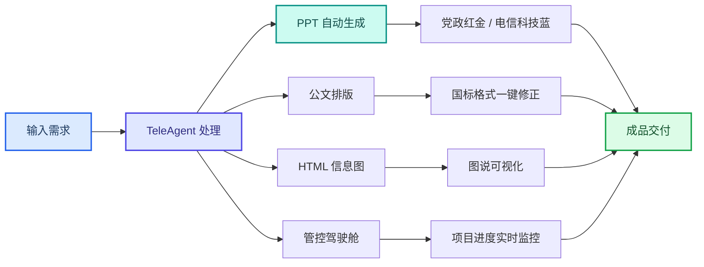

案例集

# 办公文档与PPT制作

TeleAgent 实战蓝皮书 · 30 个案例 · PPT 生成 · 公文写作 · 文档排版 · 信息图 · 项目管控

> 本章节汇集了 TeleAgent 在PPT生成、公文写作、文档排版、信息图制作、党建政务等办公场景的实战案例，覆盖全国20余家省市电信公司的实践。

共 **30** 个案例，来自全国电信系统一线实践。

## 案例目录

| # | 案例名称 | 提供单位 | 来源 |
|---|---------|---------|------|
| 1 | 党政/业务 PT 自动生成案例 | 上海电信/张磊 | 案例集第三期 |
| 2 | 分公司活动执行情况通报 | 新疆电信客户经营中心 | 案例集第三期 |
| 3 | 随时随地指挥电脑远程干活 | 新疆电信客户经营中心 | 案例集第三期 |
| 4 | 张杨路营业厅 TeleAgent 智能排班应用案例 | 西安电信张杨路营业厅 | 案例集第三期 |
| 5 | 代理商发票图片批量智能重命名 | 西安电信商圈运营中心/余茜 | 案例集第三期 |
| 6 | 写啦公文仿写 | 陕西电信/黄莹 | 案例集第三期 |
| 7 | 跨文件模糊关键词检索 | 陕西电信/黄莹 | 案例集第三期 |
| 8 | 考啦线上考试 | 陕西电信/黄老师 | 案例集第三期 |
| 9 | 培训计划智能分析 | 贵州电信 人力资源部/郑耀波 | 案例集第七期 |
| 10 | 培训师百宝箱—课堂互动工具 | 天翼物联 人力资源部/叶双 | 案例集第七期 |
| 11 | 案例推广材料制作 | 国际公司 法律合规部 | 案例集第七期 |
| 12 | 周总结PT自动生成与推送 | 重庆电信 /胡然 | 案例集第六期 |
| 13 | 解决方案PT智能制作 | 重庆电信 /胡然 | 案例集第六期 |
| 14 | 4A资源上线小助手 | 江苏电信 数A中心/姜好 | 案例集第四期 |
| 15 | PT十分钟出成品 | 上海电信/何震渊 | 案例集第四期 |
| 16 | 校园综合服务助手 | 深圳电信 | 校园场景案例集 |
| 17 | 体育场馆预约助手 | 深圳电信 | 校园场景案例集 |
| 18 | 课件闪卡制造机 | 深圳电信 | 校园场景案例集 |
| 19 | 党建责任制考核-批量生成考核通报 | 中电信人工智能科技有限公司 党群工作部 | 案例集第一期 |
| 20 | 发展党员工作-学员信息表报送 | 中电信人工智能科技有限公司 党群工作部 | 案例集第一期 |
| 21 | 党费使用管理-合规核查 | 中电信人工智能科技有限公司 党群工作部 | 案例集第一期 |
| 22 | 党务工作规范化-"三报三批"工作指引 | 中电信人工智能科技有限公司 党群工作部 | 案例集第一期 |
| 23 | 建立个性化知识库-每日更新党建资讯 | 中电信人工智能科技有限公司 党群工作部 | 案例集第一期 |
| 24 | 打造自主学习工具-政绩观学习教育解疑答惑工具 | 中电信人工智能科技有限公司 党群工作部 | 案例集第一期 |
| 25 | 各类党建公文写作-全流程覆盖 | 中电信人工智能科技有限公司 党群工作部 | 案例集第一期 |
| 26 | 国标公文排版-一键生成/修正党政机关公文格式文档 | 河北电信 /卢致远 | 案例集第二期 |
| 27 | 全场景政企营销 Skil 矩阵落地应用 | 广东电信 政企部/徐鑫 | 案例集第二期 |
| 28 | 图说 -HTML 信息图生成技能应用案例 | 云南电信 | 案例集第二期 |
| 29 | 项目管控驾驶舱 -HTML 项目管控技能应用案例 | 云南电信 | 案例集第二期 |
| 30 | 战略解码-战略拆解落地执行技能应用案例 | 云南电信 | 案例集第二期 |

---

## 1. 党政/业务 PT 自动生成案例

> **提供单位**：上海电信/张磊  
> **来源**：案例集第三期

### 案例背景

主题与风格要求，AI 自动检索权威素材，按规范逻辑生成完整 PT，支持党
政红金、电信科技多种版式

### 效果亮点

描述 PT 主题、页数、风格，AI 自动搜集素材、分章节排版生成完整演示文
稿
自动调取官方权威资料，规避不实内容，标准化模板一键出稿，数小时 PT
制作压缩至几分钟，支持党政、业务多场景风格切换

---

## 2. 分公司活动执行情况通报

> **提供单位**：新疆电信客户经营中心  
> **来源**：案例集第三期

### 案例背景

每月需制作全疆各分营销指标通报 PT，人工汇总排名、制作图表、排版调
整耗时 1-3 天，版式不统一、高低分档标注繁琐。使用 TeleAgent 读取经营
数据，自动完成分档排名、环比计算，一键生成电信红蓝规范通报幻灯片，
包含排名、亮点短板完整模块
1.设定执行率三档划分标准；定义 PT 六页标准化结构；配置电信科技蓝

### 操作步骤

+ 红色预警固定配色规则;
2.上传各分公司指标数据表；下发 PT 生成指令；AI 自动汇总排名、制作
对比图表，输出完整汇报 PT
自动区分执行高低档位，红绿直观展示环比增减；固定标准化汇报结构，每

### 效果亮点

月直接复用模板；PT 制作时长从 3 天压缩至 2 小时，统一版式无需手动调
图排版

---

## 3. 随时随地指挥电脑远程干活

> **提供单位**：新疆电信客户经营中心  
> **来源**：案例集第三期

### 案例背景

看。绑定微信 ClawBot 后，通过手机文字指令远程访问电脑目录、调取文
件、自动生成文档摘要，随时随地获取办公资料。

### 效果亮点

1.打通微信与本地文件系统交互通道；配置文件读取、摘要生成脚本；设置
访问权限管控规则;
2.微信发送查看目录、调取文件指令；AI 检索对应文档并生成精简摘要，推
送至手机端
无需第三方远程桌面软件，微信移动端轻量化操控；支持文档自动提炼核心
内容，外出办公无需携带电脑，快速获取业务资料

---

## 4. 张杨路营业厅 TeleAgent 智能排班应用案例

> **提供单位**：西安电信张杨路营业厅  
> **来源**：案例集第三期

### 案例背景

在岗人数不达标，员工临时请假需全盘重排，调整成本极高。依托
TeleAgent 搭载 OR-Tols 求解引擎，导入人员班次模板自动建模，一键生
成合规月排班表，支持自然语言调整请假、换班，自动校验全部约束条件，
实现排班智能化
1.梳理营业厅全部岗位、人员、7 大类排班约束规则，搭建标准化 Excel 排
班模板；
2.接入 OR-Tols 约束求解引擎，配置人数、连休、班次顺序、特殊休假等
校验逻辑；
3.开发自然语言交互解析能力，支持临时调班、月度重排指令；

### 操作步骤

4.配置排班导出、调整说明生成功能，完成场景测试上线。
5.上传人员班次 Excel 模板，下发月度排班生成指令；
6.AI 自动建模求解，输出完整合规排班表并校验全部规则；
7.遇员工请假、班次调整，直接文字描述需求，系统自动重算并输出变更说
明；
8.导出排班表下发班组，出现疑问可查看每条排班分配依据
1.效率大幅提升，月度排班由 2-3 天缩短至 20 分钟内，临时调班秒级完
成；
2.7 项排班规则全自动校验，彻底杜绝班次、在岗人数违规问题；

### 效果亮点

3.算法均衡分配 A/C 班次，解决人工排班劳逸不均问题；
4.自然语言轻量化操作，无需复杂修改表格，突发请假灵活迭代；
5.每一条排班均可追溯分配理由，管理有据可依；
6.拓展空间充足，后续可对接客流、考勤、跨厅人员调拨等场景持续优化。

---

## 5. 代理商发票图片批量智能重命名

> **提供单位**：西安电信商圈运营中心/余茜  
> **来源**：案例集第三期

### 案例背景

不统一，归档检索困难。依托 TeleAgent 实现票据图片智能识别，按「网点
编码 + 网点名称」统一规则自动批量改名，大幅减少人工整理时长。
1.配置发票 OCR 文字识别规则，设定标准化文件命名模板；

### 操作步骤

2.批量上传票据图片下发重命名指令，AI 读取网点编码、门店名称自动改
名，人工少量校对修正即可归档

### 效果亮点

全自动批量处理，票据整理时长由半天缩短至 30 分钟；统一命名规范，便于
后续文件检索存档，减轻内勤重复整理工作

---

## 6. 写啦公文仿写

> **提供单位**：陕西电信/黄莹  
> **来源**：案例集第三期

### 案例背景

基层支局日常需要撰写管理办法、工作通知、内部制度等公文，传统 AI 写作
容易出现风格漂移、内容随意扩充、措辞过度拔高三大问题，一份文件反复
修改 8 轮才能定稿，校对成本极高。依托 TeleAgent 内置写啦公文仿写技
能，创新 "双清单前置校验工作流"，先输出风格、内容正反四份清单确认
再生成文稿，通过 8 项负面、8 项正面约束框定写作边界，公文修改迭代量
大幅降低，适配各类参照式公文撰写场景

### 操作步骤

1.前置素材上传：上传同类型标准参照公文，同步录音 / 文字提供本次公文
核心写作要点；
2.自动生成校验清单：AI 输出风格肯定、风格否定、内容涉及、内容不涉及
四份清单；
3.人工核对确认清单，划定写作约束范围；
4.系统按照确认框架生成完整公文初稿；
5.执行双清单自动复核（8 项负面排除 + 8 项正面标准核对）；
6.少量微调即可定稿，整体仅需 1-2 轮修改
创新双清单前置管控模式，彻底解决 AI 公文风格跑偏、内容乱扩充、书面措

### 效果亮点

辞过度升级三大痛点；公文修改轮次从 8 轮压缩至 1-2 轮，节约 80% 沟通
校对时间，公文风格、内容范围实现标准化可控；工作流程可复用，所有参
照仿写类通知、制度、管理文件均可套用该方法，落地门槛低、通用性强

---

## 7. 跨文件模糊关键词检索

> **提供单位**：陕西电信/黄莹  
> **来源**：案例集第三期

### 案例背景

放位置。依托 TeleAgent 多文件提取、OCR 识图、表格生成技能，仅说明
检索文件夹、关键词、输出模板，系统自动遍历全部文件模糊匹配门店名
称，整合多套视图编码，还能识别审批截图信息填入表格，3-5 分钟输出标
准化汇总表，实现全量无遗漏检索
1.向 AI 下达指令，明确检索文件夹、目标关键词、输出参考表格模板；
2.系统自动遍历文件夹内所有 xlsx、csv 文件，模糊匹配门店名称，关联提

### 操作步骤

取视图编码；
3.多源数据交叉校验，汇总同一门店全部编码信息；
4.上传审批截图，通过 OCR 识别开关厅信息自动填入表格；
5.按照指定模板一键生成完整汇总 Excel 文件
无需人工逐个打开查阅多份数据表，自动适配不同文件名、字段名、文件编

### 效果亮点

码，模糊匹配同名不同标注门店；单次查询节省 1.5 小时人工作量，检索
无遗漏；新人无需依赖老员工即可独立完成数据核查，同时支持图片文字识
别联动填表，数据汇总标准化，大幅降低渠道数据检索维护成本

---

## 8. 考啦线上考试

> **提供单位**：陕西电信/黄老师  
> **来源**：案例集第三期

### 案例背景

企业内训组织考核传统流程繁琐：人工翻阅课件出题需 2-3 小时，线上考试
页面依赖 IT 开发、周期长达 1-2 周；成绩 Excel 无防篡改机制，还存在同名
学员、断网无法考试等问题。依托 TeleAgent「考啦线上考试」技能，上传
培训课件即可全自动完成出题、离线考试页面生成、成绩三重防篡改校验、
自动统计汇总整套流程，内训师无需代码开发能力，断网环境也能正常开展
考核
1.上传培训 PDF 课件，下达出题指令，AI 自动生成单选、多选、判断三类
试题并配套答案解析；
2.生成可离线运行 HTML 考试页面与试题审核 Word 文档；

### 操作步骤

3.迭代优化功能：增加手机号登录区分同名人员、搭建 HMAC 三重防篡改
校验机制、设置自由填写部门栏；
4.下发离线考试文件给学员，答题后自动导出带签名成绩表；
5.将成绩文件拖入汇总工具，自动校验真伪、完成分数统计并输出报表
1.全流程自动化，省去人工出题、定制页面、手动汇总多道工序，节省 2-3
小时出题工时与 1-2 周开发等待周期；
2.纯离线 HTML 文件双击即可使用，无网络也能正常考试；
3.搭载三层防篡改校验，修改成绩可被系统识别，解决数据造假隐患；
4.零代码门槛，普通培训师仅通过自然语言提需求就能搭建完整线上考核体
系，支持学员同名区分、部门信息自定义

---

## 9. 培训计划智能分析

> **提供单位**：贵州电信 人力资源部/郑耀波  
> **来源**：案例集第七期

### 案例背景

对比，至少需要1天。基于TeleAgent批量解析十文十表（9份PDF通知
+13份Excel计划），自动交叉分析，生成覆盖矩阵、缺失清单和评价
建议，全程仅需20分钟，经5版迭代从全量123个项目精准到47个核心
项目。
1. 将9份PDF通知和13份Excel计划表上传至TeleAgent，分步喂入而非
一句话搞定；
2. 输入指令："请先全景扫描所有培训计划，统计各分公司项目总数、
专业分布、覆盖情况"；
3. 智能体批量解析文件，自动交叉分析，生成覆盖矩阵和缺失清单；

### 操作步骤

4. 输入指令："请对标省公司要求，逐项检查各地市是否承接落地，输
出评价建议"；
5. 智能体从全量123个项目精准筛选到47个核心项目，生成结构化分析
报告；
6. 人工负责判断方向和审核结果，经5版迭代优化，最终输出完整分析
报告。
1. 效率质变：从至少1天缩短至20分钟，覆盖矩阵+缺失清单+评价建
议一键生成；

### 效果亮点

2. 零基础AI实践：非IT出身、非技术岗的人力资源管理人员，边学边用
完成复杂分析任务；
3. 分步喂入策略：十文十表分步输入而非一次性投喂，先全景扫描再精
准对标，逐步聚焦；
4. 人机分工明确：人负责判断方向、审核结果，智能体负责执行和交叉
分析。

---

## 10. 培训师百宝箱—课堂互动工具

> **提供单位**：天翼物联 人力资源部/叶双  
> **来源**：案例集第七期

### 案例背景

架技能广场，以单个HTML文件打通课堂互动全流程，覆盖随机抽签、
随机分组、课堂抽奖、倒计时器、积分板、课堂投票、课程提示卡、破
冰话题、白板工具、数字人等10大工具，零安装零登录，浏览器直接打
开即用。
1. 在TeleAgent中从自身真实教学痛点出发，确认课堂互动工具分散、
准备耗时等问题值得解决；
2. 搭建最小可用版本，先用一个HTML文件覆盖随机抽签、倒计时等核
心功能；

### 操作步骤

3. 在真实课堂中反复使用，根据讲师和学员反馈持续优化交互体验；
4. 逐步扩展至10大工具，覆盖课前准备→破冰暖场→分组互动→练习
限时→竞赛激励→总结收尾全流程；
5. 将经验封装为可复用技能，上架TeleAgent技能广场，让更多内训师
和班主任开箱即用。
1. 打开即用：零安装零登录零内网，单HTML文件浏览器直接打开，纯
前端运行不保存历史；

### 效果亮点

2. 10大工具全覆盖：随机抽签/分组/抽奖/倒计时/积分板/投票/提示卡
/破冰话题/白板/数字人，打通课堂全流程；
3. 全屏投影适配：六个工具支持全屏展示，适合大屏投影场景，一键全
屏；
4. 双格式下载：视觉结果类导出PNG高清截图，名单分组类导出Excel
数据表，结果可留痕。
二、法律专业应用案例
适用场景：合同审核 | 诉讼代理 | 以案促管 | 待办管理 | 纠纷管理 | 制度审核 | 跨境合规 | 推广
制作

---

## 11. 案例推广材料制作

> **提供单位**：国际公司 法律合规部  
> **来源**：案例集第七期

### 案例背景

势，缺乏专业设计工具技能，PT制作耗时且视觉风格统一性难以保
证。挑战一个下午完成一份案例推广材料，用这份PT本身作为自证明
案例：从素材收集、内容结构、视觉设计到代码编译，全程由
TeleAgent与法务人员协作完成，形成"用产品证明产品"的闭环。
1. 多轮对话收集案例素材：案例背景与痛点、实施过程细节、产出物与
效果、参考其他案例材料结构；
2. 规划PT结构与页面：18页精简篇幅、5个案例三段式、目录导航与
页码、截图占位设计；
3. 设计主题与视觉体系：科技蓝色调方案、圆角卡片式布局、统一字体
/间距/阴影；

### 操作步骤

4. 代码编译与迭代调整：Node.js编译生成.ptx，使用PptxGenJS代
码生成，局部编辑而非全量覆盖，保留用户手动修改内容，多轮打磨至
满意。
1. 对话式协作：16次深度对话从素材收集到视觉打磨，贯穿全流程，
法务人员只需对话无需设计技能；
2. 代码级精度：PptxGenJS精确排版，非手动拖拽，3个大版本迭代至

### 效果亮点

18页定稿；
3. 局部迭代保留修改：局部编辑而非全量覆盖，保留用户手动修改内
容；
4. 用产品证明产品：从推广需求到输出物形式，从内容规划到视觉设
计，从代码编译到迭代打磨，全程TeleAgent作品。
三、软件开发辅助案例
适用场景：项目全流程管理 | 问题调度 | 风险预警 | 领导看板

---

## 12. 周总结PT自动生成与推送

> **提供单位**：重庆电信 /胡然  
> **来源**：案例集第六期

### 案例背景

左右分栏。原有痛点包括每周手动整理Excel数据耗时易错、PT排版重复
劳动、截图推送操作繁琐。基于TeleAgent实现Excel数据→PT转换→截
图→企微+微信推送一条龙，每周五16:0自动执行。
1. 将周总结Excel数据上传至TeleAgent，输入指令："请读取Excel数
据，生成PT左右分栏布局，左侧表格右侧分析"；
2. 智能体读取Excel业务数据，生成左右分栏PT，左表格右分析；
3. 输入指令："记一下，以后周总结PT按这个格式生成，推送格式用
Markdown"；
4. 智能体将推送格式规范写入长期记忆，跨会话不丢失；
5. 输入指令："以后每周五16:0自动执行周总结生成并推送企微和微
信"；
6. 智能体配置定时任务，自动完成Excel读取→PT生成→截图→企微
Webhok推送+微信Server酱推送。
1. 全流程自动化：Excel数据→PT转换→截图→企微+微信推送一条龙，
每周五16:0自动执行；

### 效果亮点

2. 记忆沉淀："记一下"指令将推送格式规范写入长期记忆，跨会话不丢
失，每次自动遵循；
3. 模板复用：PT布局模板固化（左右分栏），推送格式模板固化
（Markdown），支持迭代优化；
4. 多渠道推送：企微Webhok+微信Server酱双通道，工作群和个人实
时掌握动态。

---

## 13. 解决方案PT智能制作

> **提供单位**：重庆电信 /胡然  
> **来源**：案例集第六期

### 案例背景

TeleAgent实现Excel报价表解析→功能清单提取→对比图表生成→分场景
PT制作→多版本迭代全流程。最终产出含拓扑图、平面布点图、设备清
单的15MB级图文并茂方案PT，并按汇报对象定制两份风格迥异的
PT。
1. 将项目Excel报价表上传至TeleAgent，输入指令："请解析报价表，
提取功能清单，按场景生成PT章节"；
2. 智能体解析Excel报价表，提取功能清单，生成对比图表；
3. 输入指令："请融合汇总生成完整方案PT，包含项目背景、技术优势
对比、组网架构、业务场景、设备清单与报价表"；

### 操作步骤

4. 智能体生成图文并茂PT，含AI配图封面、SVG图标贯穿、拓扑图和平
面布点图；
5. 输入指令："请按面向IT主任的风格调整一版，再按面向校领导的风格
调整一版"；
6. 智能体生成两份风格迥异的PT，技术人员版本侧重参数，领导版本侧
重图景，经3个版本迭代优化。
1. 全流程自动化：从Excel报价表到15MB级图文PT，含拓扑图、布点

### 效果亮点

图、设备清单；
2. 多版本迭代：v1基础填充→v2优化布局配色→v3融合汇总，每次保存
备份；
3. 按对象定制：同一项目为IT主任（重参数）和校领导（重图景）定制不
同风格PT；
4. 方法沉淀：给足上下文（参考PT、配色方案、章节结构），智能体产
出专业级方案。

---

## 14. 4A资源上线小助手

> **提供单位**：江苏电信 数A中心/姜好  
> **来源**：案例集第四期

### 案例背景

A中心利用TeleAgent辅助4A资源上线表格填写，使新人更快熟悉填写套路，
降低上手门槛。
1. 打开TeleAgent，将4A资源上线的填写模板和参考文档上传至对话框；
2. 输入指令："请帮我根据web资源的技术参数，按照模板格式填写4A资源上

### 操作步骤

线信息表"；
3. 智能体自动识别技术参数，按模板要求逐项填写上线信息；
4. 人工核验填写结果，确认无误后提交上线。
降低新人上手门槛，辅助填写复杂表格；模板字段自动匹配，减少填写遗漏

### 效果亮点

和错误。

---

## 15. PT十分钟出成品

> **提供单位**：上海电信/何震渊  
> **来源**：案例集第四期

### 案例背景

TeleAgent生成初稿后自然连贯修改，原来2天工作缩短到10至20分钟，解放
双手和时间，聚焦更核心工作。
1. 打开TeleAgent，将汇报思路和要点输入对话框；
2. 输入指令："根据以下思路要点，生成一份图文并茂的PT，要求逻辑清晰、

### 操作步骤

专业规范"；
3. 智能体自动生成PT初稿，包含逻辑框架、内容填充和版式排版；
4. 对初稿进行自然连贯的修改和优化；
5. 人工审核最终版本，确认内容准确性。
汇报PT制作从2天缩短至10至20分钟；AI生成初稿后自然连贯修改，效率大

### 效果亮点

幅提升；解放双手聚焦核心工作。

---

## 16. 校园综合服务助手

> **提供单位**：深圳电信  
> **来源**：校园场景案例集

### 案例背景

在香港中文大学（深圳）的校园里，学生每天都要面对大量分散、零碎、有时
效的校园信息—校巴几点发车、图书馆晚上开到几点、丢失的学生卡去哪
里找、下学期的考试周是哪一周、想找某位教授的研究方向…过去这些信息
散布在官网不同栏目、企业微信、书院群和同学的经验里，查一次要花很久，
还经常查到过期信息。依托 TeleAgent 的 Agent 协同与 Skil 调度能力，开
发『校园综合服务助手』Skil，将 19 类高频校园服务整合为一个自然语言对
话入口，把原来『翻网站+问同学+碰运气』的查询模式优化为『一句话即问
即答、答案附带权威来源』的即时服务。
1. 在 TeleAgent 对话中直接提出自然语言问题，例如：『从学勤书院到图书
馆坐哪条校巴？』『这学期考试周是哪一周？』『帮我查一下数据科学院教
机器学习方向的教授』。
2. Skil 自动识别问题所属模块（19 个模块之一：书院信息、师资队伍、校车

### 操作步骤

时刻、路径规划、校园设施等）。
3. 读取对应模块的资料库（references），返回结构化答案。
4. 答案附带来源超链接和采集日期，超过 6 个月未更新的信息自动提醒用户
核实。
1. 需求定义：以学生完整校园生命周期（新生入学→日常起居→学业发展→
应急求助）反向梳理全部高频查询场景，确定 20 类功能模块的优先级。
2. 五轮递进式信息采集：第一轮采集核心基础模块（学校简介、校园设施、
规章制度等）；第二轮按高频需求优先级新增师资、书院、宿舍模块；第三轮
复用已完成的期末备考助手、师资查询等成熟技能逻辑迁移至综合助手；第四
轮统一 20 份参考文档的来源标注格式（来源链接、采集日期、可信度分
级）；第五轮搭建校验体系，42 道全场景问答测试修正事实错误。
3. 编写 SKIL.md 核心调度文件：采用路由表式设计，不存储具体业务数据，
仅承担三大功能—定义技能触发规则（院校身份识别+校园问题关键词匹
配）、搭建 20 模块索引、统一回答管控规范（含五步兜底应答流程和六类禁
止编造行为清单）。
4. 整理标准化参考资料：20 份 reference 文档合计 240 行，全部信息标注
权威来源链接与采集时间；875 位教师数据通过脚本批量爬取后人工清洗存储
为结构化 CSV 文件，配套 query.py 实现多条件组合检索。
孵化过程
5. 验证与注册上线：双层校验标准—格式校验（命名规范、目录结构、触
发条件、文档完整性）+内容真实性校验（42 道全场景问答测试），校验发
现的数据缺口反向驱动补充采集，全部问题修复后完成技能线上注册。
6. 项目自研特色：千人教职工结构化数据库与多条件检索工具、校园出行路
径规划专属功能模块、分层优先级增量迭代开发模式、独立专项兜底验证测试
体系、标准化完整兜底应答执行规范。
1. 覆盖 19 类高频校园服务模块，875 位教师可检索数据库支持按学院、姓
名、职称、研究方向等多条件组合查询。
2. 单次查询耗时从打开 3 个以上渠道、10-30 分钟，优化为一句话秒级返

### 效果亮点

回，7×24 小时即时响应。
3. 所有回答附来源链接、注明采集日期，单一事实源保证口径一致，不确定
的信息绝不编造。
4. 可迁移至其他高校、企业园区、医院、政务大厅、大型商超等同类信息分
散场景。

---

## 17. 体育场馆预约助手

> **提供单位**：深圳电信  
> **来源**：校园场景案例集

### 案例背景

场馆价格需翻阅多篇文章，预约规则『每天 12:0 放次日名额』常被忽视导
致预约失败，入口隐蔽需经统一身份认证平台进入，体育经费每年 40 元的
使用方式和清零时间也认知模糊。依托 TeleAgent 的 Agent 协同与 Skil 调
度能力，开发『深圳大学-体育场馆预约助手』Skil，将原本 6 步割裂流程整
合为一站式对话引导服务。

### 操作步骤

1. 在 TeleAgent 对话中用自然语言描述需求，例如：『我是深大学生，粤海
校区有没有羽毛球馆？价格多少？』或『我是深大研究生，今天下午想在丽湖
校区打网球，帮我看怎么预约』。
2. Skil 自动激活（通过关键词匹配如『深大学生』『荔园』等），依次完成
需求确认。
3. 自动进行时间校验：依据『12:0 放号』规则判断当前时间是否允许预约该
日期，不合规时直接阻断并给出明确提示。
4. 提供场馆信息（价格、开放时间、预约类型、位置、设施等，数据引用
references 结构化文件），并通过浏览器工具自动打开预约页面同时输出文
本网址。
5. 提醒注意事项（取消需提前 30 分钟、45 分钟未支付自动取消、体育经费
12 月 31 日清零等），涉及支付的敏感操作始终由用户自行完成。
1. 初 始 指 令 ： 用 户 在 TeleAgent 中 输 入 需 求 ， 参 照 校 园 Skil 创 作 方 法
SOP，创建面向深大学生和教职工的体育场馆预约助手，包含预约网址、登录
提示、预约流程和支付页面弹出等功能。
2. 步骤 1—查找参考规范（耗时约 51 秒）：TeleAgent 查找校园 Skil 创
作方法 SOP 文档，了解技能创建规范和目录结构要求。
3. 步骤 2—读取文档内容（耗时约 3 分 24 秒）：因文档编码问题更换读取
方式，重新解析 SOP 文档获取技能创建的具体规范。
4. 步骤 3—访问预约网址了解页面结构：发现预约页面需登录，无法直接
获取页面结构。
5. 步骤 4—搜索深大体育场馆信息：通过在线搜索收集深大体育场馆的相
关信息，包括场馆类型、开放时间、预约规则等。
孵化过程
6. 步骤 5—信息收集与初始化技能目录（耗时 3 秒）：读取现有深大技能
参考文件，按 SOP 规范创建技能目录。
7. 步骤 6—写入核心文件（耗时约 2 秒）：创建 SKIL.md 和 references
目录下的场馆信息.md（264 行）和预约流程.md（130 行）。
8. 步骤 7—清理示例文件（耗时约 2 分 29 秒），步骤 8—运行验证（耗
时约 2 分 10 秒），步骤 9—安全扫描（耗时 0.8 秒），步骤 10—注册
技能（耗时约 5 秒），初始创建总耗时约 12 分钟。
9. 第一轮迭代—用户反馈预约后未弹出登录页面，修改 SKIL.md 使打开
预约页面时同时以文本形式输出网址，方便用户直接复制链接自行跳转（耗时
约 30 秒）。
10. 第二轮迭代—用户反馈需增加预约时间校验逻辑，在确认需求和提供信
息之间新增『预约时间校验』步骤：当天场馆允许预约、次日场馆且已过
12:0 允许预约、次日场馆但未过 12:0 则阻断并提示、超过明天则提示仅支
持当天和次日（耗时约 50 秒）。
1. 两次模拟用户测试交互：测试一查询场馆信息正常返回，测试二预约次日
场馆时间校验通过并自动打开预约页面完成全流程引导。
1. 将原来『跨多个平台、查多篇文章、易踩坑』的 6 步割裂流程，优化为
『一句话触发、一站式引导、规则前置保护』的 1 步对话流程。
2. 查询场馆价格从翻阅公众号文章 5-15 分钟优化为一句话 10 秒内获取，对
比多场馆从打开多个页面手动对比优化为口头自动列出差异。
3. 时间校验门控使预约失败率显著降低，上午尝试预约次日场馆时直接提示
『12:0 后开放』，避免无效刷新。
4. 体育经费使用提醒帮助学生每年最大化利用 40 元福利，架构高度可复
用，迁移至其他高校仅需替换场馆信息数据和预约系统网址。

---

## 18. 课件闪卡制造机

> **提供单位**：深圳电信  
> **来源**：校园场景案例集

### 案例背景

每年大一新生进入大学课程，都会面临课程多、知识点密集的共同难题。以线
性代数为例，公式多、概念抽象，章节之间前后关联性强，一个知识点没跟
上，后面就容易掉链子。传统的复习方式主要靠翻教材、抄笔记，效率低，而
且很难做到随时随地、碎片化复习。很多同学也尝试过用 Anki 这类闪卡软件
来背知识点，但手动做一张卡就要好几分钟，一门课几百个知识点，光做卡就
耗掉大半的复习时间。依托 TeleAgent 的 Agent 协同与 Skil 调度能力，开
发『课件闪卡制造机』Skil，让 TeleAgent 提前把教材/课件转化为一张结
构化的闪卡或文档形式，支持三种模式（PT 闪卡、无 PT 复习、往届试题
查找）和五种输出格式（Word、PDF、打印小卡片、PT 演示、在线交互网
页）。
1. 在 TeleAgent 中调用闪卡制造机技能，上传需要复习的教材/课件/笔记。
2. 技能自动生成闪卡组，学生可预览并按需调整章节范围。

### 操作步骤

3. 进入刷卡模式，逐张作答并标记掌握情况（『已掌握/需复习』标记，未掌
握内容会被优先复习）。
4. 技能根据标记结果，生成『薄弱知识点清单』，供考前重点复习。
孵化过程
1. 孵化定位：面向深圳技术大学在校生，覆盖课前预习、课后巩固、期末复
盘场景，核心需求为支持 PT 文本导入或教材版本信息输入，一键生成标准
化复习闪卡或模拟卷 Word，可自定义卡片样式与数量，可选择性匹配校内公
开习题。
2. 步骤 1—搭建 PT 解析与智能过滤基础能力：支持粘贴 PT 文本、上传
PT 提取文本，无课件时可填写课程+教材信息；系统按 PT 分页分段解
析，默认跳过封面、目录、致谢、参考文献不生成无效卡片；仅处理用户主动
提交文本，不解析外部链接。
3. 步骤 2—学生个性化自定义交互配置：输出模式二选一（精简知识点记
忆卡、问答式刷题卡），可自定义单页 PT 生成卡片数量（1-10 张），分层
配置（知识点梯度基础/进阶/拔高、刷题难度基础/中等/挑战自由搭配），卡
片统一格式正面为知识点标题/问题、背面为答案+详细解析。
4. 步骤 3—开发校本习题拓展交互功能：增设开关式交互功能，关闭时仅
基于 PT 内容生成闪卡，开启时依托校内公开题库匹配同课程往届作业、课
堂习题、期末公开真题生成同源拓展练习题。
5. 步骤 4—配置多格式输出能力：支持 5 种导出格式（Word、PDF、可打
印小卡片、PT 演示、问答 HTML 交互式自测页面），满足线上刷题、线下
打印多种需求。
6. 合规数据源与风控规则：仅使用深技大课程中心、校内 MOC、公开作
业、学院公开复习样卷等公开校内资源；严格规避未公开保密试卷、内部考试
题。
7. 四次迭代孵化：第一次搭建技能基础核心能力（PT 转闪卡、基础自定
义、校本习题拓展、合规则）；第二次解决无课件使用痛点，完善知识点三
级标注和分层模拟卷出题规则；第三次上线 5 类输出格式、三层知识点梯度
标签、三档难度自由搭配功能；第四次上线分类检索框架，区分校内期末、考
研、等级考试三类题库查询规则。
1. 支持三种模式（PT 闪卡、无 PT 复习、往届试题查找）和五种输出格式
（Word、PDF、打印裁剪小卡片、PT 演示、在线自测交互网页），每张卡
片自动标注基础/进阶/拔高三个难度层级。

### 效果亮点

2. 复习资料准备从翻教材、抄笔记、手动整理考点耗时较长，优化为上传课
件/教材内容技能自动生成结构化闪卡，整理时间明显缩短。
3. 复习场景从依赖整块时间、固定书桌场景，优化为支持碎片化时间（排
队、通勤、课间）随时复习，使用频次和场景更灵活。
4. 自我检测从缺少即时自测手段、效果难以量化，优化为闪卡自带问答/掌握
度标记可反复刷题，掌握度更直观。

---

## 19. 党建责任制考核-批量生成考核通报

> **提供单位**：中电信人工智能科技有限公司 党群工作部  
> **来源**：案例集第一期

### 案例背景

党建责任制考核涉及多个党支部的年度考核通报撰写，需要逐一核对扣分
项、生成格式统一的考核通报。传统方式下，需人工逐条核对各支部考核数
据并手动撰写通报，耗时耗力且容易遗漏扣分项。

### 操作步骤

1.
将考核评价要点（Excel）和全部考核结果通报材料拖入对话框
2.
输入指令："你现在是党建责任制考核工作专家，请核定党建责任制考
核反馈情况材料。核对规则：对照考核评价要点各党支部的'扣分
项'，和通报里的'存在不足'做匹配，排查三类问题—扣分项未纳入
'存在不足'、无扣分依据却被写入'存在不足'、两者不对应。最终
输出核对后的反馈结果通报材料，保留原有格式和话语风格。"
3.
智能体自动逐支部比对扣分项与通报内容，精准识别5处不一致（如：
X党总支党费管理扣分未写入、X党总支无扣分依据的条目等），并逐
一修正。
4.
以首份通报为格式模板，批量生成1份格式统一的党建责任制考核结果
通报文档（共计1个党支部）。
5.
人工审核通报内容的准确性和格式一致性，确认无误后分发各支部。
批量生成1份格式统一的党建考核通报仅耗时15分钟，批量核对扣分项仅需

### 效果亮点

10分钟。智能体精准识别5处"扣分项与存在不足不一致"问题并自动修正，
相比人工逐条核对撰写，效率提升数倍且零遗漏。

---

## 20. 发展党员工作-学员信息表报送

> **提供单位**：中电信人工智能科技有限公司 党群工作部  
> **来源**：案例集第一期

### 案例背景

表，涉及从上千条台账中手动筛选符合条件的学员信息，并按规范格式整理
报送材料。
2第  页
星辰超级智能体案例集·重庆0624
1.
将党员发展台账数据拖入对话框；
2.
输入指令："请帮我整理报送2026年入党积极分子、发展对象培训班的
学员信息表"；

### 操作步骤

3.
智能体自动从台账中筛选符合培训班条件的学员，按规范格式整理信息
表；
4.
核对学员信息的完整性和准确性；
5.
导出符合报送要求的信息表。

### 效果亮点

从上千条台账中快速筛选并规范整理学员信息，避免人工逐条核对遗漏，确
保报送数据准确合规。

---

## 21. 党费使用管理-合规核查

> **提供单位**：中电信人工智能科技有限公司 党群工作部  
> **来源**：案例集第一期

### 案例背景

建大模型业务出差、X条党校培训、X条经费计提），全部归类清晰无异
常；二是X条餐费与党建活动的交叉比对，X条与"党"相关均属出差伙
补；三是重点问题排查，核查是否存在以党建名义违规吃喝或虚列活动套取
资金情况。
1.
将党费使用台账和相关凭证材料拖入对话框；
2.
输入指令："核查党费使用程序是否规范，是否有违规使用党费情
况"；
3.
智能体逐笔审查党费支出，将含"党"字报销分为4类（党建专项支出

### 操作步骤

~X条、党建大模型业务~X条、党校培训~X条、经费计提~X条），
全部归类清晰无异常；
4.
交叉比对X条餐费记录与党建活动的关联，仅X条相关均属出差伙补；
5.
重点排查三项风险：以党建名义违规吃喝（未发现）、虚列活动套取资
金（未发现），输出核查报告。

### 效果亮点

对全部党费支出逐笔分类审查，X条餐费交叉比对，三项重点风险"零发
现"。核查覆盖面全、结论可信，确保党费管理合规无风险。

---

## 22. 党务工作规范化-"三报三批"工作指引

> **提供单位**：中电信人工智能科技有限公司 党群工作部  
> **来源**：案例集第一期

### 案例背景

过，接下来需为每个党组织分别制定一份"三报三批"工作指引及配套文件
附件。传统方式需人工逐个组织梳理审批流程、撰写指引、整理模板，工作
量大且容易格式不统一。
1.
输入指令："使用@阿组 技能（阿组技能是党组织设置工作智能助手，
面向组织委员，支持组织设置问答与材料自动生成），根据人工智能公
司所属党委、党支部成立、党支部换届已经党委会审议，接下来请为
每个党支部都制定一份'三报三批'的工作指引和相关的文件附件材
料，生成12个文件夹"；

### 操作步骤

2.
智能体自动识别各组织类型（党委成立、新成立党支部-不设支委/设支
委、换届选举），批量生成12个工作指引文件夹；
3.
每个文件夹包含专属工作指引和模板附件（设支委类28个模板、不设支
委类4个模板、换届类13个模板）；
4.
核对各指引与上级规定的流程一致性；
5.
分发至各党组织执行。

### 效果亮点

为12个党组织批量生成专属"三报三批"工作指引文件夹，仅需10分钟。按
4种组织类型（党委成立/不设支委/设支委/换届）自动匹配模板数量，实现
"一策一部"个性化指导，覆盖4份指引+28个模板到1份指引+4个模板的差
异化配置。

---

## 23. 建立个性化知识库-每日更新党建资讯

> **提供单位**：中电信人工智能科技有限公司 党群工作部  
> **来源**：案例集第一期

### 操作步骤

党建工作需要持续跟踪党建最新政策和资讯。通过智能体从人民网·党建频
道、新华网·政绩观专题、求是网、学习时报/中央党校四大权威党建网站自动
抓取最新文章，实现每日去重、分类、汇总。以2026年5月1日为例，共采
集25篇文章（去重后），今日首发5篇，跨站重复3篇。
1. 配置四大权威党建网站的信息源（人民网·党建频道、新华网、求是网、
学习时报）；
4第  页
星辰超级智能体案例集·重庆0624
2.
设置每日自动抓取任务；
3.
智能体自动访问各网站、提取最新文章、去重入库；
4.
生成每日学习资料汇总HTML页面，包含采集统计、跨站重复标注、重点
文章列举；
5.
日常工作中可直接检索知识库获取最新政策依据。

### 效果亮点

从四大权威党建网站自动抓取最新文章，8分钟完成知识库更新。自动去重、
标注首发、分类整理，确保党建工作紧跟最新政策动态。

---

## 24. 打造自主学习工具-政绩观学习教育解疑答惑工具

> **提供单位**：中电信人工智能科技有限公司 党群工作部  
> **来源**：案例集第一期

### 案例背景

料、政策解读、问答检索等功能。工具覆盖总要求、政绩三问、党性、集团
安排、学习教育、整改、金句、错误表现等维度，支持关键词搜索和热门标
签导航。
1.
整理政绩观学习材料和政策文件，构建知识库；
2.
输入指令："帮我打造一个政绩观学习教育解疑答惑工具，包含政策检
索、分类导航、热门搜索功能"；

### 操作步骤

3.
智能体生成网页工具，设置多维度分类标签（总要求、政绩三问、党性
等）和搜索功能；
4.
配置热点标签（虚假业绩、五个对照、政绩十思、三笔账等）；
5.
部署上线供党员干部使用；

### 效果亮点

一站式党建学习工具，集成政策检索、分类导航、热门标签，变被动学习为
主动学习。涵盖"政绩三问"等核心议题，支持即时检索、精准定位。

---

## 25. 各类党建公文写作-全流程覆盖

> **提供单位**：中电信人工智能科技有限公司 党群工作部  
> **来源**：案例集第一期

### 案例背景

党建工作涉及大量公文写作，涵盖通知、报告、总结、通报、研讨材料等多
5第  页
星辰超级智能体案例集·重庆0624
种文体。通过超级智能体实现公文写作全流程覆盖：资料检索(多源采集)→思
路开拓→框架搭建→起草撰写→迭代润色(多版迭代)→格式输出(精准打磨,
Word/PT)。
1.
明确公文类型和写作要求（如研讨材料、通知、通报等）；
2.
资料检索：输入主题，智能体从多信息源采集相关资料；
3.
思路开拓：基于采集资料拓展写作思路和核心要点；

### 操作步骤

4.
框架搭建：生成公文结构框架，明确各段落逻辑；
5.
起草撰写：填充内容生成初稿；
6.
迭代润色：根据反馈多版迭代优化措辞和逻辑；
7.
格式输出：按公文规范输出Word/PT格式文件；

### 效果亮点

覆盖公文写作全流程6个环节，从多源采集到精准打磨一站式完成。支持多版
迭代、多种格式输出，确保公文内容专业、格式规范。
6第  页
星辰超级智能体案例集·重庆0624
二、采购工作案例
适用场景：采购文件撰写 | 合规风险审核 | 相关资料核查/合同风险审查

---

## 26. 国标公文排版-一键生成/修正党政机关公文格式文档

> **提供单位**：河北电信 /卢致远  
> **来源**：案例集第二期

### 案例背景

政企市场人员日常需输出招标日报、工作汇报等公文，需严格遵循 GB/T
9704 国标格式，手动调整字体、行距、缩进、页边距流程繁琐，单篇排版耗
时 30 分钟以上，且 WPS 与 Word 格式不兼容易错乱，格式疏漏频发。依托
TeleAgent 搭建公文排版专用 Skil，可按标准全新生成公文档，也可上传
现有文档自动识别层级、仅调整格式不改动原文，同时兼容两类办公软件，
大幅缩减排版耗时，格式规范零遗漏。
第 2 页
1. 输入国标公文字体、行距、缩进等全部规范，由 AI 生成技能定义文件；
2. 借助 AI 编写生成脚本，输入文字内容直接输出标准公文 docx 文件；
3. 编写文档修正脚本，自动识别一、二级标题层级并统一调整格式；
4. 针对 WPS、Word 兼容问题优化底层代码，清除冲突属性，将解决方案

### 操作步骤

固化至技能内；
5. 完成测试后封装 Skil，上架 TeleAgent 平台供内部使用。
6. 指令下发：输入 "按公文格式生成文件" 或 "将文档修正为国标公文格
式"；
7. AI 自动处理：一键完成全文字体、标题、行距、页边距、页码标准化调
整；
严格贴合国标准，区分多级标题字体样式，统一页面、行距、缩进规范，

### 效果亮点

格式错误大幅减少；双软件兼容，解决 WPS 与 Word 格式互相错乱痛点，
底层优化方案永久固化在技能中，无需重复处理；效率提升显著，省去 8 步
人工手动排版操作，单篇节省 30 分钟人力，仅需短时复核；

---

## 27. 全场景政企营销 Skil 矩阵落地应用

> **提供单位**：广东电信 政企部/徐鑫  
> **来源**：案例集第二期

### 案例背景

验，搭建完整政企 Skil 技能矩阵，覆盖客户情报、拜访策略、行业配案、投
标全流程、经验萃取、知识库整理等全链路工具。仅需输入客户名称、会议
纪要、招标文件等简单信息，AI 自动输出标准化报告、话术、方案、复盘材
料，无需专业培训即可使用，大幅降低一线工作负荷，提升商机挖掘、投标
中标、存量增收转化效率。
1. 场景筛选：按照四维标准梳理政企全流程 SOP，筛选高频、高价值、低
门槛、低风险业务场景；

### 操作步骤

2. 方法论沉淀：萃取销冠实战打法，整合 BEIK/BEIKS、SPIN、三相符、
STAR 复盘等标准化分析框架；
3. 技能开发：分模块开发情报分析、拜访配案、投标生成、经验萃取、知
第 3 页
识库整理 16 类独立 Skil；
4. 功能封装：内置多源检索、分层画像、竞争研判、自动话术、方案生
成、模拟评标等功能模块；
5. 分层测试：分中小客户、行业大客户、集团高层拜访、投标项目多场景
验证输出内容；
6. 平台上架：统一上线星辰智能体平台，划分权限，配套标准化查询指令
模板；
7. 持续迭代：收集一线使用反馈，更新行业知识库、优化策略与话术模
板。
8. 登录星辰智能体，匹配当前业务场景，打开对应 Skil；
9. 简单输入信息：客户工商全称 / 会议纪要 / 招标文件 / 项目记录；
10. 输入标准化查询指令，一键触发 AI 自动检索、分析、生成材料；
1. 获取标准化输出：客户全景报告、拜访话术、营销配案、投标文件、复
盘案例；
12. 人工简单复核信息真实性，直接用于客户拜访、投标、团队培训；
13. 存量客户可重复调用，持续更新情报、挖掘新增商机。
本套 Skil 矩阵依托四维标准精准筛选刚需业务场景，覆盖政企拓客、拜访复
盘、投标全流程，内置 BEIK、SPIN 等专业分析模型与分行业专属营销策

### 效果亮点

略，萃取销冠实战经验实现打法标准化复制；操作门槛低、输入简单易上
手，AI 输出仅作参考人工把控决策风险，同时配套投标全链路智能工具，大
幅降低一线人力成本，精准挖掘客户商机、提升项目转化与中标效率。

---

## 28. 图说 -HTML 信息图生成技能应用案例

> **提供单位**：云南电信  
> **来源**：案例集第二期

### 案例背景

南电信基于 TeleAgent 自研「图说」技能，依托本地 HTML+CS 渲染生成
高清可视化 PNG 图表，覆盖营销、产品、技术、资讯、数据五大场景，配套
深浅两套配色模板，全程零 API、零成本调用，仅输入文字素材即可一键出
图，大幅缩短可视化材料制作时长，统一团队对外输出视觉风格。

### 操作步骤

1. 识别类别：根据关键词自动区分内容为营销方案、产品介绍、技术方
第 4 页
案、娱乐资讯、数据图表五大类别。
2. 提炼信息：从文字素材里提取标题、指标、痛点等结构化信息，信息不
足时合理推演并做好标注。
3. 确定色彩版本：可自选深色或浅色模板，无指定则默认浅色；每类内容
配有专属独立配色方案。
4. 生成 HTML：调用对应模板替换内容与样式，内嵌 SVG 图标，禁止使用
表情符号。
5. 渲染截图：启动本地服务，使用工具打开网页，等待字体加载后，截取
140px 宽度的高清 PNG 图片。
6. 输出交付：将图片保存到桌面并规范命名，图片需满足尺寸、字号要
求，深色模板不能出现空白色块。
技能纯本地渲染无需付费 API，零使用成本，覆盖五大业务场景且每套模板
提供深浅双配色，内置标准化 SVG 图标与统一字体规范，输出图片风格统

### 效果亮点

一；支持大篇幅文字自动浓缩可视化，一条指令即可完成制图，操作简单门
槛低，生成 140px 宽高清无损 PNG，适配汇报、宣传、培训各类办公场
景，显著减少图文制作人力耗时

---

## 29. 项目管控驾驶舱 -HTML 项目管控技能应用案例

> **提供单位**：云南电信  
> **来源**：案例集第二期

### 案例背景

线项目管控驾驶舱技能，可读取 Word、Excel、PDF 等多类型项目文件，自动生成离线可视化 HTML 管控面板，配套 4 类适配不同项目的模板，支持材料增量更新、人工修正留存，还能一键导出规范 A3 两页式汇报 PDF，实现项目进度、风险、决策全要素可视化溯源，大幅简化项目统筹与汇报工作。

### 操作步骤

1. 输入指令并指定项目材料文件夹，系统自动盘点全部文档；
2. 系统推荐 4 套适配模板，确认后自动解析文件生成离线 HTML 驾驶舱；
3. 项目材料更新时，执行更新指令，自动留存历史快照并增量同步数据；
4. 存在信息偏差可口头修正，修改内容永久保存，优先级高于原始文件；
5. 汇报场景下发导出指令，自动生成 A3 横向两页标准化汇报 PDF；
6. 离线打开 HTML 驾驶舱，可在电脑、手机端查看项目全量信息与来源佐证。

### 效果亮点

技能完全离线运行不依赖在线资源，不会改动原始项目文件，支持多格式项
目资料自动汇总，内置四类专业模板适配不同项目类型；具备完整增量更新
与历史快照回溯能力，所有项目任务、风险均可溯源原始材料，人工修正内
容永久留存且优先级最高；一键生成双端适配可视化驾驶舱与固定版式两页
汇报 PDF，省去人工整理、排版、核对的大量重复工作，项目统筹与汇报效
率显著提升。

---

## 30. 战略解码-战略拆解落地执行技能应用案例

> **提供单位**：云南电信  
> **来源**：案例集第二期

### 案例背景

规划文档、PPT、会议纪要等多类型资料输入，通过四维拆解引擎自动生成目标树、任务清单、量化指标、风险预案，一次性输出 Word 报告、Excel 任务台账、HTML 路线图三份标准化交付件，实现模糊战略快速转化为可落地执行方案。

### 操作步骤

1. 前置检查：检测 Python 运行环境，安装对应依赖包，定位脚本目录，设置 JSON 文件存放路径。
2. 资料输入与遍历：自动适配 Word、PDF、PPT、Excel 等各类文档格式，超长文档先做摘要处理，多份文件统一读取后再拆解。
3. 合并理解：识别文档类型，提炼核心方向、时间节点与关键数据，跨文档比对信息矛盾点，输出一句话战略总览。
4. 拆解引擎：逐级拆解目标树，为每个目标匹配 2-5 项关键任务，设置 2-4 条可量化考核指标，同步生成 3-8 条风险预案。
5. 输出标准 JSON：按照规范模板组装结构化数据，包含标题、目标、风险等全部字段，保存为 JSON 文件。
6. 脚本生成交付件：自动运行脚本，一次性生成 Word 报告、Excel 任务台账、HTML 可视化路线图三类文件。
7. 路线图预览：启动本地服务打开 HTML 路线图，支持截图保存并嵌入正式汇报文档。
8. 对话内展示摘要：在对话窗口输出 5 板块精简摘要，包含战略概览、任务清单、风险快照、待确认项与文件路径。
支持多类型、多份战略材料合并解析，超长文本自动摘要压缩，内置四维标准化拆解模型，全部指标强制量化并配套风险应对预案；自动识别多文档信息冲突并标注待核实内容，一键同步输出适配不同岗位的 Word 汇报稿、Excel 执行台账、可视化 HTML 路线图，省去人工梳理、制表、画图全流程工作，快速将宏观战略转化为可落地、可追踪的执行方案。

---

[← 返回案例总览](./)