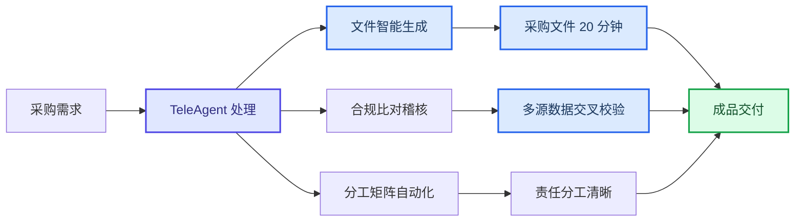

案例集

# 采购与招投标

TeleAgent 实战蓝皮书 · 14 个案例 · 文件生成 · 合规比对 · 流程稽核 · 投标辅助 · 商机监控

> 本章节汇集了 TeleAgent 在采购文件生成、合规稽核、招投标信息监控、投标辅助等采购场景的实战案例，覆盖陕西电信、江苏电信、中电信AI公司等多家单位的实践。

共 **14** 个案例，来自全国电信系统一线实践。

## 案例目录

| # | 案例名称 | 提供单位 | 来源 |
|---|---------|---------|------|
| 1 | 每日招标信息自动搜索与推送 | 重庆电信 /胡然 | 案例集第六期 |
| 2 | 采购中心分工方案及工作量评估 | 陕西电信 采购供应链管理中心 | 案例集第四期 |
| 3 | 采购合规智能比对 | 陕西电信 采购供应链管理中心 | 案例集第四期 |
| 4 | 制度自学习与管理举措生成 | 陕西电信 采购供应链管理中心 | 案例集第四期 |
| 5 | 采购文件基础逻辑稽核 | 江苏电信 采供部 | 案例集第四期 |
| 6 | 招标文件排斥潜在投标人稽核 | 江苏电信 采供部 | 案例集第四期 |
| 7 | 采购流程倒置稽核 | 江苏电信 采供部 | 案例集第四期 |
| 8 | 采购需求说明书生成 | 江苏电信 采供部 | 案例集第四期 |
| 9 | AI对物资领用的分析 | 江苏电信 采供部 | 案例集第四期 |
| 10 | 采购文件快速生成 | 中电信人工智能科技有限公司 采购部 | 案例集第一期 |
| 11 | 批量材料全面核查 | 中电信人工智能科技有限公司 采购部 | 案例集第一期 |
| 12 | 招投标信息自动收集与展示 | 中电信人工智能科技有限公司 市场部/渠道部 | 案例集第一期 |
| 13 | 招投标项目智能辅助 Agent 应用案例 | 新疆电信巴音郭楞蒙古自治州分公司 云中台/陈志远 | 案例集第二期 |
| 14 | 招投标商机智能监控 Skil 应用案例 | 广西电信河池分公司 云中台/邓体琛 | 案例集第二期 |

---

## 1. 每日招标信息自动搜索与推送

> **提供单位**：重庆电信 /胡然  
> **来源**：案例集第六期

### 案例背景

渠道（中国政府采购网、重庆政府采购网、重庆市公共资源交易网等），
自动生成Excel（招标公告+中标公告+采购意向三个Shet），自动截图
推送企微工作群和个人群。效率从每日30分钟降至0分钟（全自动），搜
索渠道从2个扩展到10+，客户匹配从人工判断升级为自动匹配+标记。
1. 打开TeleAgent，输入指令："请搜索重庆地区信息化、数字化、智能
化、网络安全、云服务、智慧城市相关招标信息，搜索渠道包括中国政府
采购网、重庆政府采购网、重庆市公共资源交易网"；
2. 智能体自动多渠道搜索，从客户清单.xlsx读取客户名称自动模糊匹配，

### 操作步骤

标记清单内客户；
3. 智能体自动生成Excel，包含招标公告、中标公告、采购意向三个
Shet，按时间降序排列，增量对比标记新增；
4. 输入指令："以后每天10:0自动执行招标搜索，生成Excel并截图推送
至企业微信群"；
5. 智能体配置定时任务，每天10:0自动执行全链路闭环，获取详情页提
取预算金额和中标金额。
1. 全自动闭环：从手动搜索30分钟到定时任务零干预，每天10:0自动执
行；

### 效果亮点

2. 搜索渠道扩展：从2个网站扩展到10+网站，覆盖中国政府采购网、重
庆政府采购网、重庆市公共资源交易网及各区县分网；
3. 客户清单匹配：自动读取客户清单.xlsx模糊匹配，标记清单内客户，替
代人工判断；
4. 多渠道推送：Excel自动生成+自动截图+企微工作群和个人群同步推
送。

---

## 2. 采购中心分工方案及工作量评估

> **提供单位**：陕西电信 采购供应链管理中心  
> **来源**：案例集第四期

### 案例背景

按38号文件14项职责和9类不纳入集约事项，需为采购中心员工制定工作分
工方案。陕西省公司本部2024至2025年归档采购结果共684条，需按物料编
码 专 业 分 类 。 人 工 分 类 工 作 量 大 、 数 据 格 式 不 规 范 、 工 作 量 难 量 化 。 利 用
TeleAgent自动完成684条采购结果数据分类、工作量统计与分工方案生成。
1. 将684条归档采购结果数据上传至TeleAgent对话框；
2. 输入指令："清洗金额格式，去除逗号分隔符，统一数据口径"；
3. 输入指令："基于采购结果名称关键词进行专业分类，优化分类规则将"其

### 操作步骤

他"类从202条降至51条，按物料编码一级目录细分专业领域"；
4. 输入指令："结合38号文件14项职责和9类不纳入集约事项，按专业集中
度分配同类工作，评估每人工作量均衡性，生成10人分工方案框架"；
5. 输 入 指 令 ： "输 出 标 准 化 采 购 中 心 分 工 方 案 Word文 档 ， 包 含 分 类 统 计 表、
工作量对比分析、分工方案正文、管理职责对照表"；
6. 人工借助经验对AI初步分配进行调整，为每个岗位增加管理职责，再用AI
判断工作量均衡性；
7. 综合多轮评估结果，确认最终方案。
数据分类与分工制定从3至5天缩短至2至3小时；"其他"类从202条降至51条，

### 效果亮点

分类精准度大幅提升；工作量客观量化，自动统计加权工作量并判定均衡性；
标准化工序文档一键生成。

---

## 3. 采购合规智能比对

> **提供单位**：陕西电信 采购供应链管理中心  
> **来源**：案例集第四期

### 案例背景

上会方案与发出的招标文件比对、合同正文与直接采购文件比对，确保关键
条款一致。人工逐项核对耗时长且容易遗漏。利用TeleAgent自动比对采购各
环节文件，识别差异点和风险项，生成结构化比对报告。
1. 将招标方案上会PT和正式发出的招标文件（Word）上传至TeleAgent对
话框；
2. 输入指令："比对上会方案与招标文件的工程概况、招标概况、评标办法、
费用与价格、工期与付款、品牌清单、关键条款7大维度，输出比对表和差异

### 操作步骤

汇总"；
3. 将合同模板、采购方案和采购结果上传至TeleAgent对话框；
4. 输入指令："登录合同页面，比对合同与页面基本信息、经审批的采购方案
及结果，对同类事项的描述是否一致，输出9张比对表"；
5. 人工审核比对结果，重点关注差异项和风险提示。
采购合规比对从人工1至2天缩短至2至3小时；覆盖7大比对维度，产出9张比

### 效果亮点

对表，差异识别更全面细致；解决人工审核难以逐行多信息来源比对的问题，
附件清单、合同正文条款等细致信息不再遗漏。

---

## 4. 制度自学习与管理举措生成

> **提供单位**：陕西电信 采购供应链管理中心  
> **来源**：案例集第四期

### 案例背景

对性制定压降举措。多文件交叉引用，人工阅读理解难以把握制度间逻辑关
系和管控要点，从制度到具体管理举措需要深入分析。让TeleAgent自学习公
司采购管理制度文件，自动生成体系化的竞争性转单一采购方式压降举措。
1. 将三个采购管理办法PDF文件导入TeleAgent：中国电信2024年30号文
件（集团级）、中电信陕2024年301号文件（省公司级）、中电信陕采购内
部2026年1号文件；
2. 输入指令："提取各文件关于采购方式适用的条件，对比集团与省公司文件
的差异条款，识别询比转单一的管控薄弱环节"；

### 操作步骤

3. 输入指令："生成竞争性转单一采购方式压降举措，每条举措需注明制度依
据（具体文件号+条款号），从需求前端管控、内审把关、流程优化、监控考
核四个维度系统施策"；
4. 输入指令："举措需可落地、可量化、可检查，区分长期机制建设和短期管
控措施"；
5. 人工审核举措的可行性和制度依据准确性，确认后形成管控方案。
AI自学习多份制度文件，自动提取采购方式适用条件与转换规则；从制度层

### 效果亮点

面生成管控抓手，四维度系统施策；解决了人员变动快、制度理解难、举措
提炼难的核心痛点。

---

## 5. 采购文件基础逻辑稽核

> **提供单位**：江苏电信 采供部  
> **来源**：案例集第四期

### 操作步骤

采购实施相关文件常出现行文错误，如价格数值错误、上下文采购项目名称
不一致、缺字漏字等语法和语义问题，对文件规范性和严谨性产生挑战。传
统人眼难以发现隐性逻辑错误，如中端品类产品价格竟比高端品类贵7倍。利
用TeleAgent分析采购实施文件的合规问题和行文问题。
1. 将采购文件上传至TeleAgent对话框；
2. 输入指令："以下分析文件面向场景是采购招投标领域，你是采购专业专家
和公文行文专家，熟知通信工程的采购招标法律法规，请分析此文件的风险
问题：采购合规问题，公文行文语法语义问题，例如缺字、漏字、段落和标
点符号异常，语句不通顺和歧义，数值错误，以及内容矛盾、逻辑错乱等问
题"；
3. 智能体自动扫描全文，识别合规风险、语病格式、逻辑错误和数值异常；
4. 人工审核稽核结果，逐项修正问题。
合规风险自动筛查，流程缺失和条款违规问题一键识别；语病格式用词逻辑

### 效果亮点

错误一键校验，行文标准化；条款歧义权责漏洞文字疏漏提前预警，减少后
期纠纷；发现人眼难以察觉的隐性逻辑错误（如价格倒挂7倍）。

---

## 6. 招标文件排斥潜在投标人稽核

> **提供单位**：江苏电信 采供部  
> **来源**：案例集第四期

### 案例背景

招标文件中若直接指定特定品牌、型号或非通用技术参数，极易形成行业壁
垒，排斥潜在合格投标人，违反招标投标法公平公正原则。江苏采供部结合
日常采购文件稽核需求，在TeleAgent平台创建Skil技能固化稽核规则，上传
待审核文件即可自动识别倾向性条款。
1. 在TeleAgent中创建招标文件稽核技能，固化排斥潜在投标人审核规则；
2. 上传待审核的招标文件；
3. 关联技能进行风险审核，智能体自动解析采购文件关键信息，识别指定品

### 操作步骤

牌型号、非通用技术参数等倾向性条款；
4. 智能体通过表格清晰展现风险项并详细解释说明；
5. 人工审核稽核结果，修正倾向性条款后重新审核。
稽核规则固化Skil，一次配置即可复用，无需重复编写提示词；精准识别指定

### 效果亮点

品牌型号和非通用技术参数等倾向性条款；从源头杜绝倾向性条款，确保招
标全过程符合法律法规，降低合规和廉政风险。

---

## 7. 采购流程倒置稽核

> **提供单位**：江苏电信 采供部  
> **来源**：案例集第四期

### 案例背景

实施，通过"先予履行申请单"绕过正常审批流程，造成合规漏洞和审计隐患。
利用TeleAgent指定包含多个采购需求相关文件的文件夹，自动对每个文件进
行识别和解析，稽核流程倒置问题。
1. 将包含多个采购需求相关文件的文件夹指定给TeleAgent；
2. 输入指令："对文件夹中每个文件进行识别和解析，稽核是否存在先实施后

### 操作步骤

采购的流程倒置问题"；
3. 智能体自动解析各文件，提取关键信息，结合提示词要求精准反馈稽核结
果；
4. 人工审核稽核结果，对流程倒置问题进行整改。
从源头杜绝"先上车后补票"的流程倒置问题；自动识别和解析多个文件，精准

### 效果亮点

反馈稽核结果；强化制度执行力，规避合同纠纷和审计合规风险。

---

## 8. 采购需求说明书生成

> **提供单位**：江苏电信 采供部  
> **来源**：案例集第四期

### 案例背景

耗时长易出错。利用TeleAgent自动读取采购需求规范、外包技术规范、场景
目录、负面清单四类基准文件，自动匹配业务场景、抽取技术条款、规避禁
止外包事项，生成采购需求说明书。
1. 将《采购需求说明书规范文档》格式参考上传至TeleAgent对话框；
2. 将《业务外包项目的技术规范书》与《业务外包场景目录清单表》《业务
外包负面清单表》上传；

### 操作步骤

3. 输入指令："将项目技术规范书中服务内容与场景目录清单表和负面清单表
比对，判断属于哪类业务外包，标准化填写采购需求说明书的场景字段和负
面场景说明，生成的文档结构与原规范一致，内容仅来源于技术规范书，不
能捏造"；
4. 智能体3至5分钟完成任务：将技术规范书中全部服务内容逐一与场景目录
清单表比对，识别出9个对应场景；逐项比对68条负面清单，重点分析区别，
结论为不涉及负面清单场景；生成与原规范模板完全一致的采购需求说明书；
5. 人工审核生成的采购需求说明书，确认场景匹配和负面清单判断准确。
3至5分钟完成采购需求说明书编制，单份编制时长缩减60%以上；自动匹配

### 效果亮点

业务场景，逐一比对68条负面清单，精准识别禁止外包事项；生成文档与原
规范模板完全一致，不捏造内容。

---

## 9. AI对物资领用的分析

> **提供单位**：江苏电信 采供部  
> **来源**：案例集第四期

### 案例背景

结合5个区局4个装维班组每月装维材料领用数据与当前库存情况，利用AI智
能算法综合研判，建立科学精准的领用合理性评估机制，识别异常波动与超
额申领，定位呆滞物料推动跨班组调拨共享，实现从"被动领用"向"精准配置"
的转变。
1. 将 5个 区 局 4个 装 维 班 组 每 月 装 维 材 料 领 用 数 据 和 当 前 库 存 数 据 上 传 至
TeleAgent；
2. 输入指令："基于历史领用趋势与实际消耗规律对比，识别各班组领用中的
异常波动与超额申领情况，及时预警并校准领用计划"；

### 操作步骤

3. 输入指令："交叉分析各班组库存水位与领用需求，精准定位长期闲置、周
转缓慢的呆滞物料，推动跨班组间的库存调拨与共享"；
4. 智能体自动完成多维分析，输出异常预警和调拨建议报告；
5. 人工审核分析结果，制定调拨方案并执行。
基于历史趋势与实际消耗规律对比，精准识别异常波动和超额申领；交叉分

### 效果亮点

析库存水位与领用需求，定位呆滞物料推动跨班组调拨；实现从"被动领用"向
"精准配置"转变，为公司降本增效提供数据驱动决策支撑。
3.软件开发辅助案例
适用场景：环境兼容性修复 | 运维排查 | 系统部署

---

## 10. 采购文件快速生成

> **提供单位**：中电信人工智能科技有限公司 采购部  
> **来源**：案例集第一期

### 案例背景

文件，传统方式需要2-3天时间。通过超级智能体，上传采购需求和模板文件
后，20分钟即可生成全套采购文件。
1.
将采购需求文档和4份模板文件（签报模板、直接采购文件模板、报价文
件模板、商务规范书模板）拖入对话框；
2.
输入指令："我准备启动关于2026年手机、泛终端设备框架采购项目的
准备工作，根据这份采购需求@采购需求.docx和相关模版@签报模
板.docx @直接采购文件模板.docx @报价文件模板.xlsx @商务规范书
模板.doc，输出该项目对应的签报和直接采购文件、报价文件、商务规
范书。"；

### 操作步骤

3.
智能体自动读取所有附件内容，识别需求和模板格式，逐一生成4份文
件；
4.
输出文件清单：①签报《关于2026年手机、泛终端设备框架采购项目的
请示.docx》（含项目背景、预算、采购方式建议）②直接采购文件（五
章完整结构：响应邀请书、供应商须知、商务规范书、技术规范书、响
应文件格式）③报价文件.xlsx（含ROUND计算公式）④商务规范
书.docx（14条框架协议条款+5个附件）；
5.
人工审核文件合规性和格式规范性，确认后定稿。
原来需要2-3天完成的4份采购文件撰写，现在仅需20分钟。输出文件内容合

### 效果亮点

规、格式规范、复用性强，5个附件（供货份额表、保密协议、网络安全承诺
书、安全生产责任书、廉洁协议）一并生成。

---

## 11. 批量材料全面核查

> **提供单位**：中电信人工智能科技有限公司 采购部  
> **来源**：案例集第一期

### 案例背景

问题。传统方式需要逐条对照检查，耗时耗力。智能体精准识别问题并附详
星辰超级智能体案例集·重庆0624
细修改意见。
1.
将修改后的采购文件拖入对话框；
2.
输入指令："这是我们修改后的采购文件，请帮我核查，重点检查是否
有上下文不一致、条目错乱、错别字等问题。"；
3.
智能体逐项检查全文，精准识别7项问题，分类输出：①上下文不一致

### 操作步骤

（3项）：供应商禁入情形正文14项vs表格1项缺失3项、"参选/响
应"用语不统一、商务条款偏离表项目名称占位符未改；②条目编号错
乱（2项）；③其他问题（2项）；
4.
每项问题附具体整改建议（如："以正文为准，表格补齐缺失3项内容，
在第10项后顺延编号"）；
5.
按修改意见逐条修正，复核定稿。

### 效果亮点

精准识别7个问题并附详细修改意见，原来需要1天的核查工作现在仅需5分
钟。问题分类清晰（上下文不一致/条目错乱/其他），整改建议可直接操作。

---

## 12. 招投标信息自动收集与展示

> **提供单位**：中电信人工智能科技有限公司 市场部/渠道部  
> **来源**：案例集第一期

### 案例背景

等），逐个搜索易遗漏、汇总展示费时间。通过超级智能体，设置关键词即
可自动抓取、结构化整理、生成可视化页面。
1.
设置搜索关键词和时间范围；
2.
输入指令："模拟浏览器访问中国招标网，取近7天'智能体'相关招中

### 操作步骤

3.
智能体自动访问招标网站，抓取相关信息；
标信息，并把结果做成一个html网页，商务风格"；
4.
结构化整理招中标信息（日期、地区、项目类型、标题）；
5.
生成商务风格的可视化HTML页面。

### 效果亮点

设置关键词自动抓取多平台招标信息，结构化整理并生成可视化HTML页面，
告别逐个网站搜索的重复劳动，确保信息不遗漏。
四、软件开发辅助案例
网页Demo

---

## 13. 招投标项目智能辅助 Agent 应用案例

> **提供单位**：新疆电信巴音郭楞蒙古自治州分公司 云中台/陈志远  
> **来源**：案例集第二期

### 案例背景

投标人员人工解析标书、核查投标文件工作量大，千页文档易遗漏资质、报
价、签章、证书等废标风险点，人工核算评分、报价规则耗时久。新疆电信
基于 TeleAgent 星辰超级智能体搭建招投标智能辅助 Agent，集成招标文件
解析、投标文件检查两大核心技能，形成 "解标 - 应标 - 检标" 闭环流程。
系统自动拆解标书资格、评分、报价要求，生成分析报告与可视化投标工作
台；从 23 个维度交叉比对招标与投标文件，依托视觉识图识别证照、保证金
图片信息，预判项目得分、精准定位废标隐患，大幅降低人工审查疏漏，提
升投标效率与中标保障
1. 上传招标文件，启动解析技能，自动生成 Word 分析报告与 HTML 投标
工作台，梳理评分细则、技术响应矩阵；
2. 依托工作台报价模块，匹配评审规则自动测算报价得分，对照评分标准
编制投标文件；

### 操作步骤

3. 同步上传招标文件与完成后的投标文件，执行投标文件全量检查；
4. 系统跨文本、跨图片交叉校验，输出问题报告，标注风险等级与对应
PDF 页码、预估扣分项；
5. 根据检查报告修改文档，重复检直至无高风险废标问题；
6. 参考得分预估结果调整方案，完成最终投标文件定稿。
形成解标、应标、检标一体化闭环，标书解析效率较人工提升 70% 以上；覆
盖 23 项全维度合规审查，支持文本、图片跨介质交叉验证，可识别千页文档

### 效果亮点

中人工极易忽略的废标隐患；搭载视觉识图能力，解决保证金、资质证书图
片无法自动核验的痛点，内置多套报价评审算法精准测算预估得分；输出可
视化投标工作台与标准化问题报告，问题精准定位页码便于整改，全方位规
第 7 页
避投标废标风险，适配交通、生态、机电等多行业招投标项目。

---

## 14. 招投标商机智能监控 Skil 应用案例

> **提供单位**：广西电信河池分公司 云中台/邓体琛  
> **来源**：案例集第二期

### 案例背景

过 LM 语义筛选匹配电信可承接业务，依托本地项目库自动去重，标准化整
理项目预算、开标时间等信息推送至企业微信群，上线以来已监控 75 个项
目、精准推送 35 条高匹配商机，大幅提升线索获取效率，助力客户经理提前
跟进项目、提高中标转化。

### 操作步骤

1. 配置 4 个招投标网站定时并行巡检任务，设置自定义执行时段；
2. 编写浏览器自动化脚本，实现网页访问、翻页、项目信息抓取；
3. 配置筛选规则：限定河池及广西区域、云网 / 安全 / 集成类业务，过滤
纯基建项目；
4. 搭建本地 Markdown 项目存储库，设计名称 + 链接双重去重校验逻
辑；
5. 开发 LM 语义识别模块，自动判断项目业务匹配度并划分优先级；
6. 对接企业微信推送接口，统一商机消息模板，完成平台上架。
实现 7×24 小时全自动多平台并行巡检，项目发布 10 分钟内即可推送线索，
线索获取效率提升 80%；内置本地项目库自动去重机制，避免重复消息干

### 效果亮点

扰；依托大模型语义智能筛选云网、信息化优质项目，自动过滤无关工程类
公告；输出统一标准化商机模板并一键推送企业微信，所有项目本地归档可
回溯查询，大幅减少人工检索工作量，提前抢占项目跟进窗口期
第 8 页

---

[← 返回案例总览](./)
