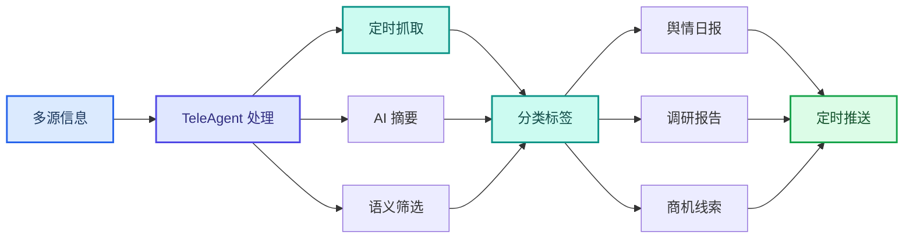

案例集

# 信息采集调研与舆情监测

TeleAgent 实战蓝皮书 · 16 个案例 · 产业调研 · 舆情监测 · 招标搜索 · 深度调研 · 知识库

> 本章节汇集了 TeleAgent 在深度调研、舆情监测、信息采集、知识库构建等场景的实战案例，覆盖上海电信、广东电信、重庆电信、四川电信等多家单位的实践。

共 **16** 个案例，来自全国电信系统一线实践。

## 案例目录

| # | 案例名称 | 提供单位 | 来源 |
|---|---------|---------|------|
| 1 | 企业邮箱智能自动化管理案例 | 上海电信/张磊 | 案例集第三期 |
| 2 | 业务数据爬虫案例 | 上海电信/张磊 | 案例集第三期 |
| 3 | 互联网舆情智能搜集分析案例 | 上海电信/张磊 | 案例集第三期 |
| 4 | 个人知识库助理案例 | 上海电信/张磊 | 案例集第三期 |
| 5 | 气象预警日报自动化 | 四川电信 云网发展部（科技创新部、共建共享工作组） | 案例集第六期 |
| 6 | 3GP协议智能解读 | 安徽电信 无线网络优化中心/共建共享组 | 案例集第六期 |
| 7 | 电信行业咨询洞察技能 | 重庆电信 政企信息服务事业群/杨玫 | 案例集第六期 |
| 8 | 在线信息收集系统搭建 | 重庆电信 渠道部 | 案例集第六期 |
| 9 | 电商大数据平台项目建设 | 西双版纳电信 | 案例集第四期 |
| 10 | 问卷设计与深度洞察 | 上海电信/何震渊 | 案例集第四期 |
| 11 | 地材信息获取—审计信息化实践 | 重庆电信 审计部 | 案例集第四期 |
| 12 | 职工诉求智能研判 | 中电信人工智能公司 工会 | 案例集第四期 |
| 13 | 工会经费智能检索 | 中电信人工智能公司 工会 | 案例集第四期 |
| 14 | 自动生成深度调研报告-TeleAgent挖掘产业动态商机 | 广东电信广州分公司 | 案例集第一期 |
| 15 | 挖掘产业动态商机 | 广东电信广州分公司 | 案例集第一期 |
| 16 | 一客一案全景报告 | 广东电信广州分公司 | 案例集第二期 |

---

## 1. 企业邮箱智能自动化管理案例

> **提供单位**：上海电信/张磊  
> **来源**：案例集第三期

### 案例背景

客户经理每日邮件数量庞大，待办、重点通知混杂难筛选，人工梳理耗时。
配置 TeleAgent 定时任务自动读取当日全部邮件，区分收件人、提及本人重
点信息，自动生成规整邮件简报推送至企业微信，实现待办自动归档、到期
提醒，无需人工逐条整理

### 操作步骤

1.配置 Foxmail/SMTP 邮箱连接脚本，设置每日定时抓取规则，搭建邮件
信息分类、简报表格模板，对接微信 ClawBot 推送接口;
2.完成邮箱账号绑定与定时任务设置，每日 21 点自动扫描收件箱，生成结
构化简报推送到微信，随时查看当日重点工作待办
7×24 自动邮件分拣，自动识别关联本人重点事项，表格化简报清晰直观，通

### 效果亮点

过微信移动端随时接收提醒，大幅减少每日邮件整理耗时，杜绝遗漏重要工
作通知

---

## 2. 业务数据爬虫案例

> **提供单位**：上海电信/张磊  
> **来源**：案例集第三期

### 案例背景

中断。自然语言下达抓取指令，AI 自动生成爬取脚本，断点续爬，关联学
区、房型数据并匹配电信内部小区台账，输出完整分析表

### 效果亮点

1.配置多房产网站访问规则、断点续爬机制，搭建外部数据与内部台账匹配
逻辑，自动打标（学区房 / 安置房等）;
2.输入目标区域、抓取平台需求，AI 自动采集小区全维度信息，关联内部业
务数据生成标准化 Excel 数据表
自然语言替代码编写，零技术门槛；支持多源数据融合，自动属性打标，
抓取中断可自动续跑，大幅缩短外部数据获取周期

---

## 3. 互联网舆情智能搜集分析案例

> **提供单位**：上海电信/张磊  
> **来源**：案例集第三期

### 案例背景

AI 结合 OCR 图文识别、NLP 语义分析，周期性抓取全网相关内容，按投
诉、资费维度汇总横向对比报告
1.配置社交媒体定时抓取任务，集成图片文字 OCR 识别模块，搭建资费、
投诉多维度对比统计模板;

### 操作步骤

2.下发舆情搜集指令，AI 自动抓取图文内容，结构化整理竞品资费、用户投
诉数据，输出完整对比分析 Word 报告

### 效果亮点

同时解析文字、海报截图类舆情素材，自动横向对比三大运营商资费与口
碑，量化投诉热度，为营销、竞品应对提供数据支撑

---

## 4. 个人知识库助理案例

> **提供单位**：上海电信/张磊  
> **来源**：案例集第三期

### 案例背景

档，AI 抽取知识点构建可检索知识库，自然语言提问即可快速调取对应口
径、指标说明

### 效果亮点

上传业务资料入库，后续直接文字提问指标、渠道口径，AI 快速匹配对应知
识点回复
兼容 Word/Excel/PDF/PT 全类型文件，碎片化业务知识统一归档，问答式
快速检索，减少翻阅大量历史文档的时间

---

## 5. 气象预警日报自动化

> **提供单位**：四川电信 云网发展部（科技创新部、共建共享工作组）  
> **来源**：案例集第六期

### 案例背景

四川气象灾害频发，暴雨/高温等预警分散在国家应急广播、四川公共气
象服务网、中国天气网、中国气象局4大平台，人工汇总效率低、跨源对
齐困难、红色预警等紧急信息无法第一时间触达一线。团队基于
TeleAgent开发气象预警日报技能，实现多源采集去重合并、交叉验证补
全、三级分层展示HTML日报、量子密信Webhok推送，定时任务自动
执行，全天候监测。
1. 在TeleAgent中配置定时任务，每日自动触发气象预警采集技能；
2. 智能体自动从4大官方源多源搜索，去重合并后进行交叉验证，省级蓝
色预警市州覆盖校验，识别遗漏并补全；
3. 智能体自动解析预警等级/类型/区域（红橙黄蓝×暴雨/高温/雷电等十

### 操作步骤

余种），21市州按常住人口+GDP综合重要度排序；
4. 智能体自动生成HTML日报，三级分层展示（省级→市州→区县），支
持三维筛选联动和双侧边栏统计；
5. 智能体通过量子密信Webhok机器人推送预警摘要至IM群聊，全程分
钟级响应。
1. 多源采集+交叉验证：4大官方源自动采集，去重合并后交叉验证，省
级预警市州覆盖校验补全遗漏；
2. 实战效果显著：7月23日四川53条预警（红色40条/橙色8/黄色4/蓝色
1），全程分钟级生成并推送；
3. 定时自动+密信联动：scheduler定时任务每日自动执行，量子密信
Webhok推送至IM群聊，全天候监测；
4. 四代迭代优化：v1单源→v2多源交叉→v3筛选联动→v4定时密信推
送，从基础版到全自动。

---

## 6. 3GP协议智能解读

> **提供单位**：安徽电信 无线网络优化中心/共建共享组  
> **来源**：案例集第六期

### 案例背景

议交叉引用频繁且版本迭代快，理解与反复查阅的时间成本极高。基于
TeleAgent开发3GP协议智能解读技能，汇聚R19 38系列全套协议构建
本地知识库，实现协议知识点秒级精准定位，回答基于原文生成确保合规
准确。
1. 将3GP协议PDF/Word/TXT文件上传至TeleAgent，输入指令："请

### 操作步骤

解析以下协议文件，自动提取内容并智能分块，构建知识库"；
2. 智能体自动解析多格式文档，智能分块后构建向量/关键词双索引；
3. 输入指令："请解读R19 38系列协议中PDCP层COUNT值判定规则"，
智能体基于语义检索匹配，秒级定位并关联原文章节；
4. 智能体生成精准回答，支持"问-答-证"闭环，关联原文溯源；
5. 协议版本迭代时，使用增量更新机制更新索引，无需全量重建。
1. 协议知识点秒级定位：直接关联原文章节，一次查询覆盖全库；
2. 回答基于原文生成：确保合规准确，解决专业术语缩写和多协议交叉引
用痛点；

### 效果亮点

3. 三层架构：底层R19 38协议资源→中层智能索引擎→顶层自然语言
问答；
4. 增量更新低成本：协议版本迭代时仅更新差异部分，加速网优人员对新
协议的理解与应用。

---

## 7. 电信行业咨询洞察技能

> **提供单位**：重庆电信 政企信息服务事业群/杨玫  
> **来源**：案例集第六期

### 案例背景

觉四大痛点。基于TeleAgent创建"电信行业咨询洞察"技能，首次将华
为五看三定等业界方法论与电信实训方法论融合成统一体系，嵌入BEIK客
户画像、政策洞察三层次法、行业分析六要素等10大方法论，覆盖咨询全
流程7大应用场景。
1. 在TeleAgent中调用@skil-creator，将梳理好的咨询方法论、模板、
清单整理为标准文件；
2. 编写SKIL.md定义核心工作流与决策树，嵌入methodology.md（10
大方法论）、evaluation-framework.md（评估框架）、
report-template.md（报告模板）、key-data-keywords.md（关键词

### 操作步骤

库）；
3. 输入指令："请编制X市X区X街道经济发展形势分析报告"；
4. 智能体自动调用五步成诗全流程，按8章32节标准结构生成报告，21张
专业表格自动生成；
5. 对商机会进行4维度13项评估，输出A-D级量化评级；
6. 输出.docx格式报告，可直接用于客户汇报。
1. 10大方法论首次融合：BEIK客户画像+政策洞察三层次法+行业分析六
要素+华为五看三定+五步成诗等，业界首次统一体系；
2. 效率提升60-70%：咨询报告从7-10天压缩到半天初稿、2天定稿，8章
32节结构化10%；
3. 量化评估体系：4维度×13项评估×1-5分制×A-D级评级，从"凭经
验"到"用数据说话"；

### 效果亮点

4. 一人创建全网复用：以技能形式封装，无需懂代码，懂业务即可创建，
上架技能广场全网复用。

---

## 8. 在线信息收集系统搭建

> **提供单位**：重庆电信 渠道部  
> **来源**：案例集第六期

### 案例背景

单、数据隐私保障、自动化汇总需求。基于TeleAgent搭建网页版信息收
集系统，从需求描述到部署上线全程对话驱动，0行代码、0费用、约2小
时完成。系统支持分公司各自填报互不可见、派单人全量查看、一键导
出、TA智能汇总分析直接输出结论呈报领导。
1. 对TeleAgent说："我需要一个分公司周报系统，密码260707，包含
填写表单和总览表，选日期自动算周次"；
2. 智能体理解需求，生成前端代码和后端逻辑；

### 操作步骤

3. 智能体指导注册GitHub、生成Token、推送代码到仓库；
4. 智能体指导通过Render自动部署上线；
5. 发现Render免费版重启后数据清空，对TeleAgent说："数据需要持
久化存储"；
6. 智能体建议接入Neon免费PostgreSQL数据库，完成数据持久化配置。
1. 零代码搭建：全程对话驱动，0行手写代码、0费用、约2小时从需求到
上线；
2. 数据隐私保障：分公司各自填报互不可见，消除顾虑坦诚填报；

### 效果亮点

3. 闭环决策支持：从信息收集→TA智能汇总分析→直接输出结论呈报领
导；
4. 技术栈完整：GitHub代码托管+Render自动部署+Neon PostgreSQL
持久化，全程AI指导搭建。
2、软件开发辅助案例
适用场景：工程概预算审核 | 终端信令解析

---

## 9. 电商大数据平台项目建设

> **提供单位**：西双版纳电信  
> **来源**：案例集第四期

### 案例背景

勐腊县职业高级中学提出建设电商直播大数据库，需围绕东南亚贸易和勐腊
本地种植业，整理服务电商教学、直播选品和产业展示的数据系统。项目采
用"TeleAgent+云电脑+定制开发"方式，利用TeleAgent深度调研东南亚贸
易数据、电商销售数据和勐腊种植业数据，结合定时任务持续更新数据，在
两天内完成数据整理、系统开发和大屏呈现，并建设数据管理后台和操作手
册。
1. 打开TeleAgent，输入指令："围绕东南亚贸易、电商销售和勐腊种植业开

### 操作步骤

展深度调研，从互联网公开信息中查找贸易数据、商品排行、市场变化和行
业资料"；
2. 将商务局、农业局提供的本地数据上传至TeleAgent，输入指令："将调研
数据与本地数据整合整理，补充单一数据来源难以覆盖的内容"；
3. 设置TeleAgent定时任务，按设定周期抓取和更新相关数据，新数据经清
洗分类汇总后写入本地数据库；
4. 输入指令："基于汇总结果生成东南亚贸易与勐腊种植业数据大屏，展示东
南亚出口品类排行、中国对老挝和泰国主要出口商品、东南亚电商热销商品，
以及勐腊茶叶水果蔬菜粮油中药材和乡镇种植分布"；
5. 输入指令："生成数据大屏系统操作手册，包含系统启动、数据维护、后台
操作和常见问题处理"；
6. 人工审核大屏展示效果和数据准确性，确认后交付客户。
两天完成首阶段交付，"TeleAgent+云电脑+定制开发"快速出成果；定时任
务持续更新数据，交付的不是固定展示页面而是可持续运营的系统；30张数

### 效果亮点

据表、200余条出口商品数据，覆盖跨境贸易和本地农业全链条；客户高度
认可并主动展示，带出商务局数据中心大屏等后续商机；项目预计形成产数
收入4万余元。

---

## 10. 问卷设计与深度洞察

> **提供单位**：上海电信/何震渊  
> **来源**：案例集第四期

### 案例背景

析，专业要求高、工作量大。利用TeleAgent智能自动分析报告，一键生成调
研画像，避免拍脑袋决策，精准感知职工需求。
1. 打开TeleAgent，将调研需求描述输入对话框；
2. 输入指令："请设计一份职工满意度调查问卷，包含逻辑关联和信效度校
验，覆盖薪酬福利、职业发展、工作环境等维度"；
3. 智能体自动生成问卷框架，设置逻辑跳转和效度检验项；

### 操作步骤

4. 收集数据后输入指令："请对问卷结果进行深度分析，包括心理维度交叉
分析，生成调研画像"；
5. 智能体输出分析报告和可视化画像；
6. 人工审核分析结论，确认调研洞察准确性。
一键生成调研画像，避免拍脑袋决策；问卷设计覆盖逻辑信效度和心理维度；

### 效果亮点

智能深度分析替代人工逐项解读。

---

## 11. 地材信息获取—审计信息化实践

> **提供单位**：重庆电信 审计部  
> **来源**：案例集第四期

### 案例背景

抓取地材价格，模拟测算价格与公开信息价比对分析，锁定审计疑点。在模
拟场景中，5项地材估算单价均高于公开信息价，偏差率6.09%至15.3%，问
题金额约109050元。实现从人工零散询价到机器自动采集的转变，数据获取
实时化、自动化、标准化。
1. 打开TeleAgent，输入指令："从造价通、各省交通运输厅官网等渠道自
动采集指定地区的地材价格信息，包含钢材、水泥、砂石、混凝土等品类"；
2. 输入指令："将采集到的地材价格按地区、品类、时间维度整理成对比分
析表，标注价格异常波动"；

### 操作步骤

3. 输入指令："将建设方提供的地材估算价格与公开网站当月信息价进行比
对，高于信息价的部分标记为问题数据，计算偏差率和问题金额"；
4. 智能体自动完成数据采集、清洗、对比分析，输出结构化审计报告，标注
风险点；
5. 人工审核审计分析结果，确认风险点和核减建议。
地材价格数据自动采集替代人工零散询价，数据获取实时化、自动化、标准

### 效果亮点

化；跨区域价格对比分析，精准锁定审计疑点；模拟审计场景中发现5项估算
单价偏差6%至15%，问题金额约10.9万元；从数人数天压缩至分钟级智能输
出。

---

## 12. 职工诉求智能研判

> **提供单位**：中电信人工智能公司 工会  
> **来源**：案例集第四期

### 案例背景

职工诉求散落在企微、飞书、邮件等多个渠道，人工排查耗时且易遗漏，研
判标准不统一导致响应不及时。利用TeleAgent实现多渠道诉求自动采集、AI
智能分类与优先级评定、精准匹配帮扶措施、处理进展跟踪与反馈的全链路
闭环，支持情绪识别和重复诉求关联，实现从发现到闭环的智能研判。
1. 将企微或飞书文档链路接入TeleAgent，输入指令："每日自动爬取各渠
道新增职工诉求，统一归集至本地工作目录"；
2. 输入指令："对采集到的诉求自动分类为六大类（薪酬福利/劳动关系/职
业发展/民主管理/生活服务/其他），根据情绪值和关键词匹配标注红橙黄三

### 操作步骤

级紧急程度，比对历史台账关联重复诉求"；
3. 输入指令："基于会员标签与历史诉求，智能匹配政策包与关怀措施，对
红级急难诉求自动生成处置建议"；
4. 输入指令："设定处理时限，到期自动提醒负责人催办，办结后自动生成
回访话术模板形成服务闭环"；
5. 人工审核研判结果和处置建议，确认诉求处理质量。
多渠道诉求实时汇聚，告别信息孤岛；AI智能分类六大类加情绪识别加三级

### 效果亮点

紧急标注；智能匹配政策包到人，精准服务替代一刀切；自动催办回访形成
闭环，诉求不遗漏。

---

## 13. 工会经费智能检索

> **提供单位**：中电信人工智能公司 工会  
> **来源**：案例集第四期

### 案例背景

入制度文件建立知识库，支持口语化表述提问、大额资金使用场景推演、电
子报销单填报自动填充校验、报销前合规预审，检索耗时从30分钟降至3分钟，
实现零遗漏风险控制。
1. 将《基层工会经费收支管理办法》《省/市工会补充规定》《公司差旅费细
则》《慰问标准》等制度文件导入TeleAgent工作空间；
2. 输入指令："基于已导入的制度文件，回答工会经费相关查询，支持口语
化表述提问，精准匹配政策依据"；
3. 输入指令："对以下报销或预算申请进行合规预审，标注超出标准、范围

### 操作步骤

不符和虚报缺失等风险项，生成审核意见与修改建议"；
4. 输入指令："自动填充报销标准，填写后校验是否符合报销规定"；
5. 政策更新后将最新文件导入，输入指令："更新知识库，通知相关人员政
策变更"；
6. 人工审核合规预审结果，确认报销合规性。
检索查询耗时从30分钟降至3分钟，效率提升10倍以上；报销前合规预审有效

### 效果亮点

降低风险；口语化提问精准匹配政策依据，零遗漏风险控制；政策更新实时
同步知识库，杜绝执行过期标准。

---

## 14. 自动生成深度调研报告-TeleAgent挖掘产业动态商机

> **提供单位**：广东电信广州分公司  
> **来源**：案例集第一期

### 案例背景

运用TeleAgent信息整合技能，智能采集广州工信官网/公众号信息，自动汇编
工信政策/企业/产业动态；实现信息可溯源、自动化生成HTML周报，适配手
机浏览器，方便一线打粮人参阅。

### 操作步骤

1.
2.
3.
4.
5.
将报表数据文件拖入对话框；
输入分析需求，如："帮我从这些数据中分析业务发展趋势，生成图文分
析报告"；
智能体自动识别数据结构，进行统计分析；
生成包含图表的分析报告；
审核报告准确性和分析深度；

### 效果亮点

紧跟地方工信政策、洞察发现机遇，辅助客户经理等岗位掌握重点企业动
态，增加走访谈判成功率；更好把握产业发展趋势，深入挖掘重点产业企业
商机。

---

## 15. 挖掘产业动态商机

> **提供单位**：广东电信广州分公司  
> **来源**：案例集第一期

### 案例背景

采集广州工信官网/公众号信息，自动汇编工信政策/企业/产业动态；实现信
息可溯源、自动化生成HTML周报，适配手机浏览器，方便一线打粮人参阅。

### 操作步骤

1.
紧跟地方工信政策、洞察发现机遇，完成5G工厂/智能工厂等230万奖项补

### 效果亮点

申报。辅助客户经理等岗位掌握重点企业动态，增加走访谈判成功率；更好
把握产业发展趋势，深入挖掘重点产业企业商机。
12第
页

---

## 16. 一客一案全景报告

> **提供单位**：广东电信广州分公司  
> **来源**：案例集第二期

### 案例背景

商机。广州电信推出「一客一案全景报告」AI 工具，输入企业全称即可自动
完成 10 维数据检索、16 模块 AI 分析，一键生成专业 HTML 全景报告并输
出营销跟进建议。
1. 明确工具功能，确定 10 维检索、16 模块 AI 分析、HTML 报告输出标
准；
2. 输入企业完整工商名称并提交；

### 操作步骤

3. 系统自动完成 10 维数据抓取与 AI 智能分析；
4. 查看、下载生成的标准化全景报告，获取商机与跟进方案；
5. 依托报告开展客户拜访、业务推介；存量客户可重复生成更新分析；
6. 在历史记录调取旧报告用于复盘、培训
自动归集客户全量信息，信息整理耗时从半天缩短至 5 分钟，解放客户经理

### 效果亮点

手工整理精力；依托全景数据自动分析客户业务缺口，输出定制化营销商机
建议

---

[← 返回案例总览](./)
