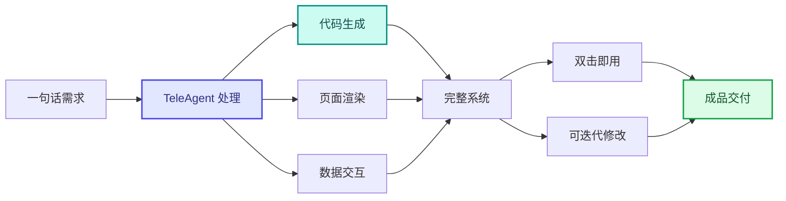

案例集

# 软件开发与系统搭建

TeleAgent 实战蓝皮书 · 16 个案例 · 网页 Demo · 管控系统 · 信息平台 · 零代码开发 · 智能巡检

> 本章节汇集了 TeleAgent 在代码生成、系统开发、智能巡检、工程审核等技术场景的实战案例，覆盖中电信AI公司、新疆电信、西双版纳电信、贵州电信等多家单位的实践。

共 **16** 个案例，来自全国电信系统一线实践。

## 案例目录

| # | 案例名称 | 提供单位 | 来源 |
|---|---------|---------|------|
| 1 | 数据业务脚本智能生成 | 上海电信/张磊 | 案例集第三期 |
| 2 | 代码编写能力 | 新疆电信客户经营中心 | 案例集第三期 |
| 3 | ICT 项目关联民企风控筛查 | 黑龙江电信政企信息服务事业群 | 案例集第三期 |
| 4 | 项目全流程调度系统 | 贵州电信 /王忠权 | 案例集第七期 |
| 5 | 装维现场质检助手 | 江苏电信 客户维护支撑中心/谢欣怡 | 案例集第五期 |
| 6 | 视联网AI智能巡检 | 四川电信 乐山分公司 | 案例集第五期 |
| 7 | 电费智能巡查小助手 | 浙江电信 舟山电信/顾磊 | 案例集第五期 |
| 8 | 无线重点场景预测与保障 | 安徽电信 无线网络优化中心/共建共享组 | 案例集第六期 |
| 9 | 通信工程概预算智能审核 | 湖北电信 云网发展部 | 案例集第六期 |
| 10 | 移动网终端能力信令解析 | 安徽电信 无线网络优化中心/共建共享组 | 案例集第六期 |
| 11 | 工作赋能分析器—岗位应用创新实践 | 西双版纳电信 | 案例集第四期 |
| 12 | 解决方案推演助手创新实践 | 西双版纳电信 | 案例集第四期 |
| 13 | 商机线索全流程闭环管控系统 | 山东电信 | 案例集第四期 |
| 14 | AI小白在网安领域TeleAgent应用实践 | 江苏电信 网络和信息安全管理部/俞国兴 | 案例集第四期 |
| 15 | Windows Server 2016云电脑环境兼容性问题修复 | 西双版纳电信 | 案例集第四期 |
| 16 | 网页Demo开发—可视化产品原型 | 中电信人工智能科技有限公司 研发团队 | 案例集第一期 |

---

## 1. 数据业务脚本智能生成

> **提供单位**：上海电信/张磊  
> **来源**：案例集第三期

### 案例背景

长。自然语言描述统计需求，AI 直接输出可运行 SQL/Python 代码，支持分
档、分组、多条件统计

### 效果亮点

描述数据统计口径、分组维度，AI 生成完整可执行代码，人工简单校验后即
可运行
业务口径内置匹配，无需熟悉数据表结构，快速生成多场景统计脚本，代码
开发效率提升 3-5 倍，大幅降低数据开发门槛

---

## 2. 代码编写能力

> **提供单位**：新疆电信客户经营中心  
> **来源**：案例集第三期

### 案例背景

征处理工作量大，业务口径依附开发人员，交接难度高。通过自然语言描述
开发需求，TeleAgent 一键输出前端 UI、后端程序、二分类建模全套代码，
支持多轮迭代优化，所有数据本地离线处理保障安全
1.封装电信计费、用户特征数据字典；搭建前端页面、机器学习建模两套生

### 操作步骤

成逻辑；配置多轮迭代调试流程;
2.口述页面 / 建模业务需求；AI 输出完整工程代码与模型脚本；人工简单校
验后运行，效果不佳可迭代调整
零代码基础人员也能通过文字需求生成可运行程序；自动输出多套算法对比

### 效果亮点

方案，快速筛选最优模型；业务数据全程不出内网，兼顾开发效率与信息安
全，降低人员交接成本。

---

## 3. ICT 项目关联民企风控筛查

> **提供单位**：黑龙江电信政企信息服务事业群  
> **来源**：案例集第三期

### 案例背景

本地共有 657 条 ICT 项目业务数据，服务商数量多、信息繁杂，传统人工
核查无法实现全量覆盖，审核标准因人而异，易产生漏判、风控盲区，完整
核查周期长达 5 天。黑龙江电信搭建物理隔离双智能体风控架构，外网猎犬
仅抓取企业工商基础信息，内网大脑处理项目涉密金额等核心数据，内外数
据隔离不互通；内置多重风控校验规则，自动完成企业匹配、风险分级、交
叉核验，实现项目全量无遗漏风控审查，兼顾数据安全与核查效率
1.搭建外网 Ap「猎犬」：开发企业名单提取、工商信息抓取、企业类型语
义映射功能，仅导出企业基础信息，隔离项目涉密数据；
2.搭建内网 Ap「内网大脑」：设置项目数据聚合、风控红线判定、交叉复
核、报告渲染四大模块；
3.迭代升级风控规则：新增签约时间校验、民企自动归类、AI 自我诊断修正
机制；
4.配置沙盒内网运行环境，核心业务数据禁止访问外网，形成内外分离安全

### 操作步骤

闭环。
5.在外网智能体导入全部项目企业名单，自动抓取存续、注册资本、企业类
型等工商信息；
6.将工商基础文件导入内网智能体，内网读取本地涉密项目台账；
7.系统自动按项目主键匹配两类数据，执行资质、注销、资金杠杆等风控校
验；
8.自动标注风险等级，生成 Excel 台账 + Word 风控报告，争议项统一留存
人工复核

### 效果亮点

采用外网、内网双智能物理隔离架构，实现 "企业信息外网查、涉密项目内
网存"，合同金额等核心数据全程不出内网，彻底保障数据隐私安全；实现
10% 项目全量核查无遗漏，人工 5 天的工作量压缩至 1 天，单条数据审
核耗时从 5 分钟降至 1 分钟；内置动态签约校验、企业自动归类、AI 自我修
正多重风控规则，审核标准统一固定，消除人工经验差异，所有存疑风险项
强制标记交由人工复核，杜绝误判漏控

---

## 4. 项目全流程调度系统

> **提供单位**：贵州电信 /王忠权  
> **来源**：案例集第七期

### 操作步骤

贵州电信项目经理面对数十个在建项目的全流程跟踪与调度难题：各项
目阶段推进散乱、卡点问题发现滞后、周报催报靠人工逐个提醒、风险
报备不及时、跨项目数据无法聚合分析。利用超级智能体零代码自主生
成一套全流程管理系统，实现项目从商机到售后的1阶段全链路可视、
AI问题调度、风险预警前置、一键生成分析报告、领导看板实时掌握全
区县项目全貌。
1. 对TeleAgent描述项目全流程管理需求，包括1阶段流转、看板展
示、问题调度、风险管理等功能；
2. 智能体零代码生成全流程管理系统，包含项目录入、阶段流转、领导
看板、问题调度、风险管理、预算商城等模块；
3. 输入指令："帮我分析这个项目的进度健康度"，智能体自动收集项目
各阶段流转详情、耗时、延期、周报日报内容，输出5维度画像；
4. 提交日报后提问"分析今天的工作进展"，智能体结合当前阶段和项目
背景，流式输出3-5条实用建议；
5. 在问题调度模块录入问题后，智能体自动分析并生成可执行调度计
划，责任人执行后智能体自动评价执行质量，形成全闭环。
1. 零代码全流程开发：利用超级智能体自主生成完整管理系统，全程零
代码人工开发，从"人管项目"升级到"系统管项目、AI辅助决策"；
2. 1阶段全链路可视：从商机到售后1阶段流转实时记录，领导看板

### 效果亮点

一屏纵览全区县、全阶段、全状态分布，图表自动生成；
3. AI问题调度闭环：发现问题→AI分析→AI生成计划→执行反馈→AI评
价，单问题调度计划从2小时缩短至5分钟；
4. 效率全面提升：项目汇总每周节省3小时，周报催报从2-3小时降至0
分钟，卡点发现从3天缩短至实时，商机分析从半天缩短至3分钟。

---

## 5. 装维现场质检助手

> **提供单位**：江苏电信 客户维护支撑中心/谢欣怡  
> **来源**：案例集第五期

### 案例背景

现检查数据实时采集、自动归集，替代纸质检查。每月节省后期整理时长150
小时，数据准确率10%，开发周期从10天缩短至0.5小时，装维随销积分全
省第二。
1. 打开TeleAgent，进入技能广场，搜索并导入"装维现场质检助手"技能；
2. 质检员到装维现场，使用手机端打开TeleAgent，输入指令："开始装维
质检，记录检查数据"；
3. 按照智能体引导的7项核心环节（服务规范、安全生产等），逐项现场拍照

### 操作步骤

并录入检查结果；
4. 智能体自动保存检查数据，替代纸质记录，实时归集照片和检查项；
5. 质检完成后，输入指令："生成装维质检报告"；
6. 智能体自动汇总检查数据，生成标准化质检报告；
7. 人工审核质检报告，对问题项安排整改。
1. 开发门槛极低：开发周期从10天缩短至0.5小时，一线非技术人员用自然语
言即可开发；
2. 降本显著：每月节省后期照片、数据整理时长150小时，释放人力投入质量
优化；

### 效果亮点

3. 数据准确率10%：自动保存杜绝人工操作导致的错漏，告别数据遗漏和分
类混乱；
4. 质检数字化：从"打印检查表→手写记录→整理录入→撰写报告"到全流
程线上闭环；
5. 随销增值：优质服务促进装维随销，6月份随销积分提升至682分（省2）。

---

## 6. 视联网AI智能巡检

> **提供单位**：四川电信 乐山分公司  
> **来源**：案例集第五期

### 案例背景

动巡检、视频链路+画面AI双重诊断、企微/量子密信智能派发故障工单、定
期生成运维台账与报表。生产效率提升95%，离线诊断准确率90%以上，已
纳管300余个摄像头点位，行业客户在线率提升15%以上。
1. 将天翼视联API外网接口信息发送给TeleAgent，输入指令："对接天翼视
联开放能力平台"；
2. 智能体通过电信独有无感认证，获取摄像头运行数据；
3. 输入指令："获取天翼视联相关数据，并输出设备离线监测、视频画质诊
断的数据"，智能体构建智能分析核心能力；

### 操作步骤

4. 输入指令："生成可视化的大屏应用网页面，展示在线、离线、卡顿等
数据"；
5. 将企微/量子密信的机器人接口信息发送给TeleAgent，输入指令："打通
实时通信，用于巡检数据的推送"；
6. 输入指令："把定时巡检→智能工单派发→处置全流程封装为Skil"；
7. 人工审核大屏数据和工单闭环情况，根据运维需求调整巡检周期和规则。
1. 全流程闭环：从"被动救火"到"主动预防"，实现自动巡检→诊断→派
单→报表全闭环生产流程；
2. 效率提升95%：原流程20分钟以上缩短至10分钟，离线诊断准确率达90%
以上；
3. 无感认证突破：TeleAgent通过电信独有XTea加密、HMAC签名等复杂

### 效果亮点

认证，一线人员可直接调用平台数据；
4. 多系统集成：视联网API+企微/量子密信+可视化大屏，实现跨系统自动派
单和实时推送；
5. 规模化推广：已在乐山全市机房、五通桥政法委等项目运行，并亮相全省
政法现场会，形成标杆。

---

## 7. 电费智能巡查小助手

> **提供单位**：浙江电信 舟山电信/顾磊  
> **来源**：案例集第五期

### 案例背景

PHP+MySQL+Nginx架构，包含首页概览、站点台账、电量管理、异常预警、
工单管理、账号管理、系统配置七大模块，实现分权分域、移动端、智能派
单、闭环流程。覆盖50余名运维人员日常使用，开发成本压降9%+，现场
巡检提速60%，工单10%线上闭环。
1. 打 开 TeleAgent， 输 入 指 令 ： " 帮 我 做 一 个 企 业 级 的 电 费 电 表 巡 检 平 台，
要求使用PHP+MySQL+Nginx环境，电信蓝主题，三级角色权限体系，包含
首页概览、站点台账、电量管理、异常预警、工单管理、账号管理、系统配
置七大模块"；
2. 智能体自动生成完整可运行的PHP+MySQL系统代码；
3. 根据生成的代码部署到服务器，输入指令："配置Nginx和MySQL，启动

### 操作步骤

平台"；
4. 逐步调整样式和补全边界场景，输入具体修改指令打磨细节；
5. 将站点台账数据导入平台，配置预警阈值和派单规则；
6. 运维人员在手机端使用平台，到达站点后一键导航、现场拍照、线上办结
工单；
7. 管理人员在PC端查看工单进度、异常预警，实现全域进度可视。
1. 开发成本压降9%+：传统系统30万+耗时数月，现在单人2日+1亿Token
算力完成；
2. 三步走极简开发：一句对话描述需求→一次输出完整系统→细节打磨，零
代码基础即可搭建企业级平台；

### 效果亮点

3. 现场巡检提速60%：单点位排查从1小时缩短至20分钟闭环；
4. 154个站点核查释放13名全职人力：6160分钟工时节省，单日释放；
5. 工单10%线上闭环：从人工派单→拍照→返程整理→集中上报，变为异常
自动派单→手机现场办结，全程线上留痕可追溯。
AI生成

---

## 8. 无线重点场景预测与保障

> **提供单位**：安徽电信 无线网络优化中心/共建共享组  
> **来源**：案例集第六期

### 案例背景

漏报率超15%、用户感知保障滞后等痛点，基于TeleAgent开发无线重点
场景预测与保障技能。实现覆盖16地市×12类场景×5轮深度检索的矩阵

### 操作步骤

智能采集，构建规划提醒→建设提醒→临时保障三级工单联动，形成AI→
工单→FTP→执行→反馈全闭环。69期累计覆盖218个场景，主动触发31
条保障工单。
1. 在TeleAgent中配置定时任务，智能体自动采集16地市×12类场景×5
轮深度检索的全网数据，每条数据必附官方URL；
2. 智能体自动进行7项输出自检与日期二次核查，确保源头准确；
3. 智能体基于规则引擎自动触发三级工单（规划提醒→建设提醒→临时保
障），12类场景差异化提前量配置，5类豁免规则；
4. 工单文件标准化封装，自动推送至指定FTP，后台自动下发工单；
5. 地市人员接收工单执行保障，回填执行结果，沉淀经验数据，驱动AI持
续优化。
1. 场景采集效率提升6-10倍：传统3-5人日/次缩短至3分钟，漏报率
从>15%降至0%；
2. 69期常态化运行：累计覆盖218个场景、主动触发31条保障工单、累计

### 效果亮点

保障1085个；
3. AI驱动闭环流程：AI智能台账→工单自动生成→FTP统一下发→现场执
行→结果反馈闭环；
4. 业务成效显著：5G网络覆盖率提升5.6P，用户投诉压降31P。

---

## 9. 通信工程概预算智能审核

> **提供单位**：湖北电信 云网发展部  
> **来源**：案例集第六期

### 案例背景

工程施工费预算智能审核技能，以工信部通信〔2016〕451号定额为准，
结合湖北公司概算要求，自动拆解表二建筑安装工程费21项费用，覆盖无
线网/线路/管道/电源四大专业，联动三表五表交叉验算，自动生成带条款
依据的docx审核报告。
1. 将通信工程概预算表格（表二/三甲/三丙/三乙/四甲）上传至
TeleAgent；
2. 输入指令："请按451定额规则体系，对该工程概预算进行智能审核，
拆解表二21项费用，联动三表五表交叉验算"；

### 操作步骤

3. 智能体自动识别专业与编制日期，按专业定额拆解表二21项费用，统一
扣除前/折后工日、安全生产费基数、监理费基数口径；
4. 智能体自动进行全维度交叉复核，包括调遣费35km距值判定、安全费
费率1.5%/2.0%切换、监理费40%阈值判定等；
5. 智能体自动生成带条款依据的docx审核报告，每项偏差均引用具体文
号与条款，可直接复核。
1. 审核效率质变：单工程审核从2天以上缩短至15-30分钟，报告自动生
成率10%；
2. 三个案例累计发现14项偏差：覆盖无线网/线路/电源三大专业，包括调
遣费多计、安全费少计、监理费少计等；
3. 四专业费率体系独立分设：无线网/线路/管道/电源独立取费，统一扣
除前/折后工日、安全费、监理费基数口径；
4. 可追溯可复核：每项偏差均引用具体文号与条款，形成可复核的整改建
议表。

---

## 10. 移动网终端能力信令解析

> **提供单位**：安徽电信 无线网络优化中心/共建共享组  
> **来源**：案例集第六期

### 案例背景

开发终端能力解析技能，基于3GP协议解析终端上报的
UERadioCapability信令码流，精准提取频段带宽、CA能力、语音能力、
天线配置、Power Clas等5大能力维度，支撑无线网"端网协同"建设决
策。
1. 将核心网抓包或DPI采集的PCAP文件导入TeleAgent，输入指令："请
解析该终端的UE能力上报码流，提取频段带宽、CA能力、语音能力、天
线配置、其他5大维度终端能力"；
2. 智能体自动调用tshark完成深度信令解码，依据3GP TS
38.306/31/101等协议解析，定位到具体字段交叉解析；

### 操作步骤

3. 智能体自动归集频段与带宽、CA载波聚合、VoNR/EPS falback、
MIMO收发层数、Power Clas等5大能力维度；
4. 智能体自动生成4类报告（简报/信令详解/14项明细/多终端对标），支
持Markdown/JSON/Word三种导出格式；
5. 内置三大运营商5G频段判定规则与AI提示词，终端能力结论一键自动
判定。
1. 终端能力从厂家说了算到信令说了算：基于信令码流解析，数据准确可
靠，支撑无线网"端网协同"建设决策；
2. 效率提升30倍+：L3以上专家单个码流耗时30min+→专业人员均可
具备，分钟级完成；
3. 5大能力维度同步获取：频段带宽、CA载波聚合、语音能力、天线配
置、Power Clas一次性全部输出；
4. 技能已上架广场：终端能力解析技能已上架TeleAgent技能广场，可全
省复用。

---

## 11. 工作赋能分析器—岗位应用创新实践

> **提供单位**：西双版纳电信  
> **来源**：案例集第四期

### 案例背景

能分析器"技能，员工上传工作周报即可自动分析每项工作的AI适配度，推荐
匹配的技能广场已有技能，并生成可直接复制使用的提示词，实现从"装了不
会用"到"分析完直接用"的闭环。
1. 打开TeleAgent，进入技能广场，搜索并导入"工作赋能分析器"技能；
2. 上传自己的工作周报或月报文档；
3. 输入指令："请分析我的工作周报，评估每项工作的AI适配度，推荐适用的
技能和提示词"；
4. 智能体自动解析周报，提取工作项列表，对每个工作项从自动化潜力、技
能覆盖度、重复性、耗时占比、质量敏感度五个维度评分，输出适配等级（S

### 操作步骤

至D）；
5. 智能体自动匹配技能广场已有技能，针对每个工作项推荐具体技能和提示
词；
6. 智能体生成HTML可视化报告，包含五维雷达图、适配度排名、省时估算
和分四周实施路径；
7. 人工审核分析结果，按推荐提示词试用对应技能完成工作。

### 效果亮点

技能上架技能广场获100+下载量，向全省开放复用；员工上传一份周报即
可获得个性化AI应用指南，提示词现成可复制；自动匹配技能广场已有技能，
形成"分析+工具"闭环；探索出技能驱动的推广路径，不依赖集中培训，员工
自助完成"发现机会、获取工具、实际使用"。

---

## 12. 解决方案推演助手创新实践

> **提供单位**：西双版纳电信  
> **来源**：案例集第四期

### 案例背景

政企解决方案经理在方案评审中面临评审深度不够和效率受限的问题。西双
版纳分公司利用TeleAgent技能孵化器，开发"解决方案推演助手"技能，用户
上传方案文档即可自动完成甲方风险、区域适配、项目生存力、僵尸项目预
警、欠款风险、效益分析等十步推演，输出DOCX推演报告和HTML可视化大
屏。
1. 打开TeleAgent，进入技能广场，搜索并导入"解决方案推演助手"技能；
2. 上传待评审的解决方案文档；
3. 输入指令："请对这份解决方案进行全维度推演分析"；
4. 智能体自动解析方案文档，提取项目名称、甲方信息、行业、区域、预算

### 操作步骤

等结构化信息；
5. 智能体依次执行十步推演，每步结合联网搜索获取甲方和区域公开信息；
6. 智能体生成DOCX推演报告和HTML可视化大屏；
7. 人工审核推演结果，重点关注风险项和缓释建议，决定方案是否提交评审。
方案评审从经验判断走向量化推演，每个维度均有评分和等级判定；十步推
演覆盖甲方风险、僵尸项目预警、欠款风险等评审中易忽略的关键维度；双

### 效果亮点

交付物输出（DOCX报告+HTML可视化大屏）；内置联网搜索能力，自动检
索甲方和区域公开信息作为推演依据；推演方法沉淀为标准化技能，可复制
到其他分公司使用。

---

## 13. 商机线索全流程闭环管控系统

> **提供单位**：山东电信  
> **来源**：案例集第四期

### 案例背景

节，实现业务数据一体化管理。系统由2.6万行代码AI智能产出，支持通报数据
自动更新并定时推送微信、汇报材料一键导出、多重安全机制（Gate验证、敏
感词过滤、三重备份），助力潍坊公司截止5月份产数收入超时序进度，完成率
全省第2、同比全省第1。
1. 打开TeleAgent，输入指令："搭建商机线索全流程闭环管控系统，紧贴潍坊
公司商机转化六步法，覆盖线索摸取、商机进展、BU派单、应投尽投、项目转

### 操作步骤

化、欠费坏账6个环节"；
2. 输入指令："实现通报功能：支持月度、周等不同时期数据查看，通报格式可
自行设置和增加，通报数据自动更新，可定时推送至微信和企业微信"；
3. 输入指令："实现汇报自动生成：支持线索、商机、BU派单、应投尽投、签
约等各环节汇报材料一键导出和单个导出，支持分角色设置项目和模板，支持时
间设置满足日通报、周例会、月经分和临时会议需求"；
4. 输入指令："实现安全机制：网页加设Gate验证防止外人和机器人破解，设
置敏感词禁用和自动替换（进入敏感词设置需超级密码），三重备份确保数据不
丢失（一层每天18时自动下载所有通报表及线索清单，其中一份仅数据、一份
数据加公式；二层定时自动同步上传NAS；三层定时将整套系统做备份）"；
5. 输入指令："实现标签管理、微信通知、基础数据维护、填写设置、使用统计、
数据看板等辅助功能"；
6. 人工审核各环节功能效果，调整通报格式和推送时间，确认系统稳定运行。
2.6万行代码AI智能产出，一个毫无编程基础的业务人员凭借一线视角搭建出完
整系统；8个环节全流程闭环，业务数据一体化，通报汇报效率大幅提高；通报

### 效果亮点

数 据 自 动 更 新 ， 定 时 推 送 微 信 ， 汇 报 材 料 一 键 导 出 ， 告 别 " 大 表 哥 、 大 表 姐"；
多重安全机制保障数据安全（Gate验证+敏感词过滤+三重备份）；助力潍坊公
司产数收入超时序进度，完成率全省第2、同比全省第1。

---

## 14. AI小白在网安领域TeleAgent应用实践

> **提供单位**：江苏电信 网络和信息安全管理部/俞国兴  
> **来源**：案例集第四期

### 案例背景

确保安全合规，探索技能广场试用漏洞监测等网安技能，结合日常工作场景
自主创建网络安全政策监测简报技能和江苏网信相关新闻简报技能，并正在
调试网络安全服务项目异常监测技能，从使用者成长为技能创造者。
1. 打开天翼云AI云电脑，在物理隔离环境中安装TeleAgent，确保不与生产

### 操作步骤

系统联通，所有数据处理在本地终端完成；
2. 打开TeleAgent技能广场，浏览已上架技能，选择调用量高、评分好的技
能试用验证，如漏洞监测技能（vuln-monitor）；
3. 输入指令："制作一份可以从工业和信息化部官网、中央网信办官网、公
安部官网每日爬取重要网络安全类新闻、文件、工作动态并整理成深度网络
安全咨询报告的技能"；
4. 输入指令："制作一份可以从江苏省工业和信息化厅、江苏省委网信办官
网、江苏省公安厅官网等每日爬取重要网络安全类新闻并整理成深度网络安
全咨询报告的技能，技能名称为【江苏网信相关新闻简报】"；
5. 输入指令："爬取招标公示信息，分析是否存在采购安全服务未通过有关
机构安全服务能力评定的情况"；
6. 人工审核各技能输出结果，持续迭代优化技能质量。
四 步 走 实 践 路 径 ， 从 AI小 白 到 技 能 创 造 者 ； 使 用 天 翼 云 AI云 电 脑 物 理 隔 离，

### 效果亮点

确保安全合规底线；自主创建多个网安专属技能（国家级和省级政策监测简
报、项目异常监测）；严格遵循集团网络安全任务单要求，安全红线不触碰。
2.采购工作案例
适用场景：采购分工评估 | 合规比对 | 制度学习 | 文件稽核 | 需求生成 | 物资分析

---

## 15. Windows Server 2016云电脑环境兼容性问题修复

> **提供单位**：西双版纳电信  
> **来源**：案例集第四期

### 案例背景

ap. asar 中 系 统 版 本 判 断 过 严 ， super-agent 后 端 二 进 制 静 态 导 入 了
Windows Server 2016不兼容的API（GetThreadDescription）。通过修改
ap.asar版本检测逻辑、执行后端兼容补丁脚本，使TeleAgent在Windows
Server 2016云电脑环境中正常运行。
1.  定 位 TeleAgent 安 装 目 录 中 resources/ap. asar ， 解 包 后 找 到
checkSystemSuport中的版本判断逻辑；
2. 将判断条件从"o <= 14393"修改为"o < 14393"，重新打包ap.asar并覆
盖原文件，解决启动阶段"系统不支持"问题；
3. 下 载 后 端 兼 容 补 丁 脚 本 TeleAgent-Server2016-Fix-v2.ps1， 复 制 到 云 电

### 操作步骤

脑；
4.  以 管 理 员 身 份 打 开 PowerShel ， 执 行 指 令 ： "powershel
-ExecutionPolicy Bypas -File ./TeleAgent-Server2016-Fix-v2.ps1"；
5. 脚 本 自 动 补 丁 super-agent后 端 可 执 行 文 件 中 不 兼 容 的 入 口 点 ， 并 更 新
runtimes.version.json中的superagentHash避免完整性校验覆盖补丁；
6.  重 启 TeleAgent ， 验 证 不 再 出 现 " 系 统 不 支 持 " 、 错 误 码 32125785 或
super-agent启动失败提示。
两 层 兼 容 性 问 题 叠 加 排 查 ， 先 区 分 前 端 检 测 与 后 端 运 行 时 ， 再 用 错 误 码
0xC00139反推定位PE导入表不兼容入口点；补丁后同步更新完整性校验

### 效果亮点

哈 希 ， 防 止 启 动 时 自 动 覆 盖 修 复 ； 避 免 客 户 重 装 云 电 脑 镜 像 的 成 本 和 风 险，
提高TeleAgent在存量云电脑环境中的可部署性；形成可复用的补丁脚本，其
他Windows Server 2016环境可直接使用。

---

## 16. 网页Demo开发—可视化产品原型

> **提供单位**：中电信人工智能科技有限公司 研发团队  
> **来源**：案例集第一期

### 案例背景

式，耗时长且调样式反复试错。通过超级智能体，一句话描述需求即可自动
生成完整网页，双击即可打开。

### 操作步骤

1.
描述Demo需求，包括核心模块和交互效果；
2.
输入指令示例："生成一个'高质量数据集管理系统'的网页，包括数
1第
页
星辰超级智能体案例集·重庆0624
据集列表管理、数据集详情查看、数据质量评估展示等核心模块，页面
需要包含UI界面和交互效果"；
3.
智能体自动生成完整网页代码（HTML+CS+JS）；
4.
双击HTML文件即可在浏览器中打开预览；
5.
根据反馈迭代优化页面效果。
一句话描述需求，自动生成完整网页，双击即可打开。从手工编码变为自然
语言驱动，大幅缩短原型开发周期。

### 效果亮点

充分利用多格式文件读取与可视化能力，将多类型项目资料自动汇总为离线 HTML 驾驶舱和标准化汇报 PDF，支持增量更新与历史快照回溯，项目全要素可溯源，大幅简化项目统筹与汇报工作。

---

[← 返回案例总览](./)